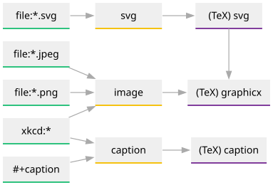

:PROPERTIES:
:ID:       0a783b08-b4af-4598-8d7d-b81987654321
:END:
#+TITLE: Beamer Test2: Quick one
#+AUTHOR: David Conner
#+OPTIONS: H:2 toc:t num:t

#+STARTUP: beamer
#+LATEX_CLASS: beamer
#+LATEX_CLASS_OPTIONS: [presentation]
# #+BEAMER_THEME: PaloAlto
#+BEAMER_THEME: Madrid
#+COLUMNS: %45ITEM %10BEAMER_ENV(Env) %10BEAMER_ACT(Act) %4BEAMER_COL(Col)

#+LATEX_HEADER: \usepackage{listings}
#+LATEX_HEADER: \usepackage{xcolor}

* Notes                                                            :noexport:

+ Activate =org-beamer-mode= and export using =org-beamer-export-pdf=
+ exporting images without =TiKz= looks [[https://www.reddit.com/r/orgmode/comments/12ezjin/exporting_svg_images_to_latex/][tough]]
  
** tecosaur/emacs-config

#+begin_example org
,#+BEAMER_THEME: [progressbar=foot]metropolis
#+end_example

*** Graphs

+ tecosaur/emacs-config: [[https://tecosaur.github.io/emacs-config/config.html#content-feature-preamble][#content-feature-preamble]]

This is a bit messy, depending on how the SVG gets included into the PDF ... but
it's better than learning =tikz=. This is also a simple example of a
well-formatted =dot= graph.

#+begin_example org
#+begin_src dot :file img/org-latex-clever-preamble.svg :exports none
digraph {
    graph [bgcolor="transparent"];
    node  [shape="underline" penwidth="2" width="1.3" style="rounded,filled" fillcolor="#efefef" color="#c9c9c9" fontcolor="#000000" fontname="overpass"];
    edge  [color="#aaaaaa" penwidth="1.2"]
    rankdir=LR
    
    node[group=a,color="#2ec27e"]
    "file:*.svg"
    "file:*.jpeg"
    "file:*.png"
    "#+caption"
    "xkcd:*"
    node[group=b,color="#f5c211"]
    "svg"
    "image"
    "caption"
    node[group=c,color="#813d9c"]
    "(TeX) svg"
    "(TeX) graphicx"
    "(TeX) caption"
    
    "file:*.svg" -> "svg" -> "(TeX) svg"
    "file:*.jpeg" -> "image" -> "(TeX) graphicx"
    "file:*.png" -> "image"
    "(TeX) svg":s -> "(TeX) graphicx":n [constraint=false]
    "#+caption" -> "caption" -> "(TeX) caption"
    "xkcd:*" -> "image"
    "xkcd:*" -> "caption"
}
#+end_src
#+end_example

Then reference the file elsewhere. Inserting it into LaTeX/PDF is another
question.

#+begin_example org
#+caption: Association between Org features, feature flags, and LaTeX snippets required.
#+attr_html: :class invertible :alt DAG showing how Org features flow through to LaTeX :style max-width:min(24em,100%)
#+attr_latex: :width 0.6\linewidth

#+end_example

  
*** Code blocks

+ run =tlmgr search listing= to check your environment
+ ensure =(setq org-latex-src-block-backend 'listings)=
+ Add =listings= and =xcolor= to =#+LATEX_HEADER=

#+begin_example org
,#+LATEX_HEADER: \usepackage{listings}
,#+LATEX_HEADER: \usepackage{xcolor}
#+end_example

**** Engraved

See [[https://github.com/emacs-straight/org-mode/blob/cdc16898fd46a30d7187c0a5830b2b898ffbd2de/lisp/ox-latex.el#L997-L1010][lisp/ox-latex.el#L997-L1010]] in the org source for setup info.

Needs something like...

#+begin_example emacs-lisp
(use-package engrave-faces :defer t)
(after!
  (use-package engrave-faces-latex))

;; see M-x dc/ox-engrave-enable.
;;
;; set (org-latex-src-block-backend 'engraved)
#+end_example

The =fvextra= package gets set up by =org-latex-engraved-{preamble,options}=

#+begin_example org
,#+LATEX_HEADER_EXTRA: \usepackage{fvextra}
#+end_example

**** Listings

#+begin_src emacs-lisp
(setq org-latex-listings-options
      '(("basicstyle" "\\ttfamily\\small")
        ("keywordstyle" "\\color{blue}\\bfseries")
        ("commentstyle" "\\color{green!50!black}")
        ("stringstyle" "\\color{purple}")
        ("showstringspaces" "false")
        ("numbers" "left")
        ("numberstyle" "\\tiny\\color{gray}")
        ("stepnumber" "1")
        ("numbersep" "8pt")
        ("backgroundcolor" "\\color{gray!5}")
        ("frame" "single")
        ("frameround" "tttt")
        ("breaklines" "true")
        ("breakatwhitespace" "true")))
#+end_src

*** Microtype

+ Protrusion for typesetting that screws with alignment
+ handling of some situations with tables
+ See [[https://texdoc.org/serve/microtype/0][microtype on texdoc]]

#+begin_example latex
\begin{tabular}{l>{\leftprotrusion}p{9cm}r}
    \hline
    Text1 & Text2 & Text3 \\
    \hline
    \multicolumn{3}{|c|}{Merged text here} \\
    \hline
\end{tabular}
#+end_example

** Themes

*** Matrix

[[https://hartwork.org/beamer-theme-matrix/][Beamer Color Matrix]] and [[https://mpetroff.net/files/beamer-theme-matrix/][Another Beamer Theme Matrix]]

|------------+------------------------------+------------+---------------------------|
| Theme      | Layout                       | Outline    | Notes                     |
|------------+------------------------------+------------+---------------------------|
| Warsaw     | Content + Top/Bottom         | Simple     |                           |
| Copenhagen | Content + Top/Bottom         | Simple     |                           |
| Ann Arbor  | Content + Top/Bottom         | Simple     | High-contrast bars        |
|------------+------------------------------+------------+---------------------------|
| Marburg    | Content + Right Sidebar      | Persistent |                           |
| Goettingen | Content + Right Sidebar      | Persistent |                           |
|------------+------------------------------+------------+---------------------------|
| Hannover   | Content + Left Sidebar + Top | Persistent |                           |
| Palo Alto  | Content + Left Sidebar + Top | Persistent | Angle in topleft, 3 tones |
| Berkeley   | Content + Left Sidebar + Top | Persistent | Same as Palo/Alto         |
|------------+------------------------------+------------+---------------------------|

+ =PaloAlto= is too much. =EastLansing= is simple

* Testing Code Exports

** Frame 1 

Issues:

+ Source blocks definitely need the right =:export code= setting
+ Emacs themes are a bit tricky here. If possible export theme to =.tex=
+ It seems there's an =ox= workflow for LaTeX where you export =TeX= then use
  =watchexec= to compile it (or emacs' =compile-mode= functionality)
  - you're going to want to read generated =TeX= source anyways.

*** Testing =engraved-faces=

proof-of-concept to see whether code exports work

#+begin_src emacs-lisp :export code
(defun dc/ox-engraved-enable ()
  (interactive)
  ;; also customize `org-latex-engraved-preamble' and
  ;; `org-latex-engraved-options'.
  (setq org-latex-src-block-backend 'engraved
        org-latex-engraved-theme 'doom-one-light))
#+end_src

** Frame 2

*** They try to tell you...

*** One hell of a learning curve
:PROPERTIES:
:BEAMER_ACT: <2->
:END:

It does seem to work, but you probably want a separate serverless emacs to use
this. but loading =ef-themes= and then changing to a =doom-theme= created some
invalid state.

*** But... 
:PROPERTIES:
:BEAMER_ACT: <3->
:END:

Emacs is much easier than you'd think. Mixing about 10 different languages and
expecting =org-export= to generate five output formats... that's extremely
difficult. Keep it simple.

* Roam                                                             :noexport:
