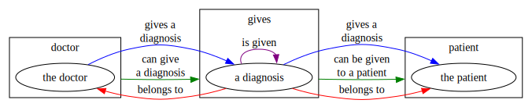
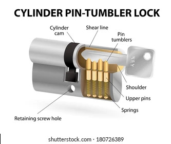
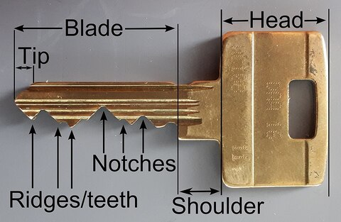

:PROPERTIES:
:ID:       40c49f4c-08be-4315-bdbe-7aa5000e4025
:ROAM_REFS: @gammahelm-1995-desig
:END:
#+title: Gamma, Erich and Helm, Richard and Johnson, Ralph and Vlissides, John, Design patterns: elements of reusable object-oriented software
#+created: <2025-06-18 Wed 19:19>
#+last_modified: [2025-06-18 Wed 19:19]

+ file :: gammahelm-1995-desig.pdf

* Roam
+ [[id:bb8bbe7c-6d49-4088-9161-2ae2edb4abd6][Ontology]]
+ [[id:4cdfd5a2-08db-4816-ab24-c044f2ff1dd9][Programming]]

* Resources

* Overview

The book needs to be read in detail to convey the subject's applications.

+ For design patterns & relationships between them, it cites
  caveats/extensions/generalizations that would be needed depending on context
  in =problem -> solution= form (telos)
  - it focuses on the telos and clarifies which problems each pattern is meant to
    overcome or how they can be adapted.

** Organization

The book gives a chapter or two to survey the concepts, but then structures its
sections in order of increasing ontological complexity.

+ creational :: objects need to be created in order to be structured
+ structural :: objects need to have structures defining abstractions in order
  to have behavioral relations
+ behavioral :: only once structures, abstractions & interfaces are defined can
  behavioral relations be specified

I can't remember whether the book clarifies this.

** Useful Outtakes

*** Diagrams

Inside back cover

*** p24-25

Surveys all the patterns, contrasts them a bit and describes use-cases.

* From Video
+ [[https://www.youtube.com/watch?v=yTuwi--LFsM][Design Patterns Revisited in Modern Java by Venkat Subramaniam]]

** Avoid unnecessary optionals
Functions are mappings from params to values. This is more clear without null.

+ Avoid setting fields to =Optional<T>=
+ Always return a value if possible. (Also, prefer deterministic functions)

* Patterns

** Creational

** Structural
*** Adapter vs. Bridge

The bridge is an "adapter-adapter"

*** Facade: access to subsystems

+ interface vs. abstract
+ interacting subsystems

*** Proxy: structure for control over interactions

** Behavioral

*** Command

* Ontology
** Examples

Some examples that are difficult to model in OWL involve subjects and objects
connected by a relation (edge) which itself has an object relationship.

Doctor, Diagnosis, Patient

#+begin_src dot :file img/gammahelm-1995-desig/doctor-diagnosis-patient.svg
digraph G {
    rankdir=LR
    compound=true

    subgraph cluster_doctor {
        label="doctor"
        drPerson[label="the doctor"]
    }

    subgraph cluster_patient {
        label="patient"
        mrPatient[label="the patient"]
    }

    subgraph cluster_gives {
        label="gives"
        diagnosis[label="a diagnosis"]
    }

    drPerson -> diagnosis [color=blue,label="gives a\ndiagnosis"]
    drPerson -> diagnosis [ltail=cluster_doctor,lhead=cluster_gives,color=green,label="can give\na diagnosis"]
    diagnosis -> drPerson [color=red,label="belongs to"]

    // can't model self-edges
    diagnosis -> diagnosis [ltail=cluster_gives,color=purple,label="is given"]

    diagnosis -> mrPatient [color=blue,label="gives a\ndiagnosis"]
    diagnosis -> mrPatient [ltail=cluster_gives,lhead=cluster_patient,color=green,label="can be given\nto a patient"]
    diagnosis -> mrPatient [color=red,label="belongs to"]
}
#+end_src

#+RESULTS:

* Key and Lock

** Metaphor

TL;DR: the lock is a function/method that satisfies a key's type constraints,
where the key is an object. If the key fits the shapes of the type constraints,
it opens the lock.

+ A =Lock lock= has a =Pair<? super N,? super Q>= of =pins= whose shape needs to
  complement the notches (by satisfying some type relation).
+ Additionally, the key blade's =profile= needs to complement the lock's =warding W=

+ A =Key key= has a =Blade<? super W'>= with =Profile p=
+ The =blade= also has a =Pair<? super N', ? super M'>= of =notches=

If some profile and set of notches also satisfies the type consraints, the lock
opens.

** Orthogonality

+ [[https://dev.to/meeshkan/covariance-and-contravariance-in-generic-types-3k63][Covariance/Contravariance in Generic Types (python)]]

There is at least some geometric orthogonality here, though the two mechanisms
aren't fully orthogonal. The key blade rotates around an axis that's coincident
with the plane that the notches lie in.

#+begin_quote
If there's always/usually some notion of orthogonality when logic is encoded
into the mechanical components of a device (... then? -> that?! idk). If so,
that would be interesting, but it'd be difficult to make that definition fit for
electronic devices.

Not sure about either a counterexample (maybe springs) or a non-trivial example
creating the orthogonality (except maybe putting two blades on the key, which
don't need to be at 90°)

hmmmm... [[https://www.youtube.com/watch?v=8taEllwQ2iE][Roons! A new marble computer]]
#+end_quote

Here, I mean that interfaces are composed:

+ The notches on a key must all match the lock's tumblers, in order. (=EDIT= ...
  um yes, this *literally* _is_ "interface composition")
  - Notches that are subtypes should also match (=EDIT=: unless the lock requires
    the extra specificity of the subtype).
+ The key's warding is another mechanism that prevents the key from fitting the
  lock's "method". (=EDIT=: this is like an object's singular =type= it receives
  from a =class=)
+ The notch/warding concepts are separate (and thus orthogonal ... in some
  sense) or decoupled.

... but usually these concepts both refer to relations between subtypes
(extension).

#+begin_quote
+ Covariant :: extension (inheritance) ...
+ Contravariant :: composition (interfaces) ...

Not quite precise...
#+end_quote

* Practice
** Creational

** Structural

| Pattern                 |                            | Desc                    |
|-------------------------+----------------------------+-------------------------|
| Singleton + Proxy + ... | singleton instance manager | singleton is creational |

** Behavioral

| Pattern                 |                                                         | Desc                                            |
|-------------------------+---------------------------------------------------------+-------------------------------------------------|
| Visitor (Interpreter?)  | symbolic numeric differentiation/integration            | Not from string interpretation. Use TreeMap?    |
| State (and?)            | Parse DHCP Session (or TCP Session) from stream of data | Not mixed traffic, just application-level bytes |
| State (and?)            | Ethernet frames from bytes)                             | No network                                      |

** Combinations

+ =Creational <- Structural=
+ ={Creational,Structural} <- Behavioral=

As noted earlier, structural/behavioral depend on the /existence/ of
structural/creational ... at least initially, before programs are sufficiently
complex such that the dynamics from the instantiation/management/interactions of
lower order patterns feed back into the complexity of the design.

+ Creational :: zeroth-order
+ Structural :: first-order
+ Behavioral :: second-order

Thus there are some "existential" aspects that imply the difficulty generally
increases with behavioral patterns and some structural patterns.

+ When design is fairly simple, then I'd actually argue the opposite for other
  reasons: not using some structural patterns will definitely increase work &
  maintainence.
+ When combining particular behavioral patterns with structural patterns (maybe
  the wrong ones idk), things could get particularly difficult to manage.
  - Refactors become larger with more complexity & especially with tight
    coupling. Builds break for longer. Branches drift for longer.

Second-order generally implies a breakdown of "completeness" ... (no time to
explain, again). Loosely speaking, "first-order" systems are fairly simple to
model with accurate extrapolation -- e.g. how does this structural pattern
affect later design. Models for second order systems require that specific/adhoc
assumptions hold ... otherwise dynamics create the possibility for novelty (or
whatever, i've written about similar millions of times).

But here, once enough 1st/2nd order patterns are involved -- the design has
accumulated a sufficient number of patterns -- then the ability to anticipate a
refactor's future design problems/needs 3+ major refactors later definitely just
bottoms out. This is somewhat "existential" bc you have to experience working
through these problems to develop enough perspective for larger applications.

** Applicability
*** Creational

*** Structural
**** Proxy

+ ={remote,virtual,protection} proxy= and =smart-reference=

*** Behavioral
**** Interpreter

* Issues

** Background

Trying to reverse-engineer example applications has been fairly difficult, since
applications/libraries are built in stages

+ some intentionally incorporate the patterns by name;
+ other phases maintain interface/type names (to avoid breaking code for library
  consumers) while shifting & retrofitting patterns to solve problems

it's obvious when the patterns are named, but otherwise maybe not (esp. without
diagrams suited to the context)

*** Terminology

Further, I learned most of what I know through SQL -- =ERD!=UML=, since SQL is
normalized and UML describes =aggregation= relationships (lifetimes/ownerships)...

+ the term =aggregation= is poorly chosen, as is =composition= (if you also wandered
  through functional programming)
+ Also, Rails, by default, is more closely associated with ERD, since you need
  models in order to define relationships. Your =controllers= instantiate models
  (briefly) ... but you only really need the more complicated behavioral
  relationships once you have services/workers

It's not that I don't understand what these means, it's just these terms are
highly specific in math, SQL, & functional programming ... so when returning to
UML from time to time, I try to re-approach the definitions via etymology. also,
the arrow notation is ad hoc or text.

I've thought about this alot, but couldn't fully articulate it.

**** In Web Applications

Web applications (on the backend anyways) do /not/ invoke environments with
hundreds of objects critical to the application's own runtime. i.e.
errors/exceptions have a tight scope & stack.

+ For example, REST can be so simple because it applies a uniform interface to
  all objects where their organization & context fits neatly into a tree
  generated from the URL Routes... these design patterns are mostly applicable
  once your application has a true graph of relationships. Threads in a web
  application are, by design, intended to be short-lived and parallel
  operations on data (mostly reads.)
+ SOAP was designed for true object oriented programming, where things living
  on the network are treated as objects. gRPC is similar, but for situations
  where the objects are distant and contexts/environments can't be reconciled
+ I'm guessing that GraphQL APIs (esp. when backed by distributed
  infrastructure & microservices) sees a completely different picture than
  REST, since coordinating traversal of dependent operations requires breaking
  the graph into a spanning tree of stream-processes (where loops are
  minimized)
+ When that requires minimal transaction times, you begin entering "CAP
  theorem" territory,
  - if you can shake out a "super-structure" for your graph to unify/simplify
    operations on objects, this means you can structure operations on data
    using transactions, but if your business logic & objects are too
    distributed, then your application just needs to deal with a loss of
    /consistency/.

* Notes
:PROPERTIES:
:NOTER_DOCUMENT: /data/xdg/Documents/books/gammahelm-1995-desig.pdf
:NOTER_PAGE: 29
:END:

** Ch 1: Introduction

Sections

| Motivation | Applicability | Consequences | Implementation | Known Uses | Related Patterns |

$Scope \otimes Purpose = (Class \oplus Object) \otimes (Creational \oplus Structural \oplus Behavioral)$

[[pdf:/data/xdg/Documents/books/gammahelm-1995-desig.pdf::22++0.00][gammahelm-1995-desig.pdf: Page 22]]

| Scope  | Creational       | Structural | Behavioral      |
|--------+------------------+------------+-----------------|
| Class  | Factory Method   |            | Interpreter     |
|        |                  |            | Template Method |
|--------+------------------+------------+-----------------|
| Object | Abstract Factory | Adapter    | Chain of Resp.  |
|        | Builder          | Bridge     | Command         |
|        | Prototype        | Composite  | Iterator        |
|        | Singleton        | Decorator  | Mediator        |
|        |                  | Facade     | Memento         |
|        |                  | Proxy      | Flyweight       |
|        |                  |            | Observer        |
|        |                  |            | State           |
|        |                  |            | Strategy        |
|        |                  |            | Visitor         |
|--------+------------------+------------+-----------------|
#+begin_quote
Creational:

+ class patterns: defer some part of object creation to subclasses
+ object patterns: defer it to another object.

Structural:

+ class patterns: use inheritance to compose classes
+ object patterns: describe ways to assemble objects

Behavioral:

+ class patterns: use inheritance to describe algorithms and flow of control
+ object patterns: describe how a group of objects cooperate to perform a task
  that no single object can carry out alone
#+end_quote

*** Class vs Interface

#+begin_quote
Class [Inheritance] versus Interface "Inheritance"
#+end_quote

This clarifies some things

#+begin_quote
An object's =class=:

+ defines how the object is implemented; i.e. object's internal state & =impl= of
  it's operations

An object's =type=:

+ "Only" refers to its *interface* -- quotes because =xlang= and =ylang= be defining
  concepts in =unslang= -- *the _set of requests_ to which it can respond*
+ may include many types; objects of different classes may the same type.
#+end_quote

Like "duh", but also okay. That clears things up. And by *set of requests*, it's
kinda talking about the _types_ of *Smalltalk messages*... to inadvertently use a
generic word like _type_ in a context where it has a specific meaning.

"Nothing purely abstract is really made plain ..." said the =3-category= to the
=2-functor='s objects ... umm nvrmind

On inheritance

#+begin_quote
Class inheritance:

+ Defines an object's implementation in terms of another object's =impl=
+ A mechanism for code and representation sharing.

Interface inheritance

+ aka =subtyping= ... ! (more clarification lost in the "obvious" syntax keywords)
+ describes when an object can be used in place of another.
#+end_quote

#+begin_quote
In =C++17= ... inheritance means both interface and implementation =inh.=

Standard way to inherit an =ifx= in =C++17=:

+ Inherit publicly from a class that has (pure) virtual member functions
+ Pure =ifx= inheritance approximated by =inh.= publicly from pure abstract classes
+ Pure =impl= or class =inh.= can be approximated w/ private inheritance
#+end_quote
