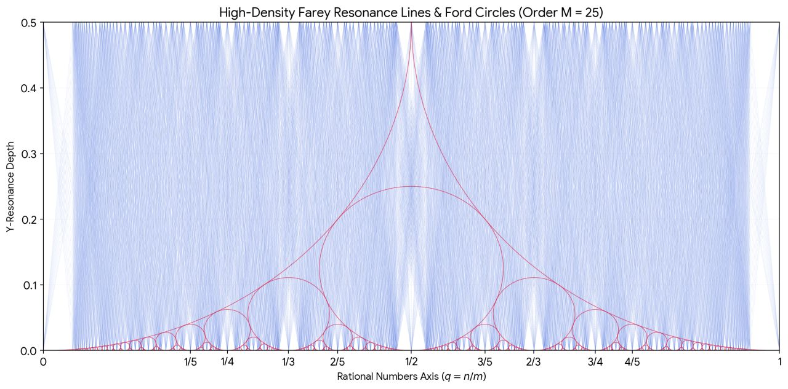

:PROPERTIES:
:ID:       4ce355fe-7c2b-4096-a44b-5daeebcd4b66
:END:
#+TITLE: Math: apollonean gaskets and number theory
#+CATEGORY: slips
#+TAGS:

Three circles generate an apollonean gasket, though this the minimal
representation. In any gasket where four circles having integral radius touch,
all circles will have an integer radius.

* Flower of Life

+ The flower of life generates [overlapping] apollonean gaskets
  with fractal relationships. This gasket can be tiled.
  - Here there are 3 lines, each cutting the largest circle in half.
  - The ratios of the next smallest circles are all integral, but it makes more
    sense to consider them to be rational ratios (there are 7)
    - For each adjacent pair of these 6 outer circles, their centers form an
      equilateral triangle with the center circle.
  - For the apollonean circles in the interior, their radii are rational (need
    to check to be sure), but their positions relative to the centers of the
    initial circles are algebraic.
    - specifically, the positions are drawn from specific subgroups of algebraic
      numbers (solutions to polynomials with even terms and max $2^{n}$ terms)
    - this provides relationships between transcendental numbers, rational
      numbers and specific subgroups of algebraic numbers (sums/products of
      2n-roots)

  - ... what are the ratios of the apollonean circles around the outside??
    - if you extend the flower of life to [[https://en.wikipedia.org/wiki/Overlapping_circles_grid#Progressions][19 circles]]? ()
* "Kissing Mesh"

Connecting all the points where the circles kiss gives a mesh.
+ Effectively a visualization of relationships between transcendental numbers,
  algebraic numbers, rationals and integers

What is the significance of the relative ratios of circles?

* Hyperbolic Gaskets

+ Do the $2^{n}$ algebraic subgroups result from the L2 norm? (i.e. the distance
formula).
 - If all this holds, then what does this mean for hyperbolic gaskets?
 - Does the curvature here permit similar integral gaskets where the relative
   values exhibit some other direct sum of quotients of algebraic numbers?
   - if so, then specific gaskets are like representations of subgroups of
     numbers and provide functional mappings between them.

+ If so, then what does this mean for the relationships b/w pi-derived
  transcendental numbers, algebraic irrationals and rationals?

* Farey Resonance

#+begin_quote
from a linkedin post... yay

I'm including one picture of the generated Farey Resonance lines and Ford
Circles. The other screenshots are too large. Don't care
#+end_quote

The first Farey Resonance picture definitely crashed though

I once tried plotting these points by hand about 15 years ago... If python
environments weren't such a cluster to manage, maybe i would've written a
program. Obviously, I don't really have an outlet for my interests

I was trying to identify/explain a 1-cover of rationals Q. The cardinality of Q
and N are usually explained as equivalent by winding through the Rationals on a
2D grid of natural numbers, for (n,m) in N^2. This doesn't create a 1-cover of
closed sets that can be decomposed nicely while only counting each rational
once.

I was reminded of the #PartitionFunction for integers that counts the number of
unique ways to reach integers with addition.

Instead you need methods like Calkin-Wilf tree from [[https://arxiv.org/abs/2205.00565][Parity and Partition of the
Rational Numbers]]

This is explained more clearly in [[https://www2.math.upenn.edu/~wilf/website/recounting.pdf][Recounting the Rationals (1999)]] which mentions

#+begin_quote
b(n) actually count something nice. In fact, b(n) is the number of ways of
writing the integer n as a sum of powers of 2, each power being used at most
twice (i.e., once more than the legal limit for binary expansions)
#+end_quote

The Calkin-Wilf tree is related to a type of partition function, which is
strange. These things are usually obvious when you have intuition for this
stuff. That doesn't really count for much though. Only social connections are
responsible for academic success, utlimately. With zero social connections,
you'll have zero success.

Intuition doesn't help much regardless. Smart people just
extrapolate/interpolate. It's normal, but not for plebs.

** Long Thread

Haven’t thought it through, but there may be a trinary encoding for the distinct
ways of summing to ~n = Σ(i=0;i<n; (0*a_0 + a_1 + 2*a_2)*2^i)~. Maybe not trinary,
but three-valued. The a_0 gets zeroed out because it’s more complete. If that
bit is hot, that $2_n$ power contributes nothing. $a_j$ for ~j=0,1,2~ are binary
values in a $3 n$ vector-like matrix where only one bit can be hot at one time.
Then you can construct a more vectorized form.

Each value incrementing to $b(n)$ is partitioned into separate subsets: the domain
is partitioned bc no values passed to b(n) could ever sum to anything else. Then
the $b(n)$ values for the recursive sequence generating the tree is precalculated
dynamically, more or less.

This is enumerable as an infinite set, if breadth-first. That’s not the form
you’re interested in. But if you definitely want rational proportions generated
by natural numbers only (a true rational number; not floating point), then this
maybe gives a sense of the density..

*** And then... (No one is actually reading this, Mr. Anderson)

The density probably has a spectral representation (and approximation without
enumeration), though Fourier is likely not the greatest. Instead some other
transform probably matches it.

The sequence does give a 1-cover of the rationals, but it’s not easy to cut
apart as sets in a way that’s desirable. Overlaying points with increasing
algebraicity (onto the intersections for Farey resonance) will probably be
interesting. Those are otherwise all the solutions to polynomials of degree one
~(y=a*x + b; (0,0) <= (x,y) <= (1,1); (x,y) in Q^2)~. Sets of numbers with
increasing algebraicity overlap… making a 1-cover difficult, againz However they
fill in various areas of missing density … while bringing all their infinite
digits with them.

*** Apollonean Gaskets (Still talking to myself on my facebook wall)

The relationship to Apollonian Gasket is interesting. IIRC, the parameters to
Apollean Gasket (here: 0,0,1,1) are shorthand for representing various sets &
systems of numbers. There are continuous maps between specific AG params and the
sets they generate, where there’s topology that allows for continuous
exploration of a hyperbolic surface of parameter space. you can slide the
circles and cycle back to equivalent AG parameter values. It shows up in quite
surprising places.

hmmm the continuous maps definitely work for the AG inside a circle, but I’m not
100% about the AG on a plane... pretty sure it does, but the topology would make
it qualitively different

** Dump thread

Fortunately, i could search online and find the answer quickly. otherwise i'd
randomly wonder about it

Gemini was not really going to point me in the right direction. The plotting was
impressive, but sidetracked the session (i didn't initially ask for it). it
wasn't going to step back & point me towards what i was looking for

same thing happens with people. gotta use the right terminology to get better
suggestions. most college-educated people primarily only recognize terminology.
without the surface-level jargon, they don't understand what you're talking
about

the next problem: they experienced classmates developing a specific set of
skills in a specific order. people make too many assumptions about dependencies
between skills -- but this is just curriculum. If you try to learn things on
your own, your knowledge set is anomalous and you approach problems
idiosyncratically.

if you can't socialize with people who know enough and have enough time to
listen, you just get pushed out.

