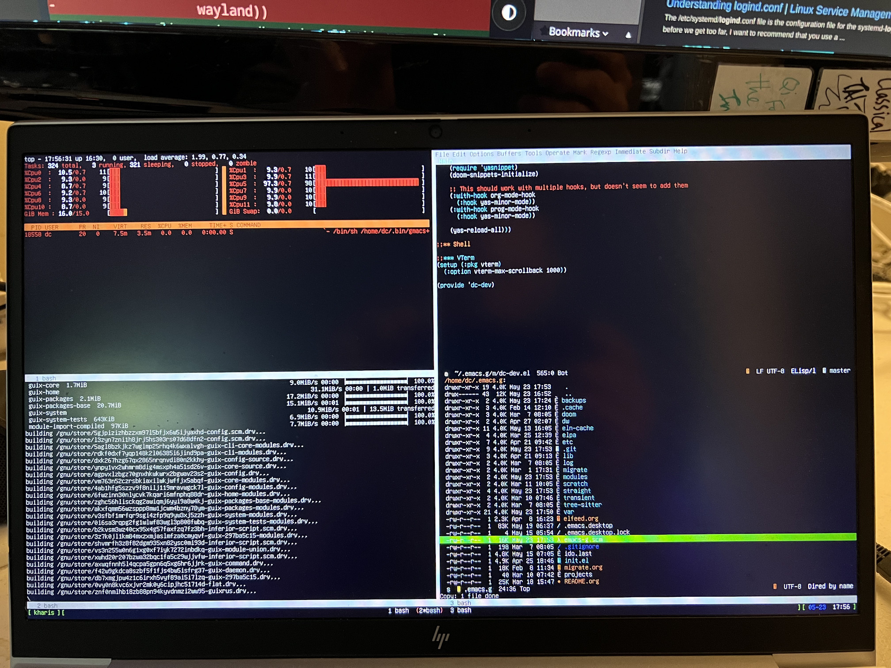

:PROPERTIES:
:ID:       772f7bf3-4556-47ed-b221-07d6894e920c
:END:
#+TITLE: TFW: You finally learn why X11 is crashing
#+CATEGORY: slips
#+TAGS:
* Roam
+ [[id:6f769bd4-6f54-4da7-a329-8cf5226128c9][Emacs]]
+ [[id:b82627bf-a0de-45c5-8ff4-229936549942][Guix]]
+ [[id:f92bb944-0269-47d4-b07c-2bd683e936f2][Wayland]]

#+begin_quote
2026/7: for whatever reason this was actually a particularly devious issue to
deal with. it also happened immediately before a conference
#+end_quote

* TIL: About TTY Permissions

And why socat is evil:

Log into two terminals, one for input, one for output:

In the output terminal, run =$(tty)= to make sure you know the value.

In the input terminal, run:

#+begin_src
export inputTTY=$(tty)
export outputTTY=/dev/ttyXYZ

socat - $outputTTY
#+end_src=

Start typing. Whatever you type appears in the second VTY. This only works if
the =/dev/ttyN= device has its ownership changed. Otherwise it requires
=sudo=. This is why the VTY devices are assigned the =tty= group, which has
/write-only/ permissions.

* I Wish I Was Ricing

I wish people would actually explain "the why" behind screenshots like this. Let
me break it down for you -- you see this when:

+ you're troubleshooting IPC (without automated testing) and you want to keep
  tabs on processes/services you're running that don't like to be started
  without their pidfiles/sockets being cleaned up first.
+ Your working with ncat, netcat, socat etc using processes or services and you
  generally want feedback on the state of the overall system.

Does this look like a MF Rice to you? It is disingenuous to convey this to new
users as tool for conveying/contrasting "on user's aesthetic choices over
anothers." And I'm using screen in vty: there's nothing aesthetic about
that. Sure, one of the "screen regions" could run a matrix screensaver, but I'm
not ricing.

By the way, you can script screen a hell of a lot easier than you can any GUI
terminal program -- because the =screenrc= scripts are +basically shell scripts.+

#+begin_quote
2026/7: ... no. they're not. =screenrc= scripts are definitely _not_ basically shell
scripts. anyways.
#+end_quote

*** todo: what it's like to restart tty's to login
+ how the login process there differs from SSH

* Migrating to Wayland

Yeh, so I finally figured out why my X11 was crashing, but I likely never would
have figured it out if I didn't migrate to Wayland.

For some reason, the way that Guix hooks X11 into being loaded by Slim or GDM
make it really tough to figure out problems involving early profile
loading. This has been a consistent problem when I have =.xsession=
problems. I'm still not sure if the =touch $HOME/.xsession-errors= method works.

What's wrong with this cute little code right here? I wanted my =pyenv= install
scripts to build with max CPU's leaving some to spare on two different computers
-- ahhh dotfiles across multiple systems: the apple to your eden.

#+begin_src sh
ncpu-x86-threads() { ls -al /sys/class/cpuid/cpu8 | wc -l }

ncpu-x86() {
    nthreads=$(ncpu-x86-threads)
    echo $(($nthreads / 2))
}
#+end_src

So there there were some hyphenated Bash scripts that I merged in from my
desktop in a rush, since I'm constantly hopping from project to project. I was
hesitent to move to Wayland since it requires replacing =mingetty= and =login=
with =agetty= and =greetd=.

#+begin_src scheme
    (services
     (append
      ;; .. modify the %base-services by removing login/mingetty
      (modify-services %base-services
        (delete login-service-type)
        (delete mingetty-service-type))

      ;; ...
#+end_src

The system definition comes [[https://github.com/daviwil/dotfiles/blob/guix-home/daviwil/systems/base.scm][./daviwil/systems/base.scm]] from [[https://github.com/daviwil/dotfiles/tree/guix-home][daviwil/dotfiles]]

#+begin_src scheme
      (list
       ;; and then append those to the following list of services

       (service
        greetd-service-type
        (greetd-configuration
         (greeter-supplementary-groups (list "video" "input"))
         (terminals
          (list
           ;; TTY1 is the graphical login screen for Sway
           (greetd-terminal-configuration
            (terminal-vt "1")
            (terminal-switch #t)
            (default-session-command
              (greetd-wlgreet-sway-session
               ;; TODO background
               (sway-configuration
                (plain-file "sway-greet.conf" (string-append
                                               "output * bg /data/xdg/Wallpapers/" %host-name "-greetd.jpg fill\n"))))))

           ;; Set up remaining TTYs for terminal use
           (greetd-terminal-configuration (terminal-vt "2"))
           (greetd-terminal-configuration (terminal-vt "3"))
           (greetd-terminal-configuration (terminal-vt "4"))
           (greetd-terminal-configuration (terminal-vt "5"))
           (greetd-terminal-configuration (terminal-vt "6"))))))

#+end_src

You could even customize your terminal fonts -- which yes, you can do with
config files or init scripts or however you do. When your brittle
=arch-installer= system breaks, how much time are you going to spend on the Arch
Wiki trying to get it back to the way it was? It's the thing for every distro
except Nix, Guix and Silverblue, basically. Did you even script your dotfiles?
(if you did, how much time do you waste doing that?)

* Emacs

I like the extensions that Doom provides to yasnippets, especially the ones that
make the snippets workflow easier to iterate on. However, there are some cycles
in how the dependencies are loaded.

TBH, I haven't even gotten to the point where I can use snippets in my
development workflow, as much as they would help. They especially help a
polyglot when you're jumping around languages and you need some ideas for syntax
or blocks. If they're useful enough to be snippetized, they're probably worth
learning. The problem is that no one actually uses or shares snippets.
