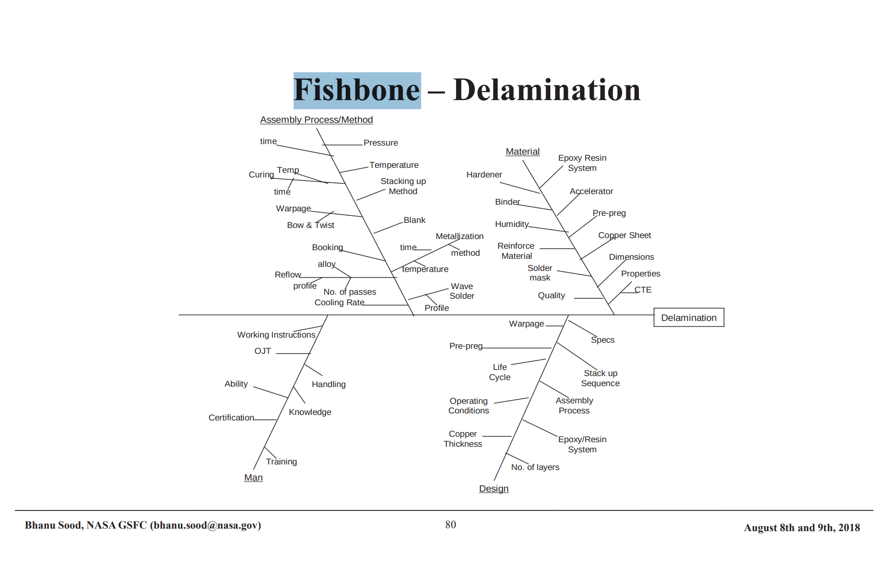
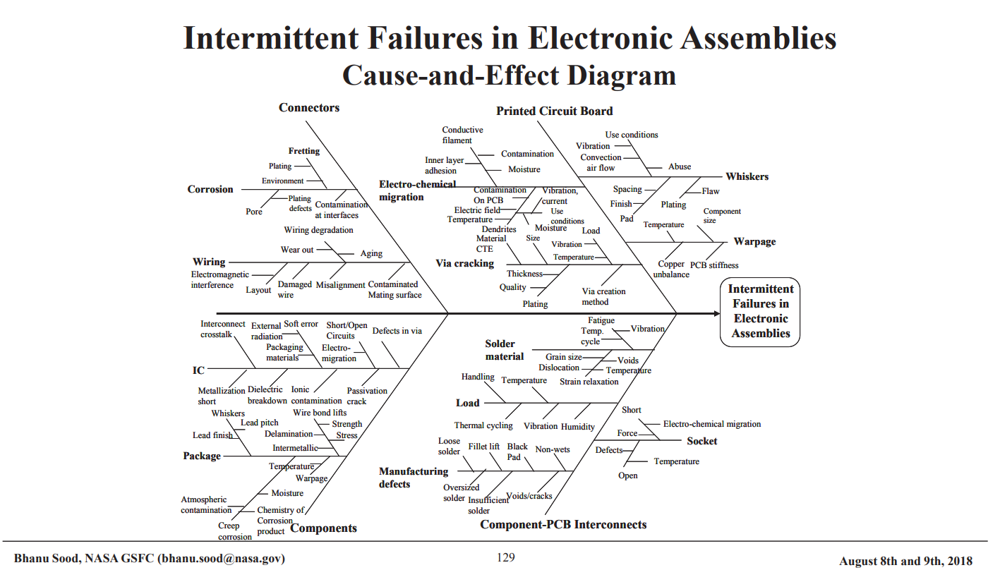

:PROPERTIES:
:ID:       0f386d10-64fa-4316-b1e3-786f7103f3a8
:END:
#+TITLE: LaTeX: Test Tikz Export
#+CATEGORY: slips
#+TAGS:  

#+OPTIONS: ':nil *:t -:t ::t <:t H:3 \n:nil ^:t arch:headline
#+OPTIONS: title:nil author:nil c:nil d:(not "LOGBOOK") date:nil
#+OPTIONS: e:t email:nil f:t inline:t num:t p:nil pri:nil stat:t
#+OPTIONS: tags:t tasks:t tex:t timestamp:t todo:t |:t
#+OPTIONS: toc:nil
#+SELECT_TAGS:
#+EXCLUDE_TAGS: noexport
#+KEYWORDS:
#+LANGUAGE: en

#+PROPERTY: header-args :eval never-export
# #+OPTIONS: texht:t
#+LATEX_CLASS: article
#+LATEX_CLASS_OPTIONS: [a4paper]

#+LATEX_HEADER_EXTRA: \usepackage{lmodern}
# #+LATEX_HEADER_EXTRA: \usepackage{rotfloat}
#+LATEX_HEADER: \hypersetup{colorlinks=true, linkcolor=blue}
#+LATEX_HEADER_EXTRA: \usepackage[margin=1in]{geometry}
#+LATEX_HEADER_EXTRA: \usepackage{units}
#+LATEX_HEADER_EXTRA: \usepackage{comment}
#+LATEX_HEADER_EXTRA: \usepackage{tabularx}
#+LATEX_HEADER_EXTRA: \usepackage{tabu,longtable}
#+LATEX_HEADER_EXTRA: \usepackage{booktabs}
#+LATEX_HEADER_EXTRA: \usepackage{makeidx}
#+LATEX_HEADER_EXTRA: \makeindex
#+LATEX_HEADER_EXTRA: \usepackage{epstopdf}
#+LATEX_HEADER_EXTRA: \epstopdfDeclareGraphicsRule{.gif}{png}{.png}{convert #1 \OutputFile}
#+LATEX_HEADER_EXTRA: \AppendGraphicsExtensions{.gif}

#+LATEX_HEADER: \setlength{\parskip}{0.1em}
#+LATEX_HEADER: \setlength{\parindent}{0em}
#+LATEX_HEADER: \setcounter{secnumdepth}{0}

# colors (requires xcolor)
#+LATEX_HEADER_EXTRA: \usepackage[table]{xcolor}
#+LATEX_HEADER_EXTRA: \definecolor{lightgray}{gray}{0.92}

# TikZ 
#+LATEX_HEADER_EXTRA: \usepackage{tikz}

# #+begin_export latex
# % looks like it's aligned to the center, then lol
# \center
# #+end_export

* Ishikawa Fishbone

Need these to help illustrate relationships between seemingly unrelated areas of
robotics, mechanical design, the java program, etc.

** Examples :noexport:

*** Mermaid

#+begin_src mermaid :file img/frc/fishbone/mermaid-ishikawa.png
ishikawa-beta
    Blurry Photo
    Process
        Out of focus
        Shutter speed too slow
        Protective film not removed
        Beautification filter applied
    User
        Shaky hands
    Equipment
        LENS
            Inappropriate lens
            Damaged lens
            Dirty lens
        SENSOR
            Damaged sensor
            Dirty sensor
    Environment
        Subject moved too quickly
        Too dark
#+end_src

*** NASA

**** PCB Delamination

**** Intermittent Failures

*** 3D Printer Reliability

[[https://doi.org/10.3390/machines10070525][Optimizing System Reliability in Additive Manufacturing Using Physics-Informed
Machine Learning]]

file:img/frc/fishbone/ishikawa-3d-printer.png

*** Bioreactor Design

[[https://doi.org/10.1002/elsc.202400023][A perspective‐driven and technical evaluation of machine learning in bioreactor
scale‐up: A case‐study for potential model developments]]

file:img/frc/fishbone/ishikawa-bioreactor.png

** StackOverflow

*** A more general pattern in [[https://tex.stackexchange.com/a/512638][this answer]]

#+begin_export latex
\usetikzlibrary{arrows,shapes.geometric,positioning,matrix}
\tikzset{
  ishikawa/.style={align=center, inner sep=0pt},
  matter/.style  ={rectangle, minimum size=6mm, very thick, draw=red!70!black!40,
    top color=white, bottom color=red!50!black!20, font=\itshape},
  level_1/.style ={ellipse, node distance=60pt, minimum size=6mm, very thick,
    draw=red!50!black!50, top color=white, bottom color=red!50!black!20, font=\itshape},
  level_2/.style={rectangle, minimum size=6mm, font=\itshape, font=\scriptsize}}
\tikzset{
  rows/.style 2 args={@/.style={row ##1/.style={#2}},@/.list={#1}},
  cols/.style 2 args={@/.style={column ##1/.style={#2}},@/.list={#1}},
}
\begin{document}
\begin{tikzpicture}
\matrix[
  matrix of nodes,
  row sep=3cm,
  column sep=1cm,
  rows={1,3}{nodes=level_1},
  rows={2}{nodes=matter,anchor=center}
] (m) {
The Cause 1 & The Cause 2 & The Cause 3 & \\
         &         &             & The Effect \\
The Cause 4  & The Cause 5  & The Cause 6     & \\
};
\path[very thick,
  toarr/.style={->, shorten <=+0pt, shorten >=+.1cm},
  fromarr/.style={<-, shorten >=+0pt, shorten <=+.1cm}]

  % Mid left to right arrow
  [toarr]
  (m-1-1|-m-2-4) edge (m-2-4)

  % The Cause 1 arrows
  (m-1-1) edge[xslant=-.5]
    coordinate[pos=.3]  (@-1-1-1)
    coordinate[pos=.5]  (@-1-1-2) 
    coordinate[near end] (@-1-1-3) (m-1-1|-m-2-4)
  [fromarr]
  (@-1-1-1) edge node[above, level_2]{Subcause 1} ++ (left:2cm)
  (@-1-1-2) edge node[above, level_2]{Subcause 2} ++ (left:2cm)
  (@-1-1-3) edge node[above, level_2]{Subcause 3} ++ (left:2cm)

  % The Cause 2 arrows
  (m-1-2) edge[xslant=-.5]
    coordinate[pos=.3]   (@-1-2-1)
    coordinate[near end] (@-1-2-2) (m-1-2|-m-2-4)
  [fromarr]
  (@-1-2-1) edge node[above, level_2]{Subcause 1} ++ (left:2cm)
  (@-1-2-2) edge node[above, level_2]{Subcause 2} ++ (left:2cm)

  % The Cause 3 arrows
  (m-1-3) edge[xslant=-.5]
    coordinate[pos=.3]   (@-1-3-1)
    coordinate[near end] (@-1-3-2) (m-1-3|-m-2-4)
  [fromarr]
  (@-1-3-1) edge node[above, level_2]{Subcause 1} ++ (left:2cm)
  (@-1-3-2) edge node[above, level_2]{Subcause 2} ++ (left:2cm)

  % The Cause 4 arrows
  (m-3-1) edge[xslant=.5]
    coordinate[pos=.3]   (@-3-1-1)
    coordinate[near end] (@-3-1-2) (m-3-1|-m-2-4)
  [fromarr]
  (@-3-1-1) edge node[above, level_2]{Subcause 1} ++ (left:2cm)
  (@-3-1-2) edge node[above, level_2]{Subcause 2} ++ (left:2cm)

  % The Cause 5 arrows
  (m-3-2) edge[xslant=.5]
    coordinate[pos=.3]   (@-3-2-1)
    coordinate[near end] (@-3-2-2) (m-3-2|-m-2-4)
  [fromarr]
  (@-3-2-1) edge node[above, level_2]{Subcause 1} ++ (left:2cm)
  (@-3-2-2) edge node[above, level_2]{Subcause 2} ++ (left:2cm)

  % The Cause 6 arrows
  (m-3-3) edge[xslant=.5]
    coordinate[pos=.3]   (@-3-3-1)
    coordinate[near end] (@-3-3-2) (m-3-3|-m-2-4)
  [fromarr]
  (@-3-3-1) edge node[above, level_2]{Subcause 1} ++ (left:2cm)
  (@-3-3-2) edge node[above, level_2]{Subcause 2} ++ (left:2cm);
\end{tikzpicture}
#+end_export

*** After some customization

En español

#+begin_export latex
\usetikzlibrary{arrows,shapes.geometric,positioning,matrix,calc}
\tikzset{
  invisible/.style={inner sep=0pt}
  ishikawa/.style={align=center, inner sep=0pt},
  matter/.style  ={rectangle, minimum size=10mm, very thick, draw=red!70!black!40,
    top color=white, bottom color=red!50!black!20, font=\itshape, font=\scriptsize},
  level_1/.style ={ellipse, node distance=6pt, minimum size=6mm, very thick,
    draw=red!50!black!50, top color=white, bottom color=red!50!black!20, font=\itshape, font=\scriptsize},
  level_2/.style={rectangle, minimum size=6mm, font=\itshape, font=\tiny}}
\tikzset{
  rows/.style 2 args={@/.style={row ##1/.style={#2}},@/.list={#1}},
  cols/.style 2 args={@/.style={column ##1/.style={#2}},@/.list={#1}},
}

\begin{tikzpicture}

\tikzset{
toarr/.style={->, shorten <=+0pt, shorten >=+.1cm, thick},
toarr1/.style={->, shorten <=+0pt, shorten >=+.1cm, very thick}
}

\node[matter](effetto){
    \begin{tabular}{c}
        Creazione\\opuscolo\\ educazionale
    \end{tabular}
};

\draw[toarr1] ($(effetto) + (-10.25,0)$) -- (effetto) 
node[invisible, pos= 0.15](I1) {}
node[invisible, pos= 0.35](I2) {}
node[invisible, pos= 0.475](I3) {}
node[invisible, pos= 0.75](I4) {}
node[invisible, pos= 0.95](I5) {};

%CAUSA 1
\node[matter, level_1, 
yshift=2.75cm, xshift=-1.375cm, 
node distance = 3cm
](causa1) at (I1) {
    \begin{tabular}{c}
        Elevato rapporto\\paziente-fisioterapista
    \end{tabular}
};

\draw[toarr] (causa1) -- (I1.center)
node[pos=0.25,invisible] (SC11) {}
node[pos=0.55,invisible] (SC12) {}
node[pos=0.9, invisible] (SC13) {}
;

\draw[toarr] ($(SC11) + (-3,0)$) -- (SC11.center) 
node[invisible, pos= 0.45,
above, level_2] {Neurochirurgia A e B};

\draw[toarr] ($(SC12) + (-2,0)$) -- (SC12.center) 
node[invisible, pos= 0.45,
above, level_2] {Neurologia};

\draw[toarr] ($(SC13) + (-4.25,0)$) -- (SC13.center) 
node[invisible, pos= 0.45,
above, level_2] {\begin{tabular}{c}
Anestesia e Terapia
Intensiva\\Polispecialistica Post-Operatoria
\end{tabular}};

%CAUSA 2
\node[matter, level_1, 
yshift=-3.25cm, xshift=-1.625cm, 
node distance = 3cm
](causa2) at (I2) {
    \begin{tabular}{c}
        Elevata variabilità\\clinica
    \end{tabular}
};

\draw[toarr] (causa2) -- (I2.center)
node[pos=0.10,invisible] (SC21) {}
node[pos=0.325,invisible] (SC22) {}
node[pos=0.55, invisible] (SC23) {}
node[pos=0.775, invisible] (SC24) {}
;

\draw[toarr] ($(SC21) + (-2.75,0)$) -- (SC21.center) 
node[invisible, pos= 0.45,
above, level_2] {Chirurgia oncologica};

\draw[toarr] ($(SC22) + (-2.75,0)$) -- (SC22.center) 
node[invisible, pos= 0.45,
above, level_2] {Chirurgia vascolare};

\draw[toarr] ($(SC23) + (-2.5,0)$) -- (SC23.center) 
node[invisible, pos= 0.45,
above, level_2] {Chirurgia spinale};

\draw[toarr] ($(SC24) + (-4.25,0)$) -- (SC24.center) 
node[invisible, pos= 0.45,
above, level_2] {Chirurgia traumatica e funzionale};

%CAUSA 3
\node[matter, level_1, 
yshift=1.5cm, xshift=-.75cm, 
node distance = 3cm
](causa3) at (I3) {
    \begin{tabular}{c}
        Tempo di cura\\dipendente\\ dal quadro clinico
    \end{tabular}
};
    
\draw[toarr] (causa3) -- (I3.center);

%CAUSA 4
\node[matter, level_1, 
yshift=-1.5cm, xshift=-.75cm, 
node distance = 3cm
](causa4) at (I4) {
    \begin{tabular}{c}
        Periodo di degenza\\dipendente\\ dal quadro clinico
    \end{tabular}
};

\draw[toarr] (causa4) -- (I4.center);

%CAUSA 5
\node[matter, level_1, 
yshift=3cm, xshift=-1.5cm, 
node distance = 3cm
](causa5) at (I5) {
    \begin{tabular}{c}
        Caratteristiche\\paziente spinale
    \end{tabular}
};

\draw[toarr] (causa5) -- (I5.center)
node[pos=0.33,invisible] (SC51) {}
node[pos=0.7,invisible] (SC52) {}
;

\draw[toarr] ($(SC51) + (-2,0)$) -- (SC51.center) 
node[invisible, pos= 0.45,
above, level_2] { \begin{tabular}{c}
  Componente \\ emotiva
\end{tabular}};

\draw[toarr] ($(SC52) + (-2.5,0)$) -- (SC52.center) 
node[invisible, pos= 0.45,
above, level_2] {
\begin{tabular}{c}
Limitazioni e/o\\ menomazioni
\end{tabular}};

\end{tikzpicture}
#+end_export

*** A different style of "TiKz trees" here

#+begin_export latex
\usetikzlibrary{trees,shapes.geometric}
\tikzpicture[>=latex,font=\figfont,lbl/.style={draw=black,very thin,fill=#1,ellipse}]
  \coordinate
    child [grow=right] {
      child {
        child [grow=125] {
          child [grow=left] {node {\tinyfigfont Cost of Transport} edge from parent[<-,thin]}
          child {
            child [grow=left] {node {\tinyfigfont Access to premises} edge from parent[<-,thin]}
            child {node [lbl=yellow!20] {Transport}}
            child [missing]
          }
          child [missing] edge from parent[<-,thick]
        }
        child [xshift=1cm] {
          child [grow=125] {
            child [grow=left] {node {\tinyfigfont Security} edge from parent[<-,thin]}
            child {node [lbl=green!20!yellow] {Premises}}
            child [missing] edge from parent[<-,thick]
          }
          child
          child [grow=-125]
        }
        child [grow=-125] {
          child [grow=left] {node {\tinyfigfont Consultation} edge from parent[<-,thin]}
          child {node [lbl=purple!20] {Clients}}
          child [missing] edge from parent[<-,thick]
        }
      }
    };
\endtikzpicture
#+end_export

* Some dots and squiggles

#+begin_export latex
\begin{tikzpicture}
\filldraw [gray] (0,2) circle [radius=2pt]
(1,1) circle [radius=2pt]
(2,1) circle [radius=2pt]
(2,0) circle [radius=2pt];
\draw (0,0) .. controls (1,1) and (2,1) .. (2,0);
\end{tikzpicture}
#+end_export

* A grid

#+begin_export latex
\begin{tikzpicture}
  \foreach \x in {1,2,...,5,7,8,...,12}
    \foreach \y in {1,...,5}
    {
      \draw (\x,\y) +(-.5,-.5) rectangle ++(.5,.5);
      \draw (\x,\y) node{\x,\y};
    }
\end{tikzpicture}
#+end_export

* Dot plot

#+begin_export latex
\begin{tikzpicture}
 %draws the outer box
 \draw (0.15,-0.05) rectangle (-3.8,3.9);

  \foreach \x in  {0,...,8}
    \foreach \y in  {0,...,8}
     \foreach \position in {(0.15*-\x,0.15*\y)}
      {\ifnum \x=\y
            { \draw[fill=black] \position rectangle +(0.1,0.1);}
        \fi}

\foreach \x in  {1,...,8}
    \foreach \y in  {1,...,8}
     \foreach \position in {(0.15 + 0.15*-\x,0.15*\y)}
      {\ifnum \x = \y
            {\draw[fill=black] \position rectangle +(0.1,0.1);}
        \fi}

\foreach \x in  {0,...,8}
    \foreach \y in  {0,...,7}
     \foreach \position in {( -0.15+0.15*-\x,0.15*\y)}
      {\ifnum \x = \y
            { \draw[fill=black] \position rectangle +(0.1,0.1);}
        \fi}

\foreach \x in  {5,...,8}
    \foreach \y in  {0,...,8}
     \foreach \position in {( 0.75+0.15*-\x,0.15*\y)}
      {\ifnum \x = \y
            {\draw[fill=black] \position rectangle +(0.1,0.1);}
        \fi}
\end{tikzpicture}
#+end_export

* test :noexport:

Setup context doesn't work

#+begin_export latex
 # +LATEX_HEADER_EXTRA: \usemodule{tikz}
 # +LATEX_HEADER_EXTRA: \usemodule{pgffor}
#+end_export

nope (not without a massive latex environment)

#+begin_export latex
\begin{tikzpicture}
[darkstyle/.style={circle,draw,minimum size=25}]
 \foreach \x in {0,...,4}
    \foreach \y in {0,...,4} 
       {\pgfmathtruncatemacro{\label}{\x - 5 *  \y +21}
       \node [darkstyle]  (\x\y) at (2.5*\x,2.5*\y) {\label};} 

  \foreach \x in {0,...,4}
    \foreach \y [count=\yi] in {0,...,3}  
      \draw (\x\y)--(\x\yi) (\y\x)--(\yi\x) ;
\end{tikzpicture}
%resulting grid shown below
#+end_export

* noexport :noexport:

+ [[https://tex.stackexchange.com/questions/432467/graph-of-a-matrix-for-a-2d-grid-using-certain-discretization-scheme][2d grid using tikz]]

  
** Resources

+ [[https://tikz.dev/][tikz.dev]]

