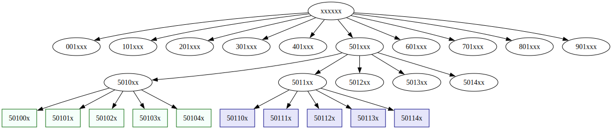

:PROPERTIES:
:ID:       57607f58-32d2-4e2b-9327-551164929fa7
:END:
#+TITLE: VyOS: Setting Up Firewall Rules
#+CATEGORY: slips
#+TAGS:

Skip to [[#Routing]] if emacs is irrelevant.

#+begin_quote
Note: config details like addresses are are swapped around, but should be
internally consistent
#+end_quote

This covers setting up DNS, NTP and basic firewall groups, but doesn't get into
setting up the ipv4 chains: input, forward, output, pre-routing

I don't think I will use zones, but instead custom chains to avoid most of the
wild rule sequencing.

The router is conveniently unplugged until it actually um has a firewall lol

* Roam
+ [[id:5aa36ac8-32b3-421f-afb1-5b6292b06915][VyOS]]
+ [[id:e967c669-79e5-4a1a-828e-3b1dfbec1d19][Route Switch]]

* Babel

This works alright...

It's possible to manage =:session *vyop*= and =:session *vyconf*=, but that may be
confusing and isn't appropriate for more secure contexts.

+ Before =install image=
  - Running =vbash; source /opt/vyatta/etc/functions/script-template= was required
  - afterwards ... not so much. it created a weird shell that I couldn't exit
  - instead, open the =ssh r2= in a babel session and manually enter the mode.
    this doesn't require =source= or changing to =vbash=
+ Script comments will silently error. This doesn't seem to affect much. idk

** Chains

under =set firewall=

#+begin_verse
bridge                 flowtable              group                   ipv4                   ipv6
├── forward            └── custom_flow_table  ├── address-group       ├── forward            ├── forward
│   └── filter +           └── +              ├── domain-group        │   └── filter +       │   └── filter +
├── input                                     ├── interface-group     ├── input              ├── input
│   └── filter +       global-options         ├── ipv6-address-group  │   └── filter +       │   └── filter +
├── name               ├── +                  ├── ipv6-network-group  ├── name               ├── ipv6-name
│   └── custom_name +  ├── all-ping           ├── mac-group           │   └── custom_name +  │   └── custom_name +
├── output             └── broadcast-ping     ├── network-group       ├── output             ├── output
│   └── filter +                              └── port-group          │   ├── filter +       │   ├── filter +
└── prerouting         zone                                           │   └── raw +          │   └── raw +
    └── filter +       └── custom_zone_name                           └── prerouting         └── prerouting
                           └── +                                          └── raw +              └── raw +
#+end_verse

** R2

shell in operation mode

#+name: *r2ops*
#+begin_src shell :session *r2ops* :results output silent
ssh r2
# vbash
# source /opt/vyatta/etc/functions/script-template
#+end_src

shell in =configure= mode

#+name: *r2conf*
#+begin_src shell :session *r2conf* :results output silent
ssh r2
# vbash
# source /opt/vyatta/etc/functions/script-template
configure
#+end_src

check =configure= status

#+begin_src shell :session *r2conf* :results output code :wrap example diff
compare | cat -v
#+end_src

#+RESULTS:
#+begin_example diff
No changes between working and active configurations.

[edit]
#+end_example

** Commands

On =r2=

#+begin_src shell :session *r2ops* :results output code :wrap example diff
ss -4t | grep ssh
#+end_src

#+RESULTS:
#+begin_example diff
ESTAB 0      0         172.16.180.102:ssh    172.16.180.73:57298
ESTAB 0      0         172.16.180.102:ssh    172.16.180.73:35572
ESTAB 0      0         172.16.180.102:ssh    172.16.180.73:45018
#+end_example

** Issues

These don't work, since =vbash -s= ends early

#+begin_example org
shell in operation mode

#+name: *r2op*
#+begin_src shell 
ssh r2 'vbash -s' <<EOF
source /opt/vyatta/etc/functions/script-template
EOF
#+end_src

shell in =configure= mode

#+name: *r2conf*
#+begin_src shell 
ssh r2 'vbash -s' <<EOF
source /opt/vyatta/etc/functions/script-template
configure
EOF
#+end_src
#+end_example

This below doesn't work

#+name: showInterfaces
#+begin_src emacs-lisp
"run show interfaces"
#+end_src

this works, but isn't flexible

#+begin_src shell :noweb yes
ssh r2 'vbash -s' <<EOF
source /opt/vyatta/etc/functions/script-template
<<showInterfaces()>>
exit
EOF
#+end_src

** Routing

For NTP/DNS/etc and stuff, ensure there's a valid default route.

#+begin_src shell :session *r2conf* :results output silent
delete protocols static route 0.0.0.0/0 interface eth0
set protocols static route 0.0.0.0/0 next-hop 172.16.180.1 interface eth2.160
#+end_src

*** NAT

**** Hosts

#+begin_src shell :session *r2conf* :results output silent
set service dns forwarding authoritative-domain home.eg.tld records a   comp1 address 172.16.180.37
set service dns forwarding authoritative-domain home.eg.tld records a   comp2 address 172.16.180.73
set service dns forwarding authoritative-domain home.eg.tld records a server1 address  172.16.250.1
#+end_src

**** Routing

#+begin_src shell :session *r2conf* :results output silent
set service dns forwarding authoritative-domain home.eg.tld records a      wan.r2.route address  172.24.24.102
set service dns forwarding authoritative-domain home.eg.tld records a     home.r2.route address  172.16.45.102
set service dns forwarding authoritative-domain home.eg.tld records a      dev.r2.route address 172.16.180.102
set service dns forwarding authoritative-domain home.eg.tld records a    build.r2.route address 172.16.240.102
set service dns forwarding authoritative-domain home.eg.tld records a  servers.r2.route address 172.16.250.102
set service dns forwarding authoritative-domain home.eg.tld records a      lab.r2.route address 172.20.100.102
#+end_src

The other addresses are explicitly configured to avoid ARP problems... right,
xfinity?

#+begin_src shell :session *vy2conf* :results output silent
set interfaces ethernet eth0 address 172.24.24.45/24
set interfaces ethernet eth0 address 172.24.24.180/24
set interfaces ethernet eth0 address 172.24.24.240/24
set interfaces ethernet eth0 address 172.24.24.250/24
set interfaces ethernet eth0 address 172.24.24.150/24
#+end_src

These address groups are for reference only. Breaking the nat out should maybe
help track what's talking to what..... if the "xfinity" doesn't throw errors
like "ERR: nope-finity on ARP" or "ERR: interface blackbox-logic BS".

#+begin_src shell
set firewall group address-group nat_oxelio_home    address 172.24.24.45
set firewall group address-group nat_oxelio_dev     address 172.24.24.180
set firewall group address-group nat_oxelio_build   address 172.24.24.240 
set firewall group address-group nat_oxelio_servers address 172.24.24.250 
set firewall group address-group nat_oxelio_lab     address 172.24.24.150
# NOTE: This addressing requires updating the DHCP pool
#+end_src

This address-specific NAT requires setting up the firewall =network-group='s in
addition to additional ip addresses on the =eth0= interface.

The interface's primary address

#+begin_src shell :session *vy2conf* :results output silent
set interfaces ethernet eth0 address 172.24.24/24
#+end_src

And the NAT configuration

#+begin_src shell :session *vy2conf* :results output silent
set nat source rule 11200 outbound-interface name eth0
set nat source rule 11200 source group network-group oxelio_lan
set nat source rule 11200 translation address 172.24.24.45

set nat source rule 11600 outbound-interface name eth0
set nat source rule 11600 source group network-group oxelio_dev
set nat source rule 11600 translation address 172.24.24.180

set nat source rule 12400 outbound-interface name eth0
set nat source rule 12400 source group network-group oxelio_farm
set nat source rule 12400 translation address 172.24.24.240

set nat source rule 13200 outbound-interface name eth0
set nat source rule 13200 source group network-group oxelio_svc
set nat source rule 13200 translation address 172.24.24.250

set nat source rule 13600 outbound-interface name eth0
set nat source rule 13600 source group network-group oxelio_lab
set nat source rule 13600 translation address 172.24.24.150
#+end_src

** NTP

#+begin_src shell :session *r2conf* :results output silent
set service ntp server us.pool.ntp.org pool
set service ntp server us.pool.ntp.org interleave
#+end_src

Maybe delete the other servers. See [[https://vyos.dev/T2297][vyos.dev#T2297]] for notes on how this affects
=chrony= config 

#+begin_src shell :session *r2conf* :results output silent
delete service ntp server 0.us.pool.ntp.org
delete service ntp server 1.us.pool.ntp.org
delete service ntp server 2.us.pool.ntp.org
delete service ntp server 3.us.pool.ntp.org
#+end_src

After =ntp= is actually running, the =hwclock= should be synchronized as well. LOL I
was seeing like five different times here:

+ 2019/06/06 (HW clock)
+ 2025/06/25 idk, but in =date= and =journalctl=
+ 1970/01/01 in =chronyc tracking=

See [[https://docs.redhat.com/en/documentation/red_hat_enterprise_linux/10/html/configuring_time_synchronization/overview-of-network-time-security-nts-in-chrony][Enabling Network Time Security (NTS) on a client]]

*** Chrony

sudo cat /run/chrony/chrony.conf

#+begin_example conf
### Autogenerated by service_ntp.py ###

# This would step the system clock if the adjustment is larger than 0.1 seconds,
# but only in the first three clock updates.
makestep 1.0 3

# The rtcsync directive enables a mode where the system time is periodically
# copied to the RTC and chronyd does not try to track its drift. This directive
# cannot be used with the rtcfile directive. On Linux, the RTC copy is performed
# by the kernel every 11 minutes.
rtcsync

# This directive specifies the maximum amount of memory that chronyd is allowed
# to allocate for logging of client accesses and the state that chronyd as an
# NTP server needs to support the interleaved mode for its clients.
clientloglimit 1048576

driftfile /run/chrony/drift
dumpdir /run/chrony
ntsdumpdir /run/chrony
pidfile /run/chrony/chrony.pid

# Determine when will the next leap second occur and what is the current offset
leapsectz right/UTC

user _chrony

# NTP servers to reach out to
pool us.pool.ntp.org iburst xleave

# Allowed clients configuration
deny all
#+end_example

** DNS

*** TODO DNS fix =source-address= and ensure =DNSSEC=

+ [ ] set a correct =source-address= (instead of the dev interface address)
+ [ ] ensure =DNSSEC= 

*** v4

=name-server= needs to be the more authoritative DNS server.

#+begin_src shell :session *r2conf* :results output silent
set service dns forwarding name-server    172.16.180.1  port 53
set service dns forwarding source-address 172.16.180.12
#+end_src

To use the =system= DNS instead

#+begin_src shell :session *r2conf* :results output silent
set service dns forwarding system
#+end_src

**** Hosts

#+begin_src shell :session *r2conf* :results output silent
set service dns forwarding authoritative-domain home.eg.tld records a   comp1 address 172.16.180.37
set service dns forwarding authoritative-domain home.eg.tld records a   comp2 address 172.16.180.73
set service dns forwarding authoritative-domain home.eg.tld records a server1 address  172.16.250.1
#+end_src

**** Routing

#+begin_src shell :session *r2conf* :results output silent
set service dns forwarding authoritative-domain home.eg.tld records a      wan.r2.route address  172.24.24.102
set service dns forwarding authoritative-domain home.eg.tld records a     home.r2.route address  172.16.45.102
set service dns forwarding authoritative-domain home.eg.tld records a      dev.r2.route address 172.16.180.102
set service dns forwarding authoritative-domain home.eg.tld records a    build.r2.route address 172.16.240.102
set service dns forwarding authoritative-domain home.eg.tld records a  servers.r2.route address 172.16.250.102
set service dns forwarding authoritative-domain home.eg.tld records a      lab.r2.route address 172.20.100.102
#+end_src

unsure

#+begin_src shell :session *r2conf* :results output silent
# set service dns forwarding authoritative-domain home.eg.tld records a  mgmt.r2.route address 172.22.192.12
# set service dns forwarding authoritative-domain home.eg.tld records a admin.r2.route address 172.22.200.12
# set service dns forwarding authoritative-domain home.eg.tld records a  util.r2.route address 172.17.180.12
#+end_src

**** DNSSEC

DNSSEC isn't enabled for system DNS, as =options edns0= isn't set in
=/etc/resolve.conf=. omarchy also has =trust-ad= which i can't find

#+begin_example conf
### Autogenerated by VyOS ###
### Do not edit, your changes will get overwritten ###

# system
nameserver 172.16.180.1
#+end_example

System DNS also has this warning,

#+begin_quote
If you are configuring a VRF for management purposes, there is currently no way
to force system DNS traffic via a specific VRF.
#+end_quote

(I think) that this means DNS lookups from the box itself need some guidance in
order to be validated.

***** Dummy device

configs like =set vrf bind-to-all= would definitely prevent this from working,
though I haven't tried it.

#+begin_src shell :session *r2conf* :results output silent
vrf_ip=172.123.0.1
vrf_dummy_ip=172.123.10.1
vrftable=1230
vrfvlan=1234
vrf=vrf1230

dns_dummy=172.16.4.4
lookupfrom=$vrf_dummy_ip # the vrf's ip

set interface dummy dum0dns address "$dns_dummy/24"
set system name-server "$dns_dummy"
set service dns forwarding name-server "$dns_dummy" port 53
set service dns forwarding source-address "$lookupfrom"

delete vrf bind-to-all

set vrf "$vrf" table "$vrftable"
set interfaces dummy dum1vrf address "$vrf_dummy_ip/24"
set interfaces ethernet dum1vrf vif $vrfvlan address "$vrf_dummy_ip"
set interfaces ethernet eth9 vif $vrfvlan vrf "$vrf1230"
set interfaces ethernet eth9 vif $vrfvlan address "$vrf_ip"

# set vrf name vrf1230 protocols static route $dns_dummy/32 next-hop "$vrf_dummy_ip" distance 1
set vrf name vrf1230 protocols static route $dns_dummy/32 interface "$dns_dummy" vrf "default" distance 1
#+end_src

... or something like that idk, with probably some firewall rules.

See [[https://docs.vyos.io/en/latest/configuration/vrf/index.html#vrf-route-leaking][VRF Route Leaking]] and [[https://docs.vyos.io/en/latest/configexamples/fwall-and-vrf.html][VRF/Firewall Example]]

* Groups

** Port

#+begin_src shell :session *r2conf* :results output silent
set firewall group port-group irc_all_t port start-end 6660-6669
set firewall group port-group synct_u port 22000
set firewall group port-group synct_t port 21027
set firewall group port-group synct_w port 8384
#+end_src

Covered by =/etc/services=, mostly.

#+begin_example shell
# from opnsense dump
yq -rj '.aliases.port | map([.name,.content] | @csv) | join("\n")'
#+end_example

core, infra, remote

| Core       |   |             | Infra   |   |      |      | Remote     |   |           |   |
|------------+---+-------------+---------+---+------+------+------------+---+-----------+---|
| dhcpv6     | U |     546:547 | bgp     | T |  179 |      | rdp        | T |      3389 |   |
| dns        | U |          53 | ipsec   | U |  500 | 4500 | vnc_client | T | 5900:5909 |   |
| dnssec     | T |         853 | syslog  | . |  514 |      | vncl       | T |      5500 |   |
| mdns       | U |        5353 | openvpn | U | 1194 |      | vnc        | W |      5800 |   |
| hkps       | T |       11371 | pptp    | T | 1723 |      |            |   |           |   |
| ntp        | U |         123 | snmp    | . |  161 |      |            |   |           |   |
| ssh        | T |          22 | snmp    | U |  162 |      |            |   |           |   |
| tftp       | U |          69 |         |   |      |      |            |   |           |   |
| traceroute | U | 33434:33524 |         |   |      |      |            |   |           |   |

comm, storage, misc

| Comm    |   |           |      | Storage    |   |           |      | Data     |   |      |
|---------+---+-----------+------+------------+---+-----------+------+----------+---+------|
| imap    | T |       143 |      | ceph       | T |      6789 | 3300 | postgres | T | 5432 |
| imaps   | T |       993 |      | ceph_extra | T | 6800:7300 |      | redis    | T | 6379 |
| irc     | T |      6667 |      |            |   |           |      |          |   |      |
| irc_all | T | 6660:6669 | 7000 |            |   |           |      |          |   |      |
| pop3    | T |       110 |      |            |   |           |      |          |   |      |
| pop3s   | T |       995 |      |            |   |           |      |          |   |      |
| smtp    | T |        25 |      |            |   |           |      |          |   |      |
| smtps   | T |       587 |  465 |            |   |           |      |          |   |      |

web, file, web services, misc

| Web   |   |     | File      |   |       | Web Services |   |      | Misc   |   |      |      |
|-------+---+-----+-----------+---+-------+--------------+---+------+--------+---+------+------|
| http  | . |  80 | rsync     | T |   873 | cockpit      | W | 9090 | squid  | T | 3128 |      |
| https | . | 443 | synct     | T | 22000 | prox_web     | W | 8006 | gnunet | . | 2086 | 1080 |
|       |   |     | synct     | U | 21027 |              |   |      | nnsp   | . |  433 |      |
|       |   |     | synct_web | W |  8384 |              |   |      | nntp   | . |  119 |      |
|       |   |     |           |   |       |              |   |      | nntps  | . |  563 |      |

** Interface

#+begin_src shell :session *vy2conf* :results output silent
set firewall group interface-group WAN interface eth0
#+end_src

** Network

#+begin_example shell
# from opnsense dump
yq -rj '.aliases.network | map([.name,.content] | @csv) | join("\n")' \
| tr -d "\"" | tr ',' '|'
#+end_example

*** ipv4

Private

#+begin_src shell :session *vy2conf* :results output silent
set firewall group network-group ipv4-private network 10.0.0.0/8
set firewall group network-group ipv4-private network 172.16.0.0/12 
set firewall group network-group ipv4-private network 192.168.0.0/16
set firewall group network-group ipv4-private network 127.0.0.0/8   
set firewall group network-group ipv4-private network 100.64.0.0/10 
set firewall group network-group ipv4-private network 169.254.0.0/16
#+end_src

*** ipv6

private

#+begin_src shell :session *vy2conf* :results output silent
set firewall group ipv6-network-group ipv6-private network fd00::/8
set firewall group ipv6-network-group ipv6-private network fe00::/10
set firewall group ipv6-network-group ipv6-private network ::/128
#+end_src

address space

#+begin_src shell :session *vy2conf* :results output silent
set firewall group ipv6-network-group ipv6-linklocal network ff02::/16
set firewall group ipv6-network-group ipv6-allnodes  network fe80::/10
# set firewall group ipv6-network-group ipv6-colophon  ::/128
#+end_src

** Address

*** DNS v4

adguard, google, cloudflare

#+begin_src shell :session *vy2conf* :results output silent
set firewall group address-group dns_adguard_v4 address 94.140.14.14
set firewall group address-group dns_adguard_v4 address 94.140.15.15
set firewall group address-group dns_google_v4 address 8.8.8.8
set firewall group address-group dns_google_v4 address 8.8.4.4
set firewall group address-group dns_cloudflare_v4 address 1.1.1.1
set firewall group address-group dns_cloudflare_v4 address 1.0.0.1
#+end_src

aws (for some bs redirects idk)

#+begin_src shell :session *vy2conf* :results output silent
set firewall group domain-group dns_aws address dns-external-master.amazon.com
set firewall group domain-group dns_aws address root.amazon.com
#+end_src

*** DNS v6

adguard, google, cloudflare

#+begin_src shell :session *vy2conf* :results output silent
set firewall group ipv6-address-group dns_adguard_v6 address 2a10:50c0::bad1:ff
set firewall group ipv6-address-group dns_adguard_v6 address 2a10:50c0::bad2:ff
set firewall group ipv6-address-group dns_google_v6 address 2001:4860:4860::8888
set firewall group ipv6-address-group dns_google_v6 address 2001:4860:4860::8844
set firewall group ipv6-address-group dns_cloudflare_v6 address 2606:4700:4700::1111
set firewall group ipv6-address-group dns_cloudflare_v6 address 2606:4700:4700::1001
#+end_src

** Host

Use [[https://dnsdumpster.com/][dnsdumpster.com]] to find records under a primary domain (e.g. under quay.io)

HKPS

#+begin_src shell :session *r2conf* :results output silent
set firewall group domain-group hkps_keyservers address keys.openpgp.org                 
set firewall group domain-group hkps_keyservers address hpks.pool.sks-keyservers.net     
set firewall group domain-group hkps_keyservers address pgp.ocf.berkely.net              
#+end_src

Github

#+begin_src shell :session *r2conf* :results output silent
set firewall group domain-group github_all address github.com
#+end_src

*** Packages

Debian

#+begin_src shell :session *r2conf* :results output silent
set firewall group domain-group pkg_debian address ftp.us.debian.org
set firewall group domain-group pkg_debian address security.debian.org
set firewall group domain-group pkg_debian address enterprise.proxmox.com
set firewall group domain-group pkg_debian address downloads.proxmox.com
set firewall group domain-group pkg_debian address mirror.cogentco.com
set firewall group domain-group pkg_debian address debian.uchicago.edu
set firewall group domain-group pkg_debian address mirror.keystealth.org
set firewall group domain-group pkg_debian address mirror-new.csail.mit.edu
set firewall group domain-group pkg_debian address debian.gtisc.gatech.edu
set firewall group domain-group pkg_debian address mirror.us.oneandone.net
#+end_src

Proxmox

#+begin_src shell :session *r2conf* :results output silent
set firewall group domain-group pkg_proxmox address download.proxmox.org
#+end_src

Vyos

#+begin_src shell :session *r2conf* :results output silent
# set firewall group domain-group pkg_vyos address 
#+end_src

Fedora

#+begin_src shell :session *r2conf* :results output silent
set firewall group domain-group pkg_fedora address centos.org
set firewall group domain-group pkg_fedora address dl.fedoraproject.org
set firewall group domain-group pkg_fedora address download.cf.centos.org
set firewall group domain-group pkg_fedora address fedoraproject.org
set firewall group domain-group pkg_fedora address mirror.centos.org
set firewall group domain-group pkg_fedora address mirrors.centos.org
set firewall group domain-group pkg_fedora address mirror.stream.centos.org
set firewall group domain-group pkg_fedora address registry.fedoraproject.org
#+end_src

Guix

#+begin_src shell :session *r2conf* :results output silent
set firewall group domain-group pkg_guix address ci.guix.gnu.org
set firewall group domain-group pkg_guix address git.savannah.gnu.org
set firewall group domain-group pkg_guix address bordeaux.guix.gnu.org
set firewall group domain-group pkg_guix address substitutes.nonguix.org
#+end_src

Ansible

#+begin_src shell :session *r2conf* :results output silent
set firewall group domain-group pkg_ansible address galaxy.ansible.com
set firewall group domain-group pkg_ansible address ansible-galaxy.s3.amazonaws.com
#+end_src

*** Containers

dockerhub

#+begin_src shell :session *r2conf* :results output silent
set firewall group domain-group reg_docker address docker.io
set firewall group domain-group reg_docker address auth.docker.io      
set firewall group domain-group reg_docker address index.docker.io     
set firewall group domain-group reg_docker address registry-1.docker.io
#+end_src

quay

#+begin_src shell :session *r2conf* :results output silent
set firewall group domain-group reg_quay address cdn.quay.io
set firewall group domain-group reg_quay address cdn01.quay.io
set firewall group domain-group reg_quay address cdn02.quay.io
set firewall group domain-group reg_quay address cdn03.quay.io
#+end_src

fedora

+ cdn.registry.fedoraproject.org :: may be required

#+begin_src shell :session *r2conf* :results output silent
set firewall group domain-group reg_fedora address registry.fedoraproject.org
#+end_src

misc

#+begin_src shell :session *r2conf* :results output silent
# set firewall group domain-group reg_misc address production.cloudflare.docker.io
#+end_src

* Firewall

** Initial

*** Global

Always respond to pings _to_ firewall

#+begin_src shell :session *vy2conf* :results output silent
set firewall global-options all-ping
#+end_src

These are evaluated immediately, but pre-empt any other ipv4 handling of L4
firewall logic for stateful connections:

#+begin_src shell :session *vy2conf* :results output silent
set firewall global-options state-policy established action accept
set firewall global-options state-policy related action accept
set firewall global-options state-policy invalid action drop
#+end_src

Drop everything from outside

#+begin_src shell :session *vy2conf* :results output silent
set firewall ipv4 name OUTSIDE-IN default-action 'drop'

set firewall ipv4 forward filter rule 5500 action jump
set firewall ipv4 forward filter rule 5500 jump-target OUTSIDE-IN
set firewall ipv4 forward filter rule 5500 inbound-interface group WAN
set firewall ipv4 forward filter rule 5500 destination group network-group oxelio
#+end_src

**** TODO Management access, SSH, services

https://docs.vyos.io/en/latest/quick-start.html#allow-management-access

**** Granular handling of stateful connections

Alternative to =firewall global-options state-policy=: chain specific to 

#+begin_src shell :session *vy2conf* :results output silent
set firewall ipv4 name CONN_FILTER default-action 'return'

set firewall ipv4 name CONN_FILTER rule 10 action 'accept'
set firewall ipv4 name CONN_FILTER rule 10 state established
set firewall ipv4 name CONN_FILTER rule 10 state related

set firewall ipv4 name CONN_FILTER rule 20 action 'drop'
set firewall ipv4 name CONN_FILTER rule 20 state invalid

set firewall ipv4 forward filter rule 10 action 'jump'
set firewall ipv4 forward filter rule 10 jump-target CONN_FILTER

set firewall ipv4 input filter rule 10 action 'jump'
set firewall ipv4 input filter rule 10 jump-target CONN_FILTER
#+end_src

*** OPNSense

Implement OPNSense port 0 blocking

#+begin_src shell :session *vy2conf* :results output silent
set firewall ipv4 input filter rule 11000 description 'Drop: Port 0'
set firewall ipv4 input filter rule 11000 action 'drop'
set firewall ipv4 input filter rule 11000 port 0

set firewall ipv6 input filter rule 11000 description 'Drop: Port 0'
set firewall ipv6 input filter rule 11000 action 'drop'
set firewall ipv6 input filter rule 11000 port 0
#+end_src

Implement OPNSense Bogon-logic

#+begin_src shell :session *vy2conf* :results output silent
set firewall ipv4 name IPV4-PRIVATE-IN default-action 'return'

set firewall ipv4 name IPV4-PRIVATE-IN rule 1000 action 'drop'
set firewall ipv4 name IPV4-PRIVATE-IN rule 1000 source group network-group ipv4-private

set firewall ipv6 name IPV6-PRIVATE-IN default-action 'return'

set firewall ipv6 name IPV6-PRIVATE-IN rule 1000 action 'drop'
set firewall ipv6 name IPV6-PRIVATE-IN rule 1000 source group network-group ipv6-private
#+end_src

OPNSense RFC4890 IPV6 ICMP logic (outbound)

#+begin_src shell :session *vy2conf* :results output silent
set firewall ipv6 name IPV6-ICMP-OUT default-action 'return'

for n in {128,129,133,134,135,136}; do
  nrule=$(( n + 1000 ));
  set firewall ipv6 name IPV6-ICMP-OUT rule "${nrule}" description  'RFC4890: ipv6-icmp6[128,129,133,134,135,136]: (self) -out-> (all-nodes,link-local)'
  set firewall ipv6 name IPV6-ICMP-OUT rule "${nrule}" action 'accept'
  set firewall ipv6 name IPV6-ICMP-OUT rule "${nrule}" destination address 'fe80::/10'
  set firewall ipv6 name IPV6-ICMP-OUT rule "${nrule}" destination address 'ff02::/16'
  set firewall ipv6 name IPV6-ICMP-OUT rule "${nrule}" icmpv6 type "${n}"
done
#+end_src

OPNSense RFC4890 IPV6 ICMP logic (inbound)

#+begin_src shell :session *vy2conf* :results output silent
set firewall ipv6 name IPV6-ICMP-IN default-action 'return'

for n in {1,2,135,136}; do
  nrule=$(( n + 1000 ));
  set firewall ipv6 name IPV6-ICMP-IN rule "${nrule}" description 'RFC4890: ipv6-icmp6[1,2,135,136]: (*) -in/out-> (*)'
  set firewall ipv6 name IPV6-ICMP-IN rule "${nrule}" action 'accept'
  set firewall ipv6 name IPV6-ICMP-IN rule "${nrule}" icmpv6 type "${n}"
done

for n in {128,129,133,134,135,136}; do
  nrule=$(( n + 2000 ));
  set firewall ipv6 name IPV6-ICMP-IN rule "${nrule}" description 'RFC4890: ipv6-icmp6[128,129,133,134,135,136]: (all-nodes) -in-> (all-nodes,link-local)'
  set firewall ipv6 name IPV6-ICMP-IN rule "${nrule}" action 'accept'
  set firewall ipv6 name IPV6-ICMP-IN rule "${nrule}" source address 'fe80::/10'
  set firewall ipv6 name IPV6-ICMP-IN rule "${nrule}" destination address 'fe80::/10'
  set firewall ipv6 name IPV6-ICMP-IN rule "${nrule}" destination address 'ff02::/16'
  set firewall ipv6 name IPV6-ICMP-IN rule "${nrule}" icmpv6 type "${n}"
done

for n in {128,129,133,134,135,136}; do
  nrule=$(( n + 3000 ));

set firewall ipv6 name IPV6-ICMP-IN rule "${nrule}" description 'RFC4890: ipv6-icmp6[128,129,133,134,135,136]: (link-local) -in-> (all-nodes)'
set firewall ipv6 name IPV6-ICMP-IN rule "${nrule}" action 'accept'
set firewall ipv6 name IPV6-ICMP-IN rule "${nrule}" source address 'ff02::/16'
set firewall ipv6 name IPV6-ICMP-IN rule "${nrule}" destination address 'fe80::/10'
  set firewall ipv6 name IPV6-ICMP-IN rule "${nrule}" icmpv6 type "${n}"
done

for n in {128,129,133,134,135,136}; do
  nrule=$(( n + 4000 ));
  set firewall ipv6 name IPV6-ICMP-IN rule "${nrule}" description 'RFC4890: ipv6-icmp6[128,129,133,134,135,136]: (::) -in-> (link-local)'
  set firewall ipv6 name IPV6-ICMP-IN rule "${nrule}" action 'accept'
  set firewall ipv6 name IPV6-ICMP-IN rule "${nrule}" source address '::'
  set firewall ipv6 name IPV6-ICMP-IN rule "${nrule}" destination address 'ff02::/16'
  set firewall ipv6 name IPV6-ICMP-IN rule "${nrule}" icmpv6 type "${n}"
done

# set firewall ipv6 name IPV6-ICMP-IN rule 1140 action 'accept'
# set firewall ipv6 name IPV6-ICMP-IN rule 1140 description
# set firewall ipv6 name IPV6-ICMP-IN rule 1140 icmpv6 type 136

# set firewall ipv6 name IPV6-ICMP-IN rule 1150 action 'accept'
# set firewall ipv6 name IPV6-ICMP-IN rule 1150 description
# set firewall ipv6 name IPV6-ICMP-IN rule 1150 icmpv6 type 136
#+end_src

***** TODO icmpv6: match on =protocol==icmpv6= and =jump= to =IPV6-ICMP-IN/OUT=

***** TODO icmpv6 redirects?

* Notes

#+begin_quote
Random ... +probably wrong+ ... definitely wrong lmao

Designing from a blank slate kinda sucks
#+end_quote

** Numbering

This is temporary.

|      n | desc                   |   |   |      n | desc                  |        |                    |
|--------+------------------------+---+---+--------+-----------------------+--------+--------------------|
| 000000 | reserved for idk       |   |   | 010000 | vlan chain jumps      | 020000 |                    |
| 000100 | global setup, reserved |   |   | 014096 | vlan chain jumps end  | 020400 | session fast-track |
| 000200 | global setup           |   |   |        |                       | 020500 | session1 setup     |
|        |                        |   |   |        |                       | 020600 | session1 deny      |
| 000600 | interface blacklist    |   |   |        |                       | 020700 | session1 permit    |
| 000700 | network blacklist      |   |   |        |                       |        |                    |
|        |                        |   |   |        |                       |        |                    |
| 001000 |                        |   |   | 021500 | interface setup       |        |                    |
| 001100 | global marking         |   |   | 021600 | interface chain jumps |        |                    |
| 001200 | global masking         |   |   | 025000 |                       |        |                    |
|        |                        |   |   | 026000 |                       |        |                    |
|        |                        |   |   |        |                       |        |                    |
|        |                        |   |   |        |                       |        |                    |

Early sessions

| 020000 |                       |
| 021000 | network setup         |
| 022000 | network chain jumps   |
| 025000 |                       |
| 026000 |                       |
| 028000 |                       |
| 050000 | applications          |
| 100000 | reserved              |

*** Design

+ need the short-ciruit denies at the top

**** Flexibility

VyOS allows for rules between =1-999999= so I'd like to break this up into an
"address space" that offers efficiency, some mnemonics, but also future
flexibility

#+name: logloglog
|      n | log(n) |      n | log(n) |      n | log(n) |
|--------+--------+--------+--------+--------+--------|
| 000001 |   0.00 | 000100 |   2.00 | 010000 |   4.00 |
| 000003 |   0.48 | 000316 |   2.50 | 031623 |   4.50 |
| 000005 |   0.70 | 000500 |   2.70 | 050000 |   4.70 |
| 000010 |   1.00 | 000632 |   2.80 | 063246 |   4.80 |
| 000031 |   1.49 | 001000 |   3.00 | 100000 |   5.00 |
| 000050 |   1.70 | 003162 |   3.50 | 316224 |   5.50 |
| 000063 |   1.80 | 005000 |   3.70 | 500000 |   5.70 |
#+tblfm: $2=log($1,10);%.2f
#+tblfm: $4=log($3,10);%.2f
#+tblfm: $6=log($5,10);%.2f

**** Migrations

To retain flexibility in design/operation in an application/protocol with trees,
you always need to retain 1+ degrees at the top of your tree. Here, the digits
for firewall rules are somewhat arbitrary ... but they're not really. Given some
additional structure, the digits in base-10 form a 10-tree.

#+begin_src dot :file img/vyos/balanced-trees.svg :results file graphics
digraph G {
    "xxxxxx" -> "001xxx","101xxx","201xxx","301xxx","401xxx","501xxx","601xxx","701xxx","801xxx","901xxx"
    "501xxx" -> "5010xx","5011xx","5012xx","5013xx","5014xx"
    node [style=filled,fillcolor=mintcream,color=darkgreen,shape=rect];
    "5010xx" -> "50100x","50101x", "50102x","50103x","50104x"
    node [style=filled,fillcolor=lavender,color=navy,shape=rect];
    "5011xx" -> "50110x","50111x", "50112x","50113x","50114x"
}
#+end_src

#+RESULTS:

As long as the FW rule "number space" isn't fully consumed, then it becomes
easier to introduce migrations without disrupting service. There are a few
options, but migrations would typically

+ add rules after current rules -- e.g. read =5010xx=, mutate the logic, then insert
  into =5011xx=
+ then drop rules before -- e.g. drop =5010xx=, leaving one set of updated rules
  active
+ then copy the updated =5011xx= back into =5010xx= -- leaving two sets of identical
  rules currently active
+ then drop the temp =5011xx= -- leaving the firewall's state ready for a new
  migration

Most migrations would involve at least as much complexity (numbering space) as
the logic they're updating. Soo... at least half. But the kinds of migrations
necessary are multi-scale ...

+ =0xxxxx -> 5xxxxx= temp space for chain-wide updates
+ =01[0-4]xxx -> 01[5-9]xxx= temp space for large updates, depending on how
  essential the ordering is and how contiguous the logic is for rules.
+ =0430xx -> 0435xx= for small application-level updates.

Because of implementation details in the kernel (or in logging & downstream
analytics), this "swap space" idea probably doesn't work for large updates of
entire-chains. The rationale for predicting how much space is required is
similar to planning total storage space required for a small on-prem network
needs for backups, though the answer's a bit different. That's relatable ...
whereas similar logic for managing dynamic VLAN inventory using netbox/nautobot
is ummm less relatable. The idea is similar though.

#+begin_quote
One main challenge here: network resources (hardware/services) are _shared
resources_ and you're probably not the only tech managing them...

Another challenge: balancing logic/organzation with the re-organization that's
needed for efficient rules. if some logic of the firewall is duplicated (or if
address-space isn't well-defined)
#+end_quote

State syncronization for NAT/etc is problematic. Migrating the logic in the
configuration _could be_ simpler than migrating at the device/network level
(doesn't require synchronization or draining resources from device/service until
offline) ... but idk

Ideally, you really don't want the logic & config of the network/firewall to
even _need_ to change very often.

+ Initially, this leads to some disruption on services ... without it, you're
  not testing you're capacity to change.
+ More change could elicit problems related to state of: application-level
  services, network analytics, network configurations or similar.
+ In the extreme, you find yourself dealing with CAP-theorem problems... so
  needing to choose consistent configuration (as seen by the network) vs.
  flexibility/specificity.

***** Alternatives

#+begin_quote
This isn't really authoritative. Idk what people do IRL, esp. since the concerns
for cloud platform customers & operators is so different than traditional
on-prem network operators (who touch cabling, swap hard drives, and carry screw
drivers).
#+end_quote

+ Swap extra devices (or failover devices) on the network. For fail-over, you'd
  typically have 2-3 firewalls for every point (in the network) where you need
  traffic filtering. You can do accomplish the migration of filtering logic"
  with the network itself ... instead of the device's configuration state. This
  is an entirely different approach.
+ etc. idk. i kinda just need to configure my firewall now.

* Trees and stuff

From some rant i never published

#+begin_quote
+ What is necessary to DNS about the TLD? e.g. the =.com= or =.io=. How does this
  relate to flexibility in architecture over time? How does that principle
  comport to:
  - flexibility in: IP addressing?
  - X509 Common Names and properties?
  - Future-proof metadata keys?
  - URL Routing Scheme to avoid link rot? To avoid later usage of subroutes?

e.g. Route collisions: Github requires =/org= in
=github.com/org/$userOrOrg/repositories= otherwise it collides with
=github.com/$userOrOrg/$repo=. This means no user or org can ever have the name
=org= or =user=.

+ To avoid this, after the =FQDN=, you should guarantee a prefix before
  any dynamic routing that occupies the entire URL space of that component.
+ you need a _finite_ set (e.g. =/u= or =/o=) or a _countable subset_ =[0-9]+.*= which can
  be "infinite" but is still distinguishable as a subspace of the domain of a
  left-adjoint [[https://en.wikipedia.org/wiki/Free_monoid][free monoid]].
  - The former is shorter to type, easier to remember (and harder to remember as
    an exception).
  - The solution GH went with is still mnemonic, but requires familiarity with
    the app's concepts/schemas in order to explain. You need to know =a priori=
    that GH has orgs or has users. For routing at scale to SOA, it's still not a
    bad solution, but requires pushing some of the complexity to layer-7
    gateways to terminate TLS connections, while forwarding the actual requests
    to the service provider's internal =github.com/(org|user)/(route)= handler
  - Simply branching off the =fqdn= is more mnemonic for the average "=www.tld.com=
    is almost too hard" American.
#+end_quote
