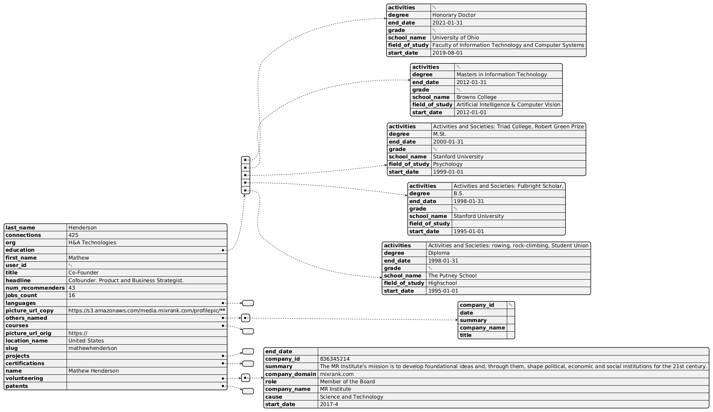

:PROPERTIES:
:ID:       01094ff9-395a-4bdc-8c8f-c6d960059f08
:END:
#+TITLE: Data Science: Mixrank and People Data Labs
#+CATEGORY: slips
#+TAGS:

* Roam
+ [[id:71622b7d-e1dd-4d43-bc7f-1beef2e1f068][AI: Recruitment LLM]]

* Talent Acquisition and Data

Digging into the AI products listed in [[id:71622b7d-e1dd-4d43-bc7f-1beef2e1f068][AI: Recruitment LLM]] led to gems like [[https://www.heymilo.ai/blog/ats-filing-cabinet-why-talent-rediscovery-fails][Your
ATS Is a Filing Cabinet. That's Why Talent Rediscovery Fails]].

TBH it was far too many tokens for me to read all by myself. So i had AI
summarize it by generating 3 to 4 unicode character responses. That reminds me
of the internet from 2017, harkening back to a day before clankers.

Anyways, interesting blogs at the pivoted voice-interview startup.

* People Data Labs

[[id:01094ff9-395a-4bdc-8c8f-c6d960059f08][Data Science: Mixrank and People Data Labs]]

The HR people finally figured out "JSON" and semi-structured data. The example
record for [[https://mixrank.com/datasets/people-data/][People Data Labs]] doesn't include work experience though. Recruiters
and TA pay 20¢ per record for this?

#+begin_src plantuml :file "img/dot/people-data-labs.png"  :noweb yes
@startjson
<<peopleDataLabs>>
@endjson
#+end_src

#+RESULTS:

It makes sense for other applications or as a schema & basis into which you can
fit other records from arbitrary sources. There are a few problems there, some
of which would bias ATS/search:

+ towards records with extent information 
+ and against anomalies (perhaps heavily)

No data? You don't exist.

#+begin_quote
There are a few reasons that I don't use products like Incogni to delete my data
... but mainly, I actually do exist. It makes more sense in the future. When
products like incogni have complicated tracking the provinance of data and gaps
are filled in by a deluge of AI-generated data, reconstructing what had happened
will be ... weird.
#+end_quote

Anyways. Not all types of data signals are easy to create or bind to your
identity -- e.g. this record shows a Masters from both Stanford and Brown. Not
common.

Using these mixrank data feeds in much smaller external databases is unlikely to
take into account:

+ a person's capacity to change. this is fairly easy to handle, even if the
  person doesn't appear in search for ATS/etc (or doesn't rank high enough)
+ the potentially asphixiating effect of a person's circumstances/environment on
  their ability to change.

My life doesn't permit my identity to be associated with most of the relevant
"Feature IDs" in that database. The data doesn't exist ... because the life
experience didn't exist. Once that data's integrated into search & llm products,
the data shapes opportunities (& then outcomes or change). Naturally, many types
of feedback should flow to/from both:

+ data -> real life
+ real life -> data

But when "data" dominates the effect that feedback has on the system, it all
becomes too backwards looking. 

This would affect people with anomalous backgrounds more than people with
"normal" backgrounds. And:

+ Culture is approaching a period of

* Mixrank

This is pretty huge. 800M+ records, fairly up-to-date: about 250M+ refreshed
each 3-6 months. Claims on their website are a bit different, but some data is
easier/cheaper to fetch

** Feature IDs

Identifiers corresponding to types in a semantic database.

Search for feature IDs by the following using =GET /segment-features/{segment}=,
returning "up to 2,000" feature IDs (gives you a sense of scale)

#+begin_quote
Codes of type company_type:

G: Government Agency
S: Partnership
P: Privately Held
D: Educational
E: Self Employed
N: Non Profit
C: Public Company
O: Self Owned

Codes of type employee_size:

A: Self-employed
B: 2--10 employees
C: 11--50 employees
D: 51--200 employees
E: 201--500 employees
F: 501--1,000 employees
G: 1,001--5,000 employees
H: 5,001--10,000 employees
I: 10,001+ employees
#+end_quote
