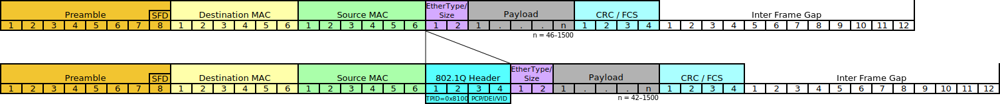
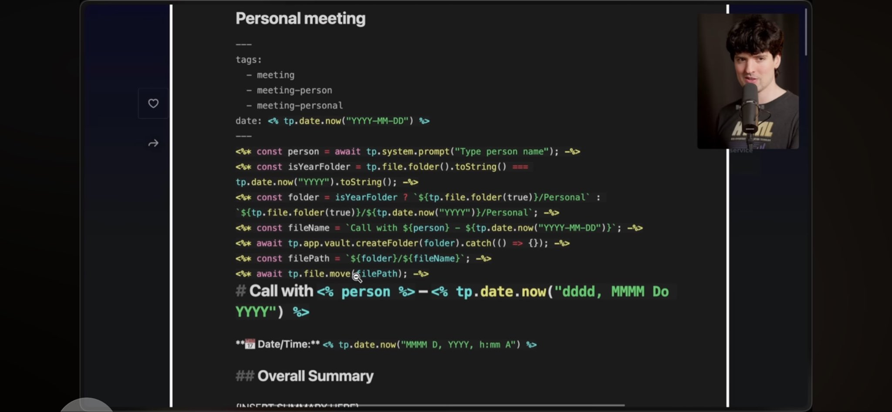

:PROPERTIES:
:ID:       355e84d4-478d-43ee-aed1-61d04bb7bef8
:END:
#+TITLE: AI: Agents, Skillz, Closure Binding and Power Dynamics
#+CATEGORY: slips
#+TAGS:

* Roam
+ [[id:cea7d11c-8357-4e4f-90b3-fa8210eff796][AI]]
+ [[id:33cee19d-b67b-429c-963b-29209d0982bc][Orgmode]]
+ [[id:6f769bd4-6f54-4da7-a329-8cf5226128c9][Emacs]]
+ [[id:d8eb5133-1e50-47c7-8127-370999d75e5f][Scheme: Simple Problems]]
+ [[id:598b9106-b509-40df-9dba-33e992e56b15][Alacritty: Automation of Interactive Tests]]

* Binding Problem

+ [[https://x.com/aionfork/status/2049423749921779846][First thread]]
+ [[https://x.com/aionfork/status/2049441161085895079][Second thread]]

See the original threads on closures/bindings to get a sense of what I mean by
"binding". A good way to imagine what i mean is to compare coordinating
LLM/Agents with traditional metaprogramming

+ like lisp macros manipulating the local bindings of symbols/variables
+ attempting the analogous with prompts which will be submitted to a subset of
  agents in a workflow

The prompts cannot so easily be adapted to their local context. Not with
precision. In networked processes with computers, i consider even the humans to
be running software (having internal bindings and needing external input to be
accessible in order to participate in some process)

* Interface Impedance

The main thesis here: constructing the interfaces -- mainly those required to
assemble text/data for agents -- will separate devs/sysadmins from the
products/techs they manage. in the extreme, there isn't really a path to migrate
back to the kinds of UI/API/HTTP interfaces that we know today.

The way AI/LLM research & products will resolve the translation layers needed --
to coordinate larger groups of agents with the vast selection of ephemeral AI
startups -- by attempting to reduce/eliminate the _interface impedance_ entirely.

The _interface impedance_ mismatch relates to kinds of "information capacities"
for the connections to an endpoint... but it's complicated. These capacities
could include:

+ literal encoded information bandwidth
+ information content of potential messages in entropy bits
+ an analogous measure that describes the how arbitary inputs map to similar
  outputs.

Comparing the information of an LLM's input to the information content of an
ethernet frame is useful. The protocol's data is mostly defined to be in-band,
but it carries a payload that can affect the behavior of layer-two devices (to
some extent). Just like with a "lexxer" for a programming language, some bytes
in an ethernet frame have magic values.

For LLMs, the "System Prompt" for LLMs usually isn't available. The message is
later encapsulated. There are similar ways to extend or wrap prompt data to
protect the system -- at the beginning, maybe repeating it at the end, etc. This
and similar approaches are intended to prevent jailbreaks/etc -- which are
really topological in nature.

One could easily imagine choosing a different set of byte values for ethernet
protocols that change how receiving layer 2 devices will process it. This would
require a different set of patches to the protocol in order to address it. But
the arrangement of bytes to produce "encapsulation" is necessary for ethernet's
functionality/versatility -- it needs an "open" symbol, a "close" symbol, a
"length" symbol or position. Topologically, this requires an interior and
exterior: it's a =1-disc=. Ethernet frames need to propagate as =1-discs= in
multiple directions along a cable, sharing their channel's bandwidth and the
protocol needs to prevent ambiguity. If the details of the protocol were
different (e.g. variable MTU), it's easy to imagine "jailbreaking" an enternet
frame to carry extra data, then supplying an alternate CRC.

But for messages in "token-space", whether something is properly structure or
should be invalid is too high-dimensional. It inherits topological problems from
those high-dimensions.

One could design a way of lexxing ethernet frames and representing them as
symbols. There are similar tokens used to encode embeddings, but idk. The point
is that there are topological characteristics to "string-space" which are easy
to capture/analyze for ethernet -- can extend lexxing to payload & read data for
the IP packet -- but impossible to meaningfully capture from token sequences. At
least not without some data set on the order of the model itself, along with
some compute resources.

TLDR: the information content is relevant to the "interface impedance" mismatch.

#+begin_quote
For the generating end, a template is mostly low-information content -- since
the strings in =<php>= don't change, there are optimizations available which cache
strings that don't change. To the receiving end (template naive), the text has
high information content. Since there are many ways to produce a similar
outcome, the output space should have lower information content (when not
interpreted as plain token bytes).

... NOTE: this really needs some work. it's difficult to be precise with the
language (or greek letters) used to define the alphabets/languages that would
model what i'm trying to convey
#+end_quote

The point is that the sender can't encode tokens with precise control over the
side-effects or output.

** Interface Mismatch

The "interface mismatch" problem is similar to that from electronics,
communications and radio antennae design ... which is why I use the term
"impedance". The way we've traditionally interfaced with computers or computer
services is to standardize on character encodings from which protocols are
defined describing interactions. Some examples.

+ HTTPS API
+ Kernel SysCall interface
+ some gRPC API
+ a call to a =*.so= dynamic library
+ throwing objects "over the FFI fence" and trying to manage/reconcile copies
  stored on both sides

+ your program assembles objects/data into some scope(s) or environments.
  - if it can't fit them all in one environment, there's some means of
    organizing everything, so the requirements of the intended computation are
    satisfied (e.g. regions of virtual memory which will be later fetched via
    MMO to propagate into the CPU)
+ then it selects from that data what is necessary for the interaction,
  organizing it into whats needed for some unit of computation
+ then it submits the data

The data structures programs work with, which are either communicated to the API
or remote party =in-band= or =out-of-band= usually have tree-like or graph-like
structures -- but to _critically_ distinguish the differences between LLM and
traditional UI & computer-interface interactions: we have a kind of certainty
over what the data is and what it's relationships to other datapoints are.

However, this isn't an "XAI" problem. The impedance problem concerns networked
components/processes and the programming interfaces that help coordinate their
interaction at a low-level & small time-scales. Since coordinating how tokens
signify some meaning in their context is computationally impossible for
real-time analysis of token streams. Explainability doesn't necessarily help for
interface impedance, because JIT-reprocessing of agent interactions will (at a
low level) increase the in-degree/out-degree of connectivity for computational
resources allocated. That's at odds with the need for real-time (in addition to
handling alternative token embedding schemes or tokens sent to distilled
networks)

** Closures

Regions of prompt-space (in templated text) correspond to related neighborhoods
of vectors in the embedded space. In order to enforce policy on agents (don't =rm
-rf= the database), you need to understand how meaning is interpreted. For now,
this can be done by scanning:

+ the output text agents receive
+ the text they attempt to apply as shell commands
+ or the text/tokens they attempt to send to another agent

Traditional software can have policy applied with determinism. The output of
some function may not be known, but the inputs to it can be scanned for
overlapping regions of input to block. e.g.

+ scanning RPC calls
+ analyzing HTTP requests in a level 7 firewall
+ scanning system calls from processes on a system

When the bindings to symbols need to be analyzed, this is more complicated. But,
what are the symbols bound in a token stream? They aren't the embedded vectors
precisely. How does one analyze the data defining the context? For a level-7
firewall, an API call for one tenant may be blocked, but may be normal for
another. There, context is usually the tenant's subdomain or a value in HTTP
header, etc. Agents can have their access isolated per-tenant, but similar
contextual data will be found in-band.

The interesting aspects of this aren't the security implications or
implementation options ... but instead the idea of the "closure" of a set of
tokens, along with its symbols and bindings.

Reasoning about this is more complicated for the programmer.

The collective economic response to the _interface impedance_ problem will cause
services to converge towards LLM-based & agent-based services. This further
affects the economics by increasing the relative value of further shifting
towards these uninterpretable interfaces

Depending on the degree of migration towards LLM/Agent-based services, this
consolidates power and decreases the relative value offered by traditional
computing. When interfacing with real-world systems via some technological
interface (e.g. not robots physically interacting with objects) then traditional
interfaces would still be needed.

But the higher-level logic & intent that describes WHY systems were commanded to
follow the logic conveyed by a program is now mostly obfuscated. 

e.g. the thermostat alarm (like in Mr Robot) had its threshold altered/disabled:

+ this resulted from instructions executed on an ARM chip
+ which resulted from a config change
+ which resulted from magic packets containing a TLS session with commands
+ which was emitted by an LLM

Some of that could be blocked by a firewall or by running NetBSD (and
restricting system calls) or by writing software to force updates to require
approval. But now, programs can't easily analyze why the LLM's "closure"
contained symbolic bindings that would cause these commands to be sent. Not in
realtime anyways.

Debugging, log-analysis, etc all depends on the programmer having insight into
these:

+ contexts (closures),
+ symbols (for logs, the fields that can be encoded as values),
+ bindings (for a text-based config interface like =bluetoothctl=, the current
  selected device)

So once most of the high-level logic is obfuscated, since it ultimately
determines whether the lower-level logic of endpoints will cause some
problematic behavior, then analyzing this quickly is impossible. Considering
that the tendancy here is to consolidate the higher-level areas of _networks_ (in
the abstract: internet, cloud, distributed data on kerbernetes), then this
increasingly leaves lower-level networks as observable or policy-enforceable.

** Control

In the recent past, ActiveRecord from rails helped developers shift control from
DBAs to applications development.

Obv. this involved more than Rails. Organizations first implemented computer
technology as mainframes & then databases. There were far less people with more
control over the tech & its data. Once PCs were well-distributed throughout
society (and esp. after mobile) then it made sense to out the UI/UX and shift
the logic into those interfaces. Naturally, DBAs having more control over
application development than the developers themselves was a problem.

The data that computer programs produce is one of the primary valuable
side-effects of networked computation (side effects in haskell terms). Another
primary category is the effect that data has on the activity of networked
systems (to include network-connected technology and also people).

So, the control shifted from small groups of IT/DBA towards application
developers who built the UI/UX (the tech. "roads") to connect the computers to
people. With LLM/Agents, as more of the "intersections" in these tech "roads"
have their logic governed by the symbols/bindings in the closures/sessions
between agents, we'll see a shift of power towards the service providers &
interests that back them. This will cause more tech implementation to
artificially become oriented around they types of "roads" they decide to build
(here, the networks are interfaces between agents & execution environments for
models). The disparity in relative value will disrupt the viability of older
methods. 

** Eliminating Tokens

This is kinda besides the point, since working in the raw embedded values that
tokens represent is difficult. Prompt engineering approaches that attempt to
optimize token budget by improving prompt quality ([[https://arxiv.org/abs/2603.02630][MASPOB]] or [[https://arxiv.org/abs/2406.11695][MIPROv2]]) are
working in other vector spaces to anticipate improved quality. However, those
methods develop a sense of the relationships between neighborhoods of input
vectors to optimize the output or goal.

Once you elimate the tokens entirely, it just makes everything simpler. Any time
you're assembling text in a prompt, you're basically "unloading the truck to
rearrange the packages and load it again". The graph describing flows of data
between computer processes, agents and services becomes far faster if you can
work with content in its native embedded form.

+ See this [[https://aclanthology.org/2025.acl-long.1237/][Embedding-Converter: A Unified Framework for Cross-Model Embedding
  Transformation]]
+ And this [[https://arxiv.org/abs/2505.12540v3][Harnessing the Universal Geometry of Embeddings]]

#+begin_quote
Retailers, shipping and distributers consider this in terms of the "number of
touchs" required to get a package/product where it's going. The retailers always
want 1-2 touches.
#+end_quote

For coordinating interaction of agents, you don't want to convert between Prompt
ASCII/Tokens/Embeddings to get a response in ASCII/tokens. It makes more sense
to mutate the tokens to shift

But i'm also talking about composing embedded vectors -- taking the vectors
corresponding to some texts A, B and C, then interpolating data in between them
-- without needing to convert from =vector <-> token <-> text= and back. "That's
not how it works" ... that's basically what prompt optimization strategies are
trying to do: predict how changing the prompt affects the interpretation by the
LLM/Agent.
** Agents
* Source

** Tech isolation

Keep in mind that i've persistently had far less human contact (esp with
developers) than most honest social distancers had during COVID. Since
like 2013.

It seems that async =*.mdx= "solves" a problem for LLM/Agents by lazily evaluating
data to be injected into a prompt while the workflow is iterating.... still I
don't feel too differently about this. It's abuse of an unintended feature

So there's just no way i'd anticipate this being used for LLM/Agent workflows,
since for some tech usage my knowledge is ABYSMAL. For most periods of time in
the past decades, my social connections are providing basically zero information
about how people use technology. -- esp. newish products or features for
iPhone/Google or commonly used feature patterns

+ I don't know what apple car is and accidentally discovered that my phone
  activates it when i plug it in to the charging port. I disabled Apple Car on
  my phone from using bluetooth. So now i can more easily play music in my car
  bc I don't need to pair. (this was like 2 months ago)
+ For almost the entire time that chromecast has existed, I've Only ever used it
  alongside another person like 5 times.
  - So the idea that I can connect a second device to the chromecast and
    "transfer" the current playlist there is something I HAVE NEVER EXPERIENCED
    EVEN INDIRECTLY.
  - My home network has some weird mDNS issues since the WiFi is outside of my
    PFSense NAT. Wifi devices can stream, but i primarily use LAN bc I hate
    broadcom and i hate wifi. If my opinions should change or be challenged by
    arbitrary social experience -- I HAVE NOTHING TO COMPARE MY LIFE TO.

I could list about 1,000 examples. Anyways

** Video: [[https://www.youtube.com/watch?v=DWcqbPm_Rn4][Markdown is a Terrible Language]]

I started watching this video on why markdown syntax is problematic. I've
noticed a few of this issues and I agree on that. It's not idea. It's also not
terrible. See further below for some notes on Org's usage of text tokens, its
grammar and org/markdown comparison.

#+begin_export html
<iframe width="560" height="315" src="https://www.youtube.com/embed/DWcqbPm_Rn4?si=F9izKosYtJCL7J0c" title="YouTube video player" frameborder="0" allow="accelerometer; autoplay; clipboard-write; encrypted-media; gyroscope; picture-in-picture; web-share" referrerpolicy="strict-origin-when-cross-origin" allowfullscreen></iframe>
#+end_export

Most of the discussion on the video was pretty average. I had no strong opinions
either way. The review of weird markdown situations is something i've
encountered more using VSCode for normies where =README.org= and, really, any
usage of =org= just doesn't make sense...

*** Async =mdx= syntax

But this abomination comes on screen and it's instant rage-bait lol. By instant,
i mean, in 1.5 seconds I'm racking my brain to attempt to uncover the use case
where this wuldn't be a horrifically bad idea.

#+begin_quote
If anyone at work rammed this through, I would instantly quit. I would live
under a bridge to avoid MDX async

Whatever level of psychopathy was required to actually implement that must have
serious prefrontal disinhibition of risk combined with thrillseeking 4 compiler
trickery
#+end_quote

I've used =*.mdx= briefly for an Astro site. i wasn't sure about it at first,
but pretty quickly it seemed alright.

+ The addition of extra grammar is pretty self-explanatory and wouldn't cause
  many problems.
+ For astro anyways, it _limits_ evaluation to single scope to the first js/ts
  block demarcated by =---= which is then bound to the later =JSX= in some
  impressively weird anonymous scopes. The details there are not precise, since
  this was a few years ago.

I wouldn't want to put too much effort into doing much with =*.mdx= except using
it for the content layer. The static site's users wouldn't really want to use
it, but the site itself would need it for some URL routes & pages. I'd ensure
the Astro typescript code handles presenting data to that layer to place a
fairly low upper-bound on future maintenancce.

Anyways...

+ Given those rules I informally set for that project (whose users not webdev
  oriented), and imagining how other devs would use MDX in similar frameworks
+ While being slightly horrified by the idea of Astro's integration with NextJS
  for remote content (esp. given that Astro is very close to web-components
  without a components framework)
+ And yet accepting that some people do be doing dumb things with web tech...

The idea of Async in this MDX code was just horrifying: projects that use it
like this would probably never fix it, etc
* Org Mode

There's something about the org-mode syntax that's pretty magical. It's not
perfect. There are many idiosyncracies and a few problems related to using
org-mode for workflows in emacs:

e.g. For the file-local comment causes issues with org's :PROPERTIES: block
so these variables must instead adopt an alternate format at the end of the
.org file. the file-local variable looks like this:

#+begin_example shell
# -*- file-local: var; mode: muh-major-mode -*- 
#+end_example

Typing this up ellicited an issue with the "org-emphasize" chars that bold &
highlight text. I couldn't type it without placing it into a block. There are
analogous well-known quirks in markdown.

** Differences in lexxed tokens

+ Org-mode does use a common comment characters in syntax: for comments.
  - org-mode comes from outline mode, which was a convention for programmers to
    use code comments for structure.
  - This allows you to flip a "literate program" inside out: replace the
    commented outlines with the end/beginning of ~#+begin_src~ blocks and now you
    have a literate program (skipping a few steps) where it's broken into
    org-mode outline
+ Markdown uses one of the main comment characters for shells & scripted
  languages to enumerate headlines.
  - notice that it also provides an alternative: underlining with =----= and ~====~.
    It may be that this was not for aesthetics, but being the first time i've
    considered it, idk.
  - so you can't 

** File-local variables

Analogous to "front-matter" ... but for all applications, not just the blog.

pretty universal for any non-binary file:

+ It's an convention (unwritten, but somewhat universal) for some applications
  to utilize the first line of a file, of which THERE CAN ONLY BE ONE.
  - It's up to the individual applications (or later processes) to determine
    what to do with this line, so it's tech trivia with mild security
    implications.
  - During the migration towards Unicode from ASCII, it was occasionally
    necessary to use file-local variables to inform text editors about how they
    should interpret the encoding. See [[https://www.masteringemacs.org/article/working-coding-systems-unicode-emacs][Working with Coding Systems and Unicode
    in Emacs]]
+ Since the kernel uses this first line for shebang, you need to figure out
  where else to place SPDX comments or file-local variables.
  - That's a "fisher price my first SPDX adventure" problem for would-be package
    maintainers who care about attribution in mixed-license projects.

), but you just don't run into many issues.

it was heavily influenced by
Donald Knuth's ideas on "Literate Programming" which are well known from his
development of =TeX=. (and indirect influence)

* Original Thread

Not really a thread, since I'm talking to myself on twitter.

+ [[https://x.com/aionfork/status/2049423749921779846][First thread]]
+ [[https://x.com/aionfork/status/2049441161085895079][Second thread]]

** Second Thread

Second before first because thse are the more important ideas.

#+begin_quote
Ideas from #SICP, #Let bindings & #LetRec I would never encountere elsewhere:

- everything's made of procedures surrounded by eval contexts (environments)
  with bindings
- procedures can symbols rebind their closures to new values
- zoom out and data is passed b/w environments
#+end_quote

#+begin_quote
- the kernel, shell (!!), compiler, language VM, runtime, the REPL ... and even
  the programmer (!!) are evaluation contexts

Zooming out gives you perspective on dataflows & workflows

[8] "Fixing Letrec (reloaded)" and otheres made 'let' more profound
https://scheme.com/pubs/index.html
#+end_quote

#+begin_quote
To an extent, this generalization homogenizes the endless variety of
technologies used: the v8 engine, cloud computing, serverless, callbacks, etc...

They just pass data, bind, eval. You can restructure processes by introducing
abstractions: in a program, network, workflow, etc
#+end_quote

#+begin_quote
You want some procedures to be flat with minimal closures: these will be simple,
fast and usually deterministic. Other procedures that need to change behavior
based on the success/failure/efficiency then are also simpler.

It's too general to really be useful at a granular level
#+end_quote

#+begin_quote
But it helps you to see the whole "stack of turtles" instead of just the layers
above/below your application's development or deployment environment.

There are some processes where I do want human intervention to be a bottleneck.
The process is modeled like the workflow awaits.
#+end_quote

#+begin_quote
That's profound and all. Less relevant to MDX eval... but relevant to agent
interactions where you can't actually guarantee that some workflow bottleneck
remains the only path for such processes to be completed, since agents can
choose many other paths to complete some goal
#+end_quote

#+begin_quote
And also helps to understand the spatial/temporal complexity of transformation
required to adapt procedures/closures/bindings in order for agents to perform
some computation by allocating token resources when considering cost/likelyhood
of failures
#+end_quote

#+begin_quote
Anyways, the use-cases for MDX should generally involve flat & controlled
manipulation of data. When it's running that code in MDX, it should never need
the kind of resources that async generally needs to hit.

Otherwise you introduce too many unknowns & problems. Either for ...
#+end_quote

#+begin_quote
(1) The program (next js probably) & its management of threads.

(2) But also for the deployment environments and data flows connected to them
(maybe to a rendered page in a browser or for an agent). It's difficult to get
insight into what's happening in those environments.
#+end_quote

#+begin_quote
so program execution should be as linear as possible

with this environments/bindings-motivated perspective, you're choosing how/where
to distribute the complexity, which usually shows up in programs as spatial
complexity of symbols/bindings, but also error handling, devops yaml
#+end_quote

#+begin_quote
and as information content required for token embeddings and token usage
#+end_quote

** First Thread

#+begin_quote
Org-mode syntax manages to dodge most of those problems, though that’s almost
entirely a user perspective. Implementation code looks rough, but the lexxing
has much less ambiguity.
#+end_quote

#+begin_quote
If anyone at work rammed this through, I would instantly quit. I would live
under a bridge to avoid MDX async

Whatever level of psychopathy was required to actually implement that must have
serious prefrontal disinhibition of risk combined with thrillseeking 4 compiler
trickery
#+end_quote

That's a bit harsh ... but seriously, that seems so lazy or unconcerned with the
future of whatever block of code would need async at the last second.

#+begin_quote
Who TF would be driving the incentivization landscape there? It’s already async
if it’s MDX? (Technically, it’s evaluation is similar)

What kind of “GET IT DONE NOW” culture would inflate that technical debtbomb?

MDX is alright though.
#+end_quote

#+begin_quote
Your content layer should be dumb. You can’t use regexp to easily find these
usages. If it’s async, it’s probably calling to some external library you don’t
have control over (which may change) or an internal implementation that
hopefully doesn’t have 100s of implementations.
#+end_quote

#+begin_quote
If evaluation doesn’t terminate … well that’s weird (& super-fun to debug)

If it hangs for too long but is successful, would you notice that at scale… or
just MOAR Next.JS SERVERS!

Can you config the evaluation of these promises with syntax?

About a dozen other problems

#+end_quote

#+begin_quote
I would instantly quit to avoid working with degenerate Javascript sheep who are
not at all concerned with quality.

I write bad or quick code to solve problems all the time, but I tend to consider
the maintenance burden ahead of time and what it would feel like to rewrite it
#+end_quote

#+begin_quote
And I guess i could be easily dissuaded from being so particularly offended by
this inconceivably stupid idea.

I’m opinionated but holy crap
#+end_quote

