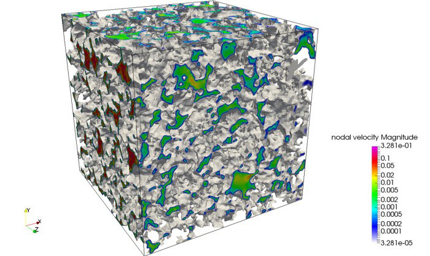
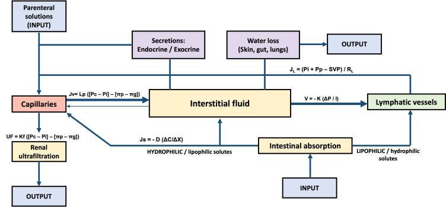

:PROPERTIES:
:ID:       0b418231-1668-46f1-8d6b-3c174d43907d
:END:
#+TITLE: Math: Computational Geometry
#+CATEGORY: slips
#+TAGS:

Infinitesimal behavior of Quadratically Regularized Optimal
Transport and its relation with the Porous Medium Equation

* Topics

** Optimal Transport

+ [[http://elenaher.dinauz.org/B07D.StFlour.pdf][Optimal Transport, old & new]] (Cedric Villani, 2008)

*** Quadratically-Regularized Optimal Transport

**** QOT and its relation to PME

Um.. this seems to relate the whys/hows of kernel density "convergence" ...
(where TF is that paper i actually read? about permuatation)

[[https://arxiv.org/abs/2407.21528][Infinitesimal behavior of Quadratically Regularized Optimal Transport and its
relation with the PME]]

**** Porous Medium Equation

This ends up being an "inoptimal transport" problem, which is kinda obvious
intuition, esp with thi picture from [[https://infrastructure.eng.unimelb.edu.au/matthai/research/fluid-flow][this page right here]]

+ [[https://verso.mat.uam.es/~juanluis.vazquez/BKPME2006six.pdf][Porous Medium Equation (text)]]

***** Examples

[[https://www.youtube.com/watch?v=a-767WnbaCQ][Percolation: A mathematic phase transition]] a video about transitions from
sub-criticality to super-criticality. not focused on fluids per se. more on
[[https://en.wikipedia.org/wiki/Kolmogorov%27s_zero%E2%80%93one_law][Kolmogorov's Zero One Law]].

For fluid systems, there are well-known relationships between volume, flow rate
and also fluid surface area. this is usually rivers/lakes. seems random, but
stoke's theorem is about connections between n-volumes & n+1-volumes.

for PME, the topology of porous connections means such connections between fluid
surfaces and porous volume needs to be treated differently -- especially if
there are changes in the graph of connected volumes and hence, to the
topology... the specific properties of the manifold affects stokes' theorem.

(i still haven't read the paper.... i'm writing this um paper? fuck)

****** albumin's impact on oncotic pressure, osmolality, etc.

a well-known exception to rules for partial pressures

the cardiovascular system's capillary interface with interstitial fluid
regulates fluid flow and homeostasis. for fluid/particle systems, esp involving
many particle sizes, it's helpful for me to imagine the paths available to
particles, w.r.t. the relative scale of particles.

there's the difference increases for the number of paths available to particles
of various sizes in the bloodstream.

this is not what PME is intended to handle: there are too many variables and
dynamics. PME is subject to blowups. choosing the model requires accepting *some
apriori assumptions* about:

+ how to model the system, the fluid diffusion and porocity (?)
  - the statistics _should_ change depending on the criticality resulting from
    paths through the fluid ... as well as variance in those conditions
  - it doesn't look like a precise simulation, but instead a macroscopic model
+ how the model's constraints (static medium, pressure gradient?), equilibrium
  conditions and equations will interact, maybe restricting solutions/methods

****** Electrons on copper

this doesnt seem "porous", but it does involve disrupted electron flow with
longer & more inefficient particle paths.

for electrons on copper, current creates heat which increases resistence. the
effects can in part be explained as increasing the path lengths electrons travel
along. the copper nuclei wobble, then *increasing variance in curvature of
electron paths*. those paths are less efficient & require either more
time/length. this changes local voltage gradients. the power spectral density
broadens out, pacing the thermal power loss: as electro/magnetic energy is
transduced, this is siphoned from the circuits observed PSD (power moves from
that waveform to the thermal radiation). longer paths waste energy, seen as
thermal energy.

the increased resistence may jump to a new plateau or completely breakdown with
a positive feedback loop

* Roam
+ [[id:a0ef7bfe-1587-4fec-ac87-f7dda5dc0d27][Maths: Statistics]]
+ [[id:a0ef7bfe-1587-4fec-ac87-f7dda5dc0d25][Maths: Geometry]]
