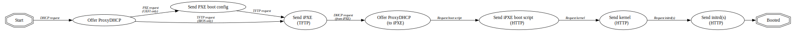

:PROPERTIES:
:ID:       7a629e2a-9de1-4fac-afb2-93873ad6ad59
:END:
#+TITLE: Bootloader: Pixiecore Without DHCP
#+CATEGORY: slips
#+TAGS:

* Resources
+ [[https://blog.yadutaf.fr/2026/06/12/introduction-to-uefi-https-boot-qemu-ovmf/][Introduction To UEFI HTTPS Boot QEMU OVMF]] yikes
+ [[https://github.com/danderson/netboot/tree/main/pixiecore][danderson/netboot]]

** DHCP
+ [[https://www.iana.org/assignments/bootp-dhcp-parameters/bootp-dhcp-parameters.xhtml][DHCP Parameters (IANA)]]
+ [[https://vyos.dev/T5414][Vyos T5411: dhcp-server does not allow valid bootfile-names]]

*** KEA
+ [[https://kea.readthedocs.io/en/kea-2.0.0/arm/dhcp4-srv.html][dhcp-srv (KEA docs)]]
+ [[https://github.com/vyos/vyos-1x/blob/6a5f1961cde6116457cb9e6b958bee7b66603c3b/python/vyos/template.py#L1007-L1055][KEA Template (vyos)]]

* Docs

* Notes

Now this makes more sense

** vyos

only provides this configuration for matching client-classes (option 82)

=set service dhcp-server client-class fdsa relay-agent-information {circuit-id,remote-id}=

There's a way to get this to work ... but it involves CIDR/DCIM (circuit-id) and
iDrac (better configuration of metadata indicating datacenter location to
configure sequences of DHCP state transitions) ... HPC stuff.

** ipxe

+ =initrd= and =module= are just aliases for [[https://ipxe.org/cmd/imgfetch?redirect=1][imgfetch]], which can additional shim
  files into the "initrd.magic" filesystem
** pixiecore
*** Caveats

Usually requires ability to bind as a DHCP for that subnet. Use =--dhcp-no-bind=
to circumvent ... & end up with basically the same problem: VyOS isn't going to
like that.

#+begin_quote
Listen for DHCP traffic without binding to the DHCP port. This enables
coexistence of Pixiecore with another DHCP server.
#+end_quote

i.e. it expects the lifetime of the request to begin with DHCP (or at least by
intercepting DHCP-ish) and to end in one of the various iPXE flows

#+begin_src shell :results output file :file img/devops/pxe-pixieboot.svg
u=https://raw.githubusercontent.com/danderson/netboot/refs/heads/main/pixiecore/bootgraph.dot
curl -sq "$u" | sed -e 's/{/{\nrankdir=LR;/g' | dot -Tsvg

# c'mon man... imagine scrolling that?
#+end_src

#+RESULTS:

*** API Mode

[[https://github.com/danderson/netboot/blob/main/pixiecore/README.api.md][README.api.md]]

+ Intercepts PXE requests and fills in the gaps
+ Defers to an HTTP API to prescribe behavior to an endpoint attempting to boot

This would make much more sense to run on a VM-Host

#+begin_quote
In addition to http and https URLs, Pixiecore supports file:// URLs to serve
files from the filesystem of the machine running Pixiecore.
#+end_quote

[[If you want to implement "single-shot" boot behavior (i.e. "netboot this MAC once, then go back to ignoring it")][The Problem]], I think? At least, at scale (often many machines/VMs will boot at
once).
** Testing with nix

Need to determine whether/how TFTP can function independently of DHCP. via
[[https://github.com/borancar/talos-pxe][borancar/talos-pxe]]

Get some images.

#+begin_src shell
v="1.13.4"
u="https://github.com/siderolabs/talos/releases/download/v$v"

for a in {amd64,arm64}; do
    d="talos/$v/$a"
    mkdir -p $d
    curl -sq "$u/vmlinuz-$a" -o "$d/vmlinuz-$a"
    curl -sq "$u/initramfs-$a.xz" -o "$d/initramfs-$a.xz"
done
#+end_src

Load pixiecore

#+begin_src shell
v="1.13.4"; a="amd64"; d="talos/$v/$a"
linux="$d/vmlinuz-$a"; ramdisk="$d/initramfs-$a.xz"
cmdline="console=ttyS0 console=tty0 console=ttyAMA0" # ¯\_(ツ)_/¯
nix shell nixpkgs#pixiecore

# doesn't really matter if it boots # --debug helps later... but not with TFTP
sudo pixiecore boot "$linux" "$ramdisk" --cmdline="$cmdline" --debug
#+end_src

.... waiting (par for the course with fucking TFTP)

#+begin_src shell
sudo strace -e all `which pixiecore` boot "$linux" "$ramdisk" --cmdline="$cmdline"

# there's a shitton of these...
# 
# --- SIGURG {si_signo=SIGURG, si_code=SI_TKILL, si_pid=503302, si_uid=0} ---
# rt_sigreturn({mask=[]})                 = 0

strace -e all curl "tftp://127.0.0.1/$linux" # ....... nothing
#+end_src

Fix the URLs

#+begin_src shell
sudo `which pixiecore` boot \
    "file:///$(pwd)/$linux" \
    "file:///$(pwd)/$ramdisk" \
    --cmdline="$cmdline" # [TFTP] unable to extract mac from request:not found
#+end_src

Fix the =curl=

#+begin_src shell
mac="12-34-56-78-90-12"
firmwaretype=2 # not the boot.ipxe or $linux (that's relayed over http)
curl "tftp://127.0.0.1/$mac/$firmwaretype" -o "test-x86_64-efi-ipxe.efi"
#+end_src

+ see [[https://github.com/danderson/netboot/blob/main/dhcp4/conn_test.go#L32][./dhcp4/conn_test.go]] for MAC format. it's easier with dashes...
+ see [[https://github.com/danderson/netboot/blob/main/pixiecore/tftp.go#L82-L85][./pixiecore/tftp.go]] for the second path parameter.
  - [[https://github.com/danderson/netboot/blob/main/pixiecore/pixiecore.go#L145-L152][firmware is an enum]] parsed [[https://github.com/danderson/netboot/blob/f5d248c4db462e626fd91ea2d383a09fe42102c0/pixiecore/cli/cli.go#L204][here]] and loaded [[https://github.com/danderson/netboot/blob/f5d248c4db462e626fd91ea2d383a09fe42102c0/cmd/pixiecore/main.go#L27][here]]. now i know why pixiecore's
    not in guix... hmm.
  - =readelf -ha `which pixiecore` | grep compress= probably in here somewhere.
+ The URIs in more detail: [[https://github.com/danderson/netboot/blob/main/pixiecore/dhcp.go#L182-L245][pixicore/dhcp.go]].
  - The enum's codes don't correspond to the [[https://ipxe.org/cfg/platform][DHCP =platform= parameter]]
  - Line 238 there (and the docs) indicate that this really requires =pixiecore=
    received a DHCP request, unless ... you knew the URL ahead of time.
  - There are only [[https://github.com/danderson/netboot/blob/main/pixiecore/pixiecore.go#L48-L54][two architectures]]: =http://%s:%d/_/ipxe?arch=%d&mac=%s=

At this point, it detects the iPXE firmware (which sends a different DHCP
argument) and responds with a URL, which iPXE interprets as a script to fetch.

#+begin_src shell :results output code :wrap example shell
# arch=0: x86_32; arch=1: x86_64
mac="12-34-56-12-34-56"
u="http://127.0.0.1/_/ipxe?arch=1&mac=$mac"
curl -k -sq "$u" 
#+end_src

#+RESULTS:
#+begin_example shell
#!ipxe
kernel --name kernel http://127.0.0.1/_/file?name=kernel&type=kernel&mac=12%3A34%3A56%3A12%3A34%3A56
initrd --name initrd0 http://127.0.0.1/_/file?name=initrd-0&type=initrd&mac=12%3A34%3A56%3A12%3A34%3A56
imgfetch --name ready http://127.0.0.1/_/booting?mac=12%3A34%3A56%3A12%3A34%3A56 ||
imgfree ready ||
boot kernel initrd=initrd0 console=ttyS0 console=tty0 console=ttyAMA0

# cmdline="console=ttyS0 console=tty0 console=ttyAMA0" # ¯\_(ツ)_/¯
#+end_example

* Roam
+ [[id:95146708-4046-4cdb-a5df-e15594f17733][Bootloader]]
+ [[id:ea11e6b1-6fb8-40e7-a40c-89e42697c9c4][Networking]]
+ [[id:bdae77b1-d9f0-4d3a-a2fb-2ecdab5fd531][Linux]]
