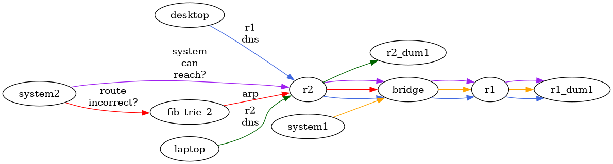

:PROPERTIES:
:ID:       7e01f0d1-58f4-4ba0-846e-e858c741a465
:END:
#+TITLE: VyOS: Setup VRRP, Conntrackd, OSPF for HA Failover
#+CATEGORY: slips
#+TAGS:

* Roam
+ [[id:5aa36ac8-32b3-421f-afb1-5b6292b06915][VyOS]]
+ [[id:e967c669-79e5-4a1a-828e-3b1dfbec1d19][Route Switch]]
+ [[id:ea11e6b1-6fb8-40e7-a40c-89e42697c9c4][Networking]]

* Goals

1. conntrack-sync across =eth3.4000= so that failover doesn't disrupt TCP/UDP
   session state
2. VRRP failover on will always allow traffic to route out of the appropriate
   NAT ip address on =eth0=
3. A partial VRRP failover affecting =HADEV= will still allow traffic on =HALAN=
   to route out whichever router is active.
4. The gateway failover should be relatively independent of failover of internal
   networks.
5. OSPF will provide a "cross-core" =area 0= to redirect traffic when WAN fails
   over.

#+begin_quote
another option that avoids OSPF entirely was to [[https://docs.vyos.io/en/1.5/configuration/protocols/static.html#ipv4-bfd][use BFD to monitor connections &
inject into static routes]]. You have to be able to control both sides of the BFD
peering though. it doesn't monitor my WANs connection... hmmm maybe not.

=set protocols static route <subnet> next-hop <address> bfd profile <profile>=
#+end_quote

** Caveats

Keep in mind that i'm assembling this after getting feedback from Gemini, so
things are a bit scattered.

+ The router configs and diffs are run through a fairly simple =sed= script for
  now to change ip's and VLANs. There could be some typos. Some of the diffs may
  be backwards, though I tried to be consistent about this.
+ This is so I could feel slightly better about sending them off to LLM and
  screenshotting them to "show of" like an idiot -- "show of" is in quotes
  because these configs are like embarrassing bad, compared to where I feel like
  I could be (extrapolating from what "lack of experience" has taught me)

Even though there's extra effort to cleanse/lint the configs, it's much simpler
when I can grep my notes in one place.

+ I need to do much of that anyways when querying LLM. I might as well have a
  structured approach to this so it's repeatable/efficient.
+ It should not feel cumbersome to do that with network configuration.
  Especially if the goal is SDN: _software-defined networking_.
+ The name of the game is, quite /intensivly/: parameterize your configs and
  stage/transactionalize their application.
+ Using the HTTP API and =jq= would make this easier... it turns out that
  regardless of how you structure the "where clauses" and "string/config
  replacements" in your queries commands that it's basically the same
  kolmologorov complexity to use =sed= or =jq=... until you need transactionality &
  dependency management. i.e. you're listing the same set of replacements/logic
  for simple operations, just in a different language.

It's presented in reverse order because the diffs are small and fairly
self-explanatory. For similar reason, "problems" are summarized at the top.

** Problems

*** DNS

#+begin_quote
I didn't use the =sysctl= thing, so the configuration to resolve this is below. I
know how "quick fixes" tend to become sticky for 10x longer than you (I)
initially expect. That's why I _do not_ try to take shortcuts...

... this ends up being worse (without feedback from people, things remain
unimplemented for longer). Hey -- if i had an IT staff, I would have no qualms
making it someone else's problem. But I don't.
#+end_quote

The logs were reporting a failure to bind for backup router, since the VIP
doesn't exist when it's not bound.

#+begin_src shell
set system systctl parameter net.ipv4.ip_nonlocal_bind value 1
#+end_src

There are security concerns here. I had bound my DNS to each local subnet, since
during =Day 0.01= i didn't want routing configuration to cause DNS to fail: i
didn't want routing as a dependency for reachable subnets to have DNS.

It looks like VRRP on a router requires a hard decision on decoupling services
from VIP's ... unless there are fairly strong controls on firewalls or the
device is contained within several security boundaries. That's why there's a
=sysctl=. It's usually a hint.

**** Security issues include:

+ A router processes/forwards a lot of traffic & routes, but if it's aware of a
  specific public address bound to a local interface, that will short-circuit
  the traffic to a services. There doesn't necessarily need to be a local
  interface for the kernel to attach that traffic stream.
  - if your firewalls enforce "Strict vs. Loose" uRPF Reverse Path Forwarding,
    which seems like a pain to enforce, then this creates simplifies MitM
    attacks or bidirectional traffic streams for a surreptition service bound to
    a non-local port
+ Application logic/validation: apparently some apps' underlying logic makes
  assumptions about about the routability of network paths & about
+ Firewall zone bypass: an application in the middle that's bound to multiple
  interfaces can poke holes in your assumptions about firewall zones.
  - This would almost certainly require sufficient knowledge about network
    internals, depending on how obvious your route/switch logic is (it's
    probably not)
  - It also implies that you're already compromised and, while remaining hidden,
    the attacker is either trying to move laterally or they want to exfiltrate
    data by mixing it in to high-volume or less secured channels.

On the other hand ... i think i'll just fix my DNS.

**** Gemini Convo :crypt:urlllm:
:PROPERTIES:
:CRYPTKEY: David Conner <aionfork@gmail.com>
:END:

-----BEGIN PGP MESSAGE-----

hQIMAz05LBTqCkO0AQ//S25SgKRiTRf/+IT7iG8Pwj48Jp0wEqy04EDKvt4tDPnN
OzwKC1no9wGveew4f5RRC8OYGFbeET3LJMLgC8ScYFZdsKNnwEbY1yi2DcF/xc7P
ifKdW96tWnXudBVO22NHPoHIJnUnEv3hJb8ewf75K5moLC16YSBlfKv/qyLBz618
wsMeJ3I8h9jPGijAQFabivuEPImjTxzcg59MOTJphntzdpH5xcBVoOZz/naTbObV
LC+fjv6S/4nJrYN+gVl+YYUSlh9/rf/Z8Bn0g/6WDJ4XoLBShGQnef6o6DFM6OK7
Ql/X5WekFnbkHVSF8/X3k1eKO6A7fZBt7ANNWwfRzxn5cdZqgywmk/N0gr6CdqMK
rQOFW7UZMV9Gc/VPzKM+sc8fZCpbv95L9mvzszsSbDmMRnpLTIZ94XFa0Ut8QSp7
11M/AqfmY4zBpJsakvtQUzNqN6L6xh3dNv1tzoTZ5AyuxiEw29YONb1eQp1xXpDa
YaKC7ZIk4xrYbHNbWavaXFOSyvzRkz0G6x/ANhaKT/82hoZxGnL7Wl/1f4zszkyH
2rhlkCS/FZm7JKnAPZh8/f50HmwSXBnT3CqF4V8j2jL9Ifio8tdQ1jYvp+QjnWH/
kPToOQRyWa9cSXqR5eyKjClpKGrlcwFeXwsRi152niPuK+IAYLcas1+3kdkj4xDS
owF9LuqzdDSyhIF9qkg3rn6G8XodTEUTEN8hr4NJItHjrxgiPlqP7ApVhHQ8EcUE
LZi4WzEMp30TY3iumSuuqBu0+5cmpLuNoHxPuoKEJECWcscKpNoliq5izSzR0v1I
8BXpi9WOyxBsNnqJKjOFyw2G1I9TRMVmSxR9BcxkF5sI7m9AqXPPC+Eoe+4EhMs+
J5dbGIx3ow0uv/cFn4whrNCYtXo=
=sh64
-----END PGP MESSAGE-----

**** Boxes

#+begin_quote
The network is a _wall_: a logical obstruction creating a series of doors that
restrict entry according to some logic. you may also consider it a kind of
containerization (a box). One of the main distringuishing factors for the
"network box" over VMs/Containers: there is no single point of failure for
compromise, for network segments that aren't hyper-connected.

+ Qubes as a hyperviser may be an execption. 
+ An attacker may escape a containers/VM. At that point, they have a lot of work
  to do in an environment that may be unstable (pods come; pods go)
+ Root or X509 compromise on one network segment really does not facillitate
  jumping to other computering devices (they're _physically_ separate and distinct
  trusted execution environments)

That said... networked devices are intended to be ummm networked. Once they are
hyper-connected, you no longer have the same quality of isolation, so there's a
big difference in network isolation for servers and deep internal networks vs.
routers or highly connected servers.

Regardless, 99% of networks are flat _because containerization is hard_. It
doesn't matter what type of "box" it is: network, VM, container, SoA. Accounting
for all that data & the idiosyncracies of that "box type" takes a lot of work.
Thus, almost every segment connected to the internet is over-exposed. The
tooling to do anything else is something the education system cautions you
against: "too secure for your own good."
#+end_quote

*** OSPF

~cat /proc/net/fib_trie~ is a useful sanity check on the routes

+ I had disabled the default =0.0.0.0= route on one one router, I think in
  anticipation of a different approach or in the middle of a transition. This
  tripped me up, but wasn't sufficient.

**** BFD

Getting this wrong or using with the wrong OSPF area-type may be a tricky source
of problems. Definitely required for the bridge network.

There are two ways to configure =bfd=:

- through =ospf= configuration commands (this is much easier for me)
- and with the more specific =set protocols bfd ...=
*** VRRP

+ [[https://forum.vyos.io/t/vrrp-transition-scripts-not-running-vyos-commands/5692/2][VRRP transition scripts not running]] seeing messages about =security_scripts not
  enabled=. These seem to have stopped (unrelated)

On the other hand, the =VRRP= logs show the routers cannot talk to the peers.

#+begin_quote
Jun 25 07:48:43 Keepalived_vrrp[79055]: Sync group HANAT has only 1 virtual router(s) - this probably isn't what you want
#+end_quote

NOTE: after a reboot, =show vrrp status= reports sane cluster state. The above
message seems to be something like a warning ... but it may also appear during
failover.

**** Nat Issues

#+begin_quote
Jun 29 07:04:46 vy1 kernel: ll header: 00000000: ff ff ff ff ff ff 64 00 6a 92 56 51 08 06
Jun 29 07:04:46 vy1 kernel: IPv4: martian source 172.24.24.16 from 172.24.24.1, on dev eth0
#+end_quote

***** Potentially a bad config

[[https://manual.mikrotik.com/docs/high-availability-solutions/vrrp#writable-settings][MicroTIK: VRRP =group-authority= Configuration]] mentions

#+begin_quote
For example, VRRP instances run on LAN and WAN networks with NAT between them.
If one VRRP instance is Master and the other is Backup on the same device, the
entire network malfunctions due to NAT failure. Grouping LAN and WAN VRRP
interfaces ensures that both are either VRRP Master or Backup. _In a VRRP group,
VRRP advertisements are sent only by the group authority._ *In a typical WAN+LAN
setup, you should use the LAN network as the group authority to keep VRRP
control traffic in the internal network.*
#+end_quote

The configuration is slightly different. =group-authority= options:

| none           | The VRRP interface is not grouped and operates independently, with its own VRRP state machine.             |
| self           | The VRRP interface acts as the group authority. It controls the state machines...                          |
|                | of other grouped VRRP interfaces and is responsible for sending and receiving VRRP advertisements.         |
| vrrp-interface | The VRRP interface is a group member. Its state machine follows the state of the specified VRRP interface. |

In vyos, these abstractions mirror =group= and =sync-group= somewhat (i think).
Adding =no-preempt= may fix this after all.

*** =conntrack-sync=

There's a problem with =conntrack-sync=. See later below. After 5 or 6 rounds,
gemini seems to think that I should disable VRRP preemption:

#+begin_quote
By default, VyOS VRRP uses preemption. When r2 recovers its WAN, it instantly
tries to claw back mastership. Combined with your preempt-delay 200, r1 and r2
spend over 3 minutes passing ambiguous state changes back and forth. conntrackd
sees this flickering and triggers its built-in safety mechanism: a scheduled
table flush to prevent routing loops.

Change your configuration to No Preempt. This means if r2 fails and r1 takes
over, r1 remains the master permanently until r2 fails or you manually reboot
it. This prevents the flip-flop that kills the NAT table.
#+end_quote

I'm not 100% sure about that.

I think there's also some issue with NAT generally. =conntrackd= never finishes
draining all the NAT connections. The ones that are left look strange... (SMH i
didn't want to have issues here bc that sucks.)

**** Gemini Convo :crypt:urlllm:
:PROPERTIES:
:CRYPTKEY: David Conner <aionfork@gmail.com>
:END:

-----BEGIN PGP MESSAGE-----

hQIMAz05LBTqCkO0ARAAivk4GB0m0VVGK2x/EyF7oRvdVURoE+ajWOXG2Qccged9
edOvvgnZQKg3O9+qvwyV7uVYmrnHb8n+hBLsbZQRSyQitAMlGy3/P02LRXoYUwP0
dethNgW9CvMkZR1rmTEcShWUIUumHBsDRsDLGrBfNn/aFnqRQJEwZkeFI5Jv23rf
CoALXZ+VAy8l/muTMLKFW0TyCBp3WuNmCSIn+r/vCUPO24/ZANojYVtJT46hfUoC
9qhjqeTZUfFC369HiqWA7QQGt+fmGWNAVkZLDlo+zlyoZimfwlJAZxSrImbrBVzv
7qqFTVtjO2vXQsbCMVozN7+4Bqt83V8EtPTyNmkgFsrzNh0AUfavAyBLHwf5MDVI
SAcNrQF8Xd+BjAhikYczdUURhrW/6zmmRNge+YwzQGPrbhMcF9qAtcrwFKKIY1wB
RZp9zviUXvpxRpiJf0IJ6cWnLftk2BIrtYAJJXviFudrC7egSU8sdBqafOLtlvs4
dJ7FJmStyh2cM5rLoMSbVlrZrOl6Cu5UVoOMq0HSmla+Qpa65QwRmIz3FV7yxzLh
c4gRkIrzlpS1Q6YEh4l0dIwxYxX8ydgbPqjp/CSk/B7p/DFVyGeImh5RM1B/pc9u
M1oXbK+60JK0cdj1+VLgOsk2ipR0oNWRWqJ/QQe2+yiaA0AotX4QZsx57aQayGfS
agHd8JpEwuwzmYFSA1oyM7R+zBiMS1mA2s7imVzrv0tjU1Uzg0B6YOvApL0kMiq1
dH4G8xAdowBz6Z++WjayMuCJMGaZe0wGF69RK8A6u7zsbUk6s6whDOcCY7m4GRfS
dlIw/GWPofri/18=
=PUlo
-----END PGP MESSAGE-----
*** Design Options

These are a bit confusing and each one comes with caveats, I'm sure

**** Recursive routing using scopes

This would to route outbound traffic across another =eth3.4020= interface

This is simpler, but I need OSPF later anyways. It could provide a backup method
in case I'm migrating/redesigning a routing protocol deployment later...

**** A dynamic routing protocol

This facilitates redistributing default routes for outbound traffic. OSPF needs
an =area 0=. I'll need OSPF if subnets are created/destroyed (but I need a VM Host
that can run FRR that is um easily configured)

I also eventually want to bridge the network to cloud. I hope I haven't bet on
the wrong "solution" here, as I think that migrating =area 0= later is a huge
problem (you can only have one)

**** Policy based routing

This is seen alot with BGP... which I don't think I'll have unless it's "IBGP".
Running an AS seems like a _*massive*_ PITA.

With FRR, PBR also works with other

*** BFD

I had to add firewall rules, which are a bit tough to manage (i'm guessing you
don't want to mess with these much for BGP and multihop BFD). Now i'm seeing
different traffic on 3875.

BFD still won't peer. The =bfdd= daemon is aware of the other endpoint: run =show
bfd peers brief=.

=set protocols ospf interface eth1.230 bfd=

+I'm not sure whether OSPF requires configuration beyond this+ it does. =bfd= peers
must be configured separately (i wonder what it does to =nftables=)

**** configuration

+ interval multiplier :: number of successive packets
+ interval receive :: =ms= between expected receive
+ interval transmit :: =ms= between transmission

#+begin_src shell
set protocols bfd peer 172.24.23.12 source interface eth1.230
set protocols bfd peer 172.24.23.12 interval multiplier '5'
set protocols bfd peer 172.24.23.12 interval receive '50'
set protocols bfd peer 172.24.23.12 interval transmit '50'
#+end_src

**** monitoring traffic

#+begin_quote
BCM-LI-SHIM: direction unused, pkt-type unknown, pkt-subtype single VLAN tag, li-id 792
#+end_quote

Gemini seems to think that, because =tcpdump= is misinterpreting the =UDP 3785=
traffic, there's a vlan encapsulation problem or misconfiguration.

+ VLAN hardware offloading can hide the vlan tag in =tcpdump -XXe -i $ifx=
+ This protocol can have interop problems: [[https://forum.vyos.io/t/vyos-wont-establish-bfd-connection-to-bird/13375/10][VyOS won't establish BFD connection
  to bird]]. 
+ Other issues: [[https://forum.vyos.io/t/ospf-w-bfd-issues-interop-with-mikrotik/10764][OSPF w/ BFD issues interop with mikrotik?]]

**** Gemini :crypt:urlllm:
:PROPERTIES:
:CRYPTKEY: David Conner <aionfork@gmail.com>
:END:

-----BEGIN PGP MESSAGE-----

hQIMAz05LBTqCkO0AQ//VbO0FjqWDhyTGaqIcHAUHQKHih75jLejkWNV2ykv9u3J
FTgbKLVl80O79siD9mE4XgMESSpEhp5tht0bMk3fqPtDvoeGvstBwqgXCv8WPTc4
RhILRa8F18qKpMh7OQAQYnXCkohQQ0PZ/EKxSgmkapUuz5QQxgPchw0BSv/8WI0X
vSvVqoTTPGCcXmozdftaq/VPYxaX4reb4h1igBCT3WRcfbzGKwkK5ThDE/nOm5Dq
nqcEP8q3zms64rPC62U3DrSWYM9Ga5EzkHms7WAuU/+pYrrPCC6xU8VBYpx36zmk
kWi6uBT9L44f/oVRqCfEX0qz3QaTuzeZ31hY4SPIMZb3DZLM8ueqgZnV6vDrn0cT
HUtwqWI7FRUitHKySBP6vipOQYd8pHHG8DtdtY5aeskkGEfVBOvbngFWC7v6Zyuy
ieTx5sPckIC/hkCmFcKjooBLbkP0x9qX3E3JJ0PqNNSB9Duo6lidNvZF2Pj4L1ru
GSSyERLW54ipguJ3Mc83dKZ+IIyqZfADzjIfLKOOEyLIehad8ztr1C7dBHWWXkod
66lZI4+4oLzSGkToyoj0CKkR5MH9wUMGWAC+oVLj6OuDSqdefnWKzmDlOpSRMlqb
6uhBzBTWW1w6z3Mw8sAIi+QxMk8eqoiPJjGMX4A+TiH5J2MuEh7y3lZrYoSfDajS
wD4BD4ZUf4YM6QdgOASQXClnGG2lph4vHAF/Hj8BxowMvWtpa3/0jYQryLzR5t91
gwA9AP3FP48U9MQx5MbGv2KkPPKUyUhbZiBlpLGV38+WMvD0WsD4sotyUwEhRF5e
Xi7K4dI4rTKsxXUuO/TgrJA20nDu2f8FkNd5lisvXXNxf03OfryTd2masq7zRO/N
wxcdkbg2zARkUhluvFnBlmP6Z0KskgPwabzxZsSA4OK4X/qNHmhHicsRU9xZQWrj
nGNbWyVlOwxpMiRBByj6EANr9oOrfM+bIT2nsbWgfz0vRRDOToeQSEashHDEgYFJ
EoITIIaWxkSxZUOdn50KWA==
=q0Z5
-----END PGP MESSAGE-----

* Setup

** Setup =VRRP= on =HANAT=. Setup =conntrack-sync=

This sets up another VRRP group and =sync-group= to track

I had configured pairs of IP addresses. This removed half of them.

#+begin_example diff
11d10
< set firewall group address-group nat-oxelio-dev address '172.24.24.15'
13d11
< set firewall group address-group nat-oxelio-devzt address '172.24.24.17'
15d12
< set firewall group address-group nat-oxelio-farm address '172.24.24.23'
17d13
< set firewall group address-group nat-oxelio-lab address '172.24.24.35'
19d14
< set firewall group address-group nat-oxelio-lan address '172.24.24.11'
21d15
< set firewall group address-group nat-oxelio-svc address '172.24.24.31'
#+end_example

This permits ping

#+begin_example diff
129a124,129
> set firewall ipv4 forward filter rule 150 action 'accept'
> set firewall ipv4 forward filter rule 150 icmp type-name 'echo-request'
> set firewall ipv4 forward filter rule 150 inbound-interface group '!WAN'
> set firewall ipv4 forward filter rule 150 protocol 'icmp'
> set firewall ipv4 forward filter rule 150 source group network-group '10dot'
> set firewall ipv4 forward filter rule 150 state 'new'
174a175,180
> set firewall ipv4 input filter rule 150 action 'accept'
> set firewall ipv4 input filter rule 150 icmp type-name 'echo-request'
> set firewall ipv4 input filter rule 150 inbound-interface group '!WAN'
> set firewall ipv4 input filter rule 150 protocol 'icmp'
> set firewall ipv4 input filter rule 150 source group network-group '10dot'
> set firewall ipv4 input filter rule 150 state 'new'
#+end_example

This removes the IP addresses from interface assignment and sets up the =VRRP=
sync group.

#+begin_example diff
351,354c357,369
< set interfaces ethernet eth0 address '172.24.24.12/24'
< set interfaces ethernet eth0 address '172.24.24.16/24'
< set interfaces ethernet eth0 address '172.24.24.18/24'
< set interfaces ethernet eth0 address '172.24.24.24/24'
---
> set high-availability vrrp group HANAT address 172.24.24.12/24 interface 'eth0'
> set high-availability vrrp group HANAT address 172.24.24.16/24 interface 'eth0'
> set high-availability vrrp group HANAT address 172.24.24.24/24 interface 'eth0'
> set high-availability vrrp group HANAT address 172.24.24.32/24 interface 'eth0'
> set high-availability vrrp group HANAT address 172.24.24.36/24 interface 'eth0'
> set high-availability vrrp group HANAT hello-source-address '172.23.240.12'
> set high-availability vrrp group HANAT interface 'eth3.4000'
> set high-availability vrrp group HANAT peer-address '172.23.240.11'
> set high-availability vrrp group HANAT preempt-delay '200'
> set high-availability vrrp group HANAT priority '200'
> set high-availability vrrp group HANAT track interface 'eth0'
> set high-availability vrrp group HANAT vrid '240'
> set high-availability vrrp sync-group HANAT member 'HANAT'
356,357d370
< set interfaces ethernet eth0 address '172.24.24.32/24'
< set interfaces ethernet eth0 address '172.24.24.36/24'
#+end_example

This sets up VLANs for heartbeat networks.

#+begin_example diff
388a402,403
> set interfaces ethernet eth3 vif 4010 address '172.16.241.12/24'
> set interfaces ethernet eth3 vif 4010 description 'VRRP: Conntrack Sync'
393a409,412
> set interfaces ethernet eth4 vif 4020 address '172.16.242.12/24'
> set interfaces ethernet eth4 vif 4020 description 'OSPF'
> set interfaces ethernet eth4 vif 4030 address '172.16.243.12/24'
> set interfaces ethernet eth4 vif 4030 description 'OSPF: Cross Core'
420a440,446
> set service conntrack-sync accept-protocol 'icmp'
> set service conntrack-sync accept-protocol 'icmp6'
> set service conntrack-sync accept-protocol 'tcp'
> set service conntrack-sync accept-protocol 'udp'
> set service conntrack-sync failover-mechanism vrrp sync-group 'HANAT'
> set service conntrack-sync interface eth3.4010 peer '172.16.241.11'
> set service conntrack-sync listen-address '172.16.241.12'
#+end_example

This ensures DHCP hands out the virtual IP address

#+begin_example diff
422,423c448,449
< set service dhcp-server shared-network-name DEV subnet 172.16.180.0/24 option default-router '172.16.180.12'
< set service dhcp-server shared-network-name DEV subnet 172.16.180.0/24 option name-server '172.16.180.12'
---
> set service dhcp-server shared-network-name DEV subnet 172.16.180.0/24 option default-router '172.16.180.1'
> set service dhcp-server shared-network-name DEV subnet 172.16.180.0/24 option name-server '172.16.180.1'
#+end_example
** Setup OSPF

This sets up explicit firewall rules

+ I had forgotten to restrict the address range on =input= interface rules
+ The traffic for =VRRP=, =OSPF= and =conntrackd= are explicitly multicast by default.
  This would simplify the rules by eliminating the need to specify a destination
  address. I may convert the configuration to use multicast instead.
+ Getting the firewall rules wrong (forgetting multicast) will cause OSPF
  neighbor(s) to disappear from =show ip ospf neighbors=. This could be a very big
  problem in production. =restart ospf= gives you a warning in vyos.
  - OSPF is stateful and a "process" is distributed across the network
  - disrupting the states can result in failure modes that are dependent on the
    sequence in which OSPF service coming up & going down. i.e. it may be
    difficult to replicate these problems. better OSPF configuration would avoid
    that, but you're getting called in for a problem that already exists.

#+begin_example diff
16a17,18
> set firewall group address-group ospfv2-multicast address '224.0.0.5'
> set firewall group address-group ospfv2-multicast address '224.0.0.6'
62a65
> set firewall group interface-group ospfv2-process interface 'eth4.4030'
63a67
> set firewall group interface-group sync-conntrack interface 'eth3.4010'
85a90
> set firewall group network-group ospfv2-process network '172.23.243.0/24'
113a119
> set firewall group network-group sync-conntrack network '172.23.241.0/24'
180a187,195
> set firewall ipv4 input filter rule 340 action 'jump'
> set firewall ipv4 input filter rule 340 destination group network-group 'sync-conntrack'
> set firewall ipv4 input filter rule 340 inbound-interface group 'sync-conntrack'
> set firewall ipv4 input filter rule 340 jump-target 'CONNTRACK-SYNC'
> set firewall ipv4 input filter rule 340 source group network-group 'sync-conntrack'
> set firewall ipv4 input filter rule 350 action 'jump'
> set firewall ipv4 input filter rule 350 inbound-interface group 'ospfv2-process'
> set firewall ipv4 input filter rule 350 jump-target 'OSPFV2-TRAFFIC'
> set firewall ipv4 input filter rule 350 source group network-group 'ospfv2-process'
207a223,230
> set firewall ipv4 name CONNTRACK-SYNC rule 10 action 'accept'
> set firewall ipv4 name CONNTRACK-SYNC rule 10 description 'Accept: conntrackd sync'
> set firewall ipv4 name CONNTRACK-SYNC rule 10 destination port '3780'
> set firewall ipv4 name CONNTRACK-SYNC rule 10 protocol 'udp'
> set firewall ipv4 name OSPFV2-TRAFFIC rule 10 action 'accept'
> set firewall ipv4 name OSPFV2-TRAFFIC rule 10 description 'Accept: OSPFv2'
> set firewall ipv4 name OSPFV2-TRAFFIC rule 10 destination group address-group 'ospfv2-multicast'
> set firewall ipv4 name OSPFV2-TRAFFIC rule 10 protocol 'ospf'
#+end_example

This sets up OSPF

+ definitely need =bdf= on this interface. that transmits dummy packets to help
  OSFP react to topology changes faster.
  - apparently too much CPU/IO strain for virtual environments. thanks CBT
    Nuggets guy
+ =hello-multiplier= increases the rate of transmission for =bfd=
+ I need passive OSPF by default. Either way, you're specifying it half the
  time. one of those two halves is much larger, but =passive= is just one word.
+ rfc1583 :: helps avoid routing loops. I'm not sure i need it, but i would like
  to avoid those.
+ graceful-restart :: this is another one i wasn't sure i needed, but i think
  you almost always want. I'm not sure when you don't.

#+begin_example diff
428a452,466
> set protocols ospf area 0 authentication 'plaintext-password'
> set protocols ospf area 0 network '172.24.24.0/24'
> set protocols ospf area 0 network '172.23.243.0/24'
> set protocols ospf default-information originate metric '10'
> set protocols ospf default-information originate metric-type '2'
> set protocols ospf graceful-restart
> set protocols ospf interface eth0 passive
> set protocols ospf interface eth4.4030 authentication plaintext-password '12345678'
> set protocols ospf interface eth4.4030 bfd
> set protocols ospf interface eth4.4030 hello-multiplier '5'
> set protocols ospf interface eth4.4030 passive disable
> set protocols ospf interface eth4.4030 priority '200'
> set protocols ospf parameters rfc1583-compatibility
> set protocols ospf parameters router-id '172.23.243.12'
> set protocols ospf passive-interface 'default'

#+end_example

While configuring OSPF, I can keep the static default routes at lower metric:
the state of the route propagation can be observed, but it won't affect routing.
Once the routes seem correct, then cut over.

+ many ospf details must match across the OSPF network process.
  - =hello-interval= must match across an area
  - =hello-multiplier= renders =hello-interval= moot (gets set to =0=)
+ Can't use =ospf interface $ifx area 0= and =ospf area 0= at the same time on vyos

** Setup =dns=

I could either use:

+ vlan :: more traffic could hit the switch. each router only has 5 ethernet
  ports and they're full.
  - with one switch, tough to balance layer2 isolation with balanced bandwidth.
  - OSPF, VRRP, conntrackd and BFD don't use much bandwidth, but they're all
    critical services, some of which are dependent on latency/jitter
  - if the failover flaps on a bandwidth spike -- let's say i'm "streaming" --
    then shit will definitely hit the fan. failover causes conntrack to sync,
    which could drop another domino. It won't because it's on a different =trunk=
    (and doesn't require a ton of bandwidth)
  - if failover happens rapidly twice, then you enter the "weird zone". VRRP and
    conntrack don't exactly use PAXOS/RAFT. That the kernel even makes
    =conntrackd= possible was suprising... I guess I'm dumb. Anyways. The kernel
    needs things to happen _fast_. It moves fast. Thus, =conntrackd= is not on the
    same =trunk= as the =OSPF= bridge.
+ vrf :: eventually i'll use VRFs, but i don't have =bind-to-all= turned on
  because i want service isolation.
  - these are advanced configs that would give a noob a hard time (y VyOS no
    working?!), so the docs don't cover this much
  - I don't have time to learn that now and DNS is critical for SoA.
  - For VRF without =bind-to-all= you need =route-map= and PBR ... which is overkill
    for static routes. They won't propagate naturally with OSPF, which would be
    isolated without =bind-to-all=, along with other services.
+ dummy :: this sounds much better. it needs a separate network for each DNS.
  - this just requires a static route on each router.

I may revisit the addressing here since:

+ =172.24.7.7/24= and =172.24.8.8/24= are taking too much address space
+ and =172.24.8.11/32= and =172.24.8.12/32= is easier to remember
+ the whole point is that the network shouldn't be routed.
  - though =/32= can be used for [[https://www.keycdn.com/support/anycast][anycast]] [[https://dnsfilter.com/glossary/anycast][routing]], which seems very stateful.
    routes need to be distributed that make assumptions about the "inbound-ness"
    of traffic reaching the whatever routes to the anycast address... along with
    the assumption that stateful routes distributed to those forwarding nodes
    will be correctly configured to pick an efficient route.

I guess I'll use =/32= then. I was worried about "you don't know what you don't
know."

*** Diffs

Configs

#+begin_example diff
392a393,394
> set interfaces dummy dum1 address '172.24.8.12/32'
> set interfaces dummy dum1 description 'DNS interface'
477a480
> set protocols static route 172.24.8.11/32 interface eth4.4030 distance '20'
487c490,491
< set service dhcp-server shared-network-name DEV subnet 172.16.180.0/24 option name-server '172.16.180.1'
---
> set service dhcp-server shared-network-name DEV subnet 172.16.180.0/24 option name-server '172.24.8.11'
> set service dhcp-server shared-network-name DEV subnet 172.16.180.0/24 option name-server '172.24.8.12'
497c501,502
< set service dhcp-server shared-network-name FARM subnet 172.16.240.0/24 option name-server '172.16.240.1'
---
> set service dhcp-server shared-network-name FARM subnet 172.16.240.0/24 option name-server '172.24.8.11'
> set service dhcp-server shared-network-name FARM subnet 172.16.240.0/24 option name-server '172.24.8.12'
503c508,509
< set service dhcp-server shared-network-name LAB subnet 172.20.100.0/24 option name-server '172.20.100.1'
---
> set service dhcp-server shared-network-name LAB subnet 172.20.100.0/24 option name-server '172.24.8.11'
> set service dhcp-server shared-network-name LAB subnet 172.20.100.0/24 option name-server '172.24.8.12'
509c515,516
< set service dhcp-server shared-network-name LAN subnet 172.16.45.0/24 option name-server '172.16.45.1'
---
> set service dhcp-server shared-network-name LAN subnet 172.16.45.0/24 option name-server '172.24.8.11'
> set service dhcp-server shared-network-name LAN subnet 172.16.45.0/24 option name-server '172.24.8.12'
515c522,523
< set service dhcp-server shared-network-name SVC subnet 172.16.250.0/24 option name-server '172.16.250.1'
---
> set service dhcp-server shared-network-name SVC subnet 172.16.250.0/24 option name-server '172.24.8.11'
> set service dhcp-server shared-network-name SVC subnet 172.16.250.0/24 option name-server '172.24.8.12'
521a530,531
> set service dns forwarding authoritative-domain o.xel.io records a dns.r1.route address '172.24.8.11'
> set service dns forwarding authoritative-domain o.xel.io records a dns.r2.route address '172.24.8.12'
537,540c547
< set service dns forwarding listen-address '172.16.180.1'
< set service dns forwarding listen-address '172.16.240.1'
< set service dns forwarding listen-address '172.16.250.1'
< set service dns forwarding listen-address '172.20.100.1'
---
> set service dns forwarding listen-address '172.24.8.12'
544a552
> set service dns forwarding source-address '172.24.8.12'
591c599,600
< set system name-server '172.16.180.1'
---
> set system name-server '172.24.8.11'
> set system name-server '172.24.8.12'
#+end_example

And the interdiff for a sanity check on typo's

#+begin_example diff
diff <(diff configs/vy1.dns.{pre,post}.sh) <(diff configs/vy2.dns.{pre,post}.sh)
2c2
< > set interfaces dummy dum1 address '172.24.8.11/32'
---
> > set interfaces dummy dum1 address '172.24.8.12/32'
5c5
< > set protocols static route 172.24.8.12/32 interface eth4.4030 distance '20'
---
> > set protocols static route 172.24.8.11/32 interface eth4.4030 distance '20'
40c40
< > set service dns forwarding listen-address '172.24.8.11'
---
> > set service dns forwarding listen-address '172.24.8.12'
42c42
< > set service dns forwarding source-address '172.24.8.11'
---
> > set service dns forwarding source-address '172.24.8.12'
#+end_example

*** Test

To test, =monitor traffic= where =filter "$pcap"= uses pcap syntax. under the hood,
it's =tcpdump=. You can't =tcpdump= on the =dum1= traffic because it doesn't "hit the
wire". so watching the traffic with filters on other interfaces is necessary

#+begin_src shell
# source -> DEV (r2) -> dum1 (r2)
monitor traffic interface eth2.160 filter 'dst host 172.24.8.12'
# source -> DEV (r2) -> OSPF Bridge (r1) -> dum1 (r1)
monitor traffic interface eth4.4030 filter 'dst host 172.24.8.11'
#+end_src

This shows:

#+begin_src dot :results output file :file img/devops/vyos/tcpdump.dns.png :cmdline -Tpng -Kdot
// :cmdline -Tpng -Ksfdp
digraph G {
    rankdir=LR
#+end_src

desktop is pinging r1's DNS

#+begin_src dot :results output file :file img/devops/vyos/tcpdump.dns.png :cmdline -Tpng -Kdot
    // 23:51:33.520901 IP 172.16.180.64 > 172.24.8.11: ICMP echo request, id 29112, seq 5, length 64
    desktop -> r2 [label="r1\ndns", color=royalblue]
    r2 -> bridge -> r1 -> r1_dum1 [color=royalblue]
#+end_src

system1 is trying DNS lookups... for firewall rules (why i don't trust these)

#+begin_src dot :results output file :file img/devops/vyos/tcpdump.dns.png :cmdline -Tpng -Kdot
    // 23:51:35.480257 IP 172.23.243.12.59608 > 172.24.8.11.domain: 50772+ AAAA? mirror.stream.centos.org. (42)
    system1 -> bridge -> r1 -> r1_dum1 [color=orange]
#+end_src

system2 doesn't know ARP won't/can't return results for that subnet

#+begin_src dot :results output file :file img/devops/vyos/tcpdump.dns.png :cmdline -Tpng -Kdot
    // 23:51:33.492651 ARP, Request who-has 172.24.8.11 tell 172.23.243.12, length 46
    system2 -> fib_trie_2 [label="route\nincorrect?",color=red]
    fib_trie_2 -> r2 [label="arp",color=red]
    r2 -> bridge [color=red]
#+end_src

laptop definitely has a browser open

#+begin_src dot :results output file :file img/devops/vyos/tcpdump.dns.png :cmdline -Tpng -Kdot
     // 23:51:44.038408 IP 172.16.180.80.48493 > 172.24.8.11.domain: 33492+ [1au] AAAA? www.google.com. (43)
     // 23:51:44.038408 IP 172.16.180.80.50496 > 172.24.8.11.domain: 809+ [1au] A? www.google.com. (43)
     // 23:51:44.039147 IP 172.16.180.80.48493 > 172.24.8.11.domain: 33492+ AAAA? www.google.com. (32)
     // 23:51:44.039147 IP 172.16.180.80.50496 > 172.24.8.11.domain: 809+ A? www.google.com. (32)
     laptop -> r2 [label="r2\ndns",color=darkgreen]
     r2 -> r2_dum1 [color=darkgreen]
#+end_src

+system2's DHCP wants to know whether DNS is reachable+

system2 was still forwarding DNS back to it's old address. since no DNS server was
bound to that address, ICMP straightens it out. (see gemini source on Connection
Tracking for ICMP below)

#+begin_src dot :results output file :file img/devops/vyos/tcpdump.dns.png :cmdline -Tpng -Kdot
    // 23:51:46.042354 IP 172.16.180.1 > 172.24.8.11: ICMP 172.16.180.1 udp port domain unreachable, length 78
    // 23:51:46.042355 IP 172.16.180.1 > 172.24.8.11: ICMP 172.16.180.1 udp port domain unreachable, length 78
    // 23:51:46.042355 IP 172.16.180.1 > 172.24.8.11: ICMP 172.16.180.1 udp port domain unreachable, length 82
    // 23:51:46.042355 IP 172.16.180.1 > 172.24.8.11: ICMP 172.16.180.1 udp port domain unreachable, length 82
    system2 -> r2 [label="system\ncan\nreach?",color=purple]
    r2 -> bridge -> r1 -> r1_dum1 [color=purple]
}
#+end_src

#+RESULTS:

And here, with =src host 172.24.8.12= on the bridge interface, it's pretty
obvious: I didn't reconfigure my firewall groups, which i had started looking
into, but it seemed like it was half working...

#+begin_example
00:28:04.404581 IP 172.24.8.12.domain > 172.16.180.80.59856: 18347 1/0/0 A 192.178.155.95 (92)
00:28:05.406031 IP 172.24.8.12.domain > 172.16.180.80.41101: 47987 ServFail 0/0/0 (32)
00:28:06.407523 IP 172.24.8.12.domain > 172.16.180.80.41050: 44649 ServFail 0/0/0 (76)
00:28:09.087800 IP 172.24.8.12.domain > 172.16.180.80.51785: 29993 1/0/0 A 172.253.63.95 (65)
00:28:10.279820 IP 172.24.8.12.domain > 172.16.180.64.56587: 64771 2/0/0 A 104.18.11.59, A 104.18.10.59 (69)
00:28:10.780654 IP 172.24.8.12.domain > 172.16.180.80.52396: 63085 ServFail 0/0/0 (49)
00:28:33.068150 IP 172.24.8.12.domain > 172.16.180.64.45770: 36924 ServFail 0/0/0 (33)
00:28:33.068180 IP 172.24.8.12.domain > 172.16.180.64.52461: 58216 ServFail 0/0/0 (33)
#+end_example

*** Fix DNS

System2 was still forwarding DNS back to it's old address. Removing this line
fixed that =set service dns forwarding name-server 172.16.180.1=, but there were
still a few other details that needed adjusting

#+begin_example diff
12a13,14
> set firewall group address-group nat-oxelio-dns address '172.24.8.11'
> set firewall group address-group nat-oxelio-dns address '172.24.8.12'
61a64
> set firewall group interface-group DNS interface 'dum1'
107a111,112
> set firewall group network-group oxelio-dns network '172.24.8.11/32'
> set firewall group network-group oxelio-dns network '172.24.8.12/32'
150c155
< set firewall ipv4 forward filter rule 400 source group network-group 'ipv4-private'
---
> set firewall ipv4 forward filter rule 400 source group network-group 'oxelio'
156c161
< set firewall ipv4 forward filter rule 410 source group network-group 'ipv4-private'
---
> set firewall ipv4 forward filter rule 410 source group network-group 'oxelio'
201c206
< set firewall ipv4 input filter rule 400 source group network-group '10dot'
---
> set firewall ipv4 input filter rule 400 source group network-group 'oxelio'
207c212
< set firewall ipv4 input filter rule 410 source group network-group '10dot'
---
> set firewall ipv4 input filter rule 410 source group network-group 'oxelio'
384a390
> set high-availability vrrp group HANAT address 172.24.24.8/24 interface 'eth0'
438a445,447
> set nat source rule 10800 outbound-interface name 'eth0'
> set nat source rule 10800 source group network-group 'oxelio-dns'
> set nat source rule 10800 translation address '172.24.24.8'
480c489,490
< set protocols static route 172.24.8.12/32 interface eth4.4030 distance '20'
---
> set protocols static route 172.24.8.12/32 next-hop 172.23.243.12 distance '20'
> set protocols static route 172.24.8.12/32 next-hop 172.23.243.12 interface 'eth4.4030'
548d557
< set service dns forwarding name-server 172.16.180.1
#+end_example

On failover, there are still:

+ martians for about 45s (unrecognized NAT connections, until conntrack-sync is complete)
+ packets being dropped traversing the bridge... 

*** Connection Tracking for ICMP

ICMP type 3 =destination-unreachable= packets contain a payload with the original
session negotiation information. This is how they can cross NAT boundaries.

| Outer IP Header               | (Src: Router/Peer)            |
| ICMP Type 3 Header            | (Dest Unreach.)               |
| Inner IP Payload (Orig L3/L4) | (Src: Client -> Dest: Server) |

For me, they weren't crossing NAT. This is still primarily a symptom of the
firewall being unable to forward packets over the bridge (SMH). However, typical
=forwarding= logic should always include ICMP type 3 & 4 messages, which are
considered critical. This should already be covered by:

#+begin_src shell
set firewall global-options state-policy established action 'accept'
set firewall global-options state-policy invalid action 'drop'
set firewall global-options state-policy related action 'accept'
#+end_src

**** Gemini :crypt:urlllm:
:PROPERTIES:
:CRYPTKEY: David Conner <aionfork@gmail.com>
:END:

-----BEGIN PGP MESSAGE-----

hQIMAz05LBTqCkO0AQ/8C4f4nL/vAbacfSQ3PaDEWfw/PHxsxs+azRwfAt5pDEdc
MJdCq2B3kd2j6/aUSA4gKsidLyLEFLHzEPNa1ufwG777f19qXkBveFFu4WgNwRx+
5b4uIHWhzZYDfEhWM7ruevWliC2cYJ1UL9cLwBIm5hV2rFF9JKMBwxGK+d7IoCqJ
fJHIIP8OBEUiMNfN7bXDKft9HzMcxGGRgRUAl9g+Yibw+5mQXJThazUaPKcsdVQw
JbzMx3FNMGNjackt89spc0XWPB4vJMDTkQ9oEQRrkGa5XP1I+VpMzDcBYF3mlLof
s9EbcK7njJHLrDd/K5oM3mgT+Zn1gNblRKNtqINl3Zn9Tm9QPmp8l3t//CzphiK8
0VbmkbyGOBJ98+qxYwwBeavxZWLnkQVszYEDXZ7UqtiIA8i5M2LvNm/x/5bQFuIa
WDB1dJ6zVdQS4FoZJh4lyiWI1xBS2PP40CycpcS1Lh6CUaNTa8D/+YEDMSSBPMev
1coxaqTa6UoqTuxxFJDXJVUkgwuL0xx4/qC2BRUvlFIM2mMhFU8U+sh/zhIDsvtH
EQ+PYZQf+VGH0hCFbLAT+gNGaE1CZTNgImdCIpk65Qu986a6OIFQjR9o8X9LK4AI
OIHTN+kinx78yaFVk6+bdh3IU8NKT/X237ifS+/FMc+9g5Vr/5jOc2zuZsHOh1/S
owENTiTY9IqvuM4HMx8H89ZZsEG8oGn2VxGuM/OVB42OCX6biWctxMnmHWx/wktF
f85Jl5Jrdvnz5FK0CXmwe2uNOMwE+0SYh6g209rgg6wwFXeE1yre1XKq1hJp9bBT
MVvO4PIEd9C0P0XJ9mbNaQcY99RYXpPWNrMg9nKrm8A0iNM6f0F7T1LQcegbeiFh
TeNIeLuu34yoXeidETXfwbJl2DU=
=Wq6F
-----END PGP MESSAGE-----

** Fix forwarding logic by migrating OSPF bridge network

To fix this without service interruption (there is no service on this network at
the moment):

+ add a vlan/network, changing its addressing to reflect summarized routes...
+ configure services to recognize them. add firewall logic
+ check that it works by dropping a static route and forcing over the OSPF bridge
+ drop the other VLAN network

#+begin_quote
nevermind, just moving it over. idc
#+end_quote

BFD is also not peering, so i need to fix that. OSPF seems to know when the
route is up though.

*** Updates

Configuration

#+begin_example diff
62a63
> set firewall group interface-group bfd-interface interface 'eth1.230'
68c69
< set firewall group interface-group ospfv2-process interface 'eth4.4030'
---
> set firewall group interface-group ospfv2-process interface 'eth1.230'
93c94
< set firewall group network-group ospfv2-process network '172.23.243.0/24'
---
> set firewall group network-group ospfv2-process network '172.24.23.0/24'
129a131,132
> set firewall group port-group bfd_u port '3784'
> set firewall group port-group bfd_u port '3785'
200a204,206
> set firewall ipv4 input filter rule 360 action 'jump'
> set firewall ipv4 input filter rule 360 inbound-interface group 'bfd-interface'
> set firewall ipv4 input filter rule 360 jump-target 'BFD-PEERING'
227a234,238
> set firewall ipv4 name BFD-PEERING rule 10 action 'accept'
> set firewall ipv4 name BFD-PEERING rule 10 destination group port-group 'bfd_u'
> set firewall ipv4 name BFD-PEERING rule 10 inbound-interface group 'bfd-interface'
> set firewall ipv4 name BFD-PEERING rule 10 protocol 'udp'
> set firewall ipv4 name BFD-PEERING rule 10 source address '172.24.23.11'
414a426,427
> set interfaces ethernet eth1 vif 230 address '172.24.23.12/24'
> set interfaces ethernet eth1 vif 230 description 'OSPF: Cross Core'
442,443d454
< set interfaces ethernet eth4 vif 4030 address '172.23.243.12/24'
< set interfaces ethernet eth4 vif 4030 description 'OSPF: Cross Core'
462a474,477
> set protocols bfd peer 172.24.23.11 interval multiplier '5'
> set protocols bfd peer 172.24.23.11 interval receive '50'
> set protocols bfd peer 172.24.23.11 interval transmit '50'
> set protocols bfd peer 172.24.23.11 source interface 'eth1.230'
465c480
< set protocols ospf area 0 network '172.23.243.0/24'
---
> set protocols ospf area 0 network '172.24.23.0/24'
470,474c485,489
< set protocols ospf interface eth4.4030 bfd
< set protocols ospf interface eth4.4030 hello-multiplier '5'
< set protocols ospf interface eth4.4030 passive disable
< set protocols ospf interface eth4.4030 priority '200'
---
> set protocols ospf interface eth1.230 bfd
> set protocols ospf interface eth1.230 hello-multiplier '5'
> set protocols ospf interface eth1.230 passive disable
> set protocols ospf interface eth1.230 priority '200'
476c491
< set protocols ospf parameters router-id '172.23.243.12'
---
> set protocols ospf parameters router-id '172.24.23.12'
489,490c504,505
< set protocols static route 172.24.8.11/32 next-hop 172.23.243.11 distance '20'
< set protocols static route 172.24.8.11/32 next-hop 172.23.243.11 interface 'eth4.4030'
---
> set protocols static route 172.24.8.11/32 next-hop 172.24.23.12 distance '25'
> set protocols static route 172.24.8.11/32 next-hop 172.24.23.12 interface 'eth1.230'
#+end_example

*** Route Summarization...

i'm assuming that a =10.x.x.x/18= is safe to forward, while retaining restrictions
on routing for other ranges of that 8bit CIDR block.

The use of summarized routes for =forwarding= logic: this is usually "dumb" and
confusing... however it's FAST. It is one binary =AND= instruction on packets that
follows a series of =accept/drop= actions. If the source/dest addresses are within
that =10.x.x.x/18=, then it's probably all good to forward internally & i can
short-circuit.

It's also simple for my scale: unless there's a specific exception, I really do
not want traffic being forwarded to the =mgmt= or =admin= networks. I want to _trust_
the management plane because I want to use it.

IDK if that's sufficient. Later, on Servers, VM Hosts and elsewhere, it feels
like zone-based firewalls are more appropriate. if those servers/services should
reject traffic, more granular policy is easier to configure there.

This isn't usually done because:

+ IP addressing is rarely greenfield. Most requirements involve a lot of tunnel
  networks ... which could be anywhere, but also need to share some address
  space. If they forward traffic to/from other IPv4 networks, then their address
  space must be mutually exclusive.
+ Crossing NAT and WAN boundaries, esp for global organizations, means someone
  else had control over addressing.
+ Binary encoding doesn't translate to "semantics" very well, so route
  summarization ends up being a bad play
+ Networks make use of =/29= and =/30= networks frequently.
+ You can't necessarily replicate the logic from =IPv4= into =IPv6= ULA without
  causing =v4= semantics to preempt possibilities that =v6= gives you. In other
  words, you don't want =v4= abstractions to determine the logic of =v6= systems.
  - e.g. multicast, dhcp relay, 

I'm still pretty sure it's dumb to not think about address space. The default
bit boundaries I see for IPv6 ULA utilization have me SMH.
    
*** Traffic flow concerns:

+ Right now the traffic is bridged over a vlan that shares the =eth4= interface
  with administrative traffic. I don't want that, so i'll reuse =eth1= which was
  intended for less secure =LAN= traffic.
+ Later on, I may need to add some ports to the routers, but that eats two
  2-port PCIe cards, which I'd wanted to save for SR-IOV.

Crucially, several router ports would be totally consumed by bandwidth on
failover:

1. The WAN =eth0= which I assume usually over-utilizes L2 capacity
2. The bridge on =eth1= will share L2 capacity with =LAN= networks. Whatever the WAN
   is utilizing,

Since the failover for most internal networks doesn't affect VRRP on those
interfaces, they still use their primary router.

+ All =DEV=, =LAN=, =SVC=, =FARM=, etc interfaces can be reached at L2 by either router.
  Traffic crossing network boundaries for networks directly connected by both
  routers will come into the VRRP master and immediately route back to the
  switch. It won't hit the OSPF bridge.
+ However, almost all =WAN= traffic will essentially add load to =eth0= and =eth1=,
  instead of just =eth0= in normal operation.

This certainly wouldn't cause cascading/flapping failover... but it is still
something to balance. Offloading some of the L4 firewall functionality to a
single firewall upstream of routers would help significantly, but consumes at
least one 2-port PCIe NIC -- without redundant firewalls, which is pointless
since i don't have redundant WAN.

I mainly want the firewall logic on two devices (i think), for SDN -- so I can
do what I'm doing here: decouple "morphisms" into composed partial functions and
structure them to retain transactionality while applying updates to one device
then the other. The redundancy isn't really for failover, it's for sequencing
configuration updates while the network is small, lacking enough router devices
to route around disconnections.

* Problems

** =conntrack-sync=

*** failover

The sync works. I needed to address =input= firewall rules to get =conntrackd=
traffic.

**** =r1= never comes up

On r2 the service state is accurate

#+begin_example shell
show conntrack-sync  status

# sync-interface        : eth3.4010
# failover-mechanism    : vrrp [sync-group HANAT]
# last state transition : MASTER at Thu Jun 25 02:46:31 PM EDT 2026

# ExpectationSync       : disabled
#+end_example

On r1, it never changes.

#+begin_example shell
show conntrack-sync status

# sync-interface        : eth3.4010
# failover-mechanism    : vrrp [sync-group HANAT]
# last state transition : no transition yet!
# ExpectationSync       : disabled
#+end_example

* Starting Config

Starting with a config *like* this:

#+begin_src terraform
system {
    host-name r2
}

firewall {
    global-options {
        all-ping enable
        state-policy {
            established {
                action accept
            }
            invalid {
                action drop
            }
            related {
                action accept
            }
        }
    }
}

protocols {
    static {
        route 0.0.0.0/0 {
            next-hop 172.24.24.1 {
                interface eth0
            }
        }
        route 172.16.45.0/24 {
            description "To LAN: VLAN 120"
            interface eth1.45 {
                distance 20
            }
        }
        route 172.16.180.0/24 {
            description "To DEV: VLAN 180"
            interface eth2.180 {
                distance 20
            }
        }
        route 172.16.250.0/24 {
            description "To SVC: VLAN 250"
            interface eth2.250 {
                distance 20
            }
        }
    }
}

high-availability {
    vrrp {
        group HADEV {
            address 172.16.180.1/24 {
                interface eth2.180
            }
            address 172.16.250.1/24 {
                interface eth2.250
            }
            hello-source-address 172.23.240.12
            interface eth3.4000
            peer-address 172.23.240.11
            preempt-delay 200
            priority 200
            track {
                interface eth2.240
                interface eth2.250
                interface eth2.180
            }
            vrid 16
        }
        group HALAN {
            address 172.16.45.1/24 {
                interface eth1.45
            }
            hello-source-address 172.23.240.12
            interface eth3.4000
            peer-address 172.23.240.11
            preempt-delay 200
            priority 200
            track {
                interface eth1.45
            }
            vrid 12
        }
    }
}
nat {
    source {
        rule 11200 {
            outbound-interface {
                name eth0
            }
            source {
                group {
                    network-group oxelio-lan
                }
            }
            translation {
                address 172.24.24.12
            }
        }
        rule 11600 {
            outbound-interface {
                name eth0
            }
            source {
                group {
                    network-group oxelio-dev
                }
            }
            translation {
                address 172.24.24.16
            }
        }
        rule 13200 {
            outbound-interface {
                name eth0
            }
            source {
                group {
                    network-group oxelio-svc
                }
            }
            translation {
                address 172.24.24.32
            }
        }
    }
}

interfaces {
    ethernet eth0 {
        address 172.24.24.12/24
        address 172.24.24.16/24
        address 172.24.24.32/24
        address 172.24.24.252/24
        description "WAN Interface"
        hw-id 64:00:6a:92:56:51
        offload {
            gro
            gso
            sg
            tso
        }
    }
    ethernet eth1 {
        description "LAN Interface"
        vif 45 {
            address 172.16.45.12/24
        }
    }
    ethernet eth2 {
        description "DEV,SVC Interface"
        vif 180 {
            address 172.16.180.12/24
        }
        vif 250 {
            address 172.16.250.12/24
        }
    }
}
#+end_src
