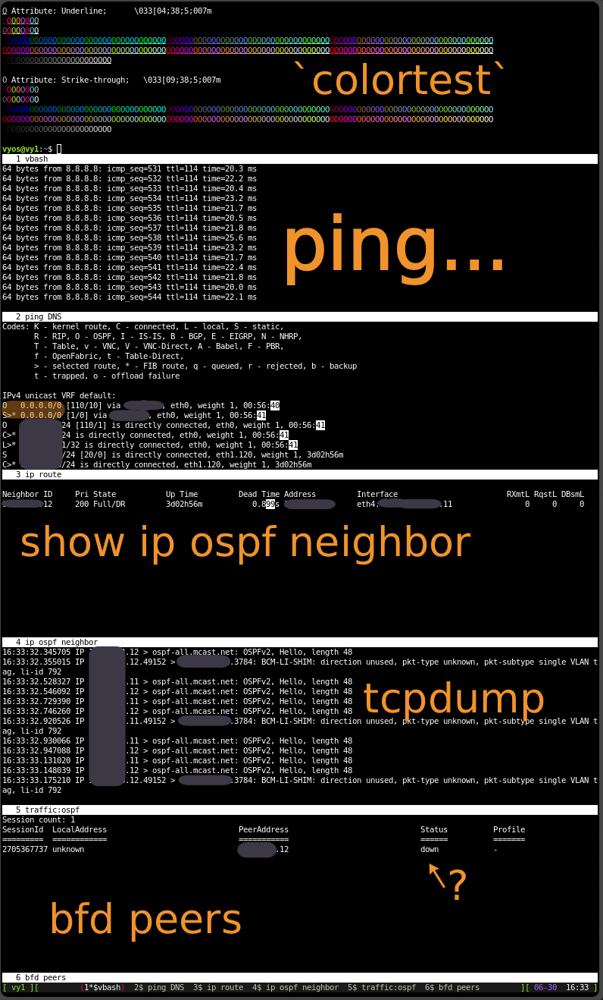

:PROPERTIES:
:ID:       2baa95b7-471f-4234-aeff-7891f1f505d1
:END:
#+TITLE: VyOS: Troubleshooting methods
#+CATEGORY: slips
#+TAGS:

* Roam
+ [[id:5aa36ac8-32b3-421f-afb1-5b6292b06915][VyOS]]
+ [[id:e967c669-79e5-4a1a-828e-3b1dfbec1d19][Route Switch]]
+ [[id:ea11e6b1-6fb8-40e7-a40c-89e42697c9c4][Networking]]

* Context

** Services
*** Names

Piping to the =match= command is slightly different than grep, technically. Feels
like a cisco thing. It is less verbose... but it's a bit hard for me to
anticipate what to grep on while watching logs. it still accepts a regexp
though, so i can select service names.

This lists service names in the most recent boot's log. =journalctl= is also
available.

#+begin_src shell
# rev rev desu
show log grep -E '\[[0-9]+\]:' \
    | sed -E 's/\[.*//g' \
    | rev | cut -f1 -d' ' | rev \
    | sort | uniq
#+end_src

I'm seeing these:

| acpid           | DhcpLFC            | rsyslogd                   | (udev-worker)        | xstate_offset |
| atopacctd       | frrinit.sh         | sshd                       | vmtouch              | zebra         |
| auditd          | haveged            | staticd                    | vyos-commitd         |               |
| augenrules      | IOAPIC             | systemctl                  | vyos-config          |               |
| chronyd         | kea-dhcp4          | (systemd)                  | vyos-configd         |               |
| commit          | Keepalived         | systemd                    | vyos-domain-resolver |               |
| conntrackd      | keepalived-fifo.py | systemd-gpt-auto-generator | vyos-hostsd          |               |
| conntrack-tools | Keepalived_vrrp    | systemd-journald           | vyos-netlinkd        |               |
| cron            | live-config        | systemd-logind             | vyos_net_name        |               |
| CRON            | pdns-recursor      | systemd-modules-load       | vyos-router          |               |
| dbus-daemon     | podman             | systemd-udevd              | watchfrr             |               |

So now... it's much easier, though this doesn't get everything.

*** Configs

Checking explicit configuration for services usually requires:

+ pgrep -fa conntrackd :: to see the runtime invocation
+ sudo /usr/sbin/conntrackd -C /run/conntrackd/conntrackd.conf -s link :: to get
  a reference to the actual configuration
+ sudo cat /run/conntrackd/conntrackd.conf :: to check for service lifecycle
  scripts
+ cat /usr/libexec/vyos/system/keepalived-fifo.py :: once discovering the
  =keepalived= configuration that vyos assembles.

This is extremely useful across various linux/bsd-based firewalls (not really a
problem, per se)

** UX

*** =monitor command= gives you =watch= or =watchexec= with =diff=

For some commands (e.g. lsof) this is tough to set up with =diff=, depending on:

+ how the command accepts input (cli args vs. pipe)
+ on how much piping is required

On vyos this is provided out of the box for operational commands and it even
helps handle some of the output processing for you.

+ =monitor command "$cmd"= replay command every two seconds
+ =monitor command diff "$cmd"= replay command every two seconds, highlight diffs
+ ="$cmd= can include pipes

This is extremely useful for specific troubleshooting scenarios (see screen/tmux
notes)

*** Task-specific terminal profiles

When debugging specific scenarios, you may want to =ssh-in-screen= or
=screen-in-ssh= & likewise for tmux. Usually you'd just do the former, since it
avoids persistent connection state and misc security issues.

+ Screen is included in the debian build for the Vyos ISO
+ but I don't think that =tmux= is
+ usually terminal integration requires =ssh-in-screen=

#+begin_quote
i had to build it into the ISO, but you could install it afterwards. In either
case, upgrading vyos will resquash a new image to unpack as the root FS on boot
... so readding those packages may be necessary which could break other scripts
(like using =opensc= or =age=)
#+end_quote

Having task-specific profiles, especially when they're distributed to your
user's home directories will greatly accelerate troubleshooting.

+ You can run many simultaneous pings in most windows
+ You can watch routes getting added/removed
+ You can monitor logs as you pull the plug

**** Restoring terminal state

you can use:

+ C-a : layout dump thisscreen.rc :: to dump the current screen config
  - then customize the commands invoked by each window process
  - this requires macro-ing through each window to invoke the primary commands
+ tmux list-windows -F "#{window_index}: #{window_name} -> #{window_layout}" ::
  to dump the =tmux= layout
  - for tmux, same thing as above: ensure the default commands are invoked.

* Config

** Options

... dammit

| ssh-in-screen | screen-in-ssh |

Operatonal commands

|      | ~ssh $host 'vbash -s' >>EOF~ | ~/home/opcommandsuser/scripts~ | manually type commands      |   |
| pros | remote                     | less typing                  | flexible, no per-user setup |   |
| cons | very weird ~bash~ options    | more user setup              | slow                        |   |
|      | must type into in ~screen~   | can't ~$@~ your scripts        |                             |   |

Instead of opcmds, can use HTTP API

|      | ssh tunnel + ~fetch/jq~            | caddy/mtls + ~fetch/jq~      | x509 + ~fetch/jq~        |   |
|------+----------------------------------+----------------------------+------------------------+---|
| pros | flexible                         | flexible, easier to extend | secure                 |   |
|      |                                  |                            | minimal per-user setup |   |
| cons | security, only some command data | only some command data     | giant PITA             |   |
|      | still requires per-user setup    | less per-user setup        |                        |   |

*** =vbash= argument handling

#+begin_example shell
#!/bin/vbash

vycmd=$1
shift 1
args=("$@")

source /opt/vyatta/etc/functions/script-template
run $vycmd "${args[@]}"
exit
#+end_example

Then call it with =bin/opsimple monitor command diff 'show ip route'=

I was needing to do this:

#+begin_src shell
# ...
# args=("$@")

declare -a vyargs=()

for arg in "${args[@]}"; do
  vyargs+=("\"$arg\"")
done

source /opt/vyatta/etc/functions/script-template
# echo ${#vyargs[@]}
# echo $vycmd "${vyargs[@]}"

# ...
#+end_src

But somewhere along the way the quotes were getting fucked up

** Screen

+ Vyos version: Screen version 4.09.00 (GNU) 30-Jan-22
+ NixOS version: Screen version 5.0.1 (build on 2025-05-15 15:05:07)

This is copied from my dotfiles. The color status bar works on the vyos server,
which is nice. I've been afraid to customize much of the =.profile= and =.bashrc= or
whatever so far.

*** =.bashrc=

To shorten some of the compound commands later, it's possible to add aliases to
the =.bashrc= only for screen. It looks like =match= doesn't have color though.

#+begin_src shell
# Just add a block below this one
case "$TERM" in
    # it's xterm-256color afaik, but it's better for this to be disabled
    xterm-color) color_prompt=yes;;
    screen*) color_prompt=yes;; # i added this
esac

if [[ "$TERM" =~ "screen" ]]; then
    # muh aliases
    alias dir='dir --color=auto'
    alias vdir='vdir --color=auto'
    alias grep='grep --color=auto'
    alias fgrep='fgrep --color=auto'
    alias egrep='egrep --color=auto'
fi
#+end_src

Those aliases are commented out, except for =ls --color=auto=. I'd like it that
way mostly, on the off-chance that encoding screws with terminal automation
(total PITA for me if I can't use tools like =TRAMP=... I'd have to install emacs
on the router lol). If it's =screen= though, i'm probably going to want color in
the =grep=.

*** =.screenrc=

#+begin_src screen
startup_message off
term screen-256color
scrollback 16000
screen 1 # index windows starting at 1

# remove window/proc number from name in windowlist (C-a ")
windowlist string "%4n %h%=%f" # default "%4n %t%=%f" 

bind c screen 1
bind ^c screen 1
bind 0 select 10

# mousetrack on     # for current window
# defmousetrack on  # for new windows

altscreen on # fix: text editor's don't properly reset the window

### Status Bar
hardstatus off
hardstatus alwayslastline
hardstatus string '%{= kG}[ %{G}%H %{g}][%= %{= kw}%?%-Lw%?%{r}(%{W}%n*%f%t%?(%u)%?%{r})%{w}%?%+Lw%?%?%= %{g}][%{B} %m-%d %{W} %c %{g}]'
#+end_src

See config notes below

**** Config Notes

+ =C-a : mousetrack on/off= is a feature to enable/disable as needed.
  - enabling it enables click to move in vim, but breaks less scrolling
  - using =C-a ESC= to enter copy/scroll mode is a PITA, but it does help navigate
    output history on a serial connection (otherwise Cisco configs and command
    output just flies into the void)
  - =mousetrack= also breaks scrolling in =C-a ESC=, which is probably why i had
    disabled it.
+ scrolling =less= output in screen windows even without these...
  - =mousetrack on= will allow you to click different windows... but breaks
    scrolling less output
  - =termcapinfo xterm*|rxvt*|kterm*|Eterm* ti@:te@= when available: use
    x-scrolling mechanism. (this breaks scrolling by just umm... scrolling the
    whole screen session)
+ attrcolor b ".I" :: enable bold colors (not required, run [[https://github.com/dcunited001/ellipsis/blob/master/bin/colortest#L1][colortest]])

**** OSPF layout

SMFH =screen= does not seem to have a way to "select" a window/region.

+ =layout select $n= :: choose a layout
+ select =$n= :: choose =screen n= for current region

#+begin_src screen
source "$HOME/.screenrc"
setenv screenbin "$HOME/.screen/bin"
setenv  ospf_bridge "eth32.1234"

# init the screens. can't seem to roll these over with \
screen -t 'ping DNS' 2 "$screenbin/opsimple" ping 8.8.8.8
screen -t 'ip route' 3 "$screenbin/opsimple" monitor command diff 'show ip route'
screen -t 'ip ospf neighbor' 4 "$screenbin/opsimple" monitor command diff 'show ip ospf neighbor'
screen -t 'traffic:ospf' 5 "$screenbin/opsimple" monitor traffic interface "$ospf_bridge"
screen -t 'bfd peers' 6 "$screenbin/opsimple" monitor command diff 'show bfd peers brief'

# init the regions
split
split
split
split
split

# assign the screens to the regions
select 1
focus
select 2
focus
select 3
focus
select 4
focus
select 5
focus
select 6
focus top
#+end_src

This gives a profile like below

**** Failover Profile
