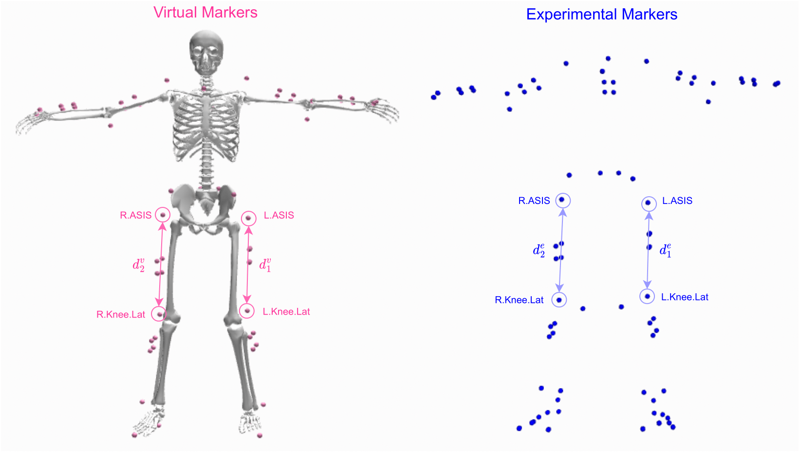

:PROPERTIES:
:ID:       7f935377-c026-48d0-8757-79bb0bb4ae5c
:END:
#+TITLE: Da Vinci Man: Connecting Mediapipe to a Human Kinematics Model for Combinatorics
#+CATEGORY: slips
#+TAGS:

* Roam
+ [[id:b3826464-5132-4a77-9707-93a72bd1d4a3][Blender]]
+ [[id:59f56c1a-d91e-48eb-88d9-868e6250465a][Biomechanics]]
+ [[id:fbf026c8-6c89-4ad3-a72e-2d693371c76a][Machine Learning]]
+ [[id:35da03b5-7810-40fc-ac9a-f7ae2ef06190][3D Modeling: Everything you need to know about topology]]

* Resources
** OpenSim

Video: [[https://www.youtube.com/watch?v=SlGXLS5m27A&t=1004s][Jumping into Musculoskeletal Modeling with OpenSim]] Overview of GUI and
usage: loading models, motions.

+ [[https://opensimconfluence.atlassian.net/wiki/spaces/OpenSim/pages/53090607/Musculoskeletal+Models][Open Sim: Musculoskeletal Models]]
+ [[https://github.com/Nyquixt/KinematicNet/tree/main/preprocessing][Nyquixt/KinematicNet: Preprocessing]]

* Overview

Given a body position with mediapipe coordinates -- synthetic, combinatorially
enumerated or inferred from video -- map them to tracking points to estimate the
level of effort required to hold the pose.

** KinematicNet
This matches tracking points to points in a kinematic model.

