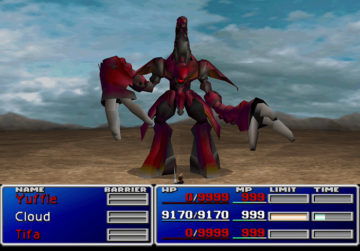

:PROPERTIES:
:ID:       f11115c8-d639-4813-bccf-f3630bfff379
:END:
#+TITLE: SOPS: Set up sops-nix
#+CATEGORY: slips
#+TAGS:

* Roam
+ [[id:f38730e0-1f42-42e3-b173-e12535e55bcd][Smallstep: CA, Policy and Provisioner Configuration]] scripts mostly from here
+ [[id:d4acf534-f60c-4471-bee8-f4b925dd0d90][SOPS]]
* TLDR

This MF right here. e causa di cosa non potevi fare nulla. da quella cosa, non
si può fare nulla. しかたがない

[[https://nascecresceignora.it/top-6-ncr-i-boss-piu-difficili-di-final-fantasy/][Top 6 Ncr I Boss Piu Difficili Di Final Fantasy]] ... anyways idk why italian
showed up, but there it is.

You basically have to cheat this to win. The super-boss from FF8 is probably
more difficult, but it's at least winnable. This FF7 guy will just ruin your day
at any point in the battle... by breaking the rules.

* Resources

+ [[https://github.com/vst/opsops][vst/opsops]]
+ [[https://getsops.io/docs/usage/advanced/][SOPS keyservice usage]]

** Misc
+ [[https://github.com/redxtech/nixfiles/blob/007c8777bbe8dd22bc0f4cdc37d92cd273ef641d/readme.md?plain=1#L3][redxtech/nixfiles]] some good stuff in the dotfiles.
+ [[https://search.nixos.org/options?channel=unstable&query=atuin#show=option:programs.atuin.enable][atuin]] magical turtles sync your wizard spells in sqlite crystals
  - i guess... idk. it could really fix bash though holy shit.
** Caddy
+ [[https://fixmycert.com/guides/caddy-ssl-certificate][Caddy mTLS Guide]]
+ [[https://caddyserver.com/docs/caddyfile/directives/tls][Caddy TLS Directives]]

** Shamir's

+ [[https://ia.cr/2021/339][Non-interactive distributed key generation and key resharing]] ... the
  power-towers wtf

Software

+ [[https://10d9e.github.io/shard/shard/][10d9e/shard]]

*** For "PSS"

oh... I definitely didn't get SSS until just now. I just thought it was
for key ceremony stuff.

#+begin_quote
Well that's a shame. I wanted Vault to run in like 2019... no bare metal
kubernetes 4 me, though at some point it was feasible.

I guess that would've really alleviated much of my anxiety over the PKI "bottom
turtle" (the ultimate root of trust). If SSS works with PSS for PKI, then it
really gives you some breathing room. Still seems like there could be issues
though.
#+end_quote

So I guess you can just manage the secrets rotation as long as the cluster
operates as one:

+ expand the SSS pool, calculate new secret, manage any transition.
+ later dropping old subkeys and contracting to a new shared secret

Still need to manage access though. Definitely requires HSM.

**** Gemini :crypt:urlllm:
:PROPERTIES:
:CRYPTKEY: David Conner <aionfork@gmail.com>
:END:

-----BEGIN PGP MESSAGE-----

hQIMAz05LBTqCkO0AQ/+IGXpsl6Q/SKFTtazaaABvqQ38S4SKsBM53tAtcz4J6y4
ydcimPxaW1UOMfrdBmAX/i+A11G2tdqbCd9gwm2K6405EKih+6nm5vDmnbEo3o2H
EbHZhfSWxufArVmrYi+tlXwfq45UEyjKmt8YT4YcSYeFUShKZlTEROW241QtwQGl
uUHpzsj3AyFgsJus9L+TdwhsVJJ/kmAazZ2ZTJ0s+5iIIxz0ey2qjth2DhtyOCgt
k5Fh/SGveunESrkXsKsGVGbrysbZRCzWi7iGNFBCK4bXOFowo9uklNiZYz3zpuX7
95h95zZafDvkMarWFlo5wUc3jMH53WU/HRSCnHtE7q1fgrVPVki9yULdjNueJplg
qsW+z0GF7fsEJHSaS6W+bjoSEV0teypRZPpkyiPT8s4VdHHOuOGK1AvfHat8B72j
gIc61poZ6iKNUTGnk/wizKkzzuhWNKbwhJlEiijgrEiJyUsSLnV7tgYvZz6P/nhq
2/A9GyDwUJNy7S9nJ80bt2zaO/QMzxkKMVgBE96rrwjvqsabDOaqGlUPuj+1LX1g
7Yt4LLu66CmgBK5OGKhgDRtrtWvUA+hyGTm/8HzOSpXfQsYOLUiplU4Hz/Fqphw+
T+xGvskVw8cF2YhBlkcr0IRpTqFjYNOtQVw5QURFwKdP1DRYhursxKcRd0529wrS
6QEaSPxE7zdfR7dP7tzaAhudia6ZuY956eXXkxoiFaOIgZ1VroOmmfT/TPCMf0oi
hEh4yR5uTEvq7MOdQBHcuPnFv1YHdh91rRVuUT47Pahh9wbKsE+kLRk6KxkqVnyo
tT3t6m2NAGAoNVBLt41oM54jDSWcfME/FVAOjNrEULUD2xf2a0w12eNb4m+js2NV
w3Z5FatFmb8xGOIp0p5xmdiFBV8xCXQ1ljcWgMWwwxt25HV8AjknpGgaJNslLP19
qN1Qe2R9D6ANXXxNmQjVyi1h/MyqW1jh7/C2a9Ry7bRWO+ONA15QewZgKtyk8Kpa
xPozl6xjflnE4DwHmjQ+aDbHylsb86BZPCU481n++UrrKvDoApISn5QDuySxAcC3
lGzIbZsCEsd5CV9C1Z9NrzXgUmOG1Q2Bd9u9hFVwrVi81RBX0x6PUZp/Mk/Do7/v
V9JaD5Z/4OEmzLiE0kfaxbuFGxKNrhT4ujMdFNZq1u19DVgvl7bOekYbrDeSyqc5
NUkim1J/FGX8fHhr6NaCkBtSZHcnVacDfQC7gjJXuHVfLoRfL8LdjlLbvIIcMb5q
YAQ4lcABpsyJHdf5tXO+BwObBBzU0GenNsevftqeKRsCuz+RVhTnEAp5JQz13wi5
ZufbWiBxXolGuIjkT+SMQ1O43RIJrvnNheGPugBaFdGVwF+3IUPd1JKzN15dbknA
Xj80mUnhCL5YK/67mNe2XcJF6/dvcnIDzaOT8xM3es5JSoYTjt1VoLh2IiQsx4qK
m1m6/mbI6InikKIHyLoZBKSMk1Wz6zQ7qfWs+XKCGin2DJJOmQqcW+vcOoooz+UR
QfROLEK2MGk2JDv2LBC2xTjBJlZC1loGCze7AB3+OQlF+MVT7UZA7XJ26IiUfTXs
57vag4Ivbqs4loe086i0zwuPSCXnRMMoNOJL3Nts+3uyr1sIpPqAiXNovK8maFnt
CPr5rbMF5Y+SdJpTBilxKaVnVb+w5utjqC7MzxGIPlctS2JRbEb2A7lAut7AFqg4
xp1TFjZSOyxKtfRUfDzHGqeb2QvEUfH/Hpun3wViSzvCVA==
=zob6
-----END PGP MESSAGE-----

** dotfiles.io

Kinda like a cross-platform omarchy, chezmoi-managed

Very interesting information. Obviously AI assisted.

|--------------+-------------+------------------+------------------------|
| Overview     | [[https://doc.dotfiles.io/OPENCODE/][OPENCODE]]    | [[https://doc.dotfiles.io/CONFIG_STRATEGY/][CONFIG_STRATEGY]]  |                        |
| [[https://doc.dotfiles.io/security/][SECURITY]]     | [[https://doc.dotfiles.io/security/FUZZING/][FUZZING]]     | [[https://doc.dotfiles.io/security/KEY_ROTATION/][KEY_ROTATION]]     | [[https://doc.dotfiles.io/security/AI_ACT_COMPLIANCE/#transparency-obligations][AI_ACT_COMPLIANCE]] (EU) |
| REFERENCE    | [[https://doc.dotfiles.io/reference/UTILS/][UTILS]]       | [[https://doc.dotfiles.io/reference/SUPPORT_MATRIX/][SUPPORT_MATRIX]]   |                        |
| [[https://doc.dotfiles.io/architecture/ARCHITECTURE/][ARCHITECTURE]] | [[https://doc.dotfiles.io/architecture/REPO_LAYOUT][REPO_LAYOUT]] | [[https://doc.dotfiles.io/architecture/fleet-deployment/][Fleet Deployment]] | [[https://doc.dotfiles.io/architecture/AI_COST_OPTIMIZATION/][AI_COST_OPTIMIZATION]]   |
|--------------+-------------+------------------+------------------------|
+ [[https://doc.dotfiles.io/reference/POWERSHELL_PARITY/][POWERSHELL_PARITY]] (feature matrix)

** The Answer: =secretspec=?

+ whatever TF [[https://github.com/cachix/secretspec][cachix/secretspec]] is doing with [[https://secretspec.dev/quick-start/#installation][secretspec.dev (docs)]]

*** Builds

+ Features enabled by default [[https://github.com/cachix/secretspec/blob/v0.19.1/secretspec/Cargo.toml#L58-L80][cachix/secretspec ./secretspec/Cargo.yaml]]

| cli   | keyring   | kdbx  | keeper  | gcsm     |
| awssm | awsps     | vault | openbao | bws      |
| akv   | infisical | bw    | age     | scaleway |
| sops  |           |       |         |          |

=dep:= i guess means runtime deps. This builds the SOPS spec/protocol into Rust,
AFAIK. Same for other deps like =keepass=

**** Rust Build Deps

In other words, =0.20= may be awhile before it's on Guix (or maybe not idk)

#+begin_quote
SecretSpec 0.20+ provides static musl CLI binaries for x64 and arm64 Linux, so
the installer works directly on Alpine without a glibc compatibility layer.
#+end_quote

Simple deps

| sops    |               |            |
| age     | dep:age       |            |
| kdbx    | dep:keepass   |            |
| cli     | dep:toml_edit |            |
| keyring | dep:keyring   | dep:whoami |
| bws     |               |            |
| bw      | dep:base64    |            |

Expensive deps

| keeper    | dep:keeper-secrets-manager-core   |                            |                                     |
| gcsm      | dep:google-cloud-secretmanager-v1 |                            |                                     |
| awssm     | dep:aws-config                    | dep:aws-sdk-secretsmanager | aws-config/credentials-login        |
| awsps     | dep:aws-config                    | dep:aws-sdk-ssm            |                                     |
| vault     | dep:reqwest                       | tokio/sync                 |                                     |
| scaleway  | dep:reqwest                       |                            |                                     |
| openbao   | dep:reqwest                       | tokio/sync                 |                                     |
| infisical | dep:reqwest                       | tokio/sync                 |                                     |
| akv       | dep:azure_core                    | dep:azure_identity         | dep:azure_security_keyvault_secrets |

** Guides

+ [[https://blog.epheo.eu/articles/k8s-sops-secrets/index.html][k8s sops management]] (repo: [[https://github.com/epheo/k8s-sops-secrets-boilerplate][epheo/k8s-sops-secrets-boilerplate]])
+ [[https://github.com/wiktor-k/age-plugin-openpgp-card][wiktor-k/age-plugin-openpgp-card]]

* Topics

** Nixpkgs

#+begin_src shell :results output
rg 'sops.secrets."?[a-zA-Z0-9 \-.]+"?' /data/ecto/nixos -g '*.nix' -NoI \
     | sed -e 's/^sops.secrets.//g' | tr -d '"' | grep -v '/' | grep -v ')' | tr '.' '/' \
     | sort | uniq | tree --fromfile . --noreport
#+end_src

#+RESULTS:
#+begin_example
.
├──  
├── attic
├── b2-acc-id
│   └── path
├── backup-secret
│   └── path
├── backup-secret 
├── build02-borgbackup-ssh
│   └── path
├── build02-borgbackup-ssh 
├── buildbot-effects-nix-community-infra
│   └── path
├── buildbot-effects-nix-community-infra 
├── buildbot-github-app-secret-key
│   └── path
├── buildbot-github-app-secret-key 
├── buildbot-github-oauth-secret
│   └── path
├── buildbot-github-oauth-secret 
├── buildbot-github-webhook-secret
│   └── path
├── buildbot-github-webhook-secret 
├── buildbot-nix-worker-password
│   └── path
├── buildbot-nix-worker-password 
├── buildbot-oauth-secret-file
│   └── path
├── buildbot-oauth-secret-file 
├── buildbot-token-file
│   └── path
├── buildbot-token-file 
├── buildbot-webhook-secret-file
│   └── path
├── buildbot-worker-password-file
│   └── path
├── buildbot-worker-password-file 
├── buildbot-workers-file
│   └── path
├── buildbot-workers-file 
├── cachix-auth-token
│   └── path
├── cachix-auth-token 
├── community-builder-nix-access-tokens
│   └── path
├── community-builder-nix-access-tokens 
├── decryption using SSH host key 
├── existing-file 
├── fabsKeytab
│   └── path
├── freescout-app-key
│   └── path
├── freescout-app-key 
├── github-r-ryantm-key 
├── github-r-ryantm-token 
├── github-token-with-username
│   └── path
├── github-token-with-username 
├── group-secret
│   └── path
├── harmonia-key
│   └── path 
├── harmonia-key 
├── headplane
├── headscale
├── hercules-binary-caches
│   └── path
├── hercules-binary-caches 
├── hercules-cluster-join-token
│   └── path
├── hercules-cluster-join-token 
├── hercules-secrets
│   └── path
├── hercules-secrets 
├── hetzner-borgbackup-passphrase
│   └── path
├── hetzner-borgbackup-ssh
│   └── path
├── hetzner-borgbackup-ssh 
├── hydra-admin-password
│   └── owner 
├── hydra-aws-credentials
│   └── path
├── hydra-github-client-secret
│   └── path
├── hydra-github-client-secret 
├── hydra-users
│   ├── owner 
│   └── path
├── id
├── limesurvey-encryption-key
│   └── path
├── limesurvey-encryption-key 
├── limesurvey-encryption-nonce
│   └── path
├── limesurvey-encryption-nonce 
├── matrix-synapse-secrets
│   └── path 
├── matrix-synapse-secrets 
├── matrix-synapse-signing-key
│   └── path
├── matrix-synapse-signing-key 
├── mjolnir-access-token
│   └── path
├── mjolnir-access-token 
├── nested
├── nix-community-matrix-bot-token
│   └── path 
├── nix-community-matrix-bot-token 
├── nixcon
│   └── org
│       └── mail
│           └── key
├── nixos
│   └── org
│       └── mail
│           └── key
├── nixos-wiki
│   ├── owner 
│   └── path
├── nixos-wiki-github-client-secret
│   ├── owner 
│   └── path
├── nur-update-github-app-private-key
│   └── path
├── nur-update-github-app-private-key 
├── oauth2-proxy-key-file
│   └── path
├── oauth2-proxy-key-file 
├── ofborg
├── oidc
├── opendkim-private-key
│   ├── owner 
│   └── path
├── opendkim-private-key 
├── operator
├── password
│   └── path
├── postsrsd-secret
│   └── path
├── postsrsd-secret 
├── prod
├── queue-runner-client
│   └── key
├── queue-runner-server
│   └── key
├── restic
├── rfc39-app-private-key
│   └── path
├── rfc39-app-private-key 
├── rfc39-record-ssh-key
│   └── path
├── rfc39-record-ssh-key 
├── rsshub
│   └── path 
├── secret
│   ├── path
│   └── sopsFile
├── signing-key
│   └── path
├── ssh
│   └── yaml
├── staging
├── storagebox-ssh-key
│   └── path
├── storagebox-ssh-key 
├── syncthing
│   └── path
├── temp-cache-key
│   └── path 
├── temp-cache-key 
├── test
├── test-backup-age
│   └── key
├── tls
├── vars
└── yaml
#+end_example

** Sops Nix

#+begin_example nix
{...}:{
  age = { abc="def"; };
  defaultSopsFile = null;
  defaultSopsFormat = "yaml";
  defaultSopsKey = null;
  environment = { ABC="DEF"; };
  gnupg = {
    home = null;
    sshKeyPaths = [ ];
  };
  keepGenerations = 1;
  log = [...]; # enum
  package = pkgs.sops;
  placeholder = [...];
  secrets = [...]; # secretType
  templates = «repeated»;
  useSystemdActivation = false;
  useTmpfs = false;
  validateSopsFiles = true;
  validationPackage = [pkg.sops-install-secrets];
}
#+end_example

=sops.secrets.<name>= is =secretType=

|----------+----------------+--------------+--------------+--------+-----|
| category |                |              |              |        |     |
|----------+----------------+--------------+--------------+--------+-----|
| *file*     | path           | name         |              |        |     |
| *fs*       | mode           | owner        | uid          | group  | gid |
| *secret*   | sopsFile       | sopsFileHash | key          | format |     |
| *systemd*  | neededForUsers | reloadUnits  | restartUnits |        |     |
|----------+----------------+--------------+--------------+--------+-----|
+ =sops.templates.<name>= also has =content= and =file=
** Misc
*** Traversing symlink trees

#+begin_src shell
find -H . -type l -printf '%p -> %l\n' | tree --fromfile . --fflinks -J
#+end_src

*** Diffing Sops Files

The k8s article recommends two python scripts

+ sops files shouldn't contain structural data... (or at least you shouldn't
  default to just encrypting large json/yaml blobs)
  - diff is difficult, ciphertext is opaque.
+ on the other hand, not using structural data at all litters your code with
  arbitrary identifiers ...
  - and so you have a massive need to settle on a "perfect schema"
  - this is compounded by: ergonomic difficulties & cost of mistakes (acute/chronic)

**** Just decrypt them?

[[https://flagzeta.org/til/how-to-do-git-diffs-of-sops-encrypted-files/][how to git-diff SOPS encrypted files]] mentions this

#+begin_src shell
git config diff.sopsdiffer.textconv "sh -c 'sops -d --input-type yaml --output-type yaml \"\$0\" || true - '"
# [diff "sopsdiffer"]
# 	textconv = sh -c 'sops -d --input-type yaml --output-type yaml \"$0\" || true - '
#+end_src

other usage seems to point in similar directions, but i think there's more of an
absence of these patterns

#+begin_src shell
git config diff.sops.textconv 'sops -d'
#+end_src

I would prefer keeping the process & tool tree very flat:

+ python is too much... maybe. but definitely if I don't check the code.
+ the potential of logs means anything with a package manager is right out.
  - this includes editors.

* Scripts

Env File

** Runthrough
:PROPERTIES:
:header-args+: :dir (setq-local step-root "/tmp/roam-uRO7v9")
:END:

*** Babel Setup

#+name: obsopsroot
#+begin_src emacs-lisp :noweb-ref obsopsroot
(or (bound-and-true-p ob@sops_set_up_sops_nix) (setq ob@sops_set_up_sops_nix (make-temp-file "roam-" t)))
#+end_src

#+RESULTS: obsopsroot
: /tmp/roam-uRO7v9

Run block with args =(org-sbe "obsopsroot" (egblock timedtextjq))=

#+name: obsopsroot-testsbe
#+headers: :results output verbatim 
#+begin_src shell :var sopsroot=obsopsroot :dir (org-sbe "obsopsroot")
echo pwd=$(pwd)
echo sopsroot=$sopsroot
#+end_src

#+RESULTS: obsopsroot-testsbe
: pwd=/tmp/roam-uRO7v9
: sopsroot=/tmp/roam-uRO7v9

*** =.env=

Set the root dir

#+header: :tangle (expand-file-name ".env" (org-sbe "obsopsroot"))
#+begin_src shell :noweb yes
ROOTDIR="<<obsopsroot()>>"
#+end_src

Misc properties

#+header: :tangle (expand-file-name ".env" (org-sbe "obsopsroot"))
#+begin_src shell :noweb yes
STEPPATH=".step.ykbootstrap"
yk5root="12345678"
ykpivpin="123456"
ykpivpuk="12345678"
SOPS_EDITOR="vim"
SOPS_AGE_KEY_FILE=".age/keys.txt"
#+end_src

*** =.sops.yaml=

#+begin_src yaml :tangle (expand-file-name ".sops.yaml" (org-sbe "obsopsroot"))
stores:
  json:
    indent: 2
  json_binary:
    indent: 2
  yaml:
    indent: 2

keys:
  hosts:
    # age tpm key:
    - &tpmtest
  users:
    # age1 key: x25519 via age-keygen
    - &admin1 age1n49hgtpev0deasvk85lwr4s79e33wxlg0zyq7vlgc7jxn8rz649sk00ds8
    # age2 key: x25519 via openssl & ssh-to-age
    - &admin2 age10g7nyzg2llvav0hjyrt3g8yet2huhe4vq9c5jmsde9x4sn7j9vzsy6s2d9

creation_rules:
  - path_regex: \.step\.ykbootstrap/root\.yaml$
    mac_only_encrypted: true
    key_groups:
      - age:
          # - *admin0
          - *admin1
          - *admin2
#+end_src

* Deep thoughts
** Key rotation

Ranting about things that don't exist just to find out that maybe they do now?

*** In flux

[[https://oneuptime.com/blog/post/2026-03-13-how-to-rotate-sops-age-keys-without-re-encrypting-all-files-in-flux/view][How to Rotate SOPS Age Keys Without Re-Encrypting All Files in Flux]]

**** Strategy 1: Add New Key Before Removing Old Key

This just has a "old/new" pattern

+ usage is probably limited to services fairly with fairly flat dependencies &
  singular endpoints.

**** Strategy 2: Gradual File-by-File Rotation

+ Service dependencies are probably still flat, but it's starting to account for
  dependencies ... by making you handle it yourself.

This would be alright if the sops-protected secrets are bootstrapping what's
needed for your k8s cluster or k8s-deployed services to manage the rest.

Although i guess I missed this trick

#+begin_src shell
cat old-key.agekey new-key.agekey > combined-keys.agekey
kubectl create secret generic sops-age \
  --namespace=flux-system \
  --from-file=age.agekey=combined-keys.agekey \
  --dry-run=client -o yaml | kubectl apply -f -
#+end_src

The keygroups thing seems like a bad pattern (one does not simply delete dummy keys)

#+begin_example
error loading config: Could not unmarshal config file: yaml: unknown anchor 'dc_kratos' referenced
#+end_example

**** Strategy 3: Directory-Based Rotation

This doesn't really make sense ... (to get partitioned nicely) ontologies afford
a limited number of primary categories to form trees (or graphs with tree-like
motifs... idk). But here, you've wasted one of those divisions which should
already be kinda obviously accounted for.

+ It works, but it doesn't really solve any problems.
+ it doesn't work for tunnels (unless you count services like envoy)

**** Interdependent services

If you need to distribute keys/secrets for service endpoints that don't function
without each being updated according to the others' new states...

Then you really just need rolling deployments (there's a discrete time
dimension: $k_{n}\; for\; n \in N$).

+ These always needs a better "rotation strategy" anyways.
+ You need three keys: one active and two provisioned (one deployed and one in
  waiting). This gives you the ability to fuck up at least once (and twice if
  you're lucky)

it's 1,000 times easier to do this when your infrastructure is
immutable/disposable (distributed into small containers)

**** The hard part

... keeping the state of quasi-gitops source code consistent across:

+ multiple deployed services 
+ on multiple machines 
+ where the functionality is also specified in flakes in multiple repos

