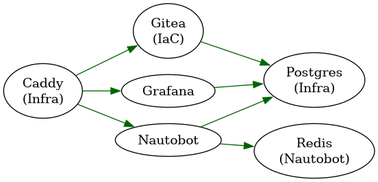
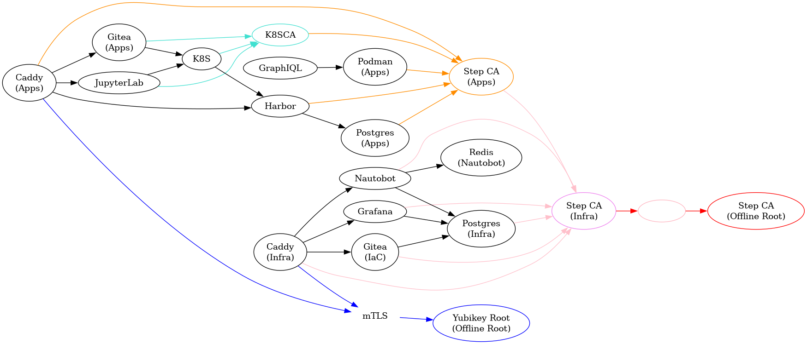
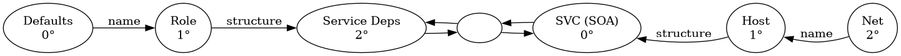

:PROPERTIES:
:ID:       34345d68-6806-459f-b450-09d9cc249302
:END:
#+TITLE: SOPS: Set up sops-nix (round 14)
#+CATEGORY: slips
#+TAGS:

* Roam
+ [[id:f38730e0-1f42-42e3-b173-e12535e55bcd][Smallstep: CA, Policy and Provisioner Configuration]] scripts mostly from here
+ [[id:d4acf534-f60c-4471-bee8-f4b925dd0d90][SOPS]]
+ [[id:6ed5eaea-447b-44c6-b020-95629b0c619f][Crypto: JWK and JWT Schema]]

* Overview

** Design

*** Requirements

Hoping that =secretspec= offers these

+ [X] Defaults/Generators
+ [X] Provisioner abstraction
  - implementation details/specifics still cause issues
+ [X] Environments
+ [ ] Environments (+1 degree of inheritance)
  - Really need at least one additional degree of separation (inheritance)
+ [X] Scopes
+ [ ] Scopes (+1 degree of inheritance)
  - may not be necessary?

*** Factory/Builder Patterns

Including these "roles" from another project's =secretspec.toml= should allow them
to compose into a factory/builder pattern.

+ using the =ref= feature could simplify references to these CA's certs/keys. e.g.
  - from a "secops" project's top-level =secretspec.toml=, output certs/keys to to
    a =sops://= uri.
  - then in a dependent project/deployment, configure a provider to that =sops://=
    uri. in the environments where it's needed use the =ref=
+ There may be an IPC with JSON-RPC later
  - it supports reading/passing data over tunnels (easier to rely on service
    when there's infrastructure and clear network boundaries)
  - there are probably better ways to skip much/some of the sops (like just
    using Cloud KMS URIs to secrets generated via their APIs)

Getting it to work for a bundle of functionality is mainly a matter of planning
the names/structure of secrets. then add one/more top-level =secretspec.toml='s.
These can be ad-hoc and arbitrary (unless auditing is necessary)

After the initial configuration (and rehashing what Step CA contexts/profiles
are), the main next blockers:

+ the Go templates for profiles/contexts
+ polices for cert issuance.

**** ./secretspec/roles/stepca.toml

#+begin_src toml
#:schema https://secretspec.dev/schema/secretspec.schema.json
[project]
name = "stepca"
revision = "1.0"
extends = ["stepyk.toml"]

[providers]
prod_sops = "sops://secrets/{project}/{profile}.enc.yaml"
dev_sops = "sops://secrets/{project}/{profile}.enc.yaml"

[profiles.default]
# STEPPATH = { description = "", required = false }
# STEP_ROOT = { description = "", required = false }

STEP_PASSWORD = { description = "Password for --password-file", required = true, type = "password", as_path = true, generate = true }
STEP_KEY = { description = "Root Key --root", required = true, as_path = true }
STEP_CA_PASSWORD = { description = "Password for --ca-password-file", required = false, as_path = true }
STEP_CA_KEY = { description = "CA Key --ca-key", required = false, as_path = true }
#+end_src

**** ./secretspec/roles/stepyk.toml

Yubikey KMS

+ serial/slot/pin needs to be set for every leaf-issuing pair (root/ca; ca1/ca2)
  in the tree. management key is likely also needed.
  - to change between Step CA =context=, each Step CA =authority= needs its own
    Secretspec =[profiles.$ENV]= environment block.
  - this works alright if the base =secretspec.toml= is intended to provide
    runtime environments for managing X509 certs.

#+begin_src toml
#:schema https://secretspec.dev/schema/secretspec.schema.json
[project]
name = "stepkms"
revision = "1.0"

[profiles.default]
# to compose options to step: --kms and --key
STEPYK_SERIAL = { description = "Root CA Yubikey Serial", required = true, type = "password" }
STEPYK_SLOT = { description = "Root CA Yubikey Slot", required = true, type = "password" }
STEPYK_PIN = { description = "Root CA Yubikey Pin", required = true, type = "password" }

# to compose options to step: --ca-kms and --ca-key
STEPYK_CA_SERIAL = { description = "ICA Yubikey Serial", required = false, type = "password" }
STEPYK_CA_SLOT = { description = "ICA Yubikey Slot", required = false, type = "password" }
STEPYK_CA_PIN = { description = "ICA Yubikey Pin", required = false, type = "password" }
#+end_src

**** ./secretspec/roles/stepjwk.toml

Then to connect to an online Step CA and make/use JWK

+ receive SSH keys/certs, etc. 

#+begin_src toml
#:schema https://secretspec.dev/schema/secretspec.schema.json
[project]
name = "stepjwk"
revision = "1.0"

[profiles.default]

# ... todo
#+end_src

**** ./secretspec/roles/stepdevice01.toml

Merges info needed for auth to a CA and uses ACME's =DEVICE-01= method:

+ to fetch a cert that's bound to a device.
+ should support multiple KMS methods (TPM, YK) via =secretspec= environments (or
  somehow)

#+begin_src toml
#:schema https://secretspec.dev/schema/secretspec.schema.json
[project]
name = "stepdevice01"
revision = "1.0"

[profiles.default]

# ... todo

#+end_src

*** Tests

*** Support Both Nix & Guix

* Secretspec TOML

** Topics

*** Setup

**** Config

+ revision = 1.0 :: this is the schema revision

Need a basic global =config.toml=

#+begin_src toml
[defaults]
provider = "dotenv"
profile = "development"

[defaults.providers]
developer = "dotenv:.env"
dotenv = "dotenv:.env"
shared = "pass://.secret/shared/{profile}/{key}"
#+end_src

An optional =secretspec.base.toml=

#+begin_src toml
#:schema https://secretspec.dev/schema/secretspec.schema.json
[project]
name = "web-api"
revision = "1.0"
#+end_src

And a basic =secretspec.toml=

#+begin_src toml
#:schema https://secretspec.dev/schema/secretspec.schema.json
[project]
name = "web-api"
revision = "1.0"
# extends = ["secretspec.base.toml"]

[providers]
env = "env://"
# prod_vault = "onepassword://Production"
# shared_vault = "onepassword://Shared"
# keyring = "keyring://"
#+end_src

***** Profiles in =secretspec.toml=

Default profile: always loaded first.

+ probably keep providers out of here: force a specified environment... Or maybe
  not, since this generates credentials using the developer's global config

#+begin_src toml
[profiles.default]
APP_NAME = { description = "Application name", required = false, default = "MyApp" }
SESSION_SECRET = { description = "Session signing secret", required = true } # , providers = [ "shared", "dotenv" ] }
GITHUB_TOKEN = { description = "GitHub token", required = true # , providers = [ "env" ] }
#+end_src

Development profile: extends default

#+begin_src toml
[profiles.development]
DATABASE_URL = { description = "Database connection", required = false, default = "sqlite://./dev.db" }
API_URL = { description = "API endpoint", required = false, default = "http://localhost:3000" }
DEBUG = { description = "Debug mode", required = false, default = "true" }
#+end_src

Production profile: extends default

#+begin_src toml
[profiles.production]
DATABASE_URL = { description = "PostgreSQL cluster connection", required = true, providers = ["shared","dotenv"] }
API_URL = { description = "Production API endpoint", required = true }
SENTRY_DSN = { description = "Error tracking service", required = true, providers = [ "shared", ] }
REDIS_URL = { description = "Redis cache connection", required = true }
#+end_src

*** Iterating

- both secretspec and watchexec support json output
- --no-prompt --explain :: these don't prevent prompts for =secretspec config
  global init= and watchexec "dud not no wut do to den"

#+begin_src shell
cmd='secretspec check -f $WATCHEXEC_COMMON_PATH/$WATCHEXEC_WRITTEN_PATH'
filter=secretspec.toml #secretspec*.toml
debounce=1s
watchexec -pd $debounce --workdir . --filter $filter \
    --fs-events=modify --emit-events-to=environment "$cmd"
#+end_src
*** URIs

There's no comprehensive doc that densely lists URI formats. Extracted from
[[https://github.com/cachix/secretspec/blob/9a866d55fd35c61087f451a2b17f22895d5f7539/docs/src/content/docs/reference/providers.mdx#L7][docs/src/content/docs/reference/providers.mdx#L7]]

| dotenv      | ~dotenv://[path]~                                                                                 | ~.env~ files                                                                          |
| file        | ~file:ROOT~                                                                                       | Stores one plaintext file per secret beneath an                                     |
| env         | ~env://~                                                                                          | Read-only access to system environment variables                                    |
| null        | ~null://~                                                                                         | Always reports a missing value so the declaration's                                 |
| systemd     | ~systemd-credential://~                                                                           |                                                                                     |
| gopass      | ~gopass://[host][path]~                                                                           | Uses ~gopass~                                                                         |
| keyring     | ~keyring://~                                                                                      | Uses system keychain/keyring for secure storage                                     |
| kdbx        | ~kdbx:PATH[?keyfile=PATH][&prefix=TEMPLATE]~                                                      |                                                                                     |
| lastpass    | ~lastpass://[item_template]~                                                                      | Integrates with LastPass via ~lpass~ CLI                                              |
| dashlane    | ~dashlane://[item_type]~                                                                          | Integrates with Dashlane via the ~dcli~ CLI                                           |
| onepassword | ~onepassword://[account@]vault~ or ~onepassword+token://vault~                                      |                                                                                     |
| keeper      | ~keeper://FOLDER_UID[?config_file=PATH]~                                                          | Google Keeper                                                                       |
| doppler     | ~doppler://PROJECT[/CONFIG]~                                                                      | Doppler project's                                                                   |
| pass        | ~pass://~                                                                                         | Uses Unix password manager with GPG encryption                                      |
| protonpass  | ~protonpass://[vault[/title-template]]~                                                           | Proton Pass via the official ~pass-cli~                                               |
| passbolt    | ~passbolt://[?server=URL][&folder=ID][&template=PATTERN]~                                         | Reads and writes resources in a self-hosted Passbolt server through ~go-passbolt-cli~ |
| fly         | ~fly://APP[?stage=true][&detach=true]~                                                            | Publishes application                                                               |
| cloudflare  | ~cloudflare://STORE_ID[?account_id=ACCOUNT_ID][&scopes=LIST][&auth=MODE][&wrangler_profile=NAME]~ |                                                                                     |
| gcsm        | ~gcsm://PROJECT_ID~                                                                               | Google Cloud Secret Manager                                                         |
| awssm       | ~awssm://[profile@]REGION~                                                                        | AWS Secrets Manager                                                                 |
| awsps       | ~awsps://[profile@]REGION[?prefix=PATH&template=TEMPLATE&kms_key_id=KEY&tier=TIER]~               |                                                                                     |
| scaleway    | ~scaleway://[REGION][?project_id=UUID&path=/folder]~                                              | Scaleway Secret Manager                                                             |
| setec       | ~setec://HOST[:PORT][?prefix=PATH][&tls=false]~                                                   | Uses a Tailscale                                                                    |
| vault       | ~vault://[namespace@]host[:port][/mount][?options]~                                               | HashiCorp Vault's KV engine                                                         |
| openbao     | ~openbao://[namespace@]host[:port][/mount][?options]~                                             | OpenBao's KV engine                                                                 |
| bw          | ~bw://[COLLECTION]~                                                                               | Bitwarden Password Manager vault via the ~bw~ CLI                                     |
| bws         | ~bws://[SERVER_BASE@]PROJECT_UUID~                                                                | Bitwarden Secrets Manager                                                           |
| akv         | ~akv://VAULT_NAME[?auth=...][&suffix=DNS_SUFFIX]~                                                 | Azure Key Vault, ~auth={env,cli,managed_identity,workload_identity}~                  |
| aac         | ~aac://STORE[?auth=METHOD][&label=LABEL][&prefix=PREFIX][&tag=NAME=VALUE]...~                     |                                                                                     |
| infisical   | ~infisical://[HOST]/PROJECT_ID[?env=SLUG][&path=/PREFIX][&tls=false]~                             | Infisical                                                                           |
| ejson       | ~ejson:PATH~                                                                                      | Reads string values from one EJSON encrypted file                                   |
| age         | ~age://PATH[?identity=FILE][&recipients-file=FILE][&armor=false]~                                 | Single age-encrypted file committed alongside code                                  |
| sops        | ~sops://PATH[?format=...]~                                                                        | ~format={yaml,json,dotenv,ini}~                                                       |
| k8s         | ~k8s+KIND://NAME[@NAMESPACE]~                                                                     | Kubernetes                                                                          |

+ gopass :: multi-user, multi-store abstraction over ~pass~, with GPG encryption
  
*** Inheritance with =extends=

+ Unsupported secretspec revision '0.1'. This version of secretspec only supports revision '1.0'

** Step CA

+ DEVICE-01 :: [[https://smallstep.com/blog/acme-managed-device-attestation-explained/][ACME via device Attestation with TPM 2.0 or Yubikey]]
  - The ACME server that Step CA runs will sign for a CSR if its
    policies/templates/config are set to recognize a particular device identity

*** Run a CA on a Yubikey

[[https://github.com/DeltChar/CA-Yubikey#generate-root-private-key-and-self-signed-certificate][DeltChar/CA-Yubikey: generate-root-private-key-and-self-signed-certificate]]

#+begin_src shell
ykpem=test-root-ca-pubkey.pem
ykcsr=test-root-ca-csr.pem
ykpem_v3=test-root-ca-with-v3.pem
caroot="CN=Test Root CA-1,O=Test Org,ST=Ohio,C=US"
ca1='C=US,ST=Ohio,O=Test Org,CN=Test Root CA-1'
pivslot=9a

# set PINs and MGMTKEY
ykman piv keys generate -P $PIN -m $MGMTKEY --algorithm=ECCP384 \
    --pin-policy ALWAYS --touch-policy ALWAYS $pivslot $ykpem
ykman piv certificates generate -P $PIN -s $caroot -d 3650 -a SHA512 $pivslot $ykpem

# ykman generates certs without X509 v3 extensions (can't sign other certs)
ykman piv certificates export $pivslot $ykpem
openssl x509 -in $ykpem -noout -text # this displays the faulty X509 cert

yubico_ykcs=$(nwix yubico-piv-tool)/lib/libykcs11.so # nwix finds the /nix/store derivation
alias ykcs11-tool="pkcs-tool --module $yubico_ykcs"

ykman piv certificates request -P $PIN -s $ca1 -a SHA512 $pivslot $ykpem $ykcsr
#+end_src

Skipping [[https://github.com/DeltChar/CA-Yubikey#create-openssl-config-for-signing-csrs-with-root-ca][OpenSSL configuration for the CA]]. It's required when using =openssl= to
sign CSR to add v3 extensions.

+ Generating the root's key on the yubikey itself allows the cert to be
  validated by YK's attestation cert. Step CA may be able do this instead of
  =openssl=, but that's a bit dicey ...
  - nevermind: =step kms create --json 'yubikey:slot-id=82'=
+ Step CA can also generate the root externally, but this can't be attested.

#+begin_src shell
pkcs11slot=01
sslconf=yubikey_openssl.cnf
openssl ca -config $sslconf -engine pkcs11 -keyform engine \
    -name root_ca_default -extensions v3_ca -days 3650 \
    -notext -md sha512 -in $ykpem  -out $ykpem_v3

# now review the cert again to find the v3 extensions
openssl x509 -in $ykpem_v3 -noout -text
ykman piv certificates import -P $PIN -m $MGMTKEY -v 9a $ykpem_v3
ykman piv certificates export 9a $yk $ykpem_v3 # overwrites the original exported pem
cp -f $ykpem rootCA/certs/
#+end_src

*** Secrets Inventory

**** For each Step

+ STEP_ROOT :: Root CA
+ STEPPATH :: path to config. probably in systemd =RuntimeDirectory= or
  =StateDirectory= or something like that, unless the config is totally nix-owned.
  State would need to be ephemeral for that to be practical.
  - =step path= changes based on =step context= state
+ The signing key's password (Root or ICA)

***** For each Step CA

Then, the context configurations need to be in place, along with configured:

| policies | templates | 

+ For ACME to LetsEncrypt, that info needs to be provided/available

**** For each yubikey

The point of the YK CA is to keep the potential for signing "offline" while
still secure/accessible. However, doing things in a non-standard way like this
requires thinking through all the exceptions (lots of practical gotchas)
    
+ The root should be offline and CA1 should be on a separate server
  - Root & CA1 should use different keys, unless personal or testing
+ The v3 path length needs to be considered _very_ early on
  - e.g. K8S manages its own ICA...
+ Bundles are necessary for proper path validation
  - Convenient to skip in some cases (requires more management of public keys)
  - Impossible to know the state of the system without automating the validation
    of PKI deployment

When specing out secrets for keys to generate, you'll need:

#+begin_example shell
rootCard=993210; rootSlot=82; rootPin=123456;
ca1Card=993220;  ca1Slot=83;  ca1Pin=123456;
ca2Card=983230;  ca2Slot=84;  ca2Pin=123456;
rootProfile=root-ca; rootName=root; rootCert=root_ca.crt
ca1Profile=ca1-ca;   ca1Name=ca1;   ca1Cert=ca1_ca.crt;  ca1context=ca1
ca2Profile=ca2-ca;   ca2Name=ca2;   ca2Cert=ca2_ca.crt;  ca2context=ca2
#+end_example

These are used for =.kms= and =.key= URIs for =step kms= commands:

#+begin_example shell
# when generating Root CA's cert:
# --kms $root_kms --key $root_key
root_kms=yubikey:serial=$rootCard&pin-value=$rootPin
root_key=yubikey:serial=$rootCard&slot-id=$rootSlot

# when generating CA1's cert, root gets bumped up:
# --ca-kms $root_kms --ca-key $root_key
# --kms $ca1_kms --key $ca1_key
ca1_kms=yubikey:serial=$ca1Card&pin-value=$ica1Pin
ca1_key=yubikey:serial=$ca1Card&slot-id=$ca1Slot
#+end_example

*** NixOS

#+begin_src nix
{ lib, pkgs, config, ...}: {
  
  services.step-ca.enable = true
  services.step-ca = {
    package = pkgs.step-ca;

    # config
    settings = "./path/to/json";
    intermediatePasswordFile = "./fdsa";
    extraArgs = ["--resolver=10.1.2.3:53" "--quiet"];

    # networking
    address = "127.0.0.1";
    port = "1111";
    openFirewall = true;

    # Then configure environment in systemd unit:
    # 
    # STEPPATH, STEP_ROOT
    # STEP_CA_URL: for one-shot units to interact with step ca
    #
    # Then ensure the systemd's unit and systemd tmpfiles are properly isolated
  };
}
#+end_src

** Step CA Examples

*** Postgres with =TLS= where user authenticates with =mTLS=

[[https://smallstep.com/hello-mtls/doc/server/postgresql][Configuring Your PostgreSQL Server for Mutual TLS]]

Lots of good guides under "Hello mTLS"

*** =SSHPOP= Short-lived SSH

*** =JWT= to sign =X509=

* Examples
** Example Service Deps

Some things I want to run are random:

+ https://github.com/jimjonesbr/oai_fdw harvest academic metadata into postgres
  for much of what uses CKAN or OAI interface
+ https://github.com/graphql/graphiql literally an html page to browse GraphQL
  schemas

Other things are standard, but I don't like the idea that the
networking/infrastructure is completely open. 

*** Infra

Services for Infra

#+begin_src dot :noweb-ref svcInfra
CaddyInfra[label="Caddy\n(Infra)"]
NautobotRedis[label="Redis\n(Nautobot)"]
PostgresInfra[label="Postgres\n(Infra)"]
GiteaIAC[label="Gitea\n(IaC)"]
Grafana
#+end_src

Deps for Infra

#+begin_src dot :noweb-ref depInfra
CaddyInfra -> {Nautobot, Grafana, GiteaIAC}

// infra
{GiteaIAC,Grafana} -> {PostgresInfra}
Nautobot -> {PostgresInfra,NautobotRedis}
#+end_src

#+name: exampleInfra
#+begin_src dot :results output file :file img/sopsnix-example-infra.png :noweb yes
digraph G {
    rankdir=LR
    edge[color=darkgreen]
    <<svcInfra>>
    <<depInfra>>
}
#+end_src

#+RESULTS: exampleInfra

*** Apps

Services for Apps

#+begin_src dot :noweb-ref svcApps
// GiteaRedis[label="Redis\n(Gitea)"]
CaddyApps[label="Caddy\n(Apps)"]
GiteaApps[label="Gitea\n(Apps)"]
Podman[label="Podman\n(Apps)"]
PostgresApps[label="Postgres\n(Apps)"]
#+end_src

Deps for Apps

#+begin_src dot :noweb-ref depApps
CaddyApps -> {Harbor,JupyterLab,GiteaApps}
K8S -> {Harbor}
{JupyterLab,GiteaApps} -> K8S
Harbor -> PostgresApps
#+end_src

#+name: exampleApps
#+begin_src dot :results output file :file img/sopsnix-example-apps.png :noweb yes
digraph G {
    rankdir=LR
    edge[color=darkgreen]
    <<svcApps>>
    <<depApps>>
}
#+end_src

#+RESULTS: exampleApps
[[file:img/sopsnix-example-apps.png]]

**** Infra and Apps ... with Private X509

Suddenly, this is a ton of shit that needs to know about other shit.

+ Nodes with colors are roots of trust. Colored edges lead generally towards
  towards some root of trust
+ This doesn't really include tunnels for prometheus, etc.
  - K8S can simplify these situations a lot, even without vault ... until you
    need a second K8S cluster or need relationships that cross trust boundaries
+ Offline root bootstraps trust or spare key (or whatever).
  - secondary chain of trust that's flexible enough to throw away

Anyway, mistakes are expensive.

#+name: exampleWithX509
#+begin_src dot :results output file :file img/sopsnix-example-x509.png :noweb yes
digraph G {
    rankdir=LR
    <<svcInfra>>
    <<svcApps>>
    <<depInfra>>
    <<depApps>>

    {GraphIQL} -> Podman
    
    blank[fontcolor=white, color=lightpink]
    
    node[color=darkorange]
    StepApps[label="Step CA\n(Apps)"]

    node[color=violet]
    StepInfra[label="Step CA\n(Infra)"]

    node[color=red]
    StepOffline[label="Step CA\n(Offline Root)"]
    StepApps -> StepInfra [color=pink]

    node[color=blue]
    YKOffline[label="Yubikey Root\n(Offline Root)"]
    
    node[color=turquoise]
    K8S -> K8SCA [color=turquoise]
    {JupyterLab,GiteaApps} -> K8SCA [color=turquoise]
    
    edge[color=darkorange]
    K8SCA -> StepApps
    {Podman,CaddyApps,PostgresApps,Harbor} -> StepApps
    
    edge[color=pink]
    {CaddyInfra,Nautobot,PostgresInfra,GiteaIAC,Grafana} -> StepInfra
    
    edge[color=red]
    StepInfra -> blank -> StepOffline
    // edge[color=seagreen]

    edge[color=blue]
    mTLS[color=white]
    {CaddyInfra,CaddyApps} -> mTLS -> YKOffline
}
#+end_src

#+RESULTS: exampleWithX509

** Examples

*** Nautobot

*** Grafana

+ [[https://grafana.com/docs/grafana/latest/setup-grafana/configure-grafana/][setup-grafana/configure-grafana]]

*** Caddy

#+begin_src toml

#+end_src

*** Caddy + mTLS

*** Harbor

*** Kubernetes
* Telos

Here, scope is in the abstract sense

+ $2^{\circ} \uparrow$ widens the scopes (from the bottom up)
+ $2^{\circ} \downarrow$ narrows the scopes (moving to the top)

|-------------+----------------------+---------------------------+-------------|
| Level       | $2^{\circ} \uparrow$ | $2^{\circ} \downarrow$    | Level       |
|-------------+----------------------+---------------------------+-------------|
| $2^{\circ}$ | Service Deps         | Service                   | $0^{\circ}$ |
| $1^{\circ}$ | Role?                | Host (or pod/whatever)    | $1^{\circ}$ |
| $0^{\circ}$ | Defaults             | Net (network environment) | $2^{\circ}$ |
|-------------+----------------------+---------------------------+-------------|
+ The left half is concerned with layering the secrets from names to roles to
  relationships between roles
  - These should be reusable factories assembled into builders (implemented
    using the tools for whatever system)
  - Hopefully, should be covered by =secretspec='s =Environment= abstraction
+ The right half is concerned with deployment details.
  - Binds the name/structure from the left into a method of providing that
    secret at runtime where it's accessibility limited in scope to what needs it
  - Hopefully, should be covered by =secretspec='s =Scope= abstraction

The rationale:

+ There are two relative degrees of separation on the left: enough to reuse
  functionality & patterns of specifying services. e.g.
  - Nautobot needs Postgres and Redis
  - Redis needs XYZ+TLS, Postgres needs XYZ+TLS
  - Redis/Postgres config structures get a name in the namespace that's
    presented to the deployment at the right. each config structure has
    properties with names, where relationships/values could otherwise be
    supplied.
+ Two relative degrees of separation on the right:
  - Enough to receive the config values/structures, know how to access/set
    props, then additionally remap the relationships.

Regardless of what abstractions/concepts are attached to the right half, as long
as they receive combinations of the structures from the left half that they know
how to (1) identify via name/space (2) operate on ... then they should be able
to (1) inject whatever info is needed (2) mutate structure ... to deliver an
immutable result... (i guess?)

+ "SVC (SOA)": Nixos service configuration (or a service ready for ingress,
  reachable from the outside)
+ "Host": Nixos System (a unit of functionality that binds what runs to its
  runtime env/net)
+ "Net": Deployment environment or additional state acquired at runtime (DHCP)

This is overly abstract but, if these patterns work elsewhere to decouple the
service's operation/interface from network/implementation, then the same tools
should be more than enough for specifying secrets names & their provision
processes.

#+begin_src dot :results output file :file img/sopsnix-degrees-of-abstraction.png
digraph G {
    rankdir=LR
    
    a[label="Defaults\n0°"]
    b[label="Role\n1°"]
    c[label="Service Deps\n2°"]
    d[label="SVC (SOA)\n0°"]
    e[label="Host\n1°"]
    f[label="Net\n2°"]

    mid[label=""]

    a -> b [label="name"]
    b -> c [label="structure"]
    f -> e [label="name"]
    e -> d [label="structure"]

    c -> mid -> d -> mid -> c

    node[style=invis]
    c -> b -> a [style=invis]
    d -> e -> f [style=invis]
}
#+end_src

#+RESULTS:

