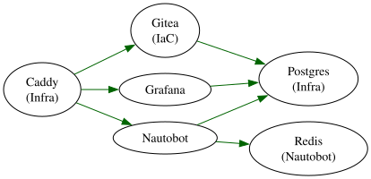
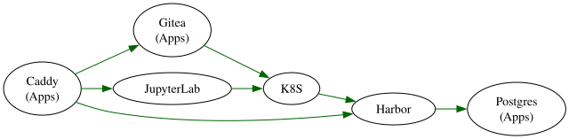
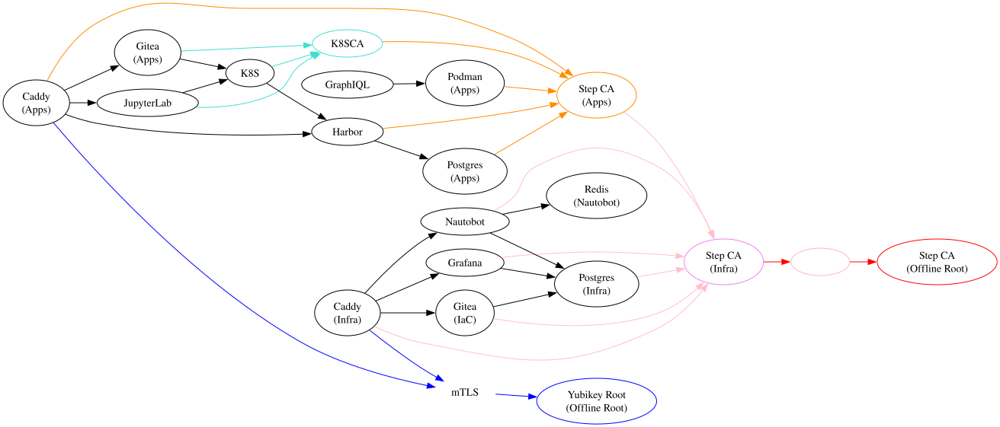
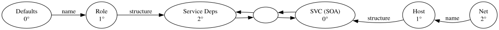

:PROPERTIES:
:ID:       34345d68-6806-459f-b450-09d9cc249302
:END:
#+TITLE: SOPS: Set up sops-nix (round 14)
#+CATEGORY: slips
#+TAGS:

* Roam
+ [[id:f38730e0-1f42-42e3-b173-e12535e55bcd][Smallstep: CA, Policy and Provisioner Configuration]] scripts mostly from here
+ [[id:d4acf534-f60c-4471-bee8-f4b925dd0d90][SOPS]]

* Overview

** Design

*** Requirements

Hoping that =secretspec= offers these

+ [X] Defaults/Generators
+ [X] Provisioner abstraction
  - implementation details/specifics still cause issues
+ [X] Environments
+ [ ] Environments (+1 degree of inheritance)
  - Really need at least one additional degree of separation (inheritance)
+ [X] Scopes
+ [ ] Scopes (+1 degree of inheritance)
  - may not be necessary?

*** Factory/Builder Patterns

*** Tests

*** Support Both Nix & Guix

** Example Service Deps

Some things I want to run are random:

+ https://github.com/jimjonesbr/oai_fdw harvest academic metadata into postgres
  for much of what uses CKAN or OAI interface
+ https://github.com/graphql/graphiql literally an html page to browse GraphQL
  schemas

Other things are standard, but I don't like the idea that the
networking/infrastructure is completely open. 

*** Infra

Services for Infra

#+begin_src dot :noweb-ref svcInfra
CaddyInfra[label="Caddy\n(Infra)"]
NautobotRedis[label="Redis\n(Nautobot)"]
PostgresInfra[label="Postgres\n(Infra)"]
GiteaIAC[label="Gitea\n(IaC)"]
Grafana
#+end_src

Deps for Infra

#+begin_src dot :noweb-ref depInfra
CaddyInfra -> {Nautobot, Grafana, GiteaIAC}

// infra
{GiteaIAC,Grafana} -> {PostgresInfra}
Nautobot -> {PostgresInfra,NautobotRedis}
#+end_src

#+name: exampleInfra
#+begin_src dot :results output file :file img/sopsnix-example-infra.svg :noweb yes
digraph G {
    rankdir=LR
    edge[color=darkgreen]
    <<svcInfra>>
    <<depInfra>>
}
#+end_src

#+RESULTS: exampleInfra

*** Apps

Services for Apps

#+begin_src dot :noweb-ref svcApps
// GiteaRedis[label="Redis\n(Gitea)"]
CaddyApps[label="Caddy\n(Apps)"]
GiteaApps[label="Gitea\n(Apps)"]
Podman[label="Podman\n(Apps)"]
PostgresApps[label="Postgres\n(Apps)"]
#+end_src

Deps for Apps

#+begin_src dot :noweb-ref depApps
CaddyApps -> {Harbor,JupyterLab,GiteaApps}
K8S -> {Harbor}
{JupyterLab,GiteaApps} -> K8S
Harbor -> PostgresApps
#+end_src

#+name: exampleApps
#+begin_src dot :results output file :file img/sopsnix-example-apps.svg :noweb yes
digraph G {
    rankdir=LR
    edge[color=darkgreen]
    <<svcApps>>
    <<depApps>>
}
#+end_src

#+RESULTS: exampleApps

**** Infra and Apps ... with Private X509

Suddenly, this is a ton of shit that needs to know about other shit.

+ Nodes with colors are roots of trust. Colored edges lead generally towards
  towards some root of trust
+ This doesn't really include tunnels for prometheus, etc.
  - K8S can simplify these situations a lot, even without vault ... until you
    need a second K8S cluster or need relationships that cross trust boundaries
+ Offline root bootstraps trust or spare key (or whatever).
  - secondary chain of trust that's flexible enough to throw away

Anyway, mistakes are expensive.

#+name: exampleWithX509
#+begin_src dot :results output file :file img/sopsnix-example-x509.svg :noweb yes
digraph G {
    rankdir=LR
    <<svcInfra>>
    <<svcApps>>
    <<depInfra>>
    <<depApps>>

    {GraphIQL} -> Podman
    
    blank[fontcolor=white, color=lightpink]
    
    node[color=darkorange]
    StepApps[label="Step CA\n(Apps)"]

    node[color=violet]
    StepInfra[label="Step CA\n(Infra)"]

    node[color=red]
    StepOffline[label="Step CA\n(Offline Root)"]
    StepApps -> StepInfra [color=pink]

    node[color=blue]
    YKOffline[label="Yubikey Root\n(Offline Root)"]
    
    node[color=turquoise]
    K8S -> K8SCA [color=turquoise]
    {JupyterLab,GiteaApps} -> K8SCA [color=turquoise]
    
    edge[color=darkorange]
    K8SCA -> StepApps
    {Podman,CaddyApps,PostgresApps,Harbor} -> StepApps
    
    edge[color=pink]
    {CaddyInfra,Nautobot,PostgresInfra,GiteaIAC,Grafana} -> StepInfra
    
    edge[color=red]
    StepInfra -> blank -> StepOffline
    // edge[color=seagreen]

    edge[color=blue]
    mTLS[color=white]
    {CaddyInfra,CaddyApps} -> mTLS -> YKOffline
}
#+end_src

#+RESULTS: exampleWithX509

** Examples

*** Nautobot

*** Grafana

+ [[https://grafana.com/docs/grafana/latest/setup-grafana/configure-grafana/][setup-grafana/configure-grafana]]

*** Caddy

#+begin_src toml

#+end_src

*** Caddy + mTLS

*** Harbor

*** Kubernetes
** Step CA Examples

*** =SSHPOP= Short-lived SSH

*** =JWT= to sign =X509=

* Telos

Here, scope is in the abstract sense

+ $2^{\circ} \uparrow$ widens the scopes (from the bottom up)
+ $2^{\circ} \downarrow$ narrows the scopes (moving to the top)

|-------------+----------------------+---------------------------+-------------|
| Level       | $2^{\circ} \uparrow$ | $2^{\circ} \downarrow$    | Level       |
|-------------+----------------------+---------------------------+-------------|
| $2^{\circ}$ | Service Deps         | Service                   | $0^{\circ}$ |
| $1^{\circ}$ | Role?                | Host (or pod/whatever)     | $1^{\circ}$ |
| $0^{\circ}$ | Defaults             | Net (network environment) | $2^{\circ}$ |
|-------------+----------------------+---------------------------+-------------|
+ The left half is concerned with layering the secrets from names to roles to
  relationships between roles
  - These should be reusable factories assembled into builders (implemented
    using the tools for whatever system)
  - Hopefully, should be covered by =secretspec='s =Environment= abstraction
+ The right half is concerned with deployment details.
  - Binds the name/structure from the left into a method of providing that
    secret at runtime where it's accessibility limited in scope to what needs it
  - Hopefully, should be covered by =secretspec='s =Scope= abstraction

The rationale:

+ There are two relative degrees of separation on the left: enough to reuse
  functionality & patterns of specifying services. e.g.
  - Nautobot needs Postgres and Redis
  - Redis needs XYZ+TLS, Postgres needs XYZ+TLS
  - Redis/Postgres config structures get a name in the namespace that's
    presented to the deployment at the right. each config structure has
    properties with names, where relationships/values could otherwise be
    supplied.
+ Two relative degrees of separation on the right:
  - Enough to receive the config values/structures, know how to access/set
    props, then additionally remap the relationships.

Regardless of what abstractions/concepts are attached to the right half, as long
as they receive combinations of the structures from the left half that they know
how to (1) identify via name/space (2) operate on ... then they should be able
to (1) inject whatever info is needed (2) mutate structure ... to deliver an
immutable result... (i guess?)

+ "SVC (SOA)": Nixos service configuration (or a service ready for ingress,
  reachable from the outside)
+ "Host": Nixos System (a unit of functionality that binds what runs to its
  runtime env/net)
+ "Net": Deployment environment or additional state acquired at runtime (DHCP)

This is overly abstract but, if these patterns work elsewhere to decouple the
service's operation/interface from network/implementation, then the same tools
should be more than enough for specifying secrets names & their provision
processes.

#+begin_src dot :results output file :file img/sopsnix-degrees-of-abstraction.svg
digraph G {
    rankdir=LR
    
    a[label="Defaults\n0°"]
    b[label="Role\n1°"]
    c[label="Service Deps\n2°"]
    d[label="SVC (SOA)\n0°"]
    e[label="Host\n1°"]
    f[label="Net\n2°"]

    mid[label=""]

    a -> b [label="name"]
    b -> c [label="structure"]
    f -> e [label="name"]
    e -> d [label="structure"]

    c -> mid -> d -> mid -> c

    node[style=invis]
    c -> b -> a [style=invis]
    d -> e -> f [style=invis]
}
#+end_src

#+RESULTS:

