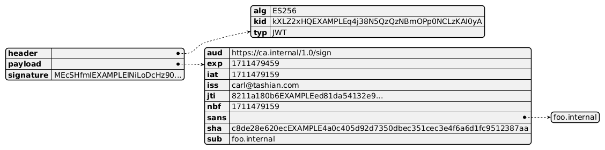
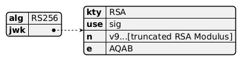
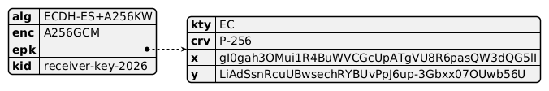
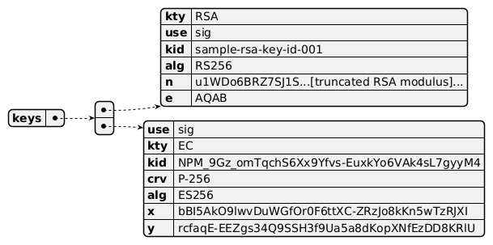
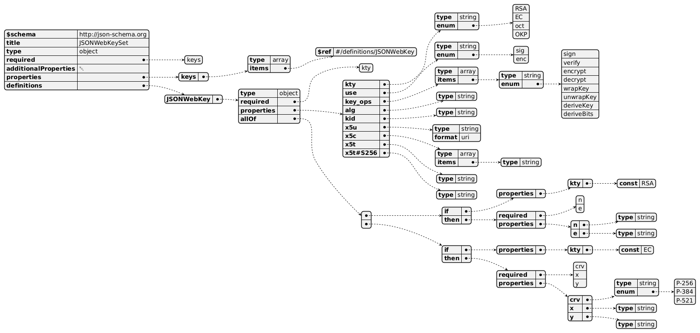
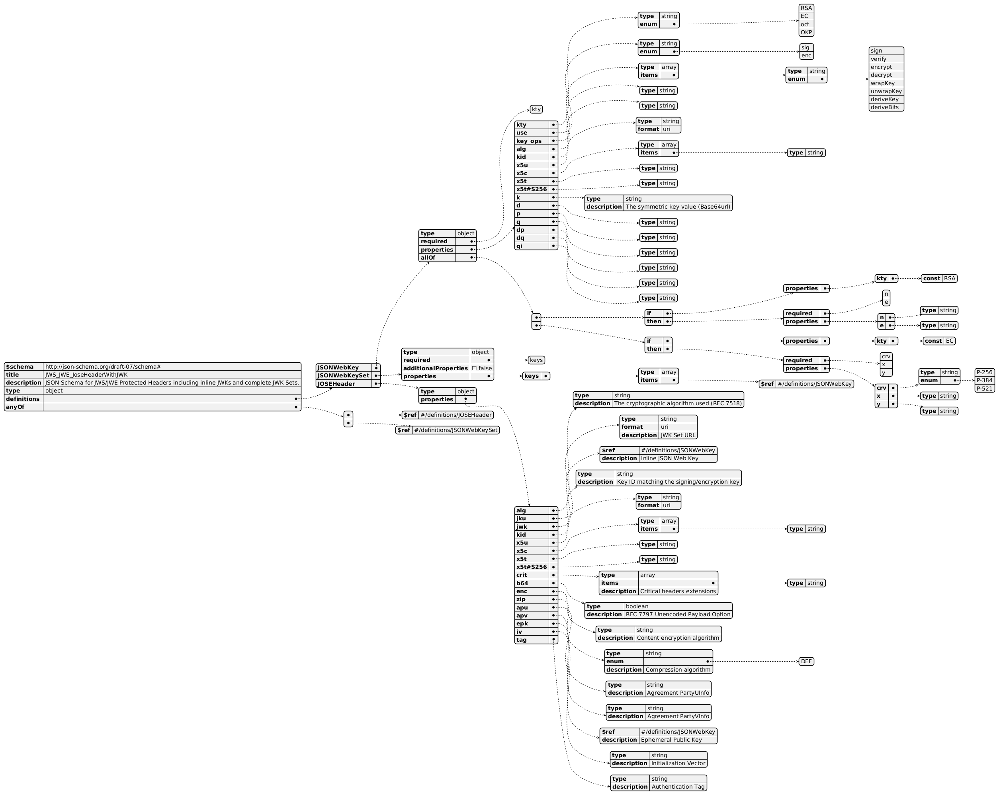
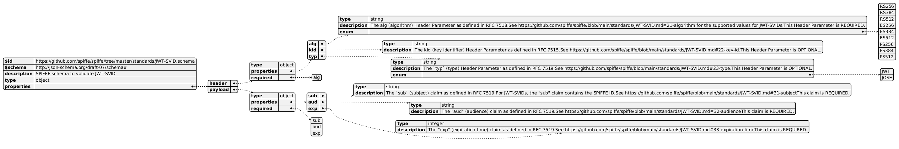
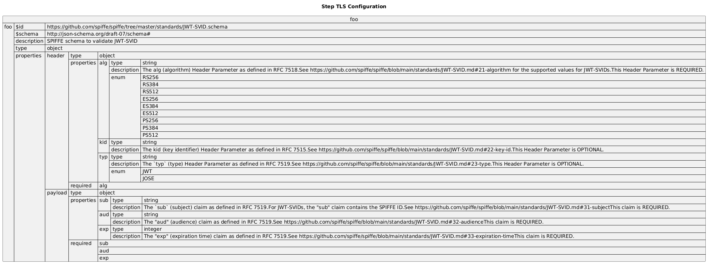

:PROPERTIES:
:ID:       6ed5eaea-447b-44c6-b020-95629b0c619f
:END:
#+TITLE: Crypto: JWK and JWT Schema
#+CATEGORY: slips
#+TAGS:

* Roam
+ [[id:c2afa949-0d1c-4703-b69c-02ffa854d4f4][Cryptography]]

* Examples :llmcontent:

Schemas and some examples generated by LLM

** Terms

+ JWS :: JSON Web Signature
+ JWE :: JSON Web Encryption
+ JWK :: JSON Web Key

*** JOSE Header Properties

#+call: jsonschemaDumpProps(what='() which='())

#+RESULTS:
: []

#+name: jsonschemaDumpProps
#+begin_src jq :stdin joseheader :results output table :var what="definitions" which="JOSEHeader"
# Wow that was so much easier
if ($what != "nil" and $which != "nil") then # ob-jq doesn't support --jsonargs
  .[$what].[$which].properties
  | to_entries | map([.key, [.value.type, .value.description // "" ]] | flatten)
else
  (.properties // [])
  | to_entries | map([.key, [.value.type, .value.description // "" ]] | flatten)
end
#+end_src

#+RESULTS: jsonschemaDumpProps
| alg      | string  | The cryptographic algorithm used (RFC 7518) |
| jku      | string  | JWK Set URL                                 |
| jwk      | nil     | Inline JSON Web Key                         |
| kid      | string  | Key ID matching the signing/encryption key  |
| x5u      | string  |                                             |
| x5c      | array   |                                             |
| x5t      | string  |                                             |
| x5t#S256 | string  |                                             |
| crit     | array   | Critical headers extensions                 |
| b64      | boolean | RFC 7797 Unencoded Payload Option           |
| enc      | string  | Content encryption algorithm                |
| zip      | string  | Compression algorithm                       |
| apu      | string  | Agreement PartyUInfo                        |
| apv      | string  | Agreement PartyVInfo                        |
| epk      | nil     | Ephemeral Public Key                        |
| iv       | string  | Initialization Vector                       |
| tag      | string  | Authentication Tag                          |

** In UML

Well... I could rewrite this using =<< nowebSnippets >>= but i don't feel like it

** JWT

#+begin_src plantuml :results output file :file img/sopsnix-jwt-example.png  :noweb-ref umlJWT
@startjson
{
  "header": {
    "alg": "ES256",
    "kid": "kXLZ2xHQEXAMPLEq4j38N5QzQzNBmOPp0NCLzKAI0yA",
    "typ": "JWT"
  },
  "payload": {
    "aud": "https://ca.internal/1.0/sign",
    "exp": 1711479459,
    "iat": 1711479159,
    "iss": "carl@tashian.com",
    "jti": "8211a180b6EXAMPLEed81da54132e9...",
    "nbf": 1711479159,
    "sans": [
      "foo.internal"
    ],
    "sha": "c8de28e620ecEXAMPLE4a0c405d92d7350dbec351cec3e4f6a6d1fc9512387aa",
    "sub": "foo.internal"
  },
  "signature": "MEcSHfmIEXAMPLElNiLoDcHz90..."
}
@endjson
#+end_src

#+RESULTS:

** JWS

#+begin_src plantuml :results output file :file img/sopsnix-jws-example.png :noweb-ref umlJWS
@startjson
{
    "alg": "RS256",
    "jwk": {
        "kty": "RSA",
        "use": "sig",
        "n": "v9...[truncated RSA Modulus]",
        "e": "AQAB"
    }
}
@endjson
#+end_src

** JWE

#+begin_src plantuml :results output file :file img/sopsnix-jwe-example.png :noweb-ref umlJWE
@startjson
{
    "alg": "ECDH-ES+A256KW",
    "enc": "A256GCM",
    "epk": {
        "kty": "EC",
        "crv": "P-256",
        "x": "gI0gah3OMui1R4BuWVCGcUpATgVU8R6pasQW3dQG5lI",
        "y": "LiAdSsnRcuUBwsechRYBUvPpJ6up-3Gbxx07OUwb56U"
    },
    "kid": "receiver-key-2026"
}
@endjson
#+end_src

** JWK

#+begin_src plantuml :results output file :file img/sopsnix-jwk-examples.png :noweb-ref umlJWK
@startjson
{
  "keys": [
    {
      "use": "sig",
      "kty": "RSA",
      "kid": "sample-rsa-key-id-001",
      "alg": "RS256",
      "n": "u1WDo6BRZ7SJ1S...[truncated RSA modulus]...",
      "e": "AQAB"
    },{
        "kty": "EC",
        "use": "sig",
        "kid": "NPM_9Gz_omTqchS6Xx9Yfvs-EuxkYo6VAk4sL7gyyM4",
        "crv": "P-256",
        "alg": "ES256",
        "x": "bBI5AkO9lwvDuWGfOr0F6ttXC-ZRzJo8kKn5wTzRJXI",
        "y": "rcfaqE-EEZgs34Q9SSH3f9Ua5a8dKopXNfEzDD8KRlU"
  }]
}
@endjson
#+end_src

*** Keys

|----------+-------------------------+----------------|
| key      | desc                    | examples       |
|----------+-------------------------+----------------|
| kty      | Algorithm               | RSA,EC,oct,OKP |
| kid      | Key ID                  |                |
| use      | what's it used for      | sig,enc        |
|----------+-------------------------+----------------|
| x5u      | X509 URL                |                |
| x5c      | X509 Cert Chain         |                |
| x5t      | X509 SHA-1 Thumbprint   |                |
| x5t#S256 | X509 SHA-256 Thumbprint |                |
|----------+-------------------------+----------------|
Elliptic Curve

|-----+---------------------+-------------------|
| key | desc                | examples          |
|-----+---------------------+-------------------|
| crv | EC curve            | P-256,P-384,P-521 |
| x,y | EC curve parameters |                   |
| d   | EC private key      |                   |
|-----+---------------------+-------------------|
RSA

|-------+------------------------|
| key   | desc                   |
|-------+------------------------|
| n     | Modulus                |
| e     | Exponent               |
| d     | Private Exponent       |
|-------+------------------------|
| p     | 1st Prime Factor       |
| q     | 2nd Prime Factor       |
| dp    | 1st Factor CRT Exp.    |
| dq    | 2nd Factor CRT Exp.    |
| qi    | 1st CRT Coefficient    |
| oth   | Other Primes Info      |
| oth.r | Prime Factor           |
| oth.d | Factor CRT Exponent    |
| oth.t | Factor CRT Coefficient |
|-------+------------------------|
There's also =key_ops= which

|------------+--------------------------------------------------------|
| op         | intended use                                          |
|------------+--------------------------------------------------------|
| sign       | compute digital signature or MAC                       |
| verify     | verify digital signature or MAC                        |
| encrypt    | encrypt content                                        |
| decrypt    | decrypt content and validate decryption, if applicable |
| wrapKey    | encrypt key                                            |
| unwrapKey  | decrypt key and validate decryption, if applicable     |
| deriveKey  | derive key                                             |
| deriveBits | derive bits not to be used as a key                    |
|------------+--------------------------------------------------------|
* Schemas :llmcontent:

** JWK

** Full JOSE

** Schema: JWK
According to LLM, this is a good schema to match:

+ [[https://www.rfc-editor.org/rfc/rfc7517][RFC7517: JSON Web Key]]
+ And [[https://www.rfc-editor.org/rfc/rfc7518][RFC7518: JSON Web Algorithms]]

*** Babel

#+begin_src plantuml :results output file :file img/sopsnix-jwk-schema.png :noweb yes
@startjson
{
  "$schema": "http://json-schema.org",
  "title": "JSONWebKeySet",
  "type": "object",
  "required": ["keys"],
  "additionalProperties": null,
  "properties": {
    "keys": {
      "type": "array",
      "items": { "$ref": "#/definitions/JSONWebKey" }
    }
  },
  "definitions": {
    "JSONWebKey": {
      "type": "object",
      "required": ["kty"],
      "properties": {
        "kty": { "type": "string", "enum": ["RSA", "EC", "oct", "OKP"] },
        "use": { "type": "string", "enum": ["sig", "enc"] },
        "key_ops": {
          "type": "array",
          "items": { "type": "string", "enum": ["sign", "verify", "encrypt", "decrypt", "wrapKey", "unwrapKey", "deriveKey", "deriveBits"] }
        },
        "alg": { "type": "string" },
        "kid": { "type": "string" },
        "x5u": { "type": "string", "format": "uri" },
        "x5c": { "type": "array", "items": { "type": "string" } },
        "x5t": { "type": "string" },
        "x5t#S256": { "type": "string" }
      },
      "allOf": [
        {
          "if": { "properties": { "kty": { "const": "RSA" } } },
          "then": {
            "required": ["n", "e"],
            "properties": {
              "n": { "type": "string" },
              "e": { "type": "string" }
            }
          }
        },
        {
          "if": { "properties": { "kty": { "const": "EC" } } },
          "then": {
            "required": ["crv", "x", "y"],
            "properties": {
              "crv": { "type": "string", "enum": ["P-256", "P-384", "P-521"] },
              "x": { "type": "string" },
              "y": { "type": "string" }
            }
          }
        }
      ]
    }
  }
}
@endjson
#+end_src

** Full Schema: JWK, JWS, JWE, JWT

#+name: joseheader
#+begin_example json :noweb-ref joseheader
{
  "$schema": "http://json-schema.org/draft-07/schema#",
  "title": "JWS_JWE_JoseHeaderWithJWK",
  "description": "JSON Schema for JWS/JWE Protected Headers including inline JWKs and complete JWK Sets.",
  "type": "object",
  "definitions": {
    "JSONWebKey": {
      "type": "object",
      "required": [
        "kty"
      ],
      "properties": {
        "kty": {
          "type": "string",
          "enum": [
            "RSA",
            "EC",
            "oct",
            "OKP"
          ]
        },
        "use": {
          "type": "string",
          "enum": [
            "sig",
            "enc"
          ]
        },
        "key_ops": {
          "type": "array",
          "items": {
            "type": "string",
            "enum": [
              "sign",
              "verify",
              "encrypt",
              "decrypt",
              "wrapKey",
              "unwrapKey",
              "deriveKey",
              "deriveBits"
            ]
          }
        },
        "alg": {
          "type": "string"
        },
        "kid": {
          "type": "string"
        },
        "x5u": {
          "type": "string",
          "format": "uri"
        },
        "x5c": {
          "type": "array",
          "items": {
            "type": "string"
          }
        },
        "x5t": {
          "type": "string"
        },
        "x5t#S256": {
          "type": "string"
        },
        "k": {
          "type": "string",
          "description": "The symmetric key value (Base64url)"
        },
        "d": {
          "type": "string"
        },
        "p": {
          "type": "string"
        },
        "q": {
          "type": "string"
        },
        "dp": {
          "type": "string"
        },
        "dq": {
          "type": "string"
        },
        "qi": {
          "type": "string"
        }
      },
      "allOf": [
        {
          "if": {
            "properties": {
              "kty": {
                "const": "RSA"
              }
            }
          },
          "then": {
            "required": [
              "n",
              "e"
            ],
            "properties": {
              "n": {
                "type": "string"
              },
              "e": {
                "type": "string"
              }
            }
          }
        },
        {
          "if": {
            "properties": {
              "kty": {
                "const": "EC"
              }
            }
          },
          "then": {
            "required": [
              "crv",
              "x",
              "y"
            ],
            "properties": {
              "crv": {
                "type": "string",
                "enum": [
                  "P-256",
                  "P-384",
                  "P-521"
                ]
              },
              "x": {
                "type": "string"
              },
              "y": {
                "type": "string"
              }
            }
          }
        }
      ]
    },
    "JSONWebKeySet": {
      "type": "object",
      "required": [
        "keys"
      ],
      "additionalProperties": false,
      "properties": {
        "keys": {
          "type": "array",
          "items": {
            "$ref": "#/definitions/JSONWebKey"
          }
        }
      }
    },
    "JOSEHeader": {
      "type": "object",
      "properties": {
        "alg": {
          "type": "string",
          "description": "The cryptographic algorithm used (RFC 7518)"
        },
        "jku": {
          "type": "string",
          "format": "uri",
          "description": "JWK Set URL"
        },
        "jwk": {
          "$ref": "#/definitions/JSONWebKey",
          "description": "Inline JSON Web Key"
        },
        "kid": {
          "type": "string",
          "description": "Key ID matching the signing/encryption key"
        },
        "x5u": {
          "type": "string",
          "format": "uri"
        },
        "x5c": {
          "type": "array",
          "items": {
            "type": "string"
          }
        },
        "x5t": {
          "type": "string"
        },
        "x5t#S256": {
          "type": "string"
        },
        "crit": {
          "type": "array",
          "items": {
            "type": "string"
          },
          "description": "Critical headers extensions"
        },
        "b64": {
          "type": "boolean",
          "description": "RFC 7797 Unencoded Payload Option"
        },
        "enc": {
          "type": "string",
          "description": "Content encryption algorithm"
        },
        "zip": {
          "type": "string",
          "enum": [
            "DEF"
          ],
          "description": "Compression algorithm"
        },
        "apu": {
          "type": "string",
          "description": "Agreement PartyUInfo"
        },
        "apv": {
          "type": "string",
          "description": "Agreement PartyVInfo"
        },
        "epk": {
          "$ref": "#/definitions/JSONWebKey",
          "description": "Ephemeral Public Key"
        },
        "iv": {
          "type": "string",
          "description": "Initialization Vector"
        },
        "tag": {
          "type": "string",
          "description": "Authentication Tag"
        }
      }
    }
  },
  "anyOf": [
    {
      "$ref": "#/definitions/JOSEHeader"
    },
    {
      "$ref": "#/definitions/JSONWebKeySet"
    }
  ]
}
#+end_example

#+name: meow
#+begin_src shell :results output :stdin joseheaderschema
cat
#+end_src

#+name: umljson
#+begin_src plantuml :results output file :file img/sopsnix-jose-schema.png :noweb yes
@startjson
<<meow()>>
@endjson
#+end_src

* JWT (SVID)

JWT-SVID from SPIFFE

#+name: jqID
#+begin_src jq
.
#+end_src

#+RESULTS: jqID

#+name: jwtSchema
#+call: jqID() :stdin jwtSchemaJson :results output silent

** PlantUML =@startjson= style

#+begin_src plantuml :results output file :file img/sopsnix-jwt-svid-schema.png :noweb yes
' @startjson usage must contain the only UML document AFAIK
@startjson
<<jwtSchema()>>
@endjson
#+end_src

#+RESULTS:

** PlantUML =@startuml= style

#+begin_src plantuml :results output file :file img/sopsnix-jwt-svid-schema2.png :noweb yes
@startuml

' !pragma layout smetana
' '!pragma ratio 1
skinparam backgroundcolor transparent
' skinparam DefaultTextAlign left
' skinparam packageTitleAlign left
set namespaceSeparator none
hide circle
hide empty fields
hide empty methods

title Step TLS Configuration

' holy crap the sheer number of hacks to get plantuml to be happy is just not worth it
'
' it doesn't like: json foo << fdsa() >> bc it repeats the prefix "json foo" for every line
json foo {
  "foo":
  <<jwtSchema()>>
}
@enduml
#+end_src

#+RESULTS:

** Schema

#+name: jwtSchemaJson
#+begin_example
{
  "$id": "https://github.com/spiffe/spiffe/tree/master/standards/JWT-SVID.schema",
  "$schema": "http://json-schema.org/draft-07/schema#",
  "description": "SPIFFE schema to validate JWT-SVID",
  "type": "object",
  "properties": {
    "header": {
      "type": "object",
      "properties": {
        "alg": {
          "type": "string",
          "description": "The alg (algorithm) Header Parameter as defined in RFC 7518.\nSee https://github.com/spiffe/spiffe/blob/main/standards/JWT-SVID.md#21-algorithm for the supported values for JWT-SVIDs.\nThis Header Parameter is REQUIRED.\n",
          "enum": [
            "RS256",
            "RS384",
            "RS512",
            "ES256",
            "ES384",
            "ES512",
            "PS256",
            "PS384",
            "PS512"
          ]
        },
        "kid": {
          "type": "string",
          "description": "The kid (key identifier) Header Parameter as defined in RFC 7515.\nSee https://github.com/spiffe/spiffe/blob/main/standards/JWT-SVID.md#22-key-id.\nThis Header Parameter is OPTIONAL.\n"
        },
        "typ": {
          "type": "string",
          "description": "The `typ` (type) Header Parameter as defined in RFC 7519.\nSee https://github.com/spiffe/spiffe/blob/main/standards/JWT-SVID.md#23-type.\nThis Header Parameter is OPTIONAL.\n",
          "enum": [
            "JWT",
            "JOSE"
          ]
        }
      },
      "required": [
        "alg"
      ]
    },
    "payload": {
      "type": "object",
      "properties": {
        "sub": {
          "type": "string",
          "description": "The `sub` (subject) claim as defined in RFC 7519.\nFor JWT-SVIDs, the \"sub\" claim contains the SPIFFE ID.\nSee https://github.com/spiffe/spiffe/blob/main/standards/JWT-SVID.md#31-subject\nThis claim is REQUIRED.\n"
        },
        "aud": {
          "type": "string",
          "description": "The \"aud\" (audience) claim as defined in RFC 7519.\nSee https://github.com/spiffe/spiffe/blob/main/standards/JWT-SVID.md#32-audience\nThis claim is REQUIRED.\n"
        },
        "exp": {
          "type": "integer",
          "description": "The \"exp\" (expiration time) claim as defined in RFC 7519.\nSee https://github.com/spiffe/spiffe/blob/main/standards/JWT-SVID.md#33-expiration-time\nThis claim is REQUIRED.\n"
        }
      },
      "required": [
        "sub",
        "aud",
        "exp"
      ]
    }
  }
}
#+end_example
