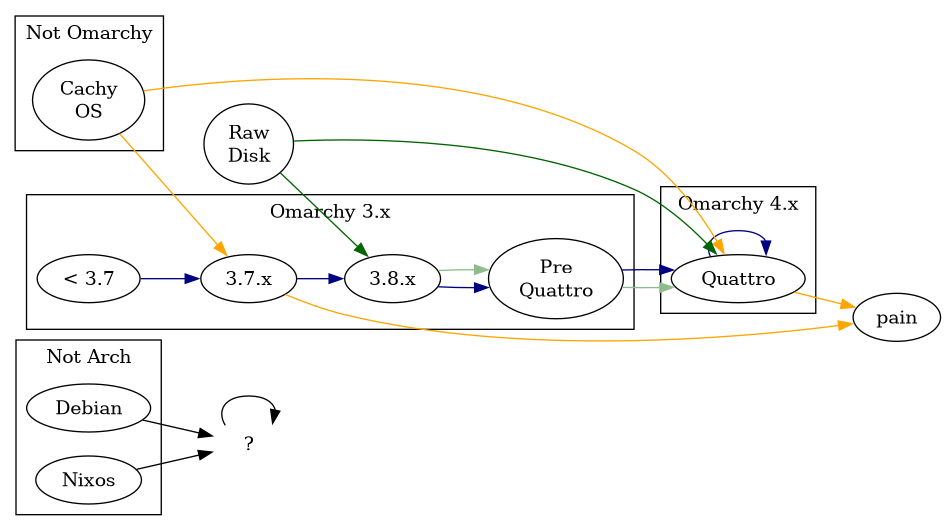

:PROPERTIES:
:ID:       04edaf13-987d-4337-a65b-3d661c3153d3
:END:
#+title: Omarchy: Upgrade To Quattro
#+CATEGORY: streams
#+TAGS: recorded
#+PROPERTY: header-args+ :dir 20260802010203-omarchy_upgrade_to_quattro  

* Roam
+ [[id:bc406527-0255-4d70-b620-82495ac5c8fe][Hyprland]]
+ [[id:fbf366f2-5c17-482b-ac7d-6dd130aa4d05][Arch]]

* Outline

I streamed it, but hit a snag and got frustrated when I realized I had been
reviewing a stream that wasn't displayed... for about 30 minutes SMH.
=#tunnelvision=

That threw me for a loop, since I haven't thought much about slicing/dicing the
video after the stream. My clip-fu is not strong bc i'm too susceptible to
tangents.

+ until the release, run with =bin/omarchy-upgrade-to-quatro --channel rc=
  - otherwise =$OMARCHY_PATH/bin/omarchy-done= doesn't exist... get it? lol
  - without =--channel rc=, it will probably fail: this switches things over to
    fetch the right packages
+ Even though =systemd-networkd= isn't disabled, I think running the installation
  twice (see) will result different network behavior
+ Though my networking functionality was fine, the firewall state was left in
  limbo. I still had some =NDI= ports open according to =ss -4tua | grep $ip=, but i
  couldn't re-establish the NDI session.
  - I probably needed to use =iptables=, but at that point I was reallly building
    the car while I was driving it. While fun (and interesting IMO), this just
    isn't great to stream while the viewer can't see it.
  - The whole thing was "bet i _can_ switch out systemd-networkd for network
    manager while i stream this... hold my beer" more or less.
  - I could've also failed over to =srt://= to stream, but i had forgetten.
+ I wasn't sure that I could run the script from =ssh=, since it requires
  =OMARCHY_PATH= and a few other intermediate environment variables.

** Misc
*** Resources for linux noobs

+ Learn about systemd: =systemd-analyze= and TUIs like =isd= are a good start
+ Flatpaks over native packages
+ Read the source! (... eventually) Find a way to reference the source as your
  primary source of information. This seems complicated, but not with grep/etc.
  Sourcegraph can help.
  - Arch wiki, gentoo wiki, etc: you'll get a ton more value out of these after
    you've read the source.
  - The most important sources to read are your package recipes

**** Certification

+ Just get a certification or take a course... it's easier that way
  - Preferably, find a course leading to certification to meet people who can
    help give you perspective or advice.
  - Something like: [[https://prolug.org/][ProLUG]] or just a local Linux User's Group

You may not plan on working with Linux professionally and the certification
course won't cover a lot about desktop usage. However, it will help chart out a
sparse approximation of those "unknown unknowns" ... when are then um less
sparse

*** Webapps are not bloat

To be fair, an 8GB iso is large... but the bloat there is probably drivers and
blobs. It's distributed as a single ISO, so it looks like it just includes more
drivers.

#+begin_src shell :results output code :wrap example conf 
ssh kharis cat ~/.local/share/applications/HEY.desktop
#+end_src

#+RESULTS:
#+begin_example conf
[Desktop Entry]
Version=1.0
Name=HEY
Comment=HEY
Exec=omarchy-launch-webapp https://app.hey.com
Terminal=false
Type=Application
Icon=/home/dc/.local/share/applications/icons/HEY.png
StartupNotify=true
#+end_example

#+begin_src shell :results output code :wrap example conf 
ssh kharis cat ~/.local/share/omarchy/bin/omarchy-launch-webapp
#+end_src

#+RESULTS:
#+begin_example conf
#!/bin/bash

# omarchy:summary=Launch a URL as a web app in the default supported browser
# omarchy:args=<url>

browser=$(xdg-settings get default-web-browser)

case $browser in
google-chrome* | brave* | microsoft-edge* | opera* | vivaldi* | helium*) ;;
,*) browser="chromium.desktop" ;;
esac

exec setsid uwsm-app -- $(sed -n 's/^Exec=\([^ ]*\).*/\1/p' {~/.local,~/.nix-profile,/usr}/share/applications/$browser 2>/dev/null | head -1) --app="$1" "${@:2}"
#+end_example

** Review upgrade script

|-----------+-----------------|
| System    | User            |
|-----------+-----------------|
| Limine    | Quickshell      |
| SDDM      | Hyprland Config |
| UWSM Init |                 |
| Packages  |                 |
|-----------+-----------------|
Potential Problems
 
|--------------------+----------------------------------|
| Desktop            | Stream                           |
|--------------------+----------------------------------|
| Limine/snapper     | Booting, starting hyprland       |
| SystemD & UWSM Env | Wifi Transition                  |
| ~/etc/profile~       | Network Manager Profiles         |
| Hyprland Config    | SRT, Can't open OBS after reboot |
| ~omarchy-shell~      |                                  |
|                    |                                  |
|--------------------+----------------------------------|
** Explain an install script
+ compare to a generic bash script
  - argument handling, validation, action
+ An installation script or system transformation script is similar

*** How to read a bash script

+ Well... how are they written?
  - argument handling, runtime context, logging, validation -> internalized state
  - internalized state -> actions, guards, failure
+ Read by: skipping to the end, returning to the beginning
  - like an academic paper.
*** What is a monoid ... (briefly)

TLDR: you should be able to run these kinds of install scripts, multiple times
with "idempotence" -- loosely, in ansible terms, multiple invocations will tend
to create no-ops.

+ The possibility for multiple invocations is provided by how the script will
  funnel transformations towards a singular "pre-quattro" type (a la category
  theory's "pre-cover" or "pre-sheaf")... more or less.
+ Anyways, this is a kind of type-theoretic convexity, i think. Interesting to
  think about... but also kinda obvious and unnecessarily technical.

**** In the terms of type theory

We need a procedure to make a thing-type ... but we could start from many other
types of things. In the end, it should act like the type we specify.

To upgrade a linux distribution, we need to migrate many different possible
installations (which have drifted outside our control)...

+ to a standard "pre-upgrade" state
+ and then to a standard "post-upgrade" state

#+begin_src dot :results file :file omarchy-install-paths.png
digraph G {
    rankdir=LR
    compound=true

    subgraph cluster_arch_not {
        label="Not Arch"
        nixos[label="Nixos"]
        debian[label="Debian"]
    }
    subgraph cluster_omarchy_4 {
        label="Omarchy 4.x"
        omarchy_quattro[label="Quattro"];
    }
    
    subgraph cluster_omarchy_3_x {
        label="Omarchy 3.x"
        omarchy_3_8[label="3.8.x"]
        omarchy_3_7[label="3.7.x"]
        omarchy_3_x[label="< 3.7"]
        omarchy_pre_quattro[label="Pre\nQuattro"]
        omarchy_3_x -> omarchy_3_7 -> omarchy_3_8 -> omarchy_pre_quattro [color="navyblue"]
    }
    subgraph cluster_omarchy_not {
        label="Not Omarchy"
        cachyos[label="Cachy\nOS"]
    }
    pain[label="pain"]
    cachyos -> {omarchy_3_7,omarchy_quattro} -> pain [color="orange"]
    huh[label="?", color="white"]
    huh -> huh
    {debian,nixos} -> huh
    raw_disk[label="Raw\nDisk"]
    omarchy_3_8 -> omarchy_pre_quattro -> omarchy_quattro [color="darkseagreen"]
    raw_disk -> {omarchy_3_8, omarchy_quattro} [color="darkgreen"]
    omarchy_pre_quattro -> omarchy_quattro [color="navyblue"]
    omarchy_quattro -> omarchy_quattro [color="navyblue"]
}
#+end_src

#+RESULTS:

**** Bash is not Haskell: Side Effects

+ Immutability prevents side effects
+ Bash is not functional programming. Developers like functional programming bc
  the lessons learned carry over to other languages. You can step back and
  methodically organize behavior to simplify error handling or structure
  transitions between "types"

Sources of mutability (or variability): 

| Hardware          | System                 | Packaging                | User                               |
|-------------------+------------------------+--------------------------+------------------------------------|
| Bootloader, UUID  | Unexpected file system | Package dependency locks | User edited =OMARCHY_PATH=           |
| Graphics drivers  | Process/Service state  |                          | Weird =~/.config/hypr= setup         |
| Secure Boot       |                        |                          | Custom =Hyprland= or =SDDM= invocation |
| UEFI config state |                        |                          |                                    |

Edge cases

+ A user's own =PKGBUILD='s specify dependency relationships that
  =bin/omarchy-upgrade-to-quattro= can't anticipate
+ =bin/omarchy-upgrade-to-quattro= references services that no longer exist
+ User removes disk from PC with NVidia hardware and tries to boot in computer
  with AMD hardware. This would likely require a chroot to fix. Notice most
  distros' ISOs come in an NVidia and non-NVidia flavor.

** Run upgrade

*** Handle Problems
*** Reboot

** After Upgrade
*** Setup Networking
*** Fix =.bashrc= and =.bash_profile=
**** Reload Hyprland?
*** Check environments
+ check editor
**** Diff bash and quickshell environments
+ Check with =ssh=
** Changes

*** Environment changes

#+begin_example shell
# some weird nix quoting here
alias covia='sed -e "s/:/\n:\t/g"'
alias diffia='envia | covia | diff - <(env | envia | covia)'
alias difnia='nenvia | diff - <(env | nenvia)'
alias envia='grep -e '\''^[A-Za-z0-9_]*PATH='\'' | sort | uniq'
alias nenvia='grep -ve '\''^[A-Za-z0-9_]*PATH='\'' | sort | uniq'
#+end_example

**** Diff

Login

#+begin_src shell :results output code :wrap example diff
diff quattro.env.login.{pre,post}
#+end_src

#+RESULTS:
#+begin_example diff
10a11
> OMARCHY_PATH=/usr/share/omarchy
#+end_example

Login and Interactive

#+begin_src shell :results output code :wrap example diff
diff quattro.env.interactive.{pre,post}
#+end_src

#+RESULTS:
#+begin_example diff
11,12c11
< __MISE_ORIG_PATH=/home/dc/.local/share/omarchy/bin
< /home/dc/wpilib/2026/vscode/VSCode-linux-x64/bin
---
> __MISE_ORIG_PATH=/home/dc/wpilib/2026/vscode/VSCode-linux-x64/bin
26,27c25,27
< OMARCHY_PATH=/home/dc/.local/share/omarchy
< PATH=/home/dc/.local/share/mise/installs/node/latest/bin
---
> OMARCHY_PATH=/usr/share/omarchy
> PATH=/home/dc/.local/share/mise/installs/codex/latest/bin
> /home/dc/.local/share/mise/installs/node/latest/bin
29d28
< /home/dc/.local/share/omarchy/bin
#+end_example

**** Fetch

Login

#+begin_src shell :results output file :file quattro.env.login.post
ssh kharis "/bin/sh -cl env" \
    | grep -e '^[A-Za-z0-9_]*PATH=' \
    | sort | uniq | tr ':' '\n'
#+end_src

#+RESULTS:
[[file:20260802010203-omarchy_upgrade_to_quattro/quattro.env.login.post]]

Interactive (needs tty + interactive)

*** Package changes

**** Diff

#+begin_src shell :results output code :wrap example diff
diff quattro.pacman.{pre,post}
#+end_src

#+RESULTS:
#+begin_example diff
1c1
< 1password-beta 8.12.30_19.BETA-19.1
---
> 1password 8.12.28-25
3d2
< a52dec 0.8.0-3
20a20
> alsa-utils 1.2.16-1
30d29
< atkmm 2.28.5-2
52a52
> bluez-tools 0.2.0-6
71d70
< cairomm 1.14.6-1
80c79
< cliamp 1.57.1-1
---
> cliamp 1.62.0-1
91a91,92
> cpptrace 1.0.4-2
> cracklib 2.10.3-1
116a118
> ddcutil 2.2.7-1
136a139
> dua-cli 2.38.1-1
138d140
< dust 1.2.4-2
145,157d146
< elephant 2.21.0-1
< elephant-bluetooth 2.21.0-1
< elephant-calc 2.21.0-1
< elephant-clipboard 2.21.0-1
< elephant-desktopapplications 2.21.0-1
< elephant-files 2.21.0-1
< elephant-menus 2.21.0-1
< elephant-providerlist 2.21.0-1
< elephant-runner 2.21.0-1
< elephant-symbols 2.21.0-1
< elephant-todo 2.21.0-1
< elephant-unicode 2.21.0-1
< elephant-websearch 2.21.0-1
159d147
< ell 0.83-1
171d158
< faad2 2.11.2-1
173a161
> fcft 3.3.3-1
190a179
> foot 1.27.0-1
228d216
< glibmm 2.66.9-1
236d223
< gnome-calculator 50.0-1
239a227
> gnome-disk-utility 46.1-2
251d238
< gpsd 3.27.5-1
278d264
< gtkmm3 3.24.11-1
280d265
< gtksourceview5 5.20.0-1
307d291
< hypridle 0.1.7-10
312d295
< hyprlock 0.9.6-1
321a305
> i2c-tools 4.4-4
328d311
< impala 0.7.4-1
348d330
< iwd 3.12-1
406,407d387
< kvantum 1.1.8-1
< kvantum-qt5 1.1.8-1
484c464
< libebml 1.4.5-3
---
> libdwarf 1:2.3.2-1
548d527
< libmatroska 1.7.2-2
550a530
> libmm-glib 1.24.2-1
555d534
< libmpdclient 2.26-1
562a542
> libndp 1.9-1
564a545
> libnewt 0.52.25-2
606a588
> libpwquality 1.4.5-7
621d602
< libsigc++ 2.12.2-1
641a623
> libteam 1.32-3
664d645
< libvlc 3.0.23_2-9
715,716c696,697
< limine-mkinitcpio-hook 1.36.0-1
< limine-snapper-sync 1.30.1-1
---
> limine-mkinitcpio-hook 1.37.1-1
> limine-snapper-sync 1.31.0-1
759d739
< mako 1.11.0-1
776a757,758
> mobile-broadband-provider-info 20251101-1
> moonlight-qt 6.1.0-6
780a763
> mpv-mpris 1.2-1
793a777
> networkmanager 1.56.1-2
814a799,801
> omacalc 0.1.1-1
> omacut 0.2.0-1
> omarchy-dev 4.0.0.r1508.g12af188-1
816,817c803,805
< omarchy-nvim 2026.7.17-1
< omarchy-walker 1.0.0-2
---
> omarchy-nvim 2026.8.1-1
> omarchy-settings-dev 4.0.0.r1508.g12af188-1
> omawrite 0.4.0-1
821d808
< opencode 1.18.4-1
854d840
< pangomm 2.46.5-1
880d865
< playerctl 2.4.1-5
885d869
< polkit-gnome 0.105-12
895d878
< pps-tools 1.0.3-2
930a914
> python-docopt 0.6.2-15
960a945
> python-keyutils 0.6-12
1028a1014,1015
> qemu-user-static 11.0.2-3
> qemu-user-static-binfmt 11.0.2-3
1054a1042
> quickshell-git 0.3.0.r18.g10b439f-3
1075d1062
< satty 0.21.1-1
1080a1068
> sdl2_ttf 2.24.0-2
1133,1134d1120
< swaybg 1.2.2-1
< swayosd 0.3.1-1
1144a1131
> tensaku 0.26.6-1
1194c1181
< ttf-jetbrains-mono-nerd 3.4.0-2
---
> ttf-jetbrains-mono-nerd-basic 3.4.0-1
1200a1188
> udiskie 2.6.2-1
1220,1251d1207
< vlc 3.0.23_2-9
< vlc-cli 3.0.23_2-9
< vlc-gui-qt 3.0.23_2-9
< vlc-plugin-a52dec 3.0.23_2-9
< vlc-plugin-alsa 3.0.23_2-9
< vlc-plugin-archive 3.0.23_2-9
< vlc-plugin-dav1d 3.0.23_2-9
< vlc-plugin-dbus 3.0.23_2-9
< vlc-plugin-dbus-screensaver 3.0.23_2-9
< vlc-plugin-faad2 3.0.23_2-9
< vlc-plugin-flac 3.0.23_2-9
< vlc-plugin-gnutls 3.0.23_2-9
< vlc-plugin-inflate 3.0.23_2-9
< vlc-plugin-journal 3.0.23_2-9
< vlc-plugin-jpeg 3.0.23_2-9
< vlc-plugin-lua 3.0.23_2-9
< vlc-plugin-matroska 3.0.23_2-9
< vlc-plugin-mpg123 3.0.23_2-9
< vlc-plugin-ogg 3.0.23_2-9
< vlc-plugin-opus 3.0.23_2-9
< vlc-plugin-png 3.0.23_2-9
< vlc-plugin-pulse 3.0.23_2-9
< vlc-plugins-base 3.0.23_2-9
< vlc-plugin-shout 3.0.23_2-9
< vlc-plugin-speex 3.0.23_2-9
< vlc-plugins-video-output 3.0.23_2-9
< vlc-plugin-tag 3.0.23_2-9
< vlc-plugin-theora 3.0.23_2-9
< vlc-plugin-twolame 3.0.23_2-9
< vlc-plugin-vorbis 3.0.23_2-9
< vlc-plugin-vpx 3.0.23_2-9
< vlc-plugin-xml 3.0.23_2-9
1254a1211
> vulkan-headers 1:1.4.350.1-1
1258c1215
< walker 2.16.2-1
---
> walker 2.17.0-1
1261d1217
< waybar 0.15.0-2
1273d1228
< wiremix 0.11.0-1
1278a1234,1235
> wpa_supplicant 2:2.11-5
> wtype 0.4-2
1319,1320c1276,1277
< yay 12.6.0-1
< yay-debug 12.6.0-1
---
> yay 13.0.1-1
> yay-debug 13.0.1-1
#+end_example

**** Fetch

#+begin_src shell :results output file :file quattro.pacman.post
ssh kharis pacman -Q | sort
#+end_src

#+RESULTS:
[[file:20260802010203-omarchy_upgrade_to_quattro/quattro.pacman.post]]

*** Systemd

These commands have a few race conditions.

#+begin_quote
There's certainly a better way to select this information from systemd. IDK
immediately what that is, but I've probably done it before. Ideally, you'd
already have this information available remotely via prometheus/cockpit/etc, but
it's hard to diff.
#+end_quote

**** Diff

System

#+begin_src shell :results output code :wrap example diff
diff quattro.systemd.{pre,post}
#+end_src

#+RESULTS:
#+begin_example diff
1a2,4
> aliases: alsa-card-wait@.service ← alsa-card-wait@.service
> aliases: alsa-restore.service ← alsa-restore.service
> aliases: alsa-state.service ← alsa-state.service
7c10
< aliases: avahi-daemon.service ← dbus-org.freedesktop.Avahi.service, avahi-daemon.service
---
> aliases: avahi-daemon.service ← avahi-daemon.service, dbus-org.freedesktop.Avahi.service
60d62
< aliases: ead.service ← ead.service
89,91d90
< aliases: gpsdctl@.service ← gpsdctl@.service
< aliases: gpsd.service ← gpsd.service
< aliases: gpsd.socket ← gpsd.socket
117d115
< aliases: iwd.service ← iwd.service
129c127
< aliases: limine-snapper-sync.service ← limine-snapper-sync.service, limine-snapper-watcher.service
---
> aliases: limine-snapper-sync.service ← limine-snapper-watcher.service, limine-snapper-sync.service
153a152,156
> aliases: NetworkManager-config-initrd.service ← NetworkManager-config-initrd.service
> aliases: NetworkManager-dispatcher.service ← dbus-org.freedesktop.nm-dispatcher.service, NetworkManager-dispatcher.service
> aliases: NetworkManager-initrd.service ← NetworkManager-initrd.service
> aliases: NetworkManager.service ← NetworkManager.service
> aliases: NetworkManager-wait-online-initrd.service ← NetworkManager-wait-online-initrd.service
160a164
> aliases: nm-priv-helper.service ← nm-priv-helper.service
202c206
< aliases: reboot.target ← reboot.target, ctrl-alt-del.target
---
> aliases: reboot.target ← ctrl-alt-del.target, reboot.target
225d228
< aliases: session-10.scope ← session-10.scope
226a230
> aliases: session-5.scope ← session-5.scope
259d262
< aliases: swayosd-libinput-backend.service ← swayosd-libinput-backend.service
339c342
< aliases: systemd-localed.service ← dbus-org.freedesktop.locale1.service, systemd-localed.service
---
> aliases: systemd-localed.service ← systemd-localed.service, dbus-org.freedesktop.locale1.service
353c356
< aliases: systemd-networkd.service ← dbus-org.freedesktop.network1.service, systemd-networkd.service
---
> aliases: systemd-networkd.service ← systemd-networkd.service
362c365
< aliases: systemd-oomd.service ← systemd-oomd.service
---
> aliases: systemd-oomd.service ← systemd-oomd.service, dbus-org.freedesktop.oom1.service
403c406
< aliases: systemd-resolved.service ← systemd-resolved.service, dbus-org.freedesktop.resolve1.service
---
> aliases: systemd-resolved.service ← dbus-org.freedesktop.resolve1.service, systemd-resolved.service
428c431
< aliases: systemd-timedated.service ← dbus-org.freedesktop.timedate1.service, systemd-timedated.service
---
> aliases: systemd-timedated.service ← systemd-timedated.service, dbus-org.freedesktop.timedate1.service
466a470
> aliases: teamd@.service ← teamd@.service
492a497,500
> aliases: wpa_supplicant-nl80211@.service ← wpa_supplicant-nl80211@.service
> aliases: wpa_supplicant.service ← wpa_supplicant.service
> aliases: wpa_supplicant@.service ← wpa_supplicant@.service
> aliases: wpa_supplicant-wired@.service ← wpa_supplicant-wired@.service
494a503,505
> ids: alsa-card-wait@.service → /usr/lib/systemd/system/alsa-card-wait@.service
> ids: alsa-restore.service → /usr/lib/systemd/system/alsa-restore.service
> ids: alsa-state.service → /usr/lib/systemd/system/alsa-state.service
545c556,557
< ids: dbus-org.freedesktop.network1.service → systemd-networkd.service
---
> ids: dbus-org.freedesktop.nm-dispatcher.service → NetworkManager-dispatcher.service
> ids: dbus-org.freedesktop.oom1.service → systemd-oomd.service
571d582
< ids: ead.service → /usr/lib/systemd/system/ead.service
600,602d610
< ids: gpsdctl@.service → /usr/lib/systemd/system/gpsdctl@.service
< ids: gpsd.service → /usr/lib/systemd/system/gpsd.service
< ids: gpsd.socket → /usr/lib/systemd/system/gpsd.socket
628d635
< ids: iwd.service → /usr/lib/systemd/system/iwd.service
665a673,678
> ids: NetworkManager-config-initrd.service → /usr/lib/systemd/system/NetworkManager-config-initrd.service
> ids: NetworkManager-dispatcher.service → /usr/lib/systemd/system/NetworkManager-dispatcher.service
> ids: NetworkManager-initrd.service → /usr/lib/systemd/system/NetworkManager-initrd.service
> ids: NetworkManager.service → /usr/lib/systemd/system/NetworkManager.service
> ids: NetworkManager-wait-online-initrd.service → /usr/lib/systemd/system/NetworkManager-wait-online-initrd.service
> ids: NetworkManager-wait-online.service → /etc/systemd/system/NetworkManager-wait-online.service
672a686
> ids: nm-priv-helper.service → /usr/lib/systemd/system/nm-priv-helper.service
737d750
< ids: session-10.scope → /run/systemd/transient/session-10.scope
738a752
> ids: session-5.scope → /run/systemd/transient/session-5.scope
772d785
< ids: swayosd-libinput-backend.service → /usr/lib/systemd/system/swayosd-libinput-backend.service
980a994
> ids: teamd@.service → /usr/lib/systemd/system/teamd@.service
1006a1021,1024
> ids: wpa_supplicant-nl80211@.service → /usr/lib/systemd/system/wpa_supplicant-nl80211@.service
> ids: wpa_supplicant.service → /usr/lib/systemd/system/wpa_supplicant.service
> ids: wpa_supplicant@.service → /usr/lib/systemd/system/wpa_supplicant@.service
> ids: wpa_supplicant-wired@.service → /usr/lib/systemd/system/wpa_supplicant-wired@.service
#+end_example

User

#+begin_src shell :results output code :wrap example diff
diff quattro.systemd.user.{pre,post}
#+end_src

#+RESULTS:
#+begin_example diff
...
#+end_example

**** Fetch

System

#+begin_src shell :results output file :file quattro.systemd.post
ssh kharis systemd-analyze unit-files | sort | uniq
#+end_src

#+RESULTS:
[[file:20260802010203-omarchy_upgrade_to_quattro/quattro.systemd.post]]

User

#+begin_src shell :results output file :file quattro.systemd.user.post
ssh kharis systemd-analyze --user unit-files | sort | uniq
#+end_src

#+RESULTS:
[[file:20260802010203-omarchy_upgrade_to_quattro/quattro.systemd.user.post]]

*** Service changes

** Setup hyprland lua
+ review new configs

*** Move hypr configs back into place
*** Fix module namespaces
+ determine how to fix this for nixos
