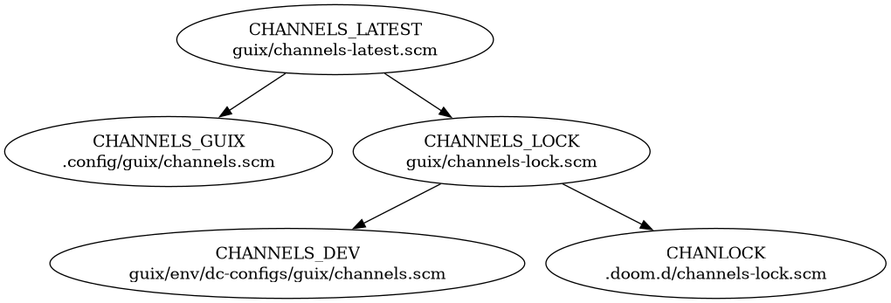

:PROPERTIES:
:ID:       04edaf13-4321-4337-a65b-3d661c3153d3
:END:
#+title: Guix On NixOS: Building VMs And Trying To Start QEMU With A Serial Port
#+CATEGORY: streams
#+TAGS: recorded
#+PROPERTY: header-args+ :dir 20260904123456-guix_on_nixos_building_vms

* Roam
+ [[id:bc406527-0255-4d70-b620-82495ac5c8fe][Hyprland]]
+ [[id:fbf366f2-5c17-482b-ac7d-6dd130aa4d05][Arch]]
+ [[id:906f0085-c2ca-4037-a096-fc2a164fcf27][Arch: Omarchy Bin Scripts]]
+ [[id:fdaa094a-3254-4de3-bc98-df279219762f][Omarchy: Upgrade to Quattro]] (more notes here)

* Overall idea

Ideally i could find some way to flash/boot ESP32-like devices over the network
while ensuring that network connectivity transmits console/serial output for
early boot to an agent.

That would be a PoC for a type of workflow for complex devices: robot, smartcar,
satellite, etc -- which many such serial ports. The outputs from hardware (i2c,
SPI) could be multiplexed into a set of TCP sockets that expose those serial
ports over the network. A network boot is triggered, and debug logs for those
hardware components can be collected...

But idk. obviously virtualizing the hardware would be more appropriate, but it
can't really account for a lot of issues:

- Low power modes with alternate drivers/software
- Transitions between those modes
- Maintanence modes running alternate hardware/software profiles. e.g. the UEFI
  targets that windows cycles through when you first install or perform
  maintanence tasks... but for more complicated devices)

* Outline
** Inbox
Outline (didn't exactly follow this)

** Learning

... This happened after the stream (lol)

** Scripting

These are the scripts I was trying to run during the stream

* Inbox

** Guix
*** TODO [#A] demo updating guix & emacs

mention latex build

+ [ ] NDI source from laptop
  - ensure guix-publish does not bind on wifi ... (this is wrong)
  - one of these will fail: either NDI or guix publish...
+ [ ] desktop: update guix channels with =make pull=, explain
  - add stuff to git, push. then pull from laptop.
  - demo =make ares=, then bump =channels-dev.scm=
+ [ ] desktop: =guix copy --to=laptop= new channels
+ [ ] laptop: no change in =guix describe= generation count
  - run update with =make up= (pulls to channels-lock.scm)
  - diff =guix describe= again
+ [ ] desktop: =cd .doom.d && make .guix-profile=
  - probably pulls LaTeX. if it does, wait...
+ [ ] desktop: =doom up=
+ [ ] laptop: =cd .doom.d && make .guix-profile=
  - check =guix describe= first
  - if it starts pulling, run =guix a

*** TODO diffing state

+ needed to patch =/etc/security/pam_env.conf= so the user's =guix= runs
  - instead of =guix= built from source =/usr/local/bin/guix=
  - and so =guix copy= also modifies store as expected (some weird things can
    happen otherwise)

#+begin_src shell :dir "~/.dotfiles/.doom.d" :results output code :wrap example diff
p=$(pwd)
diff channels-lock.scm <(ssh kharis cat $p/channels-lock.scm)
#+end_src

Active channels

#+begin_src shell :dir "~/.dotfiles/.doom.d" :results output code :wrap example diff
diff <(ssh kharis guix describe --format=human) <(guix describe --format=human)
#+end_src

#+RESULTS:
#+begin_example diff
1,2c1,2
< Generation 25	Aug 26 2026 15:26:39	(current)
<   guix e42227e
---
> Generation 17	Jul 31 2026 03:21:54	(current)
>   guix 18e73c7
5c5
<     commit: e42227e1c7e7055e27cecada52ec801a75e44909
---
>     commit: 18e73c792281e61c3813a99d662fbde108cf6ec8
14c14
<   nonguix c15e19c
---
>   nonguix 73baab3
17,18c17,18
<     commit: c15e19cdbdfdfddacdae865741809af4fa86a665
<   rde 47fb718
---
>     commit: 73baab37361b3a81f326aa3fdec78840f5acc577
>   rde 70a1881
21c21
<     commit: 47fb718f2b1a3f68a03c51a2740c1ada4052bd3c
---
>     commit: 70a1881f09c939792eb2ed932dded1f16291a59f
#+end_example

*** Channels update flow

#+begin_src dot :results output file :file channels.png
digraph G {
    // channel spec to reference when moving pins forwards
    CHANNELS_LATEST[label="CHANNELS_LATEST\nguix/channels-latest.scm"]

    // guix reads this when it needs a channelspec (could be symlink, but messy)
    CHANNELS_GUIX[label="CHANNELS_GUIX\n.config/guix/channels.scm"]

    // pinned for guix: to keep guix channels in sync across machines
    CHANNELS_LOCK[label="CHANNELS_LOCK\nguix/channels-lock.scm"]

    // ares-profile: must source this as a scheme module
    CHANNELS_DEV[label="CHANNELS_DEV\nguix/env/dc-configs/guix/channels.scm"]

    // pinned for emacs (GUIXTM is unused to launch emacs for now)
    CHANLOCK[label="CHANLOCK\n.doom.d/channels-lock.scm"]

    CHANNELS_LATEST -> {CHANNELS_GUIX,CHANNELS_LOCK}
    CHANNELS_LOCK -> {CHANNELS_DEV,CHANLOCK}
}
#+end_src

#+RESULTS:

+ trying to move to file-based targets
  - =$(CHANNELS_LOCK).lock $(CHANNELS_DEV).lock: $(CHANNELS_GUIX)=
  - so some of the makefile code is in-between
+ file-based targets =.lock= record the timestamp of the last change while
  allowing guix to manage the profile symlink (which doesn't really have a
  timestamp for =make=)
+ a few issues like that. this isn't how you'd keep track of channels deployed
  to servers.

* Learning

#+begin_src emacs-lisp
;; ... can't use vars for org-babel's :session params

(setq-local dc/ob-bash-session (format "*BASH-%s-SESSION*" (dc/org-roam-get-slug)))
;; (setq guix-session-qemu (format "*GUIX-%s-SESSION*" (dc/org-roam-get-slug)))
#+end_src

Start an async bash session

#+begin_src shell :session (identity dc/ob-bash-session) :async yes
# echo $(basename $(dirname $PWD))
#+end_src

** =$qemuscript=

Given the script in =$qemuscript=

#+begin_src shell :results silent :session (identity dc/ob-bash-session) :async yes :cache no
# this is the image to build
guixcheckout="$HOME/forge/guix/guix"
adhoc="$HOME/.dotfiles/guix/adhoc"
chan="$HOME/.dotfiles/guix/dc"
usbgpg_vm="$adhoc/isos/usb-gpg-vm.scm"
usbgpg_iso="$chan/systems/images/usb-gpg-tools.scm"
guixvm_example="$guixcheckout/gnu/system/examples/vm-image.tmpl"
#+end_src

this builds it. if it suceeds, it outputs the path to a script to run

#+name: vmExampleOut
#+begin_src shell :session (identity dc/ob-bash-session) :cache yes :async yes
# qemuscript=$(guix system -L $chan vm "$vmspec")
# echo $qemuscript

guix system -L $chan vm "$guixvm_example" 2>/dev/null
#+end_src

#+RESULTS[4d8ceef93678b0a46e1b4bdd7fc03334af9bfff9]: vmExampleOut
: /gnu/store/kclbk89lz0md9rr74gy5vpc3xg81z54l-run-vm.sh

Building the actual disk image is always the last step and usually one of the
longest. If the image is minimal, everything else is fast.

What's it do?

#+begin_src shell :var qrun=vmExampleOut :results output code :wrap example shell
cat $qrun | sed -e 's/ -/ \\\n   -/g'
#+end_src

#+RESULTS:
#+begin_example shell
#!/gnu/store/vhkg4avy9zf0kj70dcsmfpymnllkjq1y-bash-5.2.37/bin/sh
exec /gnu/store/vwrwmcs3593ki79rxc4iyh3kpl5qyzza-qemu-10.2.1/bin/qemu-system-x86_64 \
   -kernel /gnu/store/sj7dsxn3jkmrlmwn1bhdx6k4vgya4kpl-linux-libre-7.1.8/bzImage \
   -initrd /gnu/store/jd71lhg50jc0ykf0a60gv9zk3bk2jmn0-system/initrd \
   -append "root=/dev/vda1 gnu.system=/gnu/store/jd71lhg50jc0ykf0a60gv9zk3bk2jmn0-system gnu.load=/gnu/store/jd71lhg50jc0ykf0a60gv9zk3bk2jmn0-system/boot modprobe.blacklist=usbmouse,usbkbd quiet" \
   -object rng-random,filename=/dev/urandom,id=guix-vm-rng \
   -device virtio-rng-pci,rng=guix-vm-rng \
   -virtfs local,path=/gnu/store,security_model=none,mount_tag=TAGjoptajej2oynju6yvboauz7pl6uj \
   -drive file=/gnu/store/k2j1ild5gisf6409m9g4z39rn2n1x2zz-disk-image,format=raw,if=virtio,cache=writeback,werror=report,readonly=on \
   -m  512 "$@"
#+end_example

Launch directly to the terminal's =/dev/pty/n= with:

#+begin_src shell :eval never
# I got the main vm-image.tmpl working with serial output. 
/bin/sh -c "$qrun -nographic -append 'noquiet console=ttyS0'"
#+end_src

+ the =-append= arg adds some extra kernel cmdline flags, which need to agree with
  what the =$vmspec= set in the guix system (they probably override, but idk)
+ multiple console kernel args will duplex the boot output AFAIK
+ the console arg also needs to agree with =agetty= and other CLI flags

If you screwed up the boot, you'll hit a guile shell e.g.

+ booting from =/dev/sda= instead of the QEMU =/dev/vda=. This only needs to rebuild
  the bootloader image, so it's fast.
+ or specifying a non-existant console.

Note that =$qemuscript= will `exec` ... so you probably don't want to run it in
the wrong context, since that will eat the controlling shell/term

+ exit with =C-a x=
+ reset the terminal using ~alias shitbin='echo -e "\033c"'~ which is short for
  ~!@#$ that was binary~ and kinda fixes everything.

#+begin_src shell
# the usb-gpg-vm.scm image is also working, if i use no -append
/bin/sh -c "$qemuscript -nographic" # -append 'noquiet console=ttyS0'"
#+end_src

So, officially, you can't specify the same value for =console= twice. Most kernel
args will accept the last value (it does what makes sense: the earlier value
allows for automated scripts to specify default values)

*** Help from LLM

**** Serial configuration for headless qemu

Starting from the original qemu launch script via [[https://codeberg.org/guix/guix/src/master/gnu/system/examples/vm-image.tmpl#L40-L57][vm-image.tmpl]] (links to
relavant bootloader config in the image)

#+begin_src shell :var qrun=vmExampleOut :results output code :wrap example shell
cat $qrun | sed -e 's/ -/ \\\n   -/g'
#+end_src

#+RESULTS:
#+begin_example shell
#!/gnu/store/vhkg4avy9zf0kj70dcsmfpymnllkjq1y-bash-5.2.37/bin/sh
exec /gnu/store/vwrwmcs3593ki79rxc4iyh3kpl5qyzza-qemu-10.2.1/bin/qemu-system-x86_64 \
   -kernel /gnu/store/sj7dsxn3jkmrlmwn1bhdx6k4vgya4kpl-linux-libre-7.1.8/bzImage \
   -initrd /gnu/store/jd71lhg50jc0ykf0a60gv9zk3bk2jmn0-system/initrd \
   -append "root=/dev/vda1 gnu.system=/gnu/store/jd71lhg50jc0ykf0a60gv9zk3bk2jmn0-system gnu.load=/gnu/store/jd71lhg50jc0ykf0a60gv9zk3bk2jmn0-system/boot modprobe.blacklist=usbmouse,usbkbd quiet" \
   -object rng-random,filename=/dev/urandom,id=guix-vm-rng \
   -device virtio-rng-pci,rng=guix-vm-rng \
   -virtfs local,path=/gnu/store,security_model=none,mount_tag=TAGjoptajej2oynju6yvboauz7pl6uj \
   -drive file=/gnu/store/k2j1ild5gisf6409m9g4z39rn2n1x2zz-disk-image,format=raw,if=virtio,cache=writeback,werror=report,readonly=on \
   -m  512 "$@"
#+end_example

***** Capture to =stdout= in the current terminal

I basically just need =-nographic=.

I also need to ensure that =-append noquiet= is added to the =qemu-system=
invocation or the guix OS spec.

#+begin_src shell :results output code :wrap example diff
diff qemu{0,1}
#+end_src

#+RESULTS:
#+begin_example diff
5c5,6
<    -append "root=/dev/vda1 gnu.system=/gnu/store/jd71lhg50jc0ykf0a60gv9zk3bk2jmn0-system gnu.load=/gnu/store/jd71lhg50jc0ykf0a60gv9zk3bk2jmn0-system/boot modprobe.blacklist=usbmouse,usbkbd quiet" \
---
>    -append "root=/dev/vda1 gnu.system=/gnu/store/jd71lhg50jc0ykf0a60gv9zk3bk2jmn0-system gnu.load=/gnu/store/jd71lhg50jc0ykf0a60gv9zk3bk2jmn0-system/boot modprobe.blacklist=usbmouse,usbkbd noquiet console=ttyS0" \
>    -nographic \
#+end_example

***** Route virtual serial port explicitly using -chardev stdio

+ -chardev stdio,id=char0,signal=on :: defines standard i/o as a chardev
  - Set =signal=off= to pass key combinations directly to the guest (instead of
    signalling to the controlling qemu process)
+ -serial chardev:char0 :: Attaches =char0= to virt. serial port
  - -device isa-serial,chardev=char0 :: alternatively, instantiate a virtual
    device inside the guest.

The above =-chardev= config needs to be paired with an allocated device (either
=-serial= or =-device=)

#+begin_src shell :results output code :wrap example diff
diff qemu{1,2}
#+end_src

#+RESULTS:
#+begin_example diff
1d0
< #!/gnu/store/vhkg4avy9zf0kj70dcsmfpymnllkjq1y-bash-5.2.37/bin/sh
6c5,7
<    -nographic \
---
>    -chardev stdio,id=char0,signal=on \
>    -serial chardev:char0 \
>    -display none \
11a13
> 
#+end_example

***** Redirect to Unix domain socket

You would connect with socat like:

#+begin_src shell :eval never
if [[ -S /tmp/qemu-serial.sock ]]; then
    socat -,raw,echo=0 UNIX-CONNECT:/tmp/qemu-serial.sock \
else
    echo "fdskfljdsakl;"
fi
#+end_src

To connect with =tmux= or =screen=:

#+begin_src shell :eval never
tmux new-session -s qemu-console "socat -,raw,echo=0 UNIX-CONNECT:/tmp/qemu-serial.sock"

screen -S qemu-console socat -,raw,echo=0 UNIX-CONNECT:/tmp/qemu-serial.sock
#+end_src

#+begin_src shell :results output code :wrap example diff
diff qemu{2,3}
#+end_src

#+RESULTS:
#+begin_example diff
5c5
<    -chardev stdio,id=char0,signal=on \
---
>    -chardev socket,id=char0,path=/tmp/qemu-serial.sock,server=on,wait=off \
13d12
< 
#+end_example

**** When to use =-display none= and =-nographic=

+ -display none :: an alternate means of disabling display.
  - when explicitly creating the serial devices above, it makes more sense to
    use =-display none=
  - Ordinarily, silences boot's console output (you just get login at agetty)
  - With serial/device mapping, still get the console output.... while also
    being able to pull from the host's side of the console output with other
    tools (screen/tmux)
+ -nographic :: also disables display, but the options differ in how the host
  terminal is able to connect to serial/parallel ports
  - =-nographic= multiplexes the qemu monitor control signals, using =C-a= as a
    prefix.

|-----------------------------------------------------------+------------------------------------------|
| ~-display none~                                             | ~-nographic~                             |
|-----------------------------------------------------------+------------------------------------------|
| Managing VM over a network (via SSH/VNC; req other flags) | QEMU is headless in text-only SSH term |
| Want host term (no want boot logs)                        | Guest OS outputs to =console=ttyS0=   |
| Scripting a background VM daemon                          |                                        |
|-----------------------------------------------------------+----------------------------------------|

***** LLM :urlllm:crypt:
:PROPERTIES:
:CRYPTKEY: David Conner <aionfork@gmail.com>
:END:

-----BEGIN PGP MESSAGE-----

hQIMAz05LBTqCkO0AQ//W1hkmvdPa7Wfy2IoCZxe6s2MEL5LHfo/5e22CkHHwo97
S/mtxvopXXX5fdYBxaNDH5V0aZb+nTLxZbqTM+U2sRRjq/Ffew9cshMRInnbiRTb
L99u5Vuup2SaeTSPR0xBL/4F/k40EdhBx35bUc/qLxS3q9DKH+OWmRRAjDMnYhGv
OgtT9OgP0jdc8xS2fCBRvIhbnh5kgwG0Vxt4ZdtUmh1IUMa/4miNxuclT2s3B34Z
df0SaH19dwc6K3oU+bvG05x6XRyM6iTAIFw7YCgxAPSKO6ygEf7WwfkLasFWgz8J
7Cf1nUHIp860LKoi2Z/vbcgHlP+o1/sn73j3OPQgPTN3bQRgprk5a/lvvlmkw/ZT
r/wO+6mUlj+6iqsPM2HthqwF8AZjHEeQ6aqO/ilfbGHFVcPkkE5Cf4++m+kLIt5k
Pbv/+4sHT/abqYwjXFFeGXVA50I5LnXdEuGfaTWlFmZTjyX8AXgCiHHYVlw+lfKv
aiI2LHzoj96m7vwcoFrHoxQTLyeSJdrhMIkugnY80ESIZUIgy32PweHINCeAvk6x
ZxANXQ1GQ7dILTZ7Fyo8nPyX8n0GrZXYI7IQd94OshMxzBWzhMjRr99ju2zmTvnw
dMm/6dc5ffu3+PWaI6lPyTMcPGHpsRJ1dm6YzjDmBhZky7N6CXnd0TqYwTwORrPS
6QGN1l1NzIWusk/l0LPzBLlx7hiL3S+GVN3/FnU2/8WAmbzKk+UcQoQXR+kc69Ac
7Dd2rxro/5hvCG42lq0eWoNwXqoGwoafQ0sCBhTbEo1aIow6WdQH1eQ6pjux8qY+
btLS4jU2Xz1jt52r4AGHxuhnFaCGiQOVdiPdTeNC6msbyE5poPGxeAxYe7aRU7sa
C+UdjP+rpucn3z1YBlY17LdxuFC/pP2kPCKq9AKW0Me2g9k0Q9nlR0KiClzJmiwA
WVOFgAAsLdjux2W27sA0It9b+lMCerU+HckkF+wtHltPK6hbuYzroYpGsYFdLrlT
DQC/ZiDN55z2aKGoBO5a5AL/2+J90qqo/YHnh1FrYxm8F7xeZhsep17fwk5l39WT
rZD+NqleJtg6de3k/XEn468RsNxZlSSNxx5wRY0+VzjODW7322vHArd/KYd0O8YS
JLIgAQgEyhZXewX56AAoPy3aZQ1r4/7geJUegMuFR7fcek8grzv8f3QOCk1spIMv
rF5/em2wjSZpnJnjFCi5ujMI578j5xw5YeHOssJWZFHidUjyjSxvoztF9EenvZqr
EQ4eAu1Tbk3b8la4E4m8WyiBGK4pYC4ueZzqWWTQ91FnQWI+dOkeVmI3xoWwKeI9
zZgwOQ2CX7CuVt8jZIlZJOgAIBGJsuaoODn/U8pQuj8kwGXikxn/p3MwM7ro8C4W
4pYnnINAgBds/igXUt/kdZ/wNHIni5iJ+Xm0wyp1wjDuUeSlYIPFNZI6TPEBAe1q
3J5LsYER7ru6ORBWMmF1HD2u51pdD5rKrbUiUzB0O4rQez/dBK9mWirPdEvcNMJy
4Q7mghZp/cDq1040pIWE3KHAaLCf4IOUiLzWEitpyJwkjomzBMNmYKGZKYpJTq2e
QEIQfZTWjKsqgzG52J1pnecvdbzJWf3m8L6TRoas6k1LSrL/CirfEQI99BBbuQ9U
fieHCrfB/4fSKmtQ+LiO4ouN5ToiVZIDJkD6luWKnbpgd7sdAKZhvO8WKOhNrulK
8yqiX5MyZGPDA0+HzjQ+Nmth1LUOjnkwKD3lSe0Fc4fyK7wl6kAP7g==
=OJV3
-----END PGP MESSAGE-----

**** Specifying channels

Since the following is in =vm-image.tmpl= for convenience, this configuration specifies that the initial channels in the VM should use the
host's =(current-guix)=.

#+begin_example scheme
(guix-service-type config =>
 (guix-configuration
  (inherit config)
  (guix (current-guix))))
#+end_example

+ Since the host's =/gnu/store= gets shared inside the VM, this is efficient.
+ Changing this could require more builds than necessary inside the VM (after it
  initializes)
+ Changes could affect the reproducibility, depending on how the channels are
  specified. (i can't remember what guix =channels= would get installed if it
  wasn't specified)
**** Fixing the USB GPG Image

The parameters are slightly different

#+name: vmGpgOut
#+begin_src shell :session (identity dc/ob-bash-session) :cache yes :async yes
# qemuscript=$(guix system -L $chan vm "$vmspec")
# echo $qemuscript

guix system -L $chan vm "$guixvm_example" 2>/dev/null
#+end_src

** Omarchy's harness

+ Loads data in using a file system labeled =cidata=: [[https://github.com/omacom/omarchy-iso/blob/quattro/test/unit/cidata-load-test.sh][cidata-load-test.sh]]
+ To be able to test my nixos system, I'd need a custom system installed to a
  qemu image, then [[https://github.com/omacom/omarchy-iso/blob/quattro/bin/omarchy-iso-test][omarchy-iso-test]] needs the =--reuse-base= flag

From [[https://github.com/omacom/omarchy-iso/blob/quattro/bin/omarchy-iso-test#L201-L229][bin/omarchy-iso-test]] qemu harness

#+begin_src shell :eval never
start_vm() {
  local disk="$1" serial="$2"
  shift 2

  # A viewer that resizes the guest display breaks the console driving: OCR
  # cannot read the shrunken font, and a resize during early boot can wedge
  # virtio-gpu before the system comes up.
  log "Watch (do not resize): vncviewer -RemoteResize=0 127.0.0.1:5905"

  qemu-system-x86_64 \
    -cpu host -enable-kvm -machine q35,accel=kvm \
    -smp "$(nproc)" \
    -m "$MEMORY" \
    -drive if=pflash,format=raw,readonly=on,file="$OVMF_CODE" \
    -drive if=pflash,format=raw,file="$BASE_OVMF" \
    -drive file="$disk",format=qcow2,if=none,id=drive0 \
    -device virtio-blk-pci,drive=drive0,bootindex=1 \
    -device virtio-vga \
    -display none \
    -vnc 127.0.0.1:5 \
    -usb -device usb-tablet \
    -netdev user,id=net0,hostfwd=tcp:127.0.0.1:$SSH_PORT-:22 \
    -device virtio-net-pci,netdev=net0 \
    -qmp "unix:$QMP_SOCK,server,nowait" \
    -serial "file:$serial" \
    -pidfile "$PIDFILE" \
    -daemonize \
    "$@"
}
#+end_src

It just sets =-serial "file:$serial"=

#+begin_src shell :eval never
# in install_phase()
qemu-img create -f qcow2 -b "$BASE_DISK" -F qcow2 "$RUN_DIR/run.qcow2" >/dev/null
start_vm "$RUN_DIR/run.qcow2" "$RUN_DIR/serial.log"

# in acceptance_phase()
qemu-img create -f qcow2 -b "$BASE_DISK" -F qcow2 "$RUN_DIR/run.qcow2" >/dev/null
start_vm "$RUN_DIR/run.qcow2" "$RUN_DIR/serial.log"
#+end_src

* Scripting

** Generate air-gapped GPG

*** ISO

#+begin_src shell :eval never
make -C ~/.dotfiles/guix iso-gpg
# guixexpr="(@ (dc system images usb-gpg-tools) usb-gpg-tools)"
# guix system -L /home/dc/.dotfiles/guix/dc image \
#  --image-type=iso9660 -e "$guixexpr"
#+end_src

*** VM

**** example template

#+begin_src shell :eval never
guixcheckout=~/forge/guix/guix
imagespec="$guixcheckout/gnu/system/examples/vm-image.tmpl"
guix system vm "$imagespec"
#+end_src

#+begin_src shell :results output code :wrap example shell
cat /gnu/store/kclbk89lz0md9rr74gy5vpc3xg81z54l-run-vm.sh | sed -e 's/ -/ \\\n   -/g'
#+end_src

#+RESULTS:
#+begin_example shell
#!/gnu/store/vhkg4avy9zf0kj70dcsmfpymnllkjq1y-bash-5.2.37/bin/sh
exec /gnu/store/vwrwmcs3593ki79rxc4iyh3kpl5qyzza-qemu-10.2.1/bin/qemu-system-x86_64 \
   -kernel /gnu/store/sj7dsxn3jkmrlmwn1bhdx6k4vgya4kpl-linux-libre-7.1.8/bzImage \
   -initrd /gnu/store/jd71lhg50jc0ykf0a60gv9zk3bk2jmn0-system/initrd \
   -append "root=/dev/vda1 gnu.system=/gnu/store/jd71lhg50jc0ykf0a60gv9zk3bk2jmn0-system gnu.load=/gnu/store/jd71lhg50jc0ykf0a60gv9zk3bk2jmn0-system/boot modprobe.blacklist=usbmouse,usbkbd quiet" \
   -object rng-random,filename=/dev/urandom,id=guix-vm-rng \
   -device virtio-rng-pci,rng=guix-vm-rng \
   -virtfs local,path=/gnu/store,security_model=none,mount_tag=TAGjoptajej2oynju6yvboauz7pl6uj \
   -drive file=/gnu/store/k2j1ild5gisf6409m9g4z39rn2n1x2zz-disk-image,format=raw,if=virtio,cache=writeback,werror=report,readonly=on \
   -m  512 "$@"
#+end_example

**** Connecting to a serial device

From google... Should suppress the graphical interface

| -nographic            | suppresses launch |
| -chardev pty,id=char0 |                   |
| -serial chardev:char0 |                   |

To troubleshoot the serial parameters & baud rate... this is awesome bc you're
otherwise bumbling around in the dark. the host device needs to control access
to the =/dev/pty/X= though (doesn't work over the network AFAI)

#+begin_src shell :results output
# /gnu/store/kclbk89lz0md9rr74gy5vpc3xg81z54l-run-vm.sh
# /gnu/store/9v2a07hx0zbj6160ix5rjwrcdvx7mjb9-run-vm.sh
#   -nographic -chardev pty,id=char0 -serial chardev:char0
stty -F /dev/pts/9 -a
#+end_src

#+RESULTS:
#+begin_example
speed 38400 baud; rows 0; columns 0; line = 0;
intr = ^C; quit = ^\; erase = ^?; kill = ^U; eof = ^D; eol = <undef>;
eol2 = <undef>; swtch = <undef>; start = ^Q; stop = ^S; susp = ^Z; rprnt = ^R;
werase = ^W; lnext = ^V; discard = ^O; min = 1; time = 0;
-parenb -parodd -cmspar cs8 -hupcl -cstopb cread -clocal -crtscts
-ignbrk -brkint -ignpar -parmrk -inpck -istrip -inlcr -igncr -icrnl -ixon -ixoff
-iuclc -ixany -imaxbel -iutf8
-opost -olcuc -ocrnl onlcr -onocr -onlret -ofill -ofdel nl0 cr0 tab0 bs0 vt0 ff0
-isig -icanon -iexten -echo echoe echok -echonl -noflsh -xcase -tostop -echoprt
echoctl echoke -flusho -extproc
#+end_example

**** Modify kernel cmdline options

To modify the cmdline flags, add =-append console=ttyS0,115200n8= to =run-vm.sh=

... which doesn't seem to work on this VM.

**** Issues with =grub-efi-bootloader=

must use =guix image= otherwise building a UEFI VM is non-trivial

+ the =guix vm= qemu launcher script needs to find host =ovmf= firmware.
+ =(firmware (list ovmf-x86-64))= isn't sufficient

See: [[https://codeberg.org/guix/guix/src/commit/4de2d5f68f630e9a22ba206644449993da4cf45f/gnu/system/image.scm#L598-L603][gnu/system/image.scm]] And trace through references to =(uefi-firmware system)=
in [[https://codeberg.org/guix/guix/src/commit/4de2d5f68f630e9a22ba206644449993da4cf45f/gnu/tests/install.scm#L213-L222][install.scm]]

**** Building the GPG VM

#+begin_src shell
vmspec=~/.dotfiles/guix/adhoc/isos/usb-gpg-iso.scm
guix system -L /home/dc/.dotfiles/guix/dc vm "$vmspec"
#+end_src

** Diffing generations

*** Generations of the user's =~/.doom.d/.guix-profile=

#+begin_src shell :dir "~/.dotfiles/.doom.d" :results output code :wrap example diff
diff <(ssh kharis guix describe -p ~/.doom.d/.guix-profile --format=human) \
    <(guix describe -p ~/.doom.d/.guix-profile --format=human)
#+end_src

#+RESULTS:
#+begin_example diff
1c1
< Generation 1	Jul 05 2026 17:38:52	(current)
---
> Generation 29	Sep 02 2026 19:52:46	(current)
#+end_example

*** Generations of the user's =~/.config/guix/current=

#+begin_src shell :dir "~/.dotfiles/.doom.d" :results output code :wrap example diff
diff <(ssh kharis guix describe --format=human) <(guix describe --format=human)
#+end_src

#+RESULTS:
#+begin_example diff
1,2c1,2
< Generation 17	Jul 31 2026 03:21:54	(current)
<   guix 18e73c7
---
> Generation 25	Aug 26 2026 15:26:39	(current)
>   guix e42227e
5c5
<     commit: 18e73c792281e61c3813a99d662fbde108cf6ec8
---
>     commit: e42227e1c7e7055e27cecada52ec801a75e44909
14c14
<   nonguix 73baab3
---
>   nonguix c15e19c
17,18c17,18
<     commit: 73baab37361b3a81f326aa3fdec78840f5acc577
<   rde 70a1881
---
>     commit: c15e19cdbdfdfddacdae865741809af4fa86a665
>   rde 47fb718
21c21
<     commit: 70a1881f09c939792eb2ed932dded1f16291a59f
---
>     commit: 47fb718f2b1a3f68a03c51a2740c1ada4052bd3c
#+end_example

**** null result

#+begin_src shell :dir "~/.dotfiles/.doom.d" :results output code :wrap example diff
# diff <(ssh kharis guix describe -p ~/.dotfiles/guix/.guix-profile-dev --format=human) \
#     <(guix describe -p ~/.dotfiles/guix/.guix-profile-dev --format=human)
guix describe -p ~/.dotfiles/guix/.guix-profile-dev --format=human
#+end_src

#+begin_src shell :dir "~/.dotfiles/.doom.d" :results output code :wrap example diff
diff <(ssh kharis guix describe -p ~/.dotfiles/guix/.guix-profile-dev --format=human) \
    <(guix describe -p ~/.dotfiles/guix/.guix-profile-dev --format=human)
#+end_src

* Chapters

*** Markdown

+ 3:00 Fixing `org-refile` for the current workflow
+ 12:00 Using `guix describe` across ssh to diff profile generations
+ 22:00 Showing emacs configs containing OBS automation
+ 22:45 Editing files over ssh via tramp & preventing overwrites with `M-x revert-buffer`
+ 27:30 Problems with Syncthing and Git repos
+ 29:30 "There is no known network"
+ 33:30 BTRFS subvolume setup for Nix and Guix subvolumes
+ 42:00 Preventing Guix garbage collection with profiles & `guix time-machine`
+ 44:30 Building an image & QEMU launcher with `guix vm`
+ 48:30 Building an iso with `guix system image`
+ 58:30 Building a hyprland workspace for `QEMU`
+ 1:04:00 Launching `QEMU` viewer in that workspace
+ 1:08:00 Looking for examples of qemu automation
+ 1:12:00 A virtual serial port helps prep for iPXE workflows on bare metal
+ 1:18:00 Examples of bootloader build logic in the Guix codebase
+ 1:23:00 Comparing "systems vs programmer" perspectives as "top-down" vs "bottom-up"
+ 1:30:00 Launching an repl from an impure guix time-machine profile
+ 1:35:00 Moving the GPG ISO to an adhoc guile script
+ 1:41:00 The VM shares derivations with the host
+ 1:47:50 Trying to get headless QEMU output in the terminal
+ 1:51:30 stty and qemu-system-x86_64 -h
+ 2:09:00 Reviewing guix-infect.scm which converts debian to Guix on Hetzner cloud
+ 2:22:00 How isolation constricts variety of experience
+ 2:26:00 Combinatorial Explosion and Steering AI
+ 2:31:15 Guix VM doesn't work with grub-efi-bootloader. Only guix system image
+ 2:32:45 SOPS, X.509, distributing private trust
+ 2:37:00 Reviewing old design docs for a spark cluster
+ 2:44:30 Worksheets I made to help facilitate conversations, but never got help
+ 2:59:30 Lack of confidence in talking heads & in society's ability to deal with nihilism
+ 3:04:30 Are certain legal concepts fundamental & permenant? e.g. copyright, legal personhood, property rights
+ 3:08:45 Oedipus and Anti-Oedipus; Persisting meaningful change in society
+ 3:14:00 Politics can't fix everything. Why laws are difficult to design
+ 3:17:45 Too much change too fast always destabalizes, but high-magnitude change is certain
