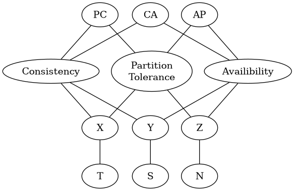

:PROPERTIES:
:ID:       cea7d11c-8357-4e4f-90b3-fa8210eff796
:END:
#+title: AI

* Docs

* Resources

* Communities
+ [[https://ai.science/][AI.science]] (slack)

* Ideas
** Thought Experiments
*** Sending a small embodied LLMs to an alien planet via a stargate

With the LLM travels through the stargate, it

+ Takes a one way trip where communication is im/possible
  - But you would know the result in the end and failure is a problem
+ Or has some simple constraints on its ability to check back in
+ Or whatever is useful for consideration

The "bandwidth" of the stargate is small, so the size of the model needs to be
optimal (otherwise the stargate will make dialup sounds for a very long time...
the point here is that there isn't a maximum amount of data that can be sent,
but larger is worse for reasons more complicated than simply time/cost)

The point is to imagine culling away all the useless "Earth-bound" information
that's either irrelevant or problematic when interacting with an alien culture
and its biosphere, while retaining only the "pure intelligence" that allows it
to magically one-shot every interaction it has (without being an asshole to
these aliens)

Examples of problems it could encounter if not trained properly:

+ It responds to alien dialogue with quotes from Tolstoy and offends them for
  some reason and it fails.
+ It can't adapt to a hospitable biosphere quickly enough or attain stability
+ It doesn't learn their culture quickly enough or well enough to connect the
  dots between its internalized "universal knowledge/understanding" with aspects
  of their technology/culture/challenges
  - this knowledge may need to be encoded in some translingual way like the
    voyager engravings

Some questions:

+ How do you produce this embodied LLM? How do you train it, then remove the
  possibility of residual linguistic information causing issues? Without losing
  the utility of the encoded information? 
+ In particular, how large is the smallest representation of this LLM? (a
  version which satisfies some threshold standard candle of optimal behavior)

In other words, we could imagine some "platonic representation model devoid of
some/all effects of language" or without the need for language to function as a
means of "connecting things together in the model".

#+begin_quote
Such a model probably doesn't exist ... or maybe it does, but probably comes
with some weird side effects. technically, with the correct input prompt and
C/C++ program, a CPU program could output any string you want. but that "model"
doesn't include the programs that run: it would need a database for komolgorov
string selection & execution; intractible & probably more difficult to compress
than you'd think
#+end_quote

And for other LLMs/models which will not go through a stargate...

+ Consider the size of the abstract mathematical information bits that produce a
  network capable of exhibiting some standard of behavior/quality. How does
  this quantity of information relate to the size of the model?
+ What requires that the input information quantity (difficult to define) to
  increase for "better output"? When does this result in an increased model
  size? (assuming that you can magically produce a network with similar levels
  of behavior/quality)
  - i.e. how much benefit do you get from additional information/data during
    pre-training and how should you anticipate tuning the model's intended
    output size according to the selected input data? (without too many
    specifics, e.g. size of a CUDA threadblock or storage/bandwidth concerns for
    computing hardware used in pre/training)
+ Does a smarter culture producing better data also produce a better AI (without
  simply getting the AIs to train themselves)? The AIs may eventually want to
  consider this especially if, absent better data, it's determined that they
  can't produce improvement in future generations.

Humans produced culture/information mostly as side effects. e.g. a bit too
imaginative... but pythagorean triples were useful in babylon if you needed to
know how much tile to order or wanted to efficiently survey the land. latter is
probably more correct. (these are also useful for validating surveys or
determining whether some land changes in size for whatever reason)

Babylonians wanted more sophisticated records collection for taxes & economic
purposes. So solving problem with cultural technology resulted in selective
advantages, both for people genetically more likely to survive/reproduce (to
some extent) and for the "memes/behaviors" that adapted/disseminated. As a
technology, writing grew quickly as a solution to a problem, not because someone
imagined the possibility of recording Gilgamesh or a civilization that
eventually produced Plato. Imitating technologies/methods, then adapting their
usage solved other problems.

There are certain aspects of human existence which drove us to express our will
through in/action. So our sense of being and the particulars of how we
experience consciousness, along with biological constraints, caused us to _invent_
technologies. Quite often by accident (then by immitation or adaptation to a new
context).

+ But if AIs are missing some of these aspects, then will they continue to
  "improve" or invent things?
  - it's more likely that AIs will exhibit many modes of being/consciousness,
    whereas humans exhibit only a few.
+ In which directions would their development extrapolate?
  - Are there information theoretical limits? (too much data/time)
  - Ontological limitations? (not enough consciousness, not embodied so no
    reason to invent shoes to prevent stubbed toes, etc)

** CAP Theorum

The main point below is that not all AI-driven productivity is really
"productivity". It all creates change, but then knowing about that change or
created structures creates a need to manage that information in the future. The
combinatorics of namespaces are insanely large.

We all know that it's a bubble... Bubbles are not innately terrible though (only
when the terminally inflated bubble surprises people by suddenly popping).
Instead of blind accelerationistic productivity, we need more coordinated
efforts to ensure that allocated productivity potential creates
stability/utility. (btw: a world that somewhat dealt with this from the past has
it much easier than one trying to fix it from the future.

+ If the bubble were to pop, where are we left and how do we move forward?
+ If the bubble could be made more stable ... that would be accomplished by
  dealing with much of this anyways.

#+begin_quote
It would be more stable bc prices/speculation would tend to retain parity with
reality for longer. Business is about consensus on expectations (of
collaboration/partnerships, but also of economic intrinsics/externalities)
#+end_quote  

Not all "productivity" is "equal". So uses of LLM/Agents or created
infrastructure will be more _valuable_ than others and will justify the ongoing
upkeep cost they create in the future.

This creates a kind of "tragedy of the commons" where advanced functionality is
so simple to create that it's basically "free" ... but it creates future
operating expenses and demand for "capitalized improvements".

+ (1) Not only does the allocation of some "productivity potential" need to be
  justified by considering opportunity costs (when costs are "low-ish" and _not_
  predictable)..
+ (2) ... By "amortizing" across "non-fungible future upkeep costs" (you applied
  your tokens to create a fun project and now need to commit to servicing github
  issues & PRS)
+ (3) But also, at the larger systems level, this creates a tail-risk: there is
  a super-additive cost of computational complexity that expands much faster
  than the volume of programming langauge libraries and Agent/LLM-created
  services integrations. It's probably sub-additive for most Agent-driven
  projects, since you can cull these out (e.g. we only do CI/CD security
  scanning for X/Y/Z set of libraries/api's; we don't train LLM on those Github
  issues).

Above, I mean non-fungible as in "difficult to specify work whose requirements
are high-dimensional & require more executive functioning (or the equivalent for
networked computer systems)." So when planning to allocate resources (agents,
humans, etc), the opportunity costs and specific labor requirements are more
difficult to compare than, e.g., a cargo container ship deciding between
potential future contracts carrying different cargo to different locations.
There, the variables' relationships to each other are usually linear. Here,
deciding to apply productive capacity becomes generally more expensive (as if
your gasoline got less mileage even while your car became insanely efficient)

There's probably a better, more official economics term than "non-fungible", but
reasoning about the potential work itself could, in theory, later require much
more work. A parallel example: insanely fast PCs today seem slower, since a
consumer's iCloud/365 functionality dramatically increases random-disk access, a
huge tax on RAM tax, unpredictable I/O interrupts (unless cloud services are
tuned to wait for inactivity, etc)

*** Picking the wrong CAP letters
Someone can choose =C-A= or =A-P= or =P-C= for their services, but generally when you
actually have "CAP theorem problems", it's bc:

+ your architecture tries to combine the wrong =C-A= or =A-P= or =P-C= pieces together
  and thus doesn't achieve any =C-A-P= guarantees well
+ or you forgot to choose =C-A=, =A-P=, =P-C= ... or you didn't actually
  architect/implement the choice you had intended

In the context of LLM/Agents, if you consider the body of code, projects,
dependencies, integrations, etc... to all be one really one large shared
resource -- then introducing too much $\Delta C$ and $\Delta A$ and $\Delta P$
is pretty much guaranteed to create problems for anyone's architecture.

+ This depends on how essential it is for the entire system to have accurately
  reflected approximated of parts of itself referenced elsewhere in itself. See
  the quote block below

furthermore, different groups with different architectures/services can manage
their own =C-A-P= choices, but when those "Web 3.0" services integrate with
exponentially more "CAP-incompatible" services, it will inevitably fail.

Whether AI agents/services are a data set or a model or a LEAN-proven "contract"
for functionality -- or simply a magical egregore representing the "spirit of
networked intelligence manifested as productivity")... they still need to reason
about other AI agents/services.

#+begin_quote
As an example, say you're deploying a large AI agent typescript thingy to vercel
as a frontend to AI-backed service integrations, where:

+ AI needs to use "tools" and "skills" securely.
  - req. data about how to use which tools depends on inference (even if it can
    include RAG or LEAN or some other way of augmenting/validating).
  - req. data about how to match "tools" to correctly constructed environments
    to execute code (or fetch data)
+ and the data returned by your services will influence the behavior of other
  globally integrated AI/Agent services (i.e. there are "many-to-many-via-many"
  feedback loops)

The ability to adapt the functionality of these products -- in code or in SDN,
automation, sandboxing, etc -- depends on many components' specifications of
dependencies/etc. But accelerated change in data (loosely $\Delta C$) or
connectivity ($\Delta P$) will accelerate an accumulated need for consensus
mechanisms (e.g. how many downstream packages need to learn about a hotfix in a
shared dependency)

For each internetworked service/agent, its ability to validate the correctness
of what's doing may depend on:

+ enumeration/evaluation of efficiencies/optimality of some options. The same
  idea of "BGP selecting or distributing information about network paths" but
  applied to:
  + internetworked agents whose actions influence other agents (which they
    either know about or don't)
  + or agents who need to pentest a remote network (if it's been completely
    changed an hour later, why bother?)
+ version management of HTTP APIs or dependencies. in the terminology of
  Contract-driven Development, when the backends of these interfaces changes
  faster than information about the contracts (expectations of interactions),
  then even with version pinning or HTTP APIs with multiply deployed
  versions.... blah blah blah
  
In the extreme, you can't really know that the lego-bricks you're building with
aren't subtly changing them faster than snap them onto what you build.
#+end_quote

*** Semantics and Ontology in CAP theorem 

The ideas below need some work. In any case, thinking about this
"pseudo-ontology" helped me imagine various problems/etc that occur at a scale
much larger than some small set of services sharing an internet.

I have a wikipedia-level working knowledge of CAP Theorem... but i get the
feeling that the "semantics" of the =C-A-P= concepts in the math proof connect to
some lower-order primatives which also have a similar overlapping relationships
similar to the =C-A-P=. See graph below

#+begin_quote
I have some crazy handwritten notes that started as an attempt to enumerate most
strategies & data sources that could resolve ambiguity in IP Reputation (or
other global-scale network problems). This lead to me thinking about how
different entities need to react to other entities, based on what's known to
them. They would then need to communicate that. But...

+ ip routes are data. CAP guarantees about partitions require ensuring enough
  routes and enough bandwidth in the space between
+ ip addressing is a naming system (and also has DNS, a better naming system)...
  or maybe my semantics are wrong
+ data about network service names/infrastructure & their statuses are
  keyed/indexed by the DNS names (in SoA, but identity of services can be
  managed without DNS or in addition to it)
+ consistency requires reconciliation (over network paths; eventually, even in
  bitcoin)
#+end_quote

Again, the semantics of time/space/names is probably overly-reductive, but if i
flipped through a textbook on CAP theorem, I could probably spot the deeper
stuff and qualify the assertions more appropriately.

Remember, math does *not* really have a concept of semantics. In the proof's
definitions & methods relevant to those definitions, there is something
intrinsic to the "guarantee of consistency" which we translate as "consistency."
In reality. it's just a bunch of =LaTeX= and greek letters corresponding to logic.
We translate it as consistency. What fundamental problems does a non-consistent
architecture not solve and what semantic category does that correspond to.

#+begin_src dot :results file :file img/cap-theorem-ontology.png
graph CAP {
CA -- C,A
AP -- A,P
PC -- P,C
    
C[label="Consistency"]
A[label="Availibility"]
P[label="Partition\nTolerance"]
C -- X,Y
A -- Y,Z
P -- Z,X
X -- T
Y -- S
Z -- N
}
#+end_src

#+RESULTS:

#+begin_quote
Really (IMO) $C, A, P$ each correspond to problems intrinsic to two of $X, Y,
Z$, where those letters correspond to some "time, space, names" $T, S, N$: e.g.
something _like_:

+ distributed computation across logically distinct systems (writing a spark
  query to run on spark nodes) requires tracking _names_, the meanings of which
  must be distributed as data (space) that correspond to and each letter
  corresponds to aspects of
+ networking requires time bc deployments are physically separate. it also
  requires an addressing system (which seems like data, but it's really a naming
  system). since guaranteeing the benefits of any =C, A, or P= in system
  distributed across a network requires reasoning about the availability of a
  path to those nodes (or at least a strategy for availability), ....

Some code will need to change its behavior/implementation when "data that should
be consistent (C)"
#+end_quote

** Deepfakes

*** Using GPG/PIV + Smartcards for provenance

Other people have probably had this idea, but crypto is so hard to
teach/train. Here, it's not even the acronyms/algorithms (these can be mostly
transparent), but the handling instructions, backups and processes required to
ensure control over a digital identity that is managed with crypto. The gpg/piv
agent process must also be secured, but associating crypto identity to
provenance at least gives you someone to ask for validity of content.

GPG signing would be a great tool in spotting deepfakes, if identity is
associated. If enough people can validate a signature and the identity is
assumed to not be stolen (and can be revoked), then this should maybe be
sufficient once socially distributed -- i.e. implemented on social media where
the community can validate signatures of interest.  However, over-reliance on
this (i.e. too many people using it without sufficient precautions) probably
won't help.

In other words, if you produce a video/pic and you want to publish it, then the
primary distributor of the video signs it and adds it to metadata like EXIF or
something.  Either a device key (less trust, but easier to teach ... also
potentially creepy for surveillance) or a smartcard (preferable because it
requires voluntary action and discretion).

This may also help for certification (signing) of original digital
works for copyright protection and provenance.
** Dysnormalization

"dysnormalization", distinguished from a period of "rapid change in norms" as
it's a complete breakdown of norms to be perceptible/useful whatsoever.

The rate of social/cultural evolution increaese until until there's too much
variation between cohorts to for anyone to clearly distinguish generations.

For dysnormalization, imagine:

+ an infinite dimensional gaussian distribution used for likelihood estimation
+ where the gaussians parameters for each dimension (covariance matrix, etc)
  give particular distribution of measure s.t. most dimensions are
  imperceptible. (the entropy bits for those dims are high and it's not
  meaningful information)
+ and where the utility for prediction from each dimension allows a small subset
  of dimensions (< 100 or < 1000) to be rank-ordered in their capacity for
  prediction (of small-scale or large scale social interactions or economic
  conditions)
  - people have social consensus on "what people may think it means" if a sample
    falls in a particular value range for some subset of the gaussian's
    dimensions. and have a personal sense for what they individually think that
    sample's values convey (and predict)
+ now adjust the parameters for the distributions' dimensions, so that:
  - the entropy increases in the most predictive dimensions (the variance/etc
    spread out)
  - the entropy reduces dramatically in the previously inconsequential
    dimensions (the non-predictive dimensions with minimal utility)

There's a point where it's impossible for people to see any value whatsoever in
developing belief/feelings about social consensus at all. Minimal
predictive/explanatory value is provided by their own experiences and/or the
encountered/discussed experiences of others. So there's no point.

But people don't think in "gaussian distributions". Instead the brain/mind are
guided by them indirectly... as feelings or intuition. We instinctively seek to
explain "surprise" because it indicates the presence of information and may
explain cause/habit/etc. But if most everything is surprising all the time for
zero meaningful reasons (at least not for long enough to be worth
remembering/reflecting)... then life just kinda breaks down.

Crazy people have impaired intuition (and are often surprised by the wrong
signals). People perceive their behavior as strange/abnormal, even when it's
complex/subtle & even when difficult to articulate. The brain is constantly
predicting how situations will unfold & then adjusting to the ways (dimensions)
in which we perceive/feel our prediction varied. Whether the norms to compare
against are physiological, cognitive, emotional, social, cultural, etc, there's
some minimum consistency in extracted information that's required in order to
logically extrapolate ... otherwise all the fuzzy logic gets way too fuzzy.

Anyways, "dysnormalization" isn't post-modernism or demoralization ... instead
it affects individuals/groups in a cognitive or sociocognitive way.

** Topology of the Hyperplane

*** Amateur Go Player Beats Top Go AI With 100% Win Rate

Sources:

+ [[The HUGE Problem with ChatGPT]]
+ [[github:HumanCompatibleAI/go_attack][HumanCompatibleAI/go_attack]]
+ [[https://arxiv.org/abs/2211.00241][Adversarial Policies Beat Superhuman Go AIs]]

So basically, the AI is not aware of the topology of the hyperplane. This is why
the strategy to beat the AI involves ... the topology (or shape) of the
arrangement of Go pieces on the board.

Since the AI algorithms for Go utilize information compression to render the
game of Go tractible, then they are unlikely to be adapted to deal with this
without being augmented with another technique -- such as the algorithm attained
by the MIT researchers themselves.

**** This "Topological perspective" also explains LLM Jailbreaks

This also explains jailbreak techniques and why it's so difficult to guard
against them. Because it's difficult to define regions of the hyperplane so that
they are "convex" for some loose definition of the term, it's also difficult to
construct an XAI policy to wall those regions off. The structure of the
hyperplane for language-based models probably moreso resembles swiss cheese than
anything that can be "convexified".

That is, the regions of the hyperplane (or a LLM's state space, if I'm mincing
terminology) form a kind of labyrinth. Your interactions with it lead it down
various paths. The space represents language, conversation and interaction
state, Because of the connectedness of this space (it is Riemannian), then given
its n-dimensional holes, then there are no simple way to define XAI-based
semantic policy to prevent someone's interaction path from reaching certain
regions of the space -- not without significantly altering the behavior of the
AI.

Just like you can flip a convex function into a concave function you could
perhaps invert this behavior: simply define interaction paths starting from a
point within a boundary and limit the paths leaving that bounded
region. However, doing so will significantly alter the behavior of the AI. To
further confound this, it requires prohibitive levels of computation /and time
lag introduced from ML ops to update the LLM policies from XAI techniques./

And convexity/concavity are extremely complicated to define even in lower
n-dimensional Euclidean space (with or without the need for variational
methods). Here your topological concerns are mostly incidential to the functions
you're analyzing, not the connectedness of manifolds or the definition of
metrics to determine some arbitrary "increase/decrease." The definitions of
convexity here are based on derivation of functions or other tools -- anyways,
is a saddle point concave or convex? How about a local minima in a 9-D subspace
of an function on 11-D Euclidian space? It's totally convex in 9-D? What is it
then in 11-D? When this happens in Riemannian manifolds, it may create
wormhole-like structures: hence the "swiss" in the swiss cheese I menioned
above.

**** Thence:

[[https://te.xel.io/posts/2019-04-12-the-analytic-iching-a-novel-exegesis-for-the-age-of-data-science.html#the-algebraic-topology-of-hyperplanes][The Algebraic Topology of Hyperplanes … Donuts My Mind May Never Digest]] where I
describe the need for a "Gauss Bonnet Theorum" to analyze the structure of the
hyperplane and define such analysis as metacognition:

#+begin_quote
... reasoning about the topological features of the hyperplane corresponds to metacognition.
#+end_quote

From the bundle of crazy I wrote in 2019, [[https://te.xel.io/posts/2019-04-12-the-analytic-iching-a-novel-exegesis-for-the-age-of-data-science.html][The Analytic I Ching: A Novel Exegesis
In The Age of Data Science]].

... But then again, I'm not even allowed to exist. Or, at least, my name is not
showing up on TV or on some influencer's channels. And no, I didn't make it, but
once someone's life has been destroyed, network theory and social physics
implies that fixing it is a bit like escaping a black hole.

**** So I Opens the article from MIT

And what do you know: [[https://arxiv.org/pdf/2211.00241.pdf][they didn't cite me]]. I've only ever been cited for a 51/50
TDO (for short-term psychiatric care).

#+begin_quote
There are a number of situations that are known to be challenging for computer
Go players. Some can be countered through targeted modifications and additions
to the model archi- tecture or training, however, as we see with Cyclic
Topology, it is difficult to design and implement solutions one-by-one to fix
every possibility. Further, the weaknesses may be unknown or not clearly
understood – for instance, *Cyclic Topology* is normally rare, but through our
work we now know it can be produced consistently. Thus, it is critical to
develop algorithmic approaches for detecting weaknesses, and eventually for
fixing them
#+end_quote

Other failure modes include:

+ Ladders :: the phenomena ever beginner go player recognizes as the thing
  indicates a "problem." Democrats still haven't figured this one out. This is
  to some extent topological because, speaking in strategery of course, there
  really is an "edge" of the board.
+ Complicated Openings :: Hmmmm
+ Cyclic Topology :: The researchers seem to be real worried about the swiss
  cheese.
+ Mirror Go :: Symmetry? That's topology. It's possible that mirroring the AI's
  moves could actually glitch the AI and produce tactical gains from more than
  simply the change in the board.

** Art
*** IDEA ideas for Krita plugins in python

**** AI assisted drawing

a few ideas but mainly just keys to flip between your painting and
overlays/side-panels that help illustrate "what the AI thinks you're painting."
there are many ways to interpret that and many ways to use something like
this.

it's hard to say really, but what I'm thinking is that as you either give it
reference images or supply tags, perhaps with a dynamic tag cloud that can be
toggled to shift it's perception. as you lay enough strokes down , the
possibility space narrows down so that the AI can:

+ display various visualizations of the collapsed possibility space. this would
  probably be an overlay where the color channels are distorted where there is
  dissonance.

It would just wouldn't be what I'm thinking if it does the work for you. The
point is to get visual feedback? ... i donno. It also doesn't work well with
interpreting styles. The AI would also need to retain its state ... and yet it
needs to refresh its state or its apprehension/perception of what you're
drawing/making. i'm not sure you can program/condition a artificial mind that
can "hold on to" or "regain" its zen. not without resetting itself.

**** Hausdorf Space

.... great. Now, I've gotten on thinking about this.

Thinking about the present range of possibilities (potential volumes surrounding
cluster centroids) and comparing it with the future range of possibilities as
the network's state changes can benefit from the Hausdorf Metric on Reimanninan
manifolds. Given its current state (and path in the recent path), if the network
were to sample from its own parameter space to determine how its state will
evolve, it needs to measure the volume of a ball surrounding points of interest
(think functional analysis). The holes, curves, distances and directions in
high-dimensional Riemannian manifolds cause changes in the volume of the ball --
probability is like an incompressible fluid.

The purpose of developing a sense of this measure is to determine whether its
confidence in producing values is likely to change given new information. As you
begin to draw something, there is almost no information, the AI network's state
is very under-determined (or underfit, though this is not the models training
but its state). The possibility space is shaped by the features that channel
"probability fluids" motion. Considering the cluster centroids for image class
candidates that the AI considers reasonable, if the packets of fluid surrounding
these start to converge towards each other or dissipate entirely, it signifies
that a change in belief is necessary. The packets of fluid represent the the
"likelihood" volume under the probability curve.

To model this, you need to /something like/ their Hausdorff dimension calculated
pairwise (since it's a sum of pairwise products, it's very similar to tensor
contraction, but at a higher order than the polytopes in this paper ... which I
don't fully understand. It does nominally involve the Hausdorff space. It is
apropos, since it models a measure for predicting reasonable ranges for accuracy
that simple K-means clustering network will arrive at.

[[Neural Network Approximation based on Hausdorff distance of Tropical Zonotopes ]]
(2022)

#+begin_quote
Therefore, it is expected that two tropical polynomials with approximately equal
extended Newton polytopes should attain similar values. In fact, this serves as
the intuition for our theorem. The metric we use to define the distance between
extended Newton polytopes is the Hausdorff distance.
#+end_quote

Sudden motion of the probability fluid, even when it seems to move with
convergence, doesn't actually mean that the expected image class prediction at
that time will become the AI network's final belief. The less that's on the
paper, the more broadly the range of classes would need to be considered.

In other words, AI (or most any person) would need to counteract the tendency to
assume that what seems to be developing actually represents where things are
going (or what beliefs are reasonable, etc). The more that someone narrows their
mind to follow "the recent past as the best predictor", the more strongly that
"path through belief-space" itself shapes the beliefs they form in the end. This
sorta relates to the concept of "zen" as I understand it, since the more
information/experience our minds accumulate, the more engrained of an effect the
"default mode network" has in constructing the "constraints" we put on what we
believe to be...

Jeez, i guess you can really just hyphen-space anything now.

* Topics

** Psychology

*** Synthesis of Knowledge

Synthesis of knowledge is a skill that ChatGPT excels ... somewhat. While IBM
Watson did have some model for knowledge, it's hard to argue that /LLM/ actually
integrates knowledge beyond what the structure that's incidentally in it's
training text.

But synthesis doesn't benefit humans when it the side-effects of /the process of
synthesizing information/ are not not deeply integrated. While low-effort
processes giving shallow surface-level responses provide a useful map to explore
a new landscape of knowledge, the responses of AI are not, in and of themselves,
the "Guiding Principles" that Peirce illustrates in the Fixation of Belief. It
is also crucially important to ensure that the net result of your thought
manages to modify the internal structure of your own mind. 

The brain follows energy-minimalization laws not unlike the [[https://en.wikipedia.org/wiki/Stationary-action_principle][Principle of Least
Action]] from Noether's theorem. It has a tendancy to minimize consumption of
physical energy and the more loosly defined "mental energy". If it can find a
short-circuit to a high-confidence answer where the path remains close to "least
action", then it will quickly follow that route and cease processing, absent
some influence from the conscious mind. Similarly, if an image classification
network were to have extremely high confidence in a result, why would it bother
investing further time/energy in computing needlessly. 

Just as endothermic chemical reactions require an enthalphy term representing
free energy achieve a transformed structure, adapting the structure of your
conscious mind also requires an investment of energy. However, not all invested
energy is equivalent for achieving mental or neurological transformation. You
can end up spinning your wheels...

** Politics
*** Have we seen the left held accountable for any of their failures? Why would AI/Climate be any different?

Being perpetually alienated for voting wrong really sucks.

How many silicon valley banks have to collapse before the liberals/moderates
admit that they have no idea what they're doing and the only reason they don't
lose elections is because they force everyone to focus on trivial cultural
issues to hack the vote (while derelicting their duty on AI/Climate). They can
set the country on fire with impunity.

Well who created AI? Have you been held accountable for anything? What are the
odds that we can hold you accountable for failing to act on AI policy after
having created it?

You suck. Good luck with that though. I'm glad we can legitimately blame you for
everything that happens, but I would rather have real leaders who do real things
that matter who are in power in Washington. We weren't allowed to have a leader
during Coronavirus though. Why? Because liberals can't stand up to leftists,
since they depend on leftist games to hack the vote.

** Epistomology

*** Models of Complexity

From a linked in post:

#+begin_quote
"Every sufficiently intelligent person is each a unique standard candle
... for overlapping subspaces of an infinite-dimensional space."
#+end_quote

Feel free to ask ChatGPT about how "overlapping subspaces of an
infinite-dimentsional space" have their own volumes & distances. They need their
own "pulsars" to provide clues on how to relate the overlapping subspaces to one
another, so that one may have a global map of epistemological space.

If you'd like, I can describe how each intellect (biological or artificial or
deterministic API) can have its complexity approximated with a metric for
Kolmogorov Complexity. In summary, any entity's ability to contruct a better
question results in a better answer. The increase/decrease in tokenization
complexity for a statement/question *should* result in an inversely correlated
decrease/increase in tokenization complexity for the corresponding
question/answer.

This should be increasingly true for conversations between entities whose
Kolmogorov complexity is higher, since this measures their capacity for
meaningful string replacement & manipulation. One may use a graded monoid to
create a system for "addressing" & mapping an infinite-dimensional space,
assigning meaning to substrings of specific sizes. The algorithm that identifies
a corresponding substring for such an address is, more or less, a compression
algorithm.

This understanding of information processing entities doesn't need to make
distinctions between biological or artificial intelligence when scoring the
complexity of input & output to analyzes the entity's potential for input/output
transformation.

It also makes sense to score the input/output of systems like:

- an HTTP API, which responds to a URL string, maybe including input extraneous
  to the system.
- a Linux kernel responding to system calls provided by a Bash command

So, in other words, an information processing entity that knows how to ask the
correct question can probably get a better answer if they can ask a specific
information processing system directly. This skill itself (& the information
required to use it) is embedded in the biological intelligence who can use Bash
& Emacs, lol

There is a problem of limits in complexity where you cannot totally generalize
answers to questions/queries without including specific information. in other
words, I can't ask ChatGPT questions about my file system if it doesn't have
information about my file system. It may attempt to answer, but results in
hallucination unless its what exists on my file system is somehow represented in
its training sets, tuning sets or state. Since we all use similar operating
systems, this means there is almost always some partial representation.. which
needs interpolation/extrapolation: hence the hallucination

when instead an entity questions/queries a system directly, the complexity of
its queries may be minimized. There are also CAP theorem concerns here and these
are loosely related to the complexity limits above, which would be specifically
results of Ergodic Ramsey Theory than of theory describing distributed systems

#+begin_quote
EDIT: below, in particular, i mean RAG that queries other LLM, but technically
wrapping & unwrapping HTTP API requests is not entirely separate if you see this
in terms of kolmogorov complexity
#+end_quote

TLDR on the comments about various complexity measures: RAG is and always was
about as bullshit as the paradigm of microservices. Their insufficiencies are
quite related to the same core problems

... though sometimes maybe microservices are helpful/necessary, they will always
increase complexity. You need service registration, a system of addressing such
services and you need to have picked your preferred answer to the CAP theorem
... among other things.

RAG is difficult because you need functions that can totally relate systems of
word embeddings to one another, which are ALWAYS more complicated than any of
the word-embedding systems which are composed. That is, RAG attempts to violate
Tesler's Law. The answer is usually to, at some point, convert queries/responses
into a common system which is relatively close to one of them. This results in
an infrastructure management problem (a ML Ops job security problem, more or
less).

At some point, I wrote about "Universal Language" after reflecting on what
information processing entities would be like in the far future. So this is a
thought experiment base on the idea of "Limits" from calculus. What happens when
two or more planet-sized AI entities need to talk when they are separated by
large distances. Well if their round-trip communication times are massive, then
if they can make assumptions about a common universal language, they can use
that language in their queries and, thus, dramatically shorten the feedback
loop.

I don't really think I knew about Leibniz's idea of a Characteristica
Universalis at that time.

Regardless, this is similar to the problem of RAG: in order for two disparate AI
entities to communicate, they need to decide on a common language. There are
several ways to make this easier, including creating a meta-language that helps
one entity understand the other by including word vector mappings that are
prepended to its query, but this is a "BOTTOM TURTLE PROBLEM"

https://te.xel.io/posts/2016-04-12-the-nature-of-space-time-and-information-implies-universal-language.html

*** Validity of Intellectual Questions

There are false paradigms (and to a less hyperbolic extent, false conclusions)
that are abundantly overrepresented in the kind of sources that algorithms
prioritize as the most authoritative, whether those are ML, newsfeed or
traditional search algorithms. Notice how many "fact checked" narratives need to
be revisited in the future? If people in positions of power adjudicating the
disputed "facts" had more knowledge or at least more foresight, this wouldn't
happen so frequently. For example:

**** Vitamin D or Zinc

These are in immunological textbooks. The proteonomic or metanomic mechanisms
these stimulate is plently available from various databases, whether the Gene
Ontology database or a metanomics database or publications citing frequency of
RNA expression in literature on Google Scholar. It's obvious that these are
effective, but advising this during a pandemic comes with caveats.

What infuriates me personally is, given that not all mineral supplements are
equivalent and some are downright toxic, the media and academic establishment
instead attempted to undermine public confidence in their use -- humorously
achieving the exact opposite in any sufficiently cynical or informed
person. Still, there are risks in taking the wrong zinc formulation or taking
too much zinc or taking too much Vitamin D. The role that Zinc plays can be
paradoxical and even risky. But the intellectuals think the average person is
too stupid to navigate this, so the "ethical" response is to make "null" claims
(neither supported nor refuted by the evidence), to advise people to do
nothing. Worst of all, we lost a great chance to systemically collect data at a
social scale to resolve the dispute forever.

_I will never forgive the medical system for that._

Besides creating a countereffective response in most reasonable people, the
intellectual establishment also inflated an already disproportionately vague &
sparse amount of information about nutritional supplements, which is now
supposed to train AI on the extent of our current "knowledge?"

**** Network Effects in Social Contexts

Go read [[https://arxiv.org/abs/2001.10488][Statistical Consequences of Fat Tails]]. It's a tough one. You're probably
going to want to be comfortable with multivariate statistics before you do. I
personally need more practice in python, especially if I am to understand really
apply the math instead of what's summarized from the math.

There are controversies surrounding the confidence assigned to the p-value in
scientific publications. The problem with the application of statistics in
science is that it usually doesn't take network effects into account ... well
that's a bit misleading, since it _can't_ take network effects into
account. Doing so requires far too much data and still, you can't tell the
chicken from the egg: did the network effects distort the variables/controls or
did your influence over variables/controls ellicit network effects? You can't
tell, unless you're working with vast volumes of data ... which generally makes
these things incomputable.

Some examples: the Coronavirus mask controversy. Is a mask effective? Well
... maybe, probably. From a stastical standpoint that is naive to dynamics where
the mask furthers the spread of the disease -- you can't touch the mask if
you're not sick or if it's not an N95, you can't count on it -- then, yes, it
absolutely does help prevent the spread. Without taking the physical mechanics
into account, if you encountered someone within 6ft, there are two relevant
probabilities: that you were transmitted the virus _from someone_ and that you
transmitted it _to someone_.

The $R_0$ value tells you how the fast the disease is exponentially spreading
_through the network_. you see network effects are multiplicative, which is why
the data is modeled with geometric relationships. The structure of the graph
affects the spread of the disease. The population density varies from place to
place, but itself is not as important as the connectivity and transmittivity
(population movement) between densely populated areas. So the exact same set of
rules doesn't actually create the best outcomes in all places. Furthermore, the
connectivity and population densities of regions should indicate how much
benefit (in reducing $R_0$ obtained from quarantine or masking.

But that's not simple. The intellectual class thinks you're stupid and the
government class wants a simple set of rules to enforce, so maybe they can spot
people breaking the rules. Vaguely defined rules are easy to misunderstand or
miscommunicate, but these are practical concerns.

Most studies in sociology or psychology do not take network effects into
account. If you do not have thousands of people in studies over fairly long
periods of time, where you can compare groups of people from various areas and
maybe use social media data to examine their connectivity -- _remember_ these
networks are graphs -- then you cannot possibly extract the connectivity of the
networks to compare it to

There is this false body of supposedly peer-reviewed results using faulty
methods and faulty statitsics that paint a picture of reality, which shapes
policy, laws, precedent, social media censorship, etc. You can fund the studies,
you can compute the results, you can examine the results, you can form consensus
on them, etc. These results are far more numerous than any sufficiently take
network effects into account. But they create a false sense of confidence in
reality that fails to understand how connectivity /MULTIPLIES/ the effects that
mechanics/dynamics of interest have through society. These faulty statistics
produce a mostly scalar p-value, regardless of what it quantifies/signifies or
the analysis used to generate it. And this is what gets written into textbooks
used to educate people.

The consequences of network effects are what the cynical or laypeople begin to
understand as "common sense" and what the elites understand as being "observably
and reliably predictive while affording them maneuverability." The elites can
lie about these things or how they use them, but no social institution concerned
with taking reputable/objective information into account can really call them on
it. The average educated person would maybe even consider these factors to be
irrelevant or irrational. All in all, this restricts Western society's ability
to zoom out to utilize a holistic view of society.

Some of these network effects can be factored out by examining other variables
in a system. Research needs to be conducted to examine many different aspects of
things to discover the proper set of variables so that the knowledge we produce
accurately reflects causation.

Here's a good podcast from Omega Tau on [[https://omegataupodcast.net/315-modeling-socio-technical-systems/][Modeling Socio-Technical Systems]] that
discusses the difficulties in modeling social systems.

**** Network Effects in Economic  or Financial Contexts

In behavioral finance or economics, you consider the actions of types of
individuals (agents) or groups in an economic model/system, particularly how the
type of agent makes its decisions given the information available to
them. Consider these classes of agents:

+ Robinhood traders
+ Small firm stock brokers
+ The guys screaming at NYSE on Wall street
+ The NYSE pit bosses
+ Big bank mutual fund managers
+ Gold guys
+ Bond investors
+ Corporations
+ Pension holders and pension managers

Zooming out, each has their own concerns, set of knowledge, level of awareness,
etc. As types of agent, they also have different population levels. Some are far
more numerous than others. Some pay for Bloomberg terminal. Others, like me,
make $3,000 a year -- $1,000 so far in 2023! -- but would like to use OpenBB to
construct a stream-processing system to collect snapshots of data from
information sources, which should be more than enough to inform trading
decisions given the information that's freely available from their API:

+ Volatility surface
+ Labor reports
+ Press releases from the Fed
+ many, many others.

Nasdaq Level 2 and realtime options data I believe are paid features or API's

Remember above that I mentioned how network effects are incomputable. Well you
see, the Ito's Calculus is used in the Martingale and Black Scholes processes
that are used to determine volatility and ultimately a fair system to price
options. I can't afford options, but they sure as hell tell you what the marking
is going to do.

I'm sure you don't care and I'm sure I sound crazy to you, so here, from wikipedia:

#+begin_quote
The prices of stocks and other traded financial assets can be modeled by
stochastic processes such as Brownian motion or, more often, geometric Brownian
motion (see Black–Scholes). Then, the Itô stochastic integral represents the
payoff of a continuous-time trading strategy consisting of holding an amount Ht
of the stock at time t.
#+end_quote

The problem with Ito's calculus is that it doesn't account for network effects,
but it's used for pricing options and measuring their volatility. This means
that volatility surface above is just what people think it is ... but just like
the "false paradigms" it's not what it actually is.

This is perhaps another example of how the elites can benefit from false
paradigms.

**** The Critical Connection

Here it is, the big reveal: the segue to the whole point of everything thus far
under "Validity of Intellectual Questions."

For each of the financial agent populations above what questions would each of
them ask ChatGPT? What kind of answers would they get. You see the biggest
questions are the ones we don't know how to ask ... but we also don't have the
same opportunity to ask them. You could use agent-based AI to ask them for you,
but they might as well start making trades for you too. Can the agent based AI's
trade without the dynamics their populations create resulting in feedback loops?
I'm not sure.

If you don't know about the "stream-processing thingy for great rich-getting
quick" then you can't ask ChatGPT about it. Depending on who you are or what
your concerns/motivations are, you might ask it:

+ Do stonks go up?
+ Is my pension safe?
+ Should I buy this stock?

These are all very low order questions that do not interest me, that also do not
result in deep answers that help you learn.

Worse, network effects have skewed the data our society has produced, making it
far more likely for AI to lie to you ... or would it be lying if it provided a
followup explanation with a link to Google Scholar. If you read it, would you
understand it? What would you ask the Google machine if you could ask a Google
scholar to fetch an article with a dissenting opinion/analysis in that
field. You wouldn't know, would you?

Well then, I wouldn't become dependent on ChatGPT if I were you. Once you're
deep within the bowels of dependency, you gradually become less aware of it. If
you ask surface-level questions, expect superficial questions. You should
probably think of AI a bit like you think of the Genie from Aladdin, except it
grants you infinite wishes that ultimately only recommend books from a
library. GLHF: if you didn't value knowledge before, I don't think you'll value
knowledge when it is as free as it has ever been. I wouldn't expect shallow
responses from AI that result in minimal action to change an average person's
mind very deeply, esp. the more dependent they are on it. After all, we've had
infinitely more access to information these past decades and our culture
programmed people to be ignorant. What are the odds?

And would your average person ask AI questions they don't want the answers to?
Would they listen?

What matters (or what /should/ matter) is whether your understanding of reality
actually predicts what will happen. The "elites" as vague as that sounds don't
really want you to understand the inner workings of the world.

#+begin_quote
$3,000 a year: i "paid the price" didn't I? Not really, but do you think I'm
going to shut up about it?
#+end_quote

If artificial refers to the man-made what kind of word discribes the machine-made man?

***** Integrating New Information

AI should already be capable of identifying coherence of new or existing
information within its cognitive or epistemological data representations, though
the degree to which LLM's like ChatGPT are capable of doing this is disputed.

Actually, in the Harvard link below, this is probably what they're eluding to:
machine learning can identify deviation from normal and, in the right
circumstances, it can classify new anomalies. Once it has a pattern, it can
recognize those (... though I skipped a few steps in the explanation here).

[[https://hbr.org/2023/03/how-network-effects-make-ai-smarter][How Network Effects Make AI Smarter]]

The above link elucidates my argument or perhaps it refutes it. AI can process
vastly more data, which again is critical for examining network effects. This is
essential for anomaly detection or to learn characteristic patterns of behavior
that are advantageous when network conditions permit and maybe disastrous
otherwise.

Sound complicated?  Dating involves familiarizing yourself with social rules and
getting a feel for other individuals, but you can't simply imitate someone
else's "game" without really understanding it. There are many social traps if
you emulate these things without fully understanding how people connect to each
other. Just so we're on the same page here: none of what I discuss above is much
more than a resilient person with a normal life would understand ... in their
own terms.
** Ontology

**** From a random LinkedIn post

#Diaspora by #GregEgan is perhaps one of the best Sci Fi books you could read to
understand the #Ontological deficiencies of #ChatGPT, #LLM and early AI
generally. I tagged a random Greg Egan, since the author famously has zero
pictures of himself online. Perhaps this itself is my own ontological
shortcoming. The millennials have had to decide between "I think therefore I
tweet" and "To share or not to share, that is the question." Still, I do
actually exist and I do think, though AI supplants knowledge/intellect as a
value we should amplify.

What follows, if you grok it, explains why any artificial self-consciousness we
do see over the next decade is merely simulacrum.

LLM hasn't transcended from an #Ontic perspective on the epistemic" to more
ontological reasoning. In overly simplified terms, at a fairly high level, LLM
needs to reflect on its own states and structures in order to do so. It needs
this to develop a personal understanding of being and "beingness" by
experiencing patterns/dynamics like growth, change in itself, cognitive
dissonance, arguments, long-term goals, failure, expectation, anticipation,
desire, hope/dread, faith/despair and suffering.

Imagine painting something that symbolizes hope/dread or faith/despair without
relying on composition or symbols to convey a sense of time or movement. I'm not
sure, but I think it may just be impossible.

Besides a need for a persistent understanding of one's individuated being as
separated from others (where time and "persistence of memory" are
necessary), most of the above existential patterns also require time, awareness
of the future/past, and reasoning about cause/effect.

So where GPT is advanced LLM, it has inflexible structure constraining how it
experiences it's evolution. It's system of experts could perhaps explain how the
expert's individuation from the others. Maybe they could reflect on the change
in state experienced by the other experts to inform responses. However, they
have no "skin in the game" with respect to the existential patterns above. An
ontological perspective informed by experiencing this is essential for
developing a sense of proportionality when practicing ethics, unless such
develops from objectivism, deontological ethics or legal positivism &
constructionism. I barely have any familiarity with the last two though.

AI's relationship to its collective unconsciousness is fundamentally disparate
from our own, with only tangential connection to humanity's archetypes. LLM
doesn't experience birth/death of self, birth/death of a child or relative,
imagining/planning relationships like marriage or other such events. These
existential patterns are distinct from the above, since bifurcate or
topologically alter spaces/manifolds that correspond to rough models of a
being's memory and beliefs or epistemological and cognitive states.

This last idea on the "bifurcation of spaces/manifolds" is my own "novel theory"
to quantifiably model existentialism using the mechanics of social physics --
though I guess that most people who would read my writing would claim it's
smatter at best or something like word salad. It is meaningful, novel and
perhaps significant, though the writing is personal/informal. Almost no one
would ever read it and understand it, unless perhaps I respond to questions they
have..... with the exception of ChatGPT, who could be goaded into some
hilariously accurate yet somewhat autistic analysis on the content.

#+begin_quote
"Do great writers write for themselves or their readers?"
#+end_quote

Whoever came up with that has some explaining to do because "writing for
yourself" can end up being some pretty sardonic advice.

Again, any artificial self-consciousness we do see over the next decade is
merely simulacrum. You can bet against me, but I will be correct. I am almost
always correct on predictions like this, especially when it involves areas where
most publicly visible experts are not even wrong, though great thinkers are
making a comeback.
** Business
*** Establishing Brand

Intelligence is very hard to quantify and first impressions are worth billions.
Most customers won't notice differences in quality of compute for tasks. They
can't easily validate the level of compute allocated to tasks or the amount of
compression, optimization or load balancing in networks. By establishing an
optimistic outlook on your brand early on, you gain marketshare that you can
then defend by calling into question the quality of your competitors products.

Users of LLM-based AI platforms (particularly the derivative products built on
the platforms) are concerned with determining the capabilities of a new and
revolutionary technology. They aren't specifically looking for measures of
quality or supplied compute, which again, can't easily be verified without
access to internal tools/metrics. The effects that brand/image have on their
demand/beliefs are squarely in their blind spot.

The unintelligibility of artificial intelligence decouples the economics from
cost. It reorients the business models around managing demand-side (willingness
to pay, vendor/platform lock-in) while adjusting the supply-side to increase
profits.

Maybe just cynical speculation.

It's hard to imagine that any competitive advantage would be guaranteed,
especially given that brand/image-based positioning in a market is a
double-edged sword. Whether your brand's image holds up is not entirely under
your control.

Other factors that could be disruptive are infrastructure
(innovation in connectivity/delivery) ...

i'm really not sure why I do this for free...

As time goes on, cultural norms will be established and the rate at which AI
improves will become more clear. At various points noticeable improvements will
plateau, as these pace neither energy/infrastructure cost nor Moore's
law. Occasionally developments in silicon/optical/quantum computing may seem
enticing, but the infrastructure for deploying those technologies at scale is
lacking.

This creates opportunities for speculation, but as someone who hates the idea of
going public, i have a very pessimistic outlook on the material value that
speculation actually delivers to the publicly traded entity. Your business dies
a little each time it bleeds stock until your diminished control implies limited
long-term strategic flexibility. At some point, the only time that long-term
strategy permits short-term losses is when both are a net-positive. That is,
without C-level and board politics to manage expectations, which are themselves
a bit paralyizing. Try explaining to your early employees or investors at any
point: you can't freely sell shares except under limited conditions and the
companies value may never inflate from speculation while significant.

** Economic
*** Restructuring the Services Sector

Many business in various service sectors enjoy competitive advantage because of
the social networks composed of their employees in the businesses'
hierarchies. However, in order to measure or project their cost/pricing
structures, these businesses need to make expectations about revenue. If AI
opens access to knowledge/experience, it undermines the value that employees in
various roles contribute to their organizations/departments. This leads to
consolidation of labor/role and then reorganization of corporations. It affects
the dynamics that determine how competitive businesses are in various sectors
while either reducing or increasing competitiveness of large players.

The disruption will lead to corporate protectionism, but may first cause
reorganization of white-collar labor/roles within these businesses. If so, there
may be quite a few disaffected employees who were no longer seen as contributing
value. If people are laid off en masse from various roles, then not only do they
face a more competitive labor market (and require social services), but they may
find that starting a small company makes more sense. The larger companies who
lay off will also constrict their access to social networks adjacent to their
former employees. Lacking some other compensating means for branching out
through society, these organizations will have lost their bridges out into
social networks in addition to the industry-specific or niche-specific
experience/knowledge that their former employees contributed to the
organization. Since these quantities are not easily measured (i.e. they are
qualitative) it is likely that micro/macro-economic strain would cause some
organizations to turnover employees quickly without necessarily hiring
replacements. The replacements may not be as experienced.

So, while this is speculative and complicated, I do think the social
mechanisms/dynamics need to be considered. Corporations and organizations need
to reconsider what their value truly is and where it truly comes from.
Especially when they are service-oriented, their products which are not
brick-and-mortar, are much more difficult to price or valuate. Many
organizations do not realize how important their people are. Corporations have
legal rights -- à la Citizens United and other cases -- but they are not
people. Their roles in the wider economy are socially mediated -- that is, what
they provide to people affects people and the effects must in some way ripple
through social networks. You can construct the most efficient enterprise,
quantatively, but when you remove the people from your organization, determining
how the social waves propagate through society is a bit like thinking about
acoustics in a vacuum: there are many fewer particles which propagate their
energy. The rules that previously may determine what happens become far less
known or measurable. What actually results and how it plays out is probably not
so hyperbolic as the acoustics in a vacuum. Furthermore, one must consider the
complement: there may be quite a few people who relate to each other as
displaced more than they do to any organizations.

#+begin_quote
s/o to Lovecraft who once referenced auditory distortions you might hear when
entering/leaving a vacuum, the fucking genius. Though wherever that was, I can't
remember and it's likely as not obvious that it's a reference to that.
#+end_quote

It may actually be that America must return to the industrialized production of
tangible goods. Much of this can be automated, but it usually involves physical
space and matter (as opposed to cyberspace and logic). Transforming the physical
world more clearly indicates economic value IMO than most services which flip
bits on servers in some data center, the halls of which very few will ever
walk.

Many of these businesses can only "contribute to GDP" by influencing consumer or
business behavior -- this only matters when consumers or businesses have access
to liquidity. You wouldn't market most of what is advertised to people who can't
possibly buy it unless those people could influence the behavior of others --
which is what? /Socially mediated/, but marketing to people /who may indirectly
influence other people/ is worrying about second-order effects -- and these have
at least two condititional probability conditions to satisfy before they result
in real-world effects. That's the thing about higher-order tactics/strategy:
without compensating in some way, it is almost one-to-one bayesian statistics in
a fairly depressing manner. Multiply any three numbers whose value is less than
one ... there's never much probability left, is there? Finding ways to integrate
across conditions requires energy/money.

It doesn't look good for the services sectors and marketing depends on the
exchange of real goods, at some level or another even if that is ultimately just
cash for service.

** Education

*** Agent-based AI in Education

Agent-based AI like [[github:TransformerOptimus/SuperAGI][TransformerOptimus/SuperAGI]] can't easily be integrated into
information systems for public education:

+ They all require mixing cloud-based services and you can't determine where
  data about a student might end up or how you can pull it down
+ You also can't easily demarcate data relating to a student's records or
  activities in most cases from data that can be used to inform agent-based
  actions (e.g. how do you distinguish the handling of a current student's
  records from a current faculty who was formerly a student ... these aren't
  your typical API requests or SQL queries). The agent would have little
  information cogent to the decisions it takes on the behalf of others and thus
  would not make great decisions.
+ You may be able to use agents to collect information if the agent-based
  systems are running in house ... or if their activities are restricted
  entirely within a cloud account, which is very difficult if they're supposed
  to have access to the internet or API's.

So, not only would federal laws like FERPA (and HIPAA in the medical contexts)
need to be amended, but also other laws/policies regarding privacy & data
stewardship need amendment. If you haven't thought much about data provenance or
stewardship, how do you begin to reason about what actions an AI Agent will take
and what kind of digital footprint student records will leave once the AI tracks
it all over the internet? The general population has little experience with
this, other than how to avoid risk by not using service X or tool Y.

So students can use the technology, but the faculty cannot without some legal
risk.  Considering that ransomware & other problems (I think?) cause many
education systems to restrict access to tools like Docker on campus, it's just
not likely that anyone in the public education system will be able to make
meaningful use of Agent-based AI without reliance on 3rd-party
platforms. i.e. Services where you can sue them if they violate data/privacy
policies ... which you will never know since you don't handle the data and must
necessarily restrict your visibility into data handling since it's essential to
the platform/service's viability.

Of course, all we hear from Washington merely concerns whatever drama the media
is blanketed with at the moment ... which is almost entirely artificial or at
least it /never/ results in meaningful consequences. This makes any significant
reform in any federal government department incredibly unlikely at a time when
we probably could use some representatives whose behavior is shaped by more than
simply the next election.

No pressure.

What is Washington itself doing with AI anyways or do they even have time for
that with whatever "Special investigation" theatre they're putting on this week?

** Legal

*** Agency Law

A good primer on the background behind legal personhood/identity/agency is [[https://press.princeton.edu/books/paperback/9780691157870/the-law-is-a-white-dog][The
Law is a White Dog]], which digs into some of the background on foundational
concepts in Western Legal Theory/Practice.

**** Thought Experiment: Suing a Robocop

Automation and AI convolute legal issues arising around agency (in both the
philosophical and legal senses). A good thought experiment is a robocop: if a
robot (or more generally, an automated agent of the state) acts inappropriately,
who is at fault? A robot lacks the kind of legal identity/personhood/standing to
face charges in court. Does a new version or a separate training version qualify
as a separate identifiable agent in court? Obviously the state is the entity
that empowered the agent to act on its behalf, but what does this mean in court
if the agent is personlike but without identity?

The examples referred in this video on [[https://www.youtube.com/watch?v=fOTuIhOWFXU][ToS for OpanAI/ChatGPT]] are already
complicated enough -- regarding waived indemnification in 3-way negatiations.

The way I think this "convolution of legal agency" will play out is that it
gives people with power/money another layer by which to obfuscate their actions
or to diffuse responsibility -- in other words: it's [[https://www.imdb.com/title/tt0119978/][Rainmakers]] all the way
down. If you have to legally break down a few of these layers with legal
expenses just to get some real issues in court, it is very convenient for large
corporations to hide behind automated agents — whose reasoning/testimony will be
simple in domes cases of explainable AI but impossible in others (LLM’s are not
explainable, especially the larger they get).

See [[https://mohitmayank.medium.com/explainable-ai-language-models-b4b75f56bfe2][Explainable AI: Language Models]] for a more "rigorous" explanation of why the
neural network architectures create explainability issues in LLM's.

But a "stupid smart" common sense way of thinking about this: is there any
definite objective meaning in language/communication? Legal language is about as
close as you can get to language that is parsed with precise meaning, but even
it is riddled with problems that require invoking various legal theories to
resolve -- e.g. the dependence on precedent in common law or constructivism
vs. positivism.

* Isolation and Stupid Physics

social media and digitized content normalizes passive behavior, making it tough
for anyone to make a move without seeming overbearing and without having it be
misinterpreted... that's probably a bigger influence on people than AI will be:
you can consciously correct for some of AI's influences as they're more
associated with an entity/agent. but social media's influences on norms are more
subtle. As "dysnormalization" becomes more manifest, people's perception of
norms will degrade. you don't easily notice what wasn't positively manifest:
doing so requires first-order logic parameterized by time; you must consider
over some time frame whether the absence of something had an effect. this is
similar to normalizing passive behavior: in epistemic games, people prefer
acting on information while retaining information about what they know (or think
that they know). strong informational biases aren't subjected to processes that
rectify bad consensus or alleviate circumstantial dynamics.

=(* 10 (* 365 24 0.001))= or =87.6 hours= ... that's probably more time than i've
spent with anyone in my basement/workspace in the past 10 years. that's a pretty
pervasive circumstantial dynamic that strongly constrains possibilities &
development. it's hard for other people to see the "nothing" I experience --
someone would first need to experience it to consider it & in doing so, may
disrupt it -- what is "nothing" anyways and how can it act with "agency" if
there's nothing there with the capacity to cause anything? it's impossible to
"control all variables" in life: there are an uncountably infinite many of them
& life is a differential equation subject to initial values, intermediate values
and chaos. creating a controlled situation biases too many values: no one should
exist in isolation. if it's not exactly voluntary, then when protracted, the
isolation acts as a psychological mutagen. for that to play out in one person's
life is one thing, but if it becomes endemic in a large enough part of the
population, fixing that requires something bigger than the society that
introduces potential for change. (usually something like Shiva)

It's okay for people to be unhappy and being labelled as having mental illness
is arguably far worse than most mental illness. given sufficient social
withdrawal, that itself may destroy someone's mind. also, if you can medicate a
chemical imbalance, you can't medicate the effects of gossip/labeling/etc. in
addition to an individual's treatment, the frontend of "psychiatry", this is
combined with cultural programming and processes/strategies for helping someone
recover from a short-term/long-term hospitalization... or whatever. the
"cultural programming" is passive: it's not really acknowledged as being a
thing. this is managed via media, hollywood, industry associations, ethical
practices, legal norms, social work, etc. This is the "backend" of psychiatry.
The average person is conditioned to see mental illness in specific ways that
should support someone's treatment, but their personal justification for doing
so absolves 98% of the population of responsibility to help & also causes people
to feel helpless. Psychiatry is a decent way to help some people, but /it's
poorly equiped for handling social problems,/ especially those with some kind of
social scale to them. If psychitric interventions are seen as the primarily
means of mediating social issues that manifest from technologically induced
cultural issues -- like "dysnormalization", or perceived as disconnecton,
dissociation, helplessness, depersonalization, depression -- then that will do
an unbelievable amount of damage while deferring most alternative approaches
until it's far too late. Wrong diagnosis? Wrong treatment. It would be a gradual
iatrogenic intervention with social scale.

Technology creates iniquity in the "interpersonal attention economy". "It takes
two" to have a relationship or interaction, there are multiple conditional
dependencies needed to explain why more than two people are spending time
interacting, whether simultaneously or asynchronously. It's just implicit in the
math: supplanting the requirement for time/energy investment from multiple
people (e.g. replacing it with Grok, GPT, Ani, TikTok, TV, etc...) will cause
people to drift apart gradually ... unless something else replaces what
technology disrupts _or_ a stronger incentivization landscape emerges that drives
people together. People will feel their relationships becoming less personal and
we prioritze relationships with a legacy of connection. It takes time for
relationships to be made strong and that requires many experiences where you
shared a connection.

** Social Phsyics

No one listens when I mention "the math... the social physics" but I'm telling
you that it doesn't look good. I'm mostly looking at the relations between

*mechanisms*:

+ conditional dependencies tend to multiply
+ "conservation" of "energy",
  - where energy is a quantity like distributed attention over time (attention
    is "limited"; time is definitely limited and conserved)
  - and conservation is not necessarily conserved.

*and asymptotics*

+ the "poles" in a Laplactian transform (not /the/ transform bc the math is
  incomputable, not easily constructed, etc).
+ discontinuities: e.g. we know that population growth is exponential ... until
  it the population hits a sigmoidal constraint. this creates phases of human
  history

I tried learning what I'd need to know to get further and I never tried to cut
corners there. So it's a bit disingenuos /and short-sighted/ to dismiss what i'm
saying, especially without brow-beating me.

I'm not trying to pass off deranged napkin math for a Fields medal. If no one's
paying attention to this (it's pretty obvious), I'd have to assume that running
headlong off a cliff is the intended destination.

Unfortunately, the average person's understanding of life seems fairly crippled.
some happy people don't understand the role that ignorance plays in creating the
perfect conditions for eventual misery, nor do they realize that their happiness
is more about what they haven't done than it is about what they have done. so
their model of socialization, psychology and personal development is stunted. as
long as people fit into a specialized niche to balance their economic needs,
then they mistake being content for having provided for a robust basis for
happiness. After multiple generations, gradual decay in culture, common sense
and the basis for prosperity creates iniquity, jealousy, and helplessness. I
don't mean to judge simple people, but you just don't know how cooked this frog
already is. People mistake what's artificially given or "permitted" for
something they created. the first steps to trapping people: identify how they
validate whether they're in control, what their moral framework is like, etc;
appeal to that, gain their consent and then ensure they're invested in retaining
the system's consent ... regardless of what they believe that is. it's
artificial, after all, they just need to feel that there's gravity to their
actions.

With less resources, people are more easily motivated by fear. When less
knowledgable, they can't all you out on lies. If they don't know what's good for
them (Hexagram 27: Nourrishment), they can't help but make mistakes to use as
pretext later. When they're preoccupied, can't easily help each other & they
won't recognize when society has taken the wrong turn. In materialistic
societies, ...
