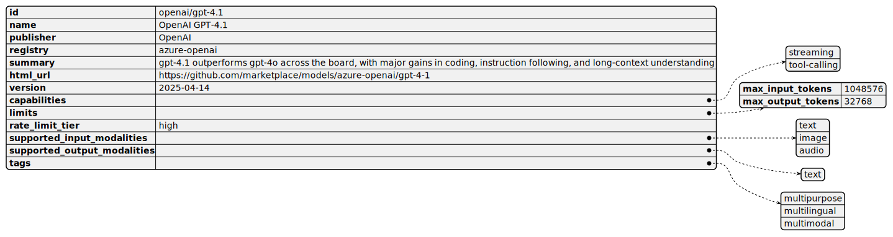

:PROPERTIES:
:ID:       96ea2679-1c00-4144-a97a-c1db570b7407
:END:
#+TITLE: Github
#+DESCRIPTION:
#+TAGS:

* Roam
+ [[id:53fc747a-3f12-411a-976a-345bb1924e2d][VCS Version Control]]
+ [[id:8d789c98-5e74-4bf8-9226-52fb43c5ca51][Forge]]

* Docs

* Resources

* Topics
** File-based Features
*** Codeowners
[[https://docs.github.com/en/repositories/managing-your-repositorys-settings-and-features/customizing-your-repository/about-code-owners][repositories/managing-your-repositorys-settings-and-features/customizing-your-repository/about-code-owners]]

+ Visibility requirements
+ Uses gitignore syntax with =@user= and =@org/teamname=

*** Github Actions

** Data Backup

This requires =admin:org= and =repos= permissions.

+ it doesn't work with fine-grained, i tried
+ make the token for 7 days
+ See the migrations POST [[https://docs.github.com/en/rest/migrations/orgs?apiVersion=2022-11-28#start-an-organization-migration][response schema here]]

#+begin_src shell
org="thisorg"
repos="\"theserepos\",\"arecomma\",\"separated\""
url="https://api.github.com/orgs/$thisorg/migrations"

payload='{"repositories":['"$repos"'"]}'

# ideally, this wouldn't need a paste
curl -X POST \
    -H "$(paste -d ' ' <(echo -n 'Authorization: Bearer') <(get-the-token))" \
    -d"$payload"
#+end_src

Migrations can be in four states:

| pending   | which means the migration hasn't started yet.    |
| exporting | which means the migration is in progress.        |
| exported  | which means the migration finished successfully. |
| failed    | which means the migration failed.                |

Note the migrations ID. check the status with:

#+begin_src shell
org="thisorg"
migration_id=12345678
url="https://api.github.com/orgs/$thisorg/migrations/$migration_id"

# ideally, this wouldn't need a paste
curl -X GET \
    -H "Accept: application/vnd.github+json" \
    -H "$(paste -d ' ' <(echo -n 'Authorization: Bearer') <(get-the-token))" \
    -d"$payload" \
    | jq '.state'
#+end_src

When this returns =exported=, you can download it with this:

#+begin_src shell
org="thisorg"
migration_id=12345678
url="https://api.github.com/orgs/$thisorg/migrations/$migration_id/archive"
output="${org}_migration_${migration_id}.tar.gz"

# ideally, this wouldn't need a paste

# must follow redirects (with headers), so -L
curl -X GET -L \
    -H "Accept: application/vnd.github+json" \
    -H "$(paste -d ' ' <(echo -n 'Authorization: Bearer') <(get-the-token))" \
    -d"$payload" | gpg -aer "$EMAIL" > "${output}.gpg"

# if you don't want gpg encryption on save, just use `-L -o $output`
#+end_src

** Models

*** Via API

#+begin_src jq :stdin schema :cmd-line "-r" :results raw
.items.properties
  | to_entries
  | map([.key, .value.type]
         | join(":"))
  | ["| " + (. | join(" | ")) + " |"] | last # | first
# :results raw jquseless

#+end_src

#+RESULTS:
| id:string | name:string | registry:string | publisher:string | summary:string | rate_limit_tier:string | html_url:string | version:string | capabilities:array | limits:object | tags:array | supported_input_modalities:array | supported_output_modalities:array |

Just kinda want to know what it looks like.

I didn't get to go to [[https://blog.postman.com/making-the-postman-logo/][space camp with Postman API bullshit]] because I coudln't
afford any $30 software bc of this shitty fucking country

#+name: fetchModels
#+headers: :jq-args "--raw-output" :eval query :results output :file "img/githubapi/models.json"
#+begin_src restclient :jq "map(keys)"
:gh-graphql-url = https://models.github.ai/catalog/models
:gh-url-base = https://api.github.com
:gh-url-path = users/:gh-user/repos
:gh-token := (auth-source-pass-get 'secret "api.github.com/dcunited001^ghub")

:headers = <<
Accept: application/vnd.github+json
Authorization: Bearer :gh-token
X-GitHub-Api-Version: 2022-11-28
User-Agent: Emacs
#

GET :gh-url-base/:gh-url-path
:headers
#+end_src

Anyways, it doesn't matter bc it looks like this:

#+name: xidel
#+begin_src shell :results output code :wrap example json
q="(//code)[4]"
curl -sq "https://docs.github.com/en/rest/models/catalog?apiVersion=2022-11-28" \
    | nix shell nixpkgs#xidel --command \
    xidel -s --xquery=$q --input=- \
    | jq 'first'

# it's no videl
# q='div[contains("concatRestCodeSamples_codeBlock__EV_jQ")]'
#+end_src

A picture is worth 10,000 tokens (and no, I can never afford those either)

#+begin_src plantuml :file img/githubapi/someapi.svg :noweb yes
@startjson
<<xidel()>>
@endjson
#+end_src

#+RESULTS:

* Issues
