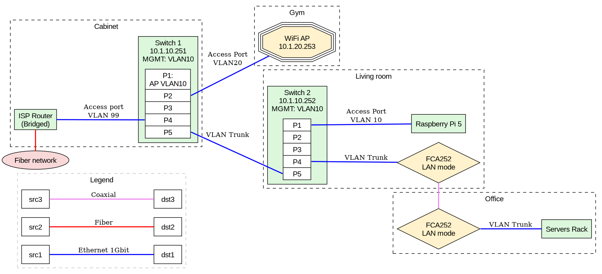

:PROPERTIES:
:ID:       e77048aa-d626-44c1-8bbb-037a1173d01d
:END:
#+title: Graphviz

* Docs

+ [[https://www.graphviz.org/pdf/dotguide.pdf][Dot Guide]]
+ [[https://graphviz.readthedocs.io/en/stable/][graphviz.readthedocs.io]]
+ [[https://www.graphviz.org/documentation/][Documentation Page]]

* Resources

+ [[https://www.sheep-thrills.net/Dot_and_Graphviz.html][Dot/Graphviz useful things]]
+ [[https://github.com/vdjagilev/nmap-formatter/blob/main/formatter/resources/templates/graphviz.tmpl][vdjagilev/nmap-formatter: Graphviz.tmpl]]

* Issues

** can't eval org-babel blocks as graphviz-dot, [[https://github.com/ppareit/graphviz-dot-mode/pull/46][but it's reported as possible]]
+ is this possible without adding a full ob-graphviz.el?
+ this mode should probably just be restricted to evalling =dot= mode blocks
  opened with =C-c =',

** evalling org-babel blocks as dot is easier
+ [[https://vxlabs.com/2014/12/04/inline-graphviz-dot-evaluation-for-graphs-using-emacs-org-mode-and-org-babel/][Inline GraphViz DOT evaluation for graphs using Emacs, org-mode and org-babel]]

** combining elisp to generate graphviz
+ may benefit from combining dynamic-graphs package

* Examples

** Ladder Diagrams
+ [[https://stackoverflow.com/questions/40558313/how-to-make-graphviz-ladder-diagram-flows-straight][ladder diagram for a protocol]]

** Network Diagrams

**** Example from reddit

From [[https://www.reddit.com/r/homelab/comments/1pc6q9e/comment/nrw2if3/?utm_source=share&utm_medium=web3x&utm_name=web3xcss&utm_term=1&utm_content=share_button][this r/homelab comment]]

#+begin_src dot :results file :file img/net/graphviz-network-example.png
graph Network {
    splines = line;
    rankdir = LR;
    compound = true;
    node [shape = box; style = "filled"; fillcolor = "white"; fontname = Arial;];
    edge [arrowsize = 0.4; style = bold; color = black; fontsize = 13;];
    graph [fontname = Arial;];

    subgraph cluster_legend {
        label = "Legend";
        style = dashed;
        color = gray;
        
        src1 -- dst1 [label = "Ethernet 1Gbit"; style = bold; color = "blue";];
        src2 -- dst2 [label = "Fiber"; style = bold; color = "red";];
        src3 -- dst3 [label = "Coaxial"; style = bold; color = "violet";];
    }

    FIBER [label = "Fiber network";shape = oval;fillcolor = "#f8d8d8";];

    subgraph cluster_cabinet {
        label = "Cabinet"
        style = dashed;
        ISP_ROUTER [label = "ISP Router\n(Bridged)"; fillcolor = "#dcf7dc"];

        subgraph cluster_vlan_switch_cabinet {
            label = "Switch 1\n10.1.10.251\nMGMT: VLAN10";
            style = filled;
            bgcolor = "#dcf7dc";
            SWITCH_CABINET [shape = record;label = "<p1>P1:\nAP VLAN10|<p2>P2|<p3>P3|<p4>P4|<p5>P5";];
        }
    }

    subgraph cluster_gym {
        label = "Gym"
        style = dashed;
        WIFI [shape = tripleoctagon;label = "WiFi AP\n10.1.20.253";fillcolor = "#fff2cc";];
    }

    subgraph cluster_livingroom {
        label = "Living room"
        style = dashed;

        MOCA_LIVING [shape=diamond,label="FCA252\nLAN mode"; fillcolor = "#fff2cc";]

        RPI [label="Raspberry Pi 5"; fillcolor = "#dcf7dc";]
        
        subgraph cluster_vlan_switch_living {
            label = "Switch 2\n10.1.10.252\nMGMT: VLAN10";
            style = filled;
            bgcolor = "#dcf7dc";
            SWITCH_LIVING [shape = record; label = "<p1>P1|<p2>P2|<p3>P3|<p4>P4|<p5>P5";];
        }        
    }
    subgraph cluster_office {
        label = "Office"
        style = dashed;

        MOCA_OFFICE [shape=diamond,label="FCA252\nLAN mode"; fillcolor = "#fff2cc";]
        RACK [label = "Servers Rack\n"; fillcolor = "#dcf7dc";];

        
    }
    FIBER -- ISP_ROUTER [constraint=FALSE; color=red]
    ISP_ROUTER -- SWITCH_CABINET:p4 [label="Access port\nVLAN 99"; color=blue];

    SWITCH_CABINET:p2 -- WIFI [label="Access Port\nVLAN20"; color=blue];
    SWITCH_CABINET:p5 -- SWITCH_LIVING:p5 [label="VLAN Trunk"; color=blue];
    
    SWITCH_LIVING:p4 -- MOCA_LIVING [label="VLAN Trunk"; color=blue;];
    SWITCH_LIVING:p1 -- RPI [color=blue, label="Access Port\nVLAN 10"] 
    MOCA_LIVING -- MOCA_OFFICE [color=violet, constraint=false]
    MOCA_OFFICE -- RACK [label="VLAN Trunk";color=blue]

    SWITCH_LIVING:p5 -- MOCA_OFFICE [style=invis];
}
#+end_src

#+RESULTS:

* Plant UML

** Docs

+ [[https://plantuml.com/guide][Drawing UML with PlantUML]]
+ [[https://ogom.github.io/draw_uml/plantuml/][Cheatsheet]]

** Resources

+ [[https://www.conexxus.org/sites/default/files/UsingPlantUML.pdf][Guidelines for Using PlantUML]]

** Tasks
*** TODO look into [[https://github.com/tj64/puml][tj64/puml]]: create reusable plantuml macros with declarative DSL (via elisp)

* Roam

+ [[id:38f43c0c-52ee-42d7-9660-af2511d19711][Modeling Language]]
