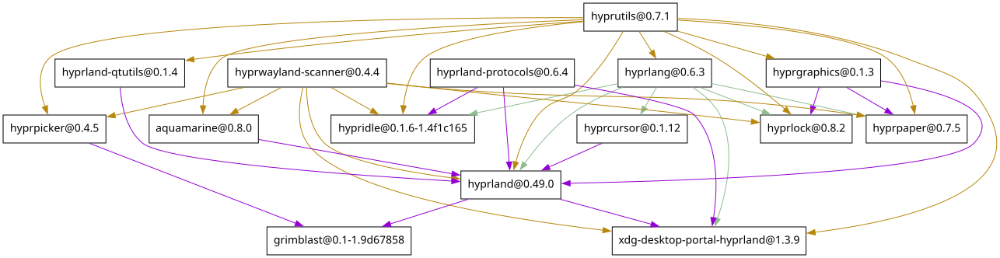

:PROPERTIES:
:ID:       bc406527-0255-4d70-b620-82495ac5c8fe
:END:
#+TITLE: Hyprland
#+DESCRIPTION:
#+TAGS:

* Roam
+ [[id:f92bb944-0269-47d4-b07c-2bd683e936f2][Wayland]]
+ [[id:da888d96-a444-49f7-865f-7b122c15b14e][Desktop]]
+ [[id:bdae77b1-d9f0-4d3a-a2fb-2ecdab5fd531][Linux]]

* Docs

* Resources

** Plugins

*** With Shaders

+ [[https://github.com/micha4w/Hypr-DarkWindow][micha4w/hypr-darkwindow]] inverts windows
+ [[https://github.com/alexhulbert/Hyprchroma/blob/main/flake.nix][alexhulbert/Hyprchroma ./main/flake.nix]] requires building darkwindow

** Configs
*** Misako
+ [[https://codeberg.org/look/misako/src/16aa0d52c0ede3f61b4b5cb91c8b0c261c1524d5/misako/home-environments/look/files/.config/hypr/rules.conf#L15][misako/home-environments: home/environments/.config/hypr/rules.conf]]
* Topics
** Dependencies

#+begin_src shell :results output file :file img/hyprland-revdeps.svg
hyprpkgs=$(guix search 'hypr' | recsel -P name | grep -E '^hypr' | grep -v hypre)
guix graph --type=reverse-package $hyprpkgs \
    | dot -Tsvg
#+end_src

#+RESULTS:

** Pre-Lua Submaps

*** Chunking submap definitions

Can reopen submap definitions

#+begin_src conf
submap = testfoo
bind = ,escape, submap, reset
bind = super, code:10, exec, notify-send -a "Hypr" -i $ihypr 1 111111111
bind = super, code:11, exec, notify-send -a "Hypr" -i $ihypr 2 222222222
submap = reset

submap = testfoo
bind = super, code:12, exec, notify-send -a "Hypr" -i $ihypr 3 333333333
bind = super, code:13, exec, notify-send -a "Hypr" -i $ihypr 4 444444444
submap = reset

bind = SUPER CTRL SHIFT, code:14, submap, testfoo
#+end_src
*** Vim-like window movement

#+begin_src conf
bind=SUPER ALT, space, submap, movewin

# shouldn't this be modal?
submap=movewin
bind=, J, movewindow, u
bind=, H, movewindow, l
bind=, L, movewindow, r
bind=, K, movewindow, d
bind=, W, movewindow, u
bind=, A, movewindow, l
bind=, D, movewindow, r
bind=, S, movewindow, d
bind=SHIFT, J, movefocus, u
bind=SHIFT, H, movefocus, l
bind=SHIFT, L, movefocus, r
bind=SHIFT, K, movefocus, d
bind=SHIFT, W, movefocus, u
bind=SHIFT, A, movefocus, l
bind=SHIFT, D, movefocus, r
bind=SHIFT, S, movefocus, d

# escape, space, enter to exit
bind=, escape, submap, reset
bind=, space, submap, reset
bind=, 36, submap, reset
submap=reset
#+end_src

*** Weird named-window hack for jumping to chromium windows

#+begin_src conf
# ---------------------------------------------
# namewin:
# - name chrome windows suffixed with mnemonic & characteristic string: [A-Z]_._CHROME_._$
# - then bind ISO_LEVEL_5+[A-Z] to focuswindow
# - jump to specific chrome windows across desktops

$namewinMod=SUPER CTRL ALT
$namewinKey=W
$namewinMatch=_._CHROME_._
$namewinBrowserClass=chromium-browser

# C-u M-! ...
# for i in {65..90}; do
#   h=$(printf '%x' "$i");
#   c=$(printf '\x'"$h");
#   # echo $namewin"$c"="$c"_._CHROME_._"$c"
#   echo '$namewin'"$c"="$c"'$namewinMatch'
# done

$namewinA=A$namewinMatch
$namewinB=B$namewinMatch
# $namewinC=C$namewinMatch # Copy $namewinMatch
$namewinD=D$namewinMatch
$namewinE=E$namewinMatch
# ...
$namewinU=U$namewinMatch
# $namewinV=V$namewinMatch # Paste
$namewinW=W$namewinMatch
$namewinX=X$namewinMatch
$namewinY=Y$namewinMatch
$namewinZ=Z$namewinMatch

bind = SUPER CTRL ALT, W, submap, NAMEWIN

submap=NAMEWIN
bind = ,escape, submap, reset

# - /\$namedwinMatch\b/ requires the break
# - alphanumeric still enters text: prefix the _._CHROME_._

# super-C/V: handle quickly copying/pasting an annoying string
bind = SUPER,C, exec, echo "$namewinMatch" | wl-copy
# hyprctl activewindow -j \
# | jq -e '.class != "$namewinBrowserClass"' 1>/dev/null \
# && echo '' | wl-copy
bind = SUPER, V, exec, hyprctl activewindow -j | jq -e '.class != "$namewinBrowserClass"' 1>/dev/null && echo '' | wl-copy
bind = SUPER, V, sendshortcut, CTRL, V, activewindow

bind = SUPER, D, focuswindow, title:(.*)( $namewinD)
# bind = SUPER,$namewinG, e, title:(.*)( $namewinD)

submap=reset

bind = MOD3, X, focuswindow, title:(.*)( $namewinX)
bind = MOD3, D, focuswindow, title:(.*)( $namewinD)

# window borders
windowrule = bordercolor rgba(DD3333FF) / rgba(CC3377AA) 45deg rgba(3CC73A7A) / rgba(CC3377AA) 45deg, title:$namewinA
windowrule = bordersize  10, title:$namewinA
windowrule = bordercolor rgba(DD3333FF) / rgba(CC3377AA) 45deg rgba(CC3377AA) / rgba(3CC73A7A) 45deg, title:$namewinB
windowrule = bordersize  10, title:$namewinB

#---------------------------------------------
# wl-paste doesn't work
# bind = w,exec, hyprctl activewindow -j | jq -e '.class == "$namewinBrowserClass"' 1>/dev/null && echo $namewinMatch | wl-copy && wl-paste

# bind = ,w,exec, hyprctl activewindow -j | jq -e '.class == "$namewinBrowserClass"' 1>/dev/null && (echo $namewinMatch | wl-copy && wl-paste)
# bind = SUPER CTRL ALT, w,exec, notify-send -a "Hypr" -i $ihypr $namewinBrowserClass $(hyprctl activewindow -j | jq '.class == "$namewinBrowserClass"')

#---------------------------------------------
# suffixing the window title needs to be a bash script ... that's a bad idea. nvm

# bind = $namewinMod, $namewinKey, sendshortcut,, f, 
# bind = $namewinMod, $namewinKey, sendshortcut,, d, 
# bind = $namewinMod, $namewinKey, sendshortcut,, s, 
# bind = $namewinMod, $namewinKey, sendshortcut,, a, 
#+end_src

*** Submap to quickly relaunch failed processes

Mostly commented out as I gravitated towards systemd

#+begin_src conf
# $waybarLaunch=waybar
# exec-once = uwsm app -- $waybarLaunch

# $elephantLaunch=elephant
# exec-once = uwsm app -- $elephantLaunch

# command never completes...
# 114082 /bin/sh -c uwsm app -- walker --gapplication-service || notify-send -a "Hypr" -i $ihypr 'REEXEC' "Failed: walker --gapplication-service"
# $walkerLaunch=walker --gapplication-service
# exec-once = uwsm app -- $walkerLaunch

# $makoLaunch=mako -c "$HOME/.config/mako/config"
# exec-once = uwsm app -- $makoLaunch

# TODO: maybe switch back to swaync
# exec-once = uwsm app -- swaync -c "$HOME/.config/swaync/config.json"

# the hypridle config must exist in HOME, XDG_CONFIG_HOME or /etc/hypr
# exec-once = uwsm app -- hypridle -c "$HOME/.dotfiles/.config/hypr/$host/hypridle.conf"

# ---------------------------------------------
# REEXEC submap
bind = SUPER ALT, F2, submap, REEXEC

submap=REEXEC
# bind = , B, exec, pkill -fx ".*$waybarLaunch" || notify-send -a "Hypr" -i $ihypr 'REEXEC' "Failed: pkill -fx \"$waybarLaunch\""
# bind = ALT, B, exec, uwsm app -- $waybarLaunch || notify-send -a "Hypr" -i $ihypr 'REEXEC' "Failed: $waybarLaunch"
# bind = , W, exec, pkill -fx ".*$walkerLaunch" || notify-send -a "Hypr" -i $ihypr 'REEXEC' "Failed: pkill -fx \"$walkerLaunch\""
# bind = ALT, W, exec, uwsm app -- $walkerLaunch || notify-send -a "Hypr" -i $ihypr 'REEXEC' "Failed: $walkerLaunch"
# bind = , E, exec, pkill -fx ".*$elephantLaunch(-wrapped)?" || notify-send -a "Hypr" -i $ihypr 'REEXEC' "Failed: pkill -fx \"$elephantLaunch(-wrapped)?\""
# bind = ALT, E, exec, uwsm app -- $elephantLaunch || notify-send -a "Hypr" -i $ihypr 'REEXEC' "Failed: $elephantLaunch"
# bind = , B, exec, pkill -fx ".*$swayncLaunch"
# bind = ALT, B, exec, uwsm app -- $swayncLaunch
# bind = , N, exec, notify-send -a "Hypr" -i $ihypr 'REEXEC' "Running: pkill -fx \"$makoLaunch\"" && pkill -fx ".*$makoLaunch" 
# bind = ALT, N, exec, uwsm app -- $makoLaunch || notify-send -a "Hypr" -i $ihypr 'REEXEC' "Failed: $makoLaunch"

# bind = ,catchall, submap, reset # catchall activates on mod mods
bind = ,escape, submap, reset
submap=reset
#+end_src

*** Submap to test walker features

#+begin_src conf
# ---------------------------------------------
# WALKER submap

# holy crap it really do not let no newlines through
$walkerNotify=-1 5000 "rgb(CC00CC)"
$walkerNotifyMsg="$(echo " "; echo " "; for i in '; providerlist' '> runner' '/ files' '. symbols' '! todo' '= calc' '@ websearch' ': clipboard' '$ windows' ', unicode'; do echo $i; done )"
bind = MOD3, W, exec, hyprctl notify $walkerNotify 'TEST WALKER' $walkerNotifyMsg

bind = MOD3, W, submap, WALKER

submap=WALKER, reset
bind =      , semicolon, exec, walker -m providerlist -p "Providerlist..."
bind = SHIFT, period   , exec, walker -m runner       -p "Runner..."
bind =      , slash    , exec, walker -m files        -p "Files..."
bind =      , period   , exec, walker -m symbols      -p "Symbols..."
bind = SHIFT, code:10  , exec, walker -m todo         -p "Todo..."
bind = SHIFT, code:11  , exec, walker -m websearch    -p "Websearch..."
bind = SHIFT, code:13  , exec, walker -m windows      -p "Windows..."
bind =      , equal    , exec, walker -m calc         -p "Calc..."
bind = SHIFT, semicolon, exec, walker -m clipboard    -p "Clipboard..."
bind =      , comma    , exec, walker -m unicode      -p "Unicode..."

bind =      , M        , exec, dwalker-man

# bind = ,greater, exec, walker -m runner -p "Runner..."
# bind = ,exclam, exec, walker -m todo -p "Todo..."
# bind = ,at, exec, walker -m websearch -p "Websearch..."
# bind = ,dollar, exec, walker -m windows -p "Windows..."
# bind =  semicolon, exec, walker -m clipboard -p "Clipboard..."
# bind = ,catchall, submap, reset

bind = ,escape, submap, reset
submap=reset
#+end_src
** Pre-Lua Keybinds

From pre-lua hyprland

*** keypad

|------+--------+--------+--------+----+-----+----+-----+-----------+-----------+-------------+-------------|
| --   | *$kpmul* | *$kpdiv* | *$kpsub* | *77* | *106* | *63* | *82*  | *Num_Lock*  | *KP_Divide* | *KP_Multiply* | *KP_Subtract* |
| $kp7 | $kp8   | $kp9   | *$kpadd* | 79 |  80 | 81 | *82*  | KP_7      | KP_8      | KP_9        | *KP_Add*      |
| $kp4 | $kp5   | $kp6   | --     | 83 |  84 | 85 | --  | KP_4      | KP_5      | KP_6        | --          |
| $kp1 | $kp2   | $kp3   | *$kpent* | 87 |  88 | 89 | *104* | KP_1      | KP_2      | KP_3        | *KP_Enter*    |
| $kp0 | --     | *$kpdec* | --     | *90* |  -- | *91* | --  | *KP_Insert* | --        | *KP_Delete*   | --          |
|------+--------+--------+--------+----+-----+----+-----+-----------+-----------+-------------+-------------|
... kp_insert?
*** digits

|-----+-----+-----+-----+-----+-----+-----+-----+-----+-----+---------+---------|
| $k1 | $k2 | $k3 | $k4 | $k5 | $k6 | $k7 | $k8 | $k9 | $k0 | $kminus | $kequal |
|-----+-----+-----+-----+-----+-----+-----+-----+-----+-----+---------+---------|
|  10 |  11 |  12 |  13 |  14 |  15 |  16 |  17 |  18 |  19 |      20 |      21 |
|-----+-----+-----+-----+-----+-----+-----+-----+-----+-----+---------+---------|
*** Rebind menu

#+begin_src  conf
# Custom

# Rebind Menu
#
# - requires key actually on keyboard (virtually).

# - `sendshortcut` does not seem to work work with Mod3. hyprland probably
#   filters a hardcoded set of modifiers

# bindd = SUPER, TAB, Send Ctrl+Shift Menu Key, sendshortcut, , code:135, activewindow
# bindd = SUPER, TAB, Send Ctrl+Shift Menu Key, sendshortcut, Alt, X, activewindow
# bindd = SUPER CTRL SHIFT, TAB, Send Menu Key, sendshortcut, , code:135, activewindow
# bindd = MOD3, TAB, Send Menu Key, sendshortcut, , Menu
# bindd = MOD3, TAB, Send Menu Key, sendshortcut, Alt, X

# bindd = MOD3 SHIFT, TAB, Send Shift Menu Key, sendshortcut, SHIFT, Menu
# bindd = MOD3 ALT, TAB, Send Alt Menu Key, sendshortcut, ALT, Menu
# bindd = MOD3 ALT SHIFT, TAB, Send Alt+Shift Menu Key, sendshortcut, ALT SHIFT, Menu
# bindd = MOD3 CTRL, TAB, Send Ctrl Menu Key, sendshortcut, CTRL, Menu
# bindd = MOD3 CTRL SHIFT, TAB, Send Ctrl+Shift Menu Key, sendshortcut, CTRL SHIFT, Menu

# Custom

# Rebind Menu
#
# - requires key actually on keyboard (virtually).

# - `sendshortcut` does not seem to work work with Mod3. hyprland probably
#   filters a hardcoded set of modifiers

# bindd = SUPER, TAB, Send Ctrl+Shift Menu Key, sendshortcut, , code:135, activewindow
# bindd = SUPER, TAB, Send Ctrl+Shift Menu Key, sendshortcut, Alt, X, activewindow
# bindd = SUPER CTRL SHIFT, TAB, Send Menu Key, sendshortcut, , code:135, activewindow
# bindd = MOD3, TAB, Send Menu Key, sendshortcut, , Menu
# bindd = MOD3, TAB, Send Menu Key, sendshortcut, Alt, X

# bindd = MOD3 SHIFT, TAB, Send Shift Menu Key, sendshortcut, SHIFT, Menu
# bindd = MOD3 ALT, TAB, Send Alt Menu Key, sendshortcut, ALT, Menu
# bindd = MOD3 ALT SHIFT, TAB, Send Alt+Shift Menu Key, sendshortcut, ALT SHIFT, Menu
# bindd = MOD3 CTRL, TAB, Send Ctrl Menu Key, sendshortcut, CTRL, Menu
# bindd = MOD3 CTRL SHIFT, TAB, Send Ctrl+Shift Menu Key, sendshortcut, CTRL SHIFT, Menu
#+end_src

** Rules
** Binds

** Converting to lua

*** Omarchy module structure

+ The top-level =o= metatable (?) contains some functions that wrap =hl=, so there
  aren't many direct references to the latter.

**** User config

The [[https://github.com/basecamp/omarchy/blob/quattro/default/hypr/bootstrap.lua#L3][default/hypr/bootstrap.lua]] does some special setup to give the user a "hypr"
module namespace, i think

#+begin_src shell
OMARCHY_PATH=~/.local/share/omarchy
cd $OMARCHY_PATH && grep -re '^ *require("' config/hypr
#+end_src

Entry point: =~/.config/hypr/hyprland.lua=

| config/hypr/hyprland.lua | default/hypr/bootstrap.lua      |
| config/hypr/hyprland.lua | require("default.hypr.omarchy") |
| config/hypr/hyprland.lua | require("hypr.monitors")        |
| config/hypr/hyprland.lua | require("hypr.input")           |
| config/hypr/hyprland.lua | require("hypr.bindings")        |
| config/hypr/hyprland.lua | require("hypr.looknfeel")       |
| config/hypr/hyprland.lua | require("hypr.autostart")       |
| config/hypr/hyprland.lua | require("default.hypr.toggles") |
**** Omarchy

#+begin_src shell
OMARCHY_PATH=~/.local/share/omarchy
cd $OMARCHY_PATH && grep -re '^ *require("default' default
#+end_src

In logical order of inclusion

| default/hypr/omarchy.lua | require("default.hypr.helpers")            |
| default/hypr/omarchy.lua | require("default.hypr.autostart")          |
| default/hypr/omarchy.lua | require("default.hypr.bindings.media")     |
| default/hypr/omarchy.lua | require("default.hypr.bindings.clipboard") |
| default/hypr/omarchy.lua | require("default.hypr.bindings.tiling")    |
| default/hypr/omarchy.lua | require("default.hypr.bindings.utilities") |
| default/hypr/omarchy.lua | require("default.hypr.envs")               |
| default/hypr/envs.lua    | require("default.hypr.nvidia")             |
| default/hypr/omarchy.lua | require("default.hypr.looknfeel")          |
| default/hypr/omarchy.lua | require("default.hypr.input")              |
| default/hypr/omarchy.lua | require("default.hypr.windows")            |
| default/hypr/windows.lua | require("default.hypr.apps")               |

=default.hypr.apps=, includes the entire path:

#+begin_src lua
require_all.files(paths.omarchy_path .. "/default/hypr/apps", "default.hypr.apps")
#+end_src

There are a few exceptions. Modules like =default.hypr.{tiling,bindings,apps}=
call =require_all=. I'm not quite sure what loads =tiling= and =bindings=, but the
=require= for =default.hypr.apps= is obvious.

=require_all= is not native to =lua=. it's a helper in =default.hypr.require_all= that
gets "locally" required where needed.

+ I think =default.hypr.bootstrap= and =require_all= affect how hyprland's lua state
  is managed (e.g. when you =git pull= during an =omarchy update=)

*** Watchexec

#+begin_src shell
debounce=1
cmd='hyprland --verify-config -c $HOME/.dotfiles/.config/hypr/kratos.hyprland.lua'

watchexec -d $debounce --workdir . --filter '*.lua' "$cmd"
#+end_src
** Instance Socket

A better way to get the instance socket (than =ls= or something)

#+begin_src shell
inst=$(hyprctl instances -j | jq -r 'first | .instance')
#+end_src

*** Hyprland socket interaction

Could, in theory, make this socket a repl using =rlwrap=. It has an ascii
interface.

+ rlwrap -f $rlwrap_completion :: provide basic completion
+ rlwrap -H $rlwrap_history :: store history of interactions

#+begin_src shell
HIS=$HYPRLAND_INSTANCE_SIGNATURE
HSOCKET2=$XDG_RUNTIME_DIR/hypr/$HIS/.socket2.sock
rlwrap socat - UNIX-CONNECT:$HSOCKET2
#+end_src

But newer versions of hyprland include =hyprctl repl= for a LUA repl

*** Triggering commands remotely

You can't troubleshoot everything over =ssh=, since =ssh= can't usually access
remote sockets... or something...

#+begin_quote
yeh that didn't seem right... it's not. without =jq -r=, then =$inst= will include
quotes. you can absolutely interact with the instance socket remotely.
#+end_quote

**** Using =at=

You'd need =atd= or some other =at=-like daemon to execute jobs. This isn't a good
idea, since they'll run under the authority of the =atd= user. From the remote:

#+begin_src shell
t=$(mktemp -d) # I /think/ this correct but idk
at now + 5 minutes "echo 'foob ar '\"$(date +%s)\" >> $t/foo.job"
at -c # list jobs
#+end_src

**** Using =watchexec=

Something like this:

#+begin_src shell
tf=$(mktemp -d)/task.watch # I /think/ this correct but idk
tfrun=$(dirname $tf)/task.run
debounce=25
touch $tf # again, I didn't exactly test this
watchexec -d $debounce -f "$tf" 'echo "$(date +%s)" >> $tfrun"'
#+end_src

* Issues
** Nixos
*** Startup

**** Without =start-hyprland= message showing

https://github.com/hyprwm/Hyprland/blob/02ff413002eddd7419ba70eb0f9f92acd2d97ddc/src/main.cpp#L214-L227

#+begin_src cpp
    reapZombieChildrenAutomatically();

    bool watchdogOk = watchdogFd > 0;

    if (watchdogFd > 0)
        watchdogOk = g_pCompositor->setWatchdogFd(watchdogFd);
    if (safeMode)
        g_pCompositor->m_safeMode = true;

    if (!watchdogOk && !verifyConfig)
        Log::logger->log(Log::WARN, "WARNING: Hyprland is being launched without start-hyprland. This is highly advised against.");

    g_pCompositor->initServer(socketName, socketFd);
#+end_src
