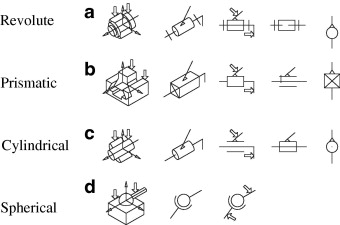

:PROPERTIES:
:ID:       4630e006-124c-4b66-97ad-b35e9b29ae0b
:END:
#+title: Robotics
#+filetags: robotics

* Terminology
** Gears
+ [[https://en.wikipedia.org/wiki/List_of_gear_nomenclature][List of gear nomenclature]]
+ [[https://www.pirate4x4.com/d1/tech/billavista/Gear_Setup/][Gettin' the Gears Done]]
** Shafts
+
+ Fasteners
  - [[https://en.wikipedia.org/wiki/Circlip][Jesus Clips]] and [[https://en.wikipedia.org/wiki/Retaining_ring][Retaining Rings]]
  - [[https://www.sdproducts.co.uk/circlips-spiral-retaining-rings-and-wave-springs][Circlips, Spiral Retaining Rings, Wave Springs]]
+ Axels
** Manufacturing Methods
+ [[https://en.wikipedia.org/wiki/Interference_fit][Interference Fit]] (press fit, friction fit, hydraulic dilation)
  - [[https://www.assemblymag.com/articles/93984-best-practices-for-press-fit-assembly][best practices for press-fit assembly]]
  - [[https://www.fictiv.com/articles/too-tight-or-perfect-fit-when-to-use-press-fits-in-your-assemblies][Never use press fits in plastics]] (cold creep)
+ [[https://en.wikipedia.org/wiki/Induction_shrink_fitting][Induction Shrink Fitting]]
** Motors
+ [[https://www.linquip.com/blog/what-is-motor-shaft/][What is Motor Shaft?]] (Liquip)
  - [[https://www.linquip.com/blog/category/coupling/][Coupling Articles]]
  - [[https://www.linquip.com/blog/category/motor/][Motor Articles]]

* Docs

** Texts

[[http://asrl.utias.utoronto.ca/~tdb/bib/barfoot_ser17.pdf][State Estimation For Robotics (Barfoot 2022, 2nd Ed. Draft)]]

+ This one is a draft, highly technical. Has exercises with answers & solutions
  partially worked out, which is great bc yeh.

* Resources

** ISO
*** LaTeX
**** KinemaTikZ
+ source: [[https://ctan.org/pkg/kinematikz?lang=en][CTAN]], docs: [[https://mirrors.rit.edu/CTAN//graphics/pgf/contrib/kinematikz/kinematikzmanual.pdf][kinematikzmanual.pdf]]

Examples

+ [[https://yorkspace.library.yorku.ca/items/e8e30807-9846-4aac-a4c9-0e3422417f6a][Novel Design and Analysis of Parallel Robotic Mechanisms]]
+ [[https://www.sciencedirect.com/science/article/pii/S0094114X07001073?via%3Dihub][Topology of serial and parallel manipulators and topological diagrams]]
  - PDF on [[https://www.researchgate.net/profile/Luc-Baron-2/publication/259578704_r13/links/00b4952cbab89a98a8000000/r13.pdf][ReasearchGate]]
  - ~M-x org-cliplink~ returns [[https://www.sciencedirect.com/science/article/pii/S0094114X07001073?via%3Dihub][Client Request Error]] ... bc ~fu2, Elsevier~ 

image from the above "Topology of serial/parallel ..."  

#+begin_quote
Emacs is not recognized as a legitimate client, which eventually complicated
usage of projects like [[https://github.com/jkitchin/scimax][jkitchin/scimax]].

But since we have shiny AI tools, then it will be fine if the lack of any/all
efficient alternatives to AI/LLM just atrophy... (like that one last checkout
line that's too long: you still have the option, but now the option is
comparatively terrible)
#+end_quote

* Issues

* Topics

** Robot Description

*** UDRF

This is used by the ROS framework

+ [[https://wiki.ros.org/urdf][XML Specifications]]
+ URDF has a [[https://hiro-group.ronc.one/vscode_urdf_previewer.html][VS Code extension]] that can be visualize

**** [[https://github.com/robot-descriptions/robot_descriptions.py][robot-descriptions/robot_descriptions.py]]

+ [[https://github.com/google-deepmind/mujoco_menagerie][google-deepmind/mujoco_menagerie]] can load any model from robot_descriptions
  into Menagerie. Works with either URDF or MJCF.
+ [[https://github.com/robot-descriptions/robot_descriptions.py/tree/main/robot_descriptions/_cache.py][robot_descriptions/_cache.py]] will clone the repo containing the robot
  description (and its URDF or MJDF) into a directory where =*_description.py=
  transforms it into a common python data structure.

See understanding URDF: Dataset & Analysis ([[https://arxiv.org/abs/2308.00514][doi:10.48550/arXiv.2308.00514]])

*** .rob

I believe this format is from [[http://robotics.stanford.edu/~mitul/mpk/mpk_new/node3.html][Stanford's MPK]] (motion planning kit)

* ROS

** Docs

** Resource

+ [[https://github.com/Greenroom-Robotics/ros-d2][D2 plugin for ROS]]
