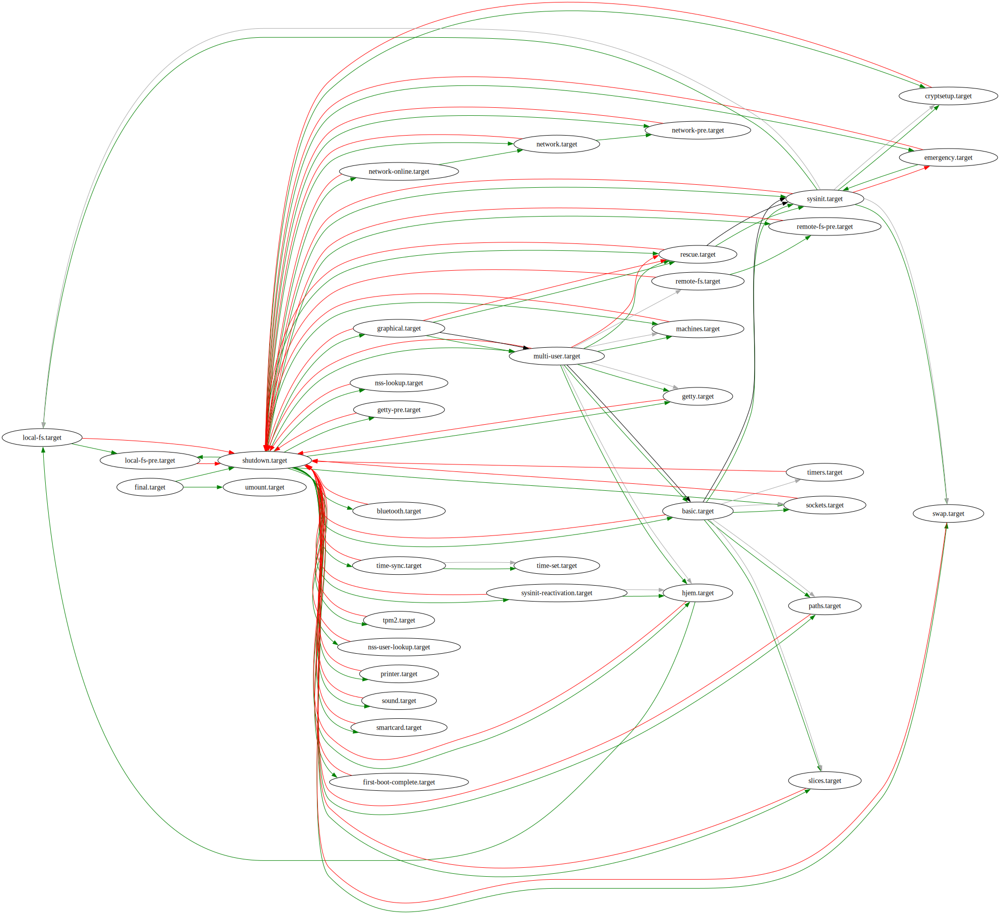
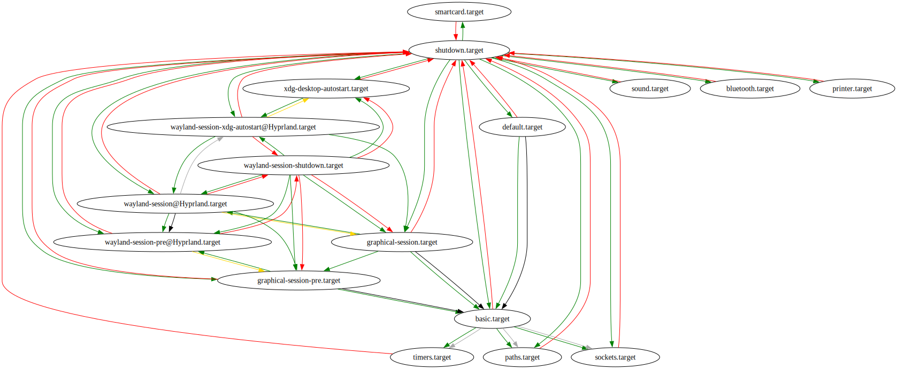
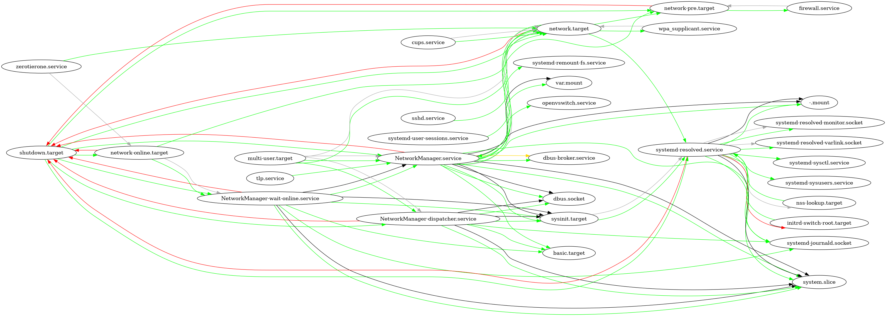
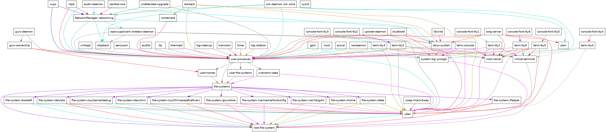
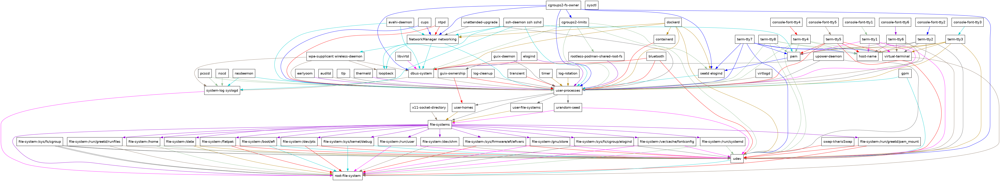

:PROPERTIES:
:ID:       df7f060a-d663-4eaa-844e-f8baec7c94a2
:END:
#+TITLE: SystemD
#+DESCRIPTION:
#+TAGS:

* Roam
+ [[id:bdae77b1-d9f0-4d3a-a2fb-2ecdab5fd531][Linux]]

* Docs

* Resources

** Nixos

+ [[https://github.com/NixOS/nixpkgs/blob/85fe7380cc14e96a569f53fc07133b2db55049d9/nixos/lib/systemd-lib.nix#L70][nixos/lib/systemd-lib.nix]] regexp for systemd unit types
+ [[https://github.com/NixOS/nixpkgs/blob/85fe7380cc14e96a569f53fc07133b2db55049d9/nixos/lib/systemd-unit-options.nix#L64][nixos/lib/systemd-unit-options.nix]] spec/validation of systemd unit options
+ [[https://github.com/NixOS/nixpkgs/blob/85fe7380cc14e96a569f53fc07133b2db55049d9/nixos/modules/system/boot/systemd/user.nix#L71][nixos/modules/system/boot/systemd/user.nix]] handling units for users

** SystemD

*** On Demand Activation

+ Should be everyday & very simple, but I don't commonly see this outside of
  packages: [[https://erlangen-sheppy.medium.com/on-demand-activation-of-arbitrary-applications-3b577eb116b6][on-demand-activation-of-arbitrary-applications]]
+ Why have I never encountered any libraries that generate/manage this
  toml/conf? I'm guessing Jinja does it more than half the time.

* Topics

** =systemd-networkd=

*** OpenVPN

**** Setup

Adding client to =/etc/openvpn/client/fdsa.conf= creates a templated target. So
start as systemd service: =openvpn-client@fdsa.service=

+ [[https://wiki.archlinux.org/title/OpenVPN#Run_as_unprivileged_user][Running as unpriviledge user has problems]] (this is kinda why you want it on a
  network device) Instead of =nobody/nobody=,
  - with network-manager, these could be =nm-openvpn/nm-openvpn=.
  - with systemd these could be =openvpn/openvpn= ... i think?

***** TOTP

Still asks for TOTP... no idea how to get systemd to let me enter this....

***** Certificates

=systemd-networkd= doesn't easily expose a way to enter passwords for
certificates.

#+begin_quote
Forward password requests to Plymouth skipped.......
#+end_quote

Which i fully anticipated

#+begin_src shell
p12_in=bundle.enc.p12
pem_in=bundle.dec.pem
p12_out=bundle.dec.p12

openssl pkcs12 -in "$p12_in" -nodes -out "$pem_in"
openssl pkcs12 -export -in "$pem_in" -out "$p12_out"

# or ....... nope (gotta write to "$pem_in")
passin=fd:<(gpg -d foob.gpg) # fd expects a number
passin=fd:<(gpg -d foob.gpg) # not a file, technically

# openssl pkcs12 -export -in "$pem_in" \
#         <(openssl pkcs12 -in "$p12_in" -nodes -passin $passin -out "$pem_in")
#         -out "$p12_out"

passin=stdin # can pipe
openssl pkcs12 -export -in "$pem_in" \
        <(gpg -d foob.gpg | openssl pkcs12 -in "$p12_in" -nodes -passin $passin) \
        -out "$p12_out"

# .... pkcs12 
#+end_src

Which i started to grok halfway through... that is the point of pkcs12

***** Update DNS

See [[https://wiki.archlinux.org/title/OpenVPN#Route_configuration_fails_with_systemd-networkd][9: DNS from archwiki]]

***** Fix routes

[[https://wiki.archlinux.org/title/OpenVPN#Route_configuration_fails_with_systemd-networkd][12.4: Route Config Fails with systemd-networkd]]

#+begin_src conf
# /etc/systemd/network/90-tun-ignore.network
[Match] # tun1: tuns of fun
Name=tun*

[Link]
Unmanaged=true
#+end_src

To control the network interface name, 

#+begin_src conf
# /etc/openvpn/client/fdsa.conf
dev tun-fdsa
dev-type tun

# /etc/systemd/network/90-tun-ignore.network
[Match] # tun1: tuns of fun
Name=tun-fdsa
#+end_src

***** Arch Package

OpenVPN expects you to magically "know" about linux "packaging" ... lol

#+begin_src shell
pacman -Fl | cut -f2- -d' ' | tree --fromfile .
#+end_src

Alot of the solutions expect me to run up/down scripts ... which aren't in here.
I'm not touching the AUR right now.

+ you're also expected to write a shitton of =/etc= files -- which is my personal
  favorite. don't forget to chown/chmod! (or write packages ... the archwiki
  NEVER tells you that. in fact, basically ZERO linux documentation guides you
  into writing packages)
+ oh and sort out your miscellaneous half-backed up files later. NO GIT (they're
  scattered throughout =/etc= with half-complete versions, since you didn't fully
  know how to complete the task)

*** Vortix
**** Overview

+ manages wireguard/openvpn tunnels
  - supervises network status, & imposes policy under changing conditions (e.g.
    manages fw rules)
  - quickly kills leaks (supposedly)
+ works with =NetworkManager= and =systemd-networkd=
+ babies you with =sudo= management, so you don't accidentally create bad things
  - what's the worst that could happen in your country really?
+ emits machine-readable =NDJSON= logs for the "AI agents"
  - these are also unbelievably useful. if you can parse these under controlled
    conditions, you can fuzz the configuration and re-parameterize the shell
    commands. that's all "deterministic, mannn" (besides the state machines
    reacting to network input)
  - i guess the system configuration there is problematic. still useful for
    scripting though.

**** Data

+ [[https://github.com/Harry-kp/vortix#directory-structure][Directory Structure]]

logs to =XDG_CONFIG_HOME=

#+begin_src shell
strace -e all -o $d/vortix.strace vortix -v
grep -E '(statx|mkdir|openat|readlink)' $d/vortix.strace
#+end_src

***** Auth

+ see [[https://github.com/Harry-kp/vortix/blob/d4492bf0f9912a9ddb1a3a4c09663c2b51f7c0b8/SECURITY.md][SECURITY.md]]

+ Stores authentication in plain text
  - protected against "Casual disk-snooping. Profile configs and
    =auth/<profile>.auth= files are mode 0600." by file permissions ......
+ Also doesn't import certificates properly

**** Setup

+ Arch: requires =pacman -S wireguard-tools openvpn iptables=

***** Systemd

Includes a =vortix-daemon.service=, but doesn't install it on arch.

+ daemon relies on SO_PEERCRED (see [[https://man7.org/linux/man-pages/man7/socket.7.html][socket(7)]] and [[https://man7.org/linux/man-pages/man7/unix.7.html][unix(7)]])

***** AI Slop

[[https://github.com/Harry-kp/vortix#q-how-do-i-know-what-dns-resolver-my-system-uses][Q: How do I know what DNS resolver my system uses?]]

#+begin_src shell
# Systemd (most modern Linux distros) 
resolvectl status 2>/dev/null && echo "Only checks that you're using resolved"
# NetworkManager
nmcli dev show 2>/dev/null | grep DNS && echo "Only checks that NetworkManager is aware of DNS"
# Fallback check
cat /etc/resolv.conf | head -3 && echo "Only checks resolv.conf comments (and that resolv.conf exists, basically)"
#+end_src
*** Ugh...

I'd love to have systemd-networkd bc it offers declarative configuration of

+ virtual devices like =MACVTAP/MACVLAN= via =systemd.netdev=
+ thorough per-network configuration via =systemd.network= with good IPv6 support
+ and similarly deep config of layer2 via =systemd.link=

... but i cannot for the life of me figure out how tf to make this work on a
laptop.

**** Examples of Problems

+ juggling network connections

**** Gemini had some suggestions

***** Systemd templates

#+begin_quote
Systemd Templates: Use =@= units (e.g., =vpn@home.service=). It’s the "C-way" to do
polymorphic configurations without an orchestrator.
#+end_quote

This is not a terrible idea. But the single-parameter "polymorphism" doesn't
really work with systemd units beyond simple use-cases, unless chaining
configuration ... and systemd unit configuration is difficult-to-manage
spaghetti code. AFAIK, you would _not_ get a singular consistent view of the
merged unit files.
** Examples
*** NixOS

These queries are confusing.

+ I'm looking for =$type= mentioned in any =[ "fdsa.$type" ]= where attrs are set.
+ It doesn't catch directives that span over multiple lines (see [[https://github.com/nix-community/home-manager/blob/ca2ab1d877a24d5a437dad62f56b8b2c02e964e9/modules/services/radicle.nix#L101][radical.nix]]).
  simple, but I'm just trying to find entry-points to elucidate patterns
+ These queries only capture =requires = [...];=, not =Requires = "foobar.service";=
+ Many units could be leaf-level or pulled in from a package.
+ Too many syntax patterns are used to specify =...systemd.(user\.)?.<service>=

I would evaluate =nix= expressions and extract JSON, but they seem a bit difficult
to access in the repl. some evaluation is required for modules whose services
depend on config or module interactions.

**** Nixpkgs

Units specifying an edge to another unit.

#+name: nixpkgsSystemdEdges
#+begin_src shell :results output table :var type="target" checkout="/data/ecto/nixos/nixos/nixpkgs" include="" exclude=""
#  'wantedby\s*=.*\[.*".*\.target"' # '.*\[.*".*\.target"'
grep  --include='*.nix' -ire '=.*\[.*".*\.'$type'"' $checkout \
| grep -i "$include" | grep -iv "${exclude:-\0}" | sed -E 's/.*(\[.*\]);/\1/g' \
| grep -E '^\[' | sed -E 's/\[ *"(.*)" *\].*/\1/g' \
| sort | uniq
# the null char in exclude is probably unsafe... it's also temperamental
# (1) req. echo -e (2) can't quote a variable after assigning nullchar
# (3) grep warns you

# d=$(date +%s | rev); h=$(echo $d | sha256sum | rev); grep -v $h # - \bacd8b8ceb8c ... lol woops
#+end_src

Files with units

#+name: nixpkgsSystemdFilesWithUnits
#+begin_src shell :results output table :var type="path" checkout="/data/ecto/nixos/nixos/nixpkgs"
grep -l --include='*.nix' -ire ' \+".*\.'$type'" \+' $checkout | grep -v 'nixos/tests/'
#+end_src

#+RESULTS: nixpkgsSystemdFilesWithUnits
| /data/ecto/nixos/nixos/nixpkgs/pkgs/development/python-modules/svg-path/default.nix    |
| /data/ecto/nixos/nixos/nixpkgs/pkgs/development/python-modules/jaraco-path/default.nix |
| /data/ecto/nixos/nixos/nixpkgs/nixos/modules/system/boot/systemd/initrd.nix            |
| /data/ecto/nixos/nixos/nixpkgs/nixos/modules/system/boot/systemd/user.nix              |
| /data/ecto/nixos/nixos/nixpkgs/nixos/modules/services/cluster/hadoop/default.nix       |
| /data/ecto/nixos/nixos/nixpkgs/nixos/modules/services/monitoring/thanos.nix            |
| /data/ecto/nixos/nixos/nixpkgs/nixos/modules/services/misc/zoneminder.nix              |

#+call: nixpkgsSystemdFilesWithUnits(checkout="/data/ecto/nixos/nixos/nixpkgs", type="timer")

***** Timers

These are usually setup using =wantedBy=

***** Targets
****** PartOf

#+call: nixpkgsSystemdEdges(checkout="/data/ecto/nixos/nixos/nixpkgs", type="target", include="partOf")

#+RESULTS:
| ax25-axports.target       | matrix-synapse.target | windmill.target |
| ceph-${daemonType}.target | multi-user.target     |                 |
| ceph.target               | network.target        |                 |
| firezone.target           | phpfpm.target         |                 |
| gitlab.target             | postgresql.target     |                 |
| graphical-session.target  | samba.target          |                 |
| kerberos-server.target    | sleep.target          |                 |
| lock.target               | unlock.target         |                 |

****** WantedBy

#+call: nixpkgsSystemdEdges(checkout="/data/ecto/nixos/nixos/nixpkgs")

| basic.target              | getty.target                 | initrd.target          | machines.target       | paths.target           | shutdown.target |
| bluetooth.target          | gitlab.target                | kerberos-server.target | mastodon.target       | peering-manager.target | sleep.target    |
| capsule@alice.target      | graphical-session-pre.target | kexec.target           | matrix-synapse.target | phpfpm.target          | sockets.target  |
| ceph-${daemonType}.target | graphical-session.target     | kubernetes.target      | multi-user.target     | poweroff.target        | sound.target    |
| ceph.target               | graphical.target             | lcd.target             | netbox.target         | reboot.target          | sysinit.target  |
| default.target            | halt.target                  | local-fs-pre.target    | network-online.target | remote-fs.target       | timers.target   |
| emergency.target          | healthchecks.target          | local-fs.target        | network-pre.target    | samba.target           | unlock.target   |
| firezone.target           | initrd-switch-root.target    | lock.target            | network.target        | sata-timeout.target    | zfs.target      |

Not including =wantedBy=

#+call: nixpkgsSystemdEdges(checkout="/data/ecto/nixos/nixos/nixpkgs", exclude="wantedBy")

| ax25-axports.target       | firezone.target        | nss-lookup.target           | windmill.target              |
| ceph-${daemonType}.target | fs.target              | nss-user-lookup.target      | xdg-desktop-autostart.target |
| ceph.target               | initrd-fs.target       | phpfpm.target               | zfs-import.target            |
| cfssl.target              | ipset.target           | postgresql.target           |                              |
| cloud-config.target       | keycloak.service       | rustdesk.target             |                              |
| dissect.target            | machines.target        | sysinit-reactivation.target |                              |
| dysnomia.target           | networking.target      | test-target.target          |                              |
| final.target              | nominatim-init.service | time-sync.target            |                              |
**** Home Manager
** Automation
*** Timers

#+begin_src shell
grep -ire 'wantedby\s*=.*\[.*"timers.target"' \
    --include='*.nix' /data/ecto/nixos/nixos/nixpkgs
#+end_src

*** Useful tasks

+ database backups
+ path activation (dev project? logs?)
+ cache cleanup
** Learning

*** =systemd-analyze dot=

**** System Targets

#+begin_src shell :results output file :file img/nix/systemd-analyze-system-targets.svg
systemd-analyze dot \
    --from-pattern='*.target' \
    --to-pattern='*.target' \
    | dot -Grankdir=LR -Tsvg
#+end_src

#+RESULTS:

**** User Targets

For =programs.hyprland.withUWSM=

#+begin_src shell :results output file :file img/nix/systemd-analyze-user-targets.svg
systemd-analyze --user dot \
    --from-pattern='*.target' \
    --to-pattern='*.target' \
    | dot -Grankdir=TB -Tsvg
#+end_src

#+RESULTS:

**** Quickies

This is otherwise very hairy

#+begin_src shell :results output file :file img/nix/systemd-analyze-system-targets.png
systemd-analyze dot '*' \
    | grep -iE '(digraph|{|}|network|resolv)' \
    | dot -Grankdir=LR -Tpng
# getting lucky: digraph { }
#+end_src

#+RESULTS:

***** Guix Comparison

#+name: guix-desktop-services
#+begin_src shell :var system="kharis" inDir=(expand-file-name ".dotfiles" (getenv "HOME"))
cd $inDir
guix system -L ellipsis/ -L dc/ shepherd-graph \
    "dc/dc/system/$system.scm" | dot -Tpng
#+end_src

An X11-based system's services

#+call: guix-desktop-services(system="kharis-x11") :results output file :file "img/nix/guix-desktop-x11.png"

#+RESULTS:

An Wayland-based system's services

#+call: guix-desktop-services(system="kharis") :results output file :file "img/nix/guix-desktop-wayland.png"

#+RESULTS:

****** Diffable

#+begin_quote
The package graphs are not usually diffable (they're not flat and involve
tracking package identity with misc IDs)
#+end_quote

for basic comparison, at least for simple cases, these can sort because they're
flat graphs -- i.e. only one edge definition per line, with deterministically
computed node id's

#+begin_src shell :results output code :wrap example diff :var system="kharis" :dir (expand-file-name ".dotfiles" (getenv "HOME"))
sys1="dc/dc/system/$system-x11.scm"
sys2="dc/dc/system/$system.scm"

# produce the .dot graph files
diff <(guix system -L ellipsis/ -L dc/ shepherd-graph "$sys1" | sort) \
    <(guix system -L ellipsis/ -L dc/ shepherd-graph "$sys2" | sort)
echo ''
#+end_src

#+RESULTS:
#+begin_example diff
12a13,26
>   "cgroups2-fs-owner" -> "cgroups2-limits" [color = blue];
>   "cgroups2-fs-owner" -> "dbus-system" [color = blue];
>   "cgroups2-fs-owner" [label = "cgroups2-fs-owner", shape = box, fontname = sans];
>   "cgroups2-fs-owner" -> "NetworkManager networking" [color = blue];
>   "cgroups2-fs-owner" -> "seatd elogind" [color = blue];
>   "cgroups2-fs-owner" -> "udev" [color = blue];
>   "cgroups2-fs-owner" -> "user-processes" [color = blue];
>   "cgroups2-limits" -> "dbus-system" [color = darkseagreen];
>   "cgroups2-limits" [label = "cgroups2-limits", shape = box, fontname = sans];
>   "cgroups2-limits" -> "NetworkManager networking" [color = darkseagreen];
>   "cgroups2-limits" -> "rootless-podman-shared-root-fs" [color = darkseagreen];
>   "cgroups2-limits" -> "seatd elogind" [color = darkseagreen];
>   "cgroups2-limits" -> "udev" [color = darkseagreen];
>   "cgroups2-limits" -> "user-processes" [color = darkseagreen];
37a52
>   "dockerd" -> "seatd elogind" [color = darkgoldenrod];
41a57,59
>   "elogind" -> "dbus-system" [color = darkviolet];
>   "elogind" [label = "elogind", shape = box, fontname = sans];
>   "elogind" -> "user-processes" [color = darkviolet];
62a81,92
>   "file-system-/run/greetd/pam_mount" [label = "file-system-/run/greetd/pam_mount", shape = box, fontname = sans];
>   "file-system-/run/greetd/pam_mount" -> "root-file-system" [color = red];
>   "file-system-/run/greetd/pam_mount" -> "udev" [color = red];
>   "file-system-/run/greetd/runfiles" [label = "file-system-/run/greetd/runfiles", shape = box, fontname = sans];
>   "file-system-/run/greetd/runfiles" -> "root-file-system" [color = peachpuff4];
>   "file-system-/run/greetd/runfiles" -> "udev" [color = peachpuff4];
>   "file-system-/run/systemd" [label = "file-system-/run/systemd", shape = box, fontname = sans];
>   "file-system-/run/systemd" -> "root-file-system" [color = darkseagreen];
>   "file-system-/run/systemd" -> "udev" [color = darkseagreen];
>   "file-system-/run/user" [label = "file-system-/run/user", shape = box, fontname = sans];
>   "file-system-/run/user" -> "root-file-system" [color = magenta];
>   "file-system-/run/user" -> "udev" [color = magenta];
69a100,103
>   "file-systems" -> "file-system-/run/greetd/pam_mount" [color = darkviolet];
>   "file-systems" -> "file-system-/run/greetd/runfiles" [color = darkviolet];
>   "file-systems" -> "file-system-/run/systemd" [color = darkviolet];
>   "file-systems" -> "file-system-/run/user" [color = darkviolet];
70a105
>   "file-systems" -> "file-system-/sys/fs/cgroup/elogind" [color = darkviolet];
73d107
<   "file-systems" -> "file-system-/var/lib/gdm" [color = darkviolet];
78a113,120
>   "file-system-/sys/fs/cgroup/elogind" [label = "file-system-/sys/fs/cgroup/elogind", shape = box, fontname = sans];
>   "file-system-/sys/fs/cgroup/elogind" -> "root-file-system" [color = dimgrey];
>   "file-system-/sys/fs/cgroup/elogind" -> "udev" [color = dimgrey];
>   "file-system-/sys/fs/cgroup" [label = "file-system-/sys/fs/cgroup", shape = box, fontname = sans];
>   "file-system-/sys/fs/cgroup" -> "root-file-system" [color = dimgrey];
>   "file-system-/sys/fs/cgroup" -> "root-file-system" [color = dimgrey];
>   "file-system-/sys/fs/cgroup" -> "udev" [color = dimgrey];
>   "file-system-/sys/fs/cgroup" -> "udev" [color = dimgrey];
85,87d126
<   "file-system-/var/lib/gdm" [label = "file-system-/var/lib/gdm", shape = box, fontname = sans];
<   "file-system-/var/lib/gdm" -> "root-file-system" [color = darkgoldenrod];
<   "file-system-/var/lib/gdm" -> "udev" [color = darkgoldenrod];
116a156
>   "pam" -> "seatd elogind" [color = blue];
123a164,167
>   "rootless-podman-shared-root-fs" [label = "rootless-podman-shared-root-fs", shape = box, fontname = sans];
>   "rootless-podman-shared-root-fs" -> "user-processes" [color = darkviolet];
>   "seatd elogind" [label = "seatd elogind", shape = box, fontname = sans];
>   "seatd elogind" -> "user-processes" [color = cyan3];
135,139d178
<   "term-console" -> "host-name" [color = magenta];
<   "term-console" [label = "term-console", shape = box, fontname = sans];
<   "term-console" -> "system-log syslogd" [color = magenta];
<   "term-console" -> "udev" [color = magenta];
<   "term-console" -> "user-processes" [color = magenta];
141a181
>   "term-tty1" -> "pam" [color = magenta];
146a187
>   "term-tty2" -> "pam" [color = dimgrey];
151a193
>   "term-tty3" -> "pam" [color = darkgoldenrod];
156a199
>   "term-tty4" -> "pam" [color = darkseagreen];
161a205
>   "term-tty5" -> "pam" [color = red];
166a211
>   "term-tty6" -> "pam" [color = peachpuff4];
169a215,227
>   "term-tty7" -> "host-name" [color = blue];
>   "term-tty7" [label = "term-tty7", shape = box, fontname = sans];
>   "term-tty7" -> "pam" [color = blue];
>   "term-tty7" -> "seatd elogind" [color = blue];
>   "term-tty7" -> "udev" [color = blue];
>   "term-tty7" -> "user-processes" [color = blue];
>   "term-tty7" -> "virtual-terminal" [color = blue];
>   "term-tty8" -> "host-name" [color = darkseagreen];
>   "term-tty8" [label = "term-tty8", shape = box, fontname = sans];
>   "term-tty8" -> "pam" [color = darkseagreen];
>   "term-tty8" -> "udev" [color = darkseagreen];
>   "term-tty8" -> "user-processes" [color = darkseagreen];
>   "term-tty8" -> "virtual-terminal" [color = darkseagreen];
208,215c266,267
<   "xorg-server" -> "dbus-system" [color = red];
<   "xorg-server" -> "host-name" [color = red];
<   "xorg-server" [label = "xorg-server", shape = box, fontname = sans];
<   "xorg-server" -> "pam" [color = red];
<   "xorg-server" -> "udev" [color = red];
<   "xorg-server" -> "user-processes" [color = red];
<   "zerotier-one" [label = "zerotier-one", shape = box, fontname = sans];
<   "zerotier-one" -> "NetworkManager networking" [color = red];
---
>   "x11-socket-directory" -> "file-systems" [color = peachpuff4];
>   "x11-socket-directory" [label = "x11-socket-directory", shape = box, fontname = sans];

#+end_example

in-place script

#+begin_example shell :var system="kharis" :dir (expand-file-name ".dotfiles" (getenv "HOME"))
export t=$(mktemp -d) 
export system_x11=kharis-x11
export system_wayland=kharis-x11

# produce the .dot graph files
guix system -L ellipsis/ -L dc/ shepherd-graph \
    "dc/dc/system/$system_x11.scm" > "$t/$system_x11.dot"
guix system -L ellipsis/ -L dc/ shepherd-graph \
    "dc/dc/system/$system_wayland.scm" > "$t/$system_wayland.dot"

# produce the images 
guix system -L ellipsis/ -L dc/ shepherd-graph \
    "dc/dc/system/$system_x11.scm" | dot -Tpng > "$t/$system_x11.png"
guix system -L ellipsis/ -L dc/ shepherd-graph \
    "dc/dc/system/$system_wayland.scm" | dot -Tpng > "$t/$system_wayland.png"

# for basic comparison (at least for simple cases), these can sort because they're flat graphs 
# (i.e. only one edge definition per line, with deterministically computed node id's)
diff <(cat $t/$system_x11.dot | sort) \
    <(cat $t/$system_wayland.dot | sort) > $t/kharis.diff.txt
#+end_example

*** List Subcommands

See

**** Via Man
What are the systemd subcommands? =man systemctl= doesn't show much (i forgot
there are =systemd.$subcmd= commands)

#+begin_src sh :results output verbatim
# I couldn't retain the descriptions bc the regexp seemed to lead me towards
# weird matching groups.
man -k 'systemd' --sections=1 \
    | grep -e '^systemd' \
    | sed -E 's/\(.*//' \
    | sed -e 's/-/\//g' \
    | tree --fromfile .

# (the hierarchical organization here doesn't make sense ... )
#+end_src

I honestly just need to see whatever it is that my completion is seeing. There's
a ton of features that help with the CLI -- the ones I'm looking for are mostly
_interactive_ features, so they're not going to show up in any scripts that I can
grep.
*** Enumerating =.service= files

#+begin_src shell
systemctl --user list-units --output=json | jq '.'
#+end_src

*** Enumerating =.service= files (WRONG)

#+begin_quote
not for lack of trying...

Though this does discover units not in memory
#+end_quote

It's tough to get =find= to work

#+begin_src shell
find /home/dc/.local/share/{flatpak,systemd} -type f -name "*.service"
#+end_src

Use =systemd-path=

#+begin_src shell :results output verbatim
unitRgx='unit: '
# cut -f1 -d' ' # doesn't split paths correctly
paste \
    <(systemd-path --no-pager | grep -e "$unitRgx" | sed -E 's/^(.*): (.*)$/\1/') \
    <(systemd-path --no-pager | grep -e "$unitRgx" | sed -E 's/^(.*): (.*)$/\2/')
#+end_src

#+RESULTS:
: systemd-system-unit	/nix/store/ymmaa926pv3f3wlgpw9y1aygdvqi1m7j-systemd-257.6/lib/systemd/system
: systemd-user-unit	/nix/store/ymmaa926pv3f3wlgpw9y1aygdvqi1m7j-systemd-257.6/lib/systemd/user
: systemd-search-system-unit	/etc/systemd/system.control:/run/systemd/system.control:/run/systemd/transient:/run/systemd/generator.early:/etc/systemd/system:/nix/var/nix/profiles/default/lib/systemd/system:/etc/systemd/system.attached:/run/systemd/system:/run/systemd/system.attached:/run/systemd/generator:/nix/store/ymmaa926pv3f3wlgpw9y1aygdvqi1m7j-systemd-257.6/lib/systemd/system:/run/systemd/generator.late
: systemd-search-user-unit	/home/dc/.config/systemd/user.control:/run/user/1000/systemd/user.control:/run/user/1000/systemd/transient:/run/user/1000/systemd/generator.early:/home/dc/.config/systemd/user:/etc/xdg/systemd/user:/home/dc/.config/guix/current/etc/xdg/systemd/user:/home/dc/.guix-home/profile/etc/xdg/systemd/user:/home/dc/.guix-profile/etc/xdg/systemd/user:/home/dc/.local/share/flatpak/exports/etc/xdg/systemd/user:/var/lib/flatpak/exports/etc/xdg/systemd/user:/home/dc/.nix-profile/etc/xdg/systemd/user:/home/dc/.local/state/nix/profile/etc/xdg/systemd/user:/etc/profiles/per-user/dc/etc/xdg/systemd/user:/nix/var/nix/profiles/default/etc/xdg/systemd/user:/run/current-system/sw/etc/xdg/systemd/user:/etc/systemd/user:/run/user/1000/systemd/user:/run/systemd/user:/run/user/1000/systemd/generator:/home/dc/.local/share/systemd/user:/gnu/store/mpbhcsairkigzv53dyj6k779dwy2w9d0-shared-mime-info-2.3/share/systemd/user:/gnu/store/rx9fvgchvhjf0bvlad6xsaxkszjw622m-glib-2.83.3/share/systemd/user:/gnu/store/jd59bp9az0fbyrjniar2qd40il5ak4rd-gtk+-3.24.43/share/systemd/user:/gnu/store/m5vcc81k4d27509a708j6swdmqlkkpav-emacs-next-pgtk-31.0.50-1.9663c95/share/systemd/user:/home/dc/.local/share/flatpak/exports/share/systemd/user:/nix/store/vqlrn4r4pvgfwv2yqcc0n985974y3hrb-desktops/share/systemd/user:/home/dc/.config/guix/current/share/systemd/user:/home/dc/.guix-home/profile/share/systemd/user:/home/dc/.guix-profile/share/systemd/user:/var/lib/flatpak/exports/share/systemd/user:/home/dc/.nix-profile/share/systemd/user:/home/dc/.local/state/nix/profile/share/systemd/user:/etc/profiles/per-user/dc/share/systemd/user:/nix/var/nix/profiles/default/share/systemd/user:/run/current-system/sw/share/systemd/user:/nix/store/ymmaa926pv3f3wlgpw9y1aygdvqi1m7j-systemd-257.6/lib/systemd/user:/run/user/1000/systemd/generator.late

Just the paths and pass to find

#+begin_src shell :results output verbatim
unitRgx='unit: '
#pathRgx='dc/.local'
#pathRgx='/'
pathRgx='/etc/systemd/user'

sysPaths=$(systemd-path --no-pager | grep -e "$unitRgx" \
    | sed -E 's/^(.*): (.*)$/\2/' | tr ':' '\n' \
    | sort | uniq | grep -E "$pathRgx")

# cant pass directly to find?
sysPaths=($(echo ${sysPaths[@]} | tr '\n' ' '))

find ${sysPaths[@]} -follow -name '*.service' -type f -printf '%p\n' \
    | while read -n f; do
    # systemctl show --output=json jq '.'
    echo "congratulations youre an idiot"
done
#+end_src

#+RESULTS:
#+begin_example
/etc/systemd/user/graphical-session.target.wants/hypridle.service
/etc/systemd/user/graphical-session.target.wants/yubikey-touch-detector.service
/etc/systemd/user/default.target.wants/nixos-activation.service
/etc/systemd/user/pipewire.service.wants/wireplumber.service
/etc/systemd/user/nixos-activation.service
/etc/systemd/user/dbus.service
#+end_example
** Commands

*** systemd-path

#+begin_src shell
alias sysupath='systemd-path user-shared'
alias sysdpath='systemd-path system-shared'
#+end_src

** All Commands

Using Emacs' =embark=

* Issues
